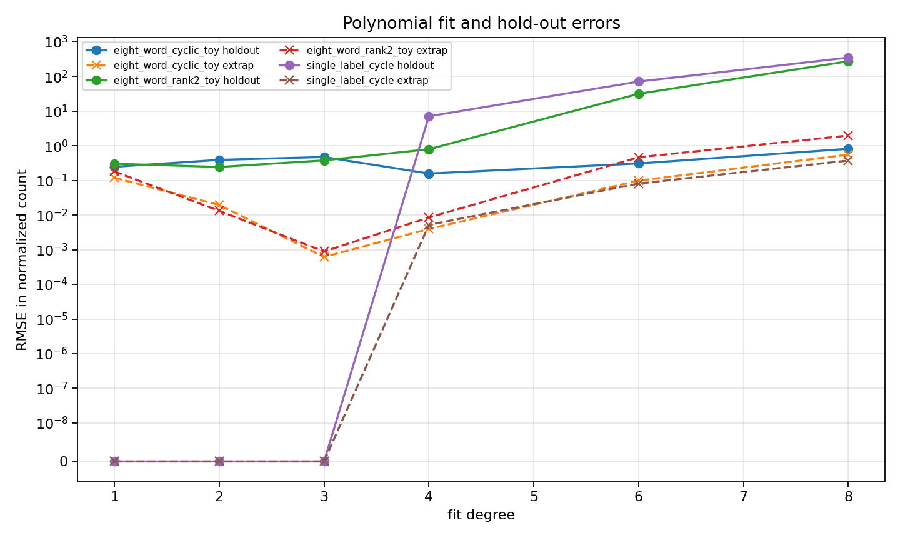
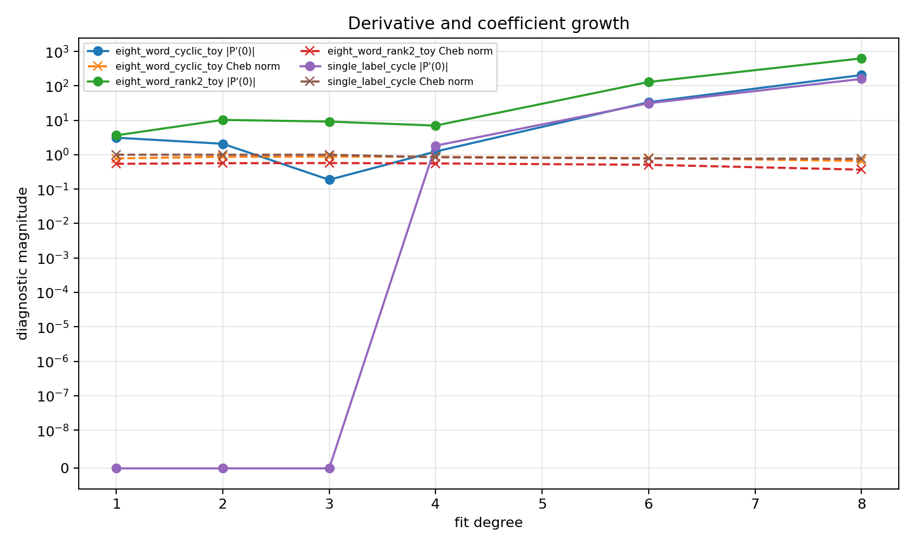

# M3 Polynomial-Window Diagnostics

## Question

Cycles 6-8 built random-permutation observables that separate cyclic diagonal templates from rank-two templates. This cycle probes a different piece of the proof ledger: the polynomial interpolation step in `x = 1/n` and the Markov-type instability that appears when polynomial degree or window complexity grows.

This is not the MPvH/MP23 polynomial from the paper. It is a numerical stability diagnostic built from the Cycle 8 normalized labelled-embedding counts.

## Construction

The script `scripts/probe_polynomial_window_diagnostics.py` reads `data/polynomial_method/labelled_graph_embedding_summary.csv`, keeps Monte Carlo rows, and fits normalized counts as functions of `x = 1/n`. The default templates are:

- `single_label_cycle`, an exact constant control with normalized value 1.
- `eight_word_cyclic_toy`, the rank-one eight-edge diagonal benchmark.
- `eight_word_rank2_toy`, the rank-two eight-edge benchmark.

Fits use a Chebyshev basis over each training window for conditioning. The reported derivative is `P'(0)` with respect to `x`, and the reported coefficient norm is the norm after converting the fitted Chebyshev polynomial back to the ordinary monomial basis in `x`.

Final command:

```bash
python3 scripts/probe_polynomial_window_diagnostics.py \
  --input-summary data/polynomial_method/labelled_graph_embedding_summary.csv \
  --out-csv data/polynomial_method/polynomial_window_diagnostics.csv \
  --fit-summary data/polynomial_method/polynomial_window_fit_summary.csv \
  --degrees 1,2,3,4,6,8 \
  --bootstrap 100 \
  --seed 20260515 \
  --fit-error-png reports/figures/m3_polynomial_window_fit_error.png \
  --derivative-png reports/figures/m3_polynomial_window_derivative_growth.png \
  --extrapolation-png reports/figures/m3_polynomial_window_extrapolation.png
```

Outputs:

- `data/polynomial_method/polynomial_window_diagnostics.csv`: 7344 diagnostic rows.
- `data/polynomial_method/polynomial_window_fit_summary.csv`: 18 fit-summary rows.
- `reports/figures/m3_polynomial_window_fit_error.png`: fit, hold-out, and extrapolation errors.
- `reports/figures/m3_polynomial_window_derivative_growth.png`: derivative and coefficient growth by degree.
- `reports/figures/m3_polynomial_window_extrapolation.png`: predicted and observed normalized counts as `x` approaches 0.






## Results

Selected fit-summary rows:

| template | degree | holdout RMSE | extrapolation RMSE | derivative at 0 | monomial coefficient norm |
|---|---:|---:|---:|---:|---:|
| `single_label_cycle` | 1 | 2.22e-16 | 2.22e-16 | -3.30e-16 | 1 |
| `single_label_cycle` | 8 | 3.53e2 | 3.77e-1 | -1.59e2 | 4.83e8 |
| `eight_word_cyclic_toy` | 1 | 2.48e-1 | 1.20e-1 | -3.12 | 3.32 |
| `eight_word_cyclic_toy` | 3 | 4.76e-1 | 6.17e-4 | -1.87e-1 | 47.96 |
| `eight_word_cyclic_toy` | 8 | 8.23e-1 | 5.58e-1 | 2.06e2 | 1.02e8 |
| `eight_word_rank2_toy` | 1 | 3.05e-1 | 1.82e-1 | -3.65 | 3.74 |
| `eight_word_rank2_toy` | 3 | 3.81e-1 | 8.90e-4 | -9.19 | 35.71 |
| `eight_word_rank2_toy` | 8 | 2.76e2 | 1.98 | -6.29e2 | 7.24e8 |

Low to moderate degree fits give useful extrapolation near `x = 0`, especially degree 3: extrapolation RMSE is `6.17e-4` for the cyclic eight-template and `8.90e-4` for the rank-two eight-template. The high-degree fits are intentionally unregularized and underdetermined relative to the train window; they expose the expected instability, with monomial coefficient norms rising to `1.02e8` for the cyclic benchmark and `7.24e8` for the rank-two benchmark at degree 8.

The exact control is important. `single_label_cycle` is recovered to machine precision at degrees 1-3, so the basic fitting path is correct. Its degree 4-8 failures are not mathematical failures of the constant sequence; they are a conditioning stress test showing that unregularized high-degree interpolation can invent huge coefficients even from exact constant data when the train window is too small.

## Interpretation

The toy Markov-amplification mechanism is supported. Derivative and coefficient diagnostics are flat at low degree for the exact control and then grow sharply in the high-degree overfit regime. The eight-template pair behaves similarly: degree 3 gives accurate `x = 0` extrapolation, while degree 6 and 8 fits produce much larger derivative and coefficient diagnostics.

The rank-two eight-template is more sensitive than the cyclic eight-template at the high-degree end: at degree 8 its derivative magnitude is about `629` versus `206`, and its extrapolation RMSE is `1.98` versus `0.558`. At degree 3, both templates are stable after naive normalization. This suggests that the main cyclic/rank-two difference in this toy setting is not low-degree approximability, but the severity of high-degree extrapolation instability.

Bootstrap variance is a null result here. The Cycle 8 expectation estimator has near-zero standard errors for these templates because the partial-permutation constraint probability is effectively deterministic once the template is fixed. Therefore this cycle measures interpolation conditioning, not realized random-action sampling noise.

## Recommendation

Use `eight_word_cyclic_toy` versus `eight_word_rank2_toy` with degree 3 fits as the standard polynomial-window benchmark for the next M3/M5 step. This setting preserves the cyclic/rank-two distinction, has accurate extrapolation toward `x = 0`, and still leaves degree 6/8 as a reproducible stress test for Markov-style amplification.

Future extension work should not use high-degree monomial coefficient norms alone as evidence of a paper-level loss. The useful diagnostic is comparative: keep the data window, template pair, and fitting basis fixed, then measure how derivative and coefficient growth respond to changes in window placement or added polynomial weights.

## Limitations

The inputs are normalized expected embedding counts from Cycle 8, not hyperbolic trace statistics. The fit split is small because the available `n` grid has only eight values. The high-degree regime is deliberately ill-conditioned; it is evidence of interpolation fragility, not a recommended estimator.
