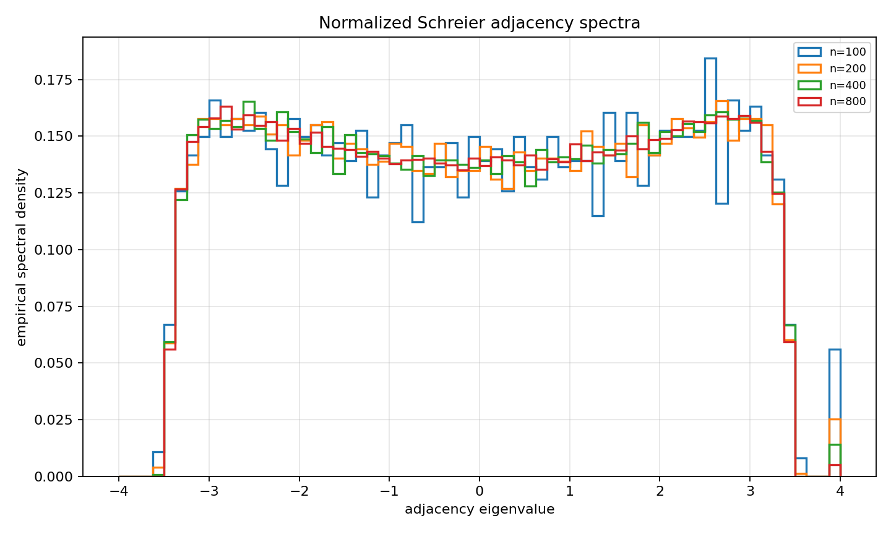
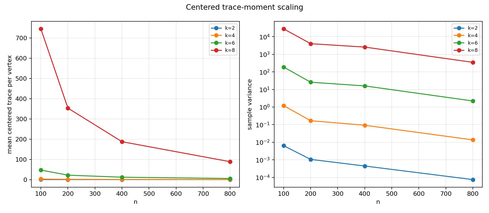
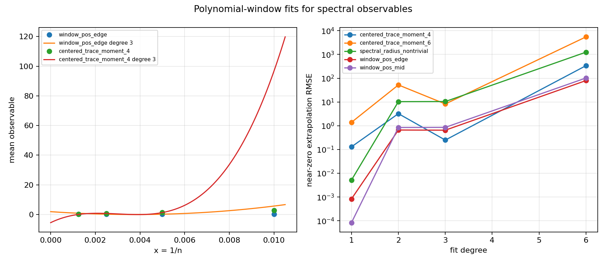

# M3 Schreier Spectral Toy Probe

## Purpose

This cycle moves the M3 probes from combinatorial labelled embeddings to an actual operator statistic. The model is still only a graph-spectral toy analogue: two independent uniform permutations `a,b` on `[n]` define the undirected multigraph adjacency

`A = P_a + P_a^T + P_b + P_b^T`.

Loops and parallel edges are retained, so every row sum is exactly `4`. This is not a discretization of Kim--Tao's hyperbolic Laplacian; it tests whether permutation-representation trace mechanisms remain visible after passing to a finite Schreier operator.

## Command

```bash
python3 scripts/probe_schreier_spectral_toy.py \
  --n-values 100,200,400,800 \
  --trials 30 \
  --seed 20260515 \
  --top-count 5 \
  --trials-csv data/polynomial_method/schreier_spectral_toy_trials.csv \
  --summary-csv data/polynomial_method/schreier_spectral_toy_summary.csv \
  --fits-csv data/polynomial_method/schreier_spectral_window_fits.csv \
  --hist-png reports/figures/m3_schreier_spectral_eigenvalue_histograms.png \
  --trace-png reports/figures/m3_schreier_spectral_trace_scaling.png \
  --fit-png reports/figures/m3_schreier_spectral_window_fit.png
```

Outputs:

- `2160` trial-observable rows.
- `72` summary rows.
- `20` polynomial-window fit rows.







## Selected Results

| observable | n=100 mean | n=200 mean | n=400 mean | n=800 mean |
|---|---:|---:|---:|---:|
| `spectral_radius_nontrivial` | 3.4224 | 3.4349 | 3.4507 | 3.4534 |
| `window_neg_edge` | 0.2133 | 0.2142 | 0.2167 | 0.2163 |
| `window_neg_mid` | 0.2813 | 0.2842 | 0.2818 | 0.2831 |
| `window_pos_mid` | 0.2787 | 0.2808 | 0.2824 | 0.2833 |
| `window_pos_edge` | 0.2267 | 0.2208 | 0.2191 | 0.2174 |

The four fixed eigenvalue windows are stable by `n=800`, and their sample variances shrink from roughly `1e-4` at `n=100` to `1e-6` or smaller at `n=800`.

| observable | n=100 mean | n=200 mean | n=400 mean | n=800 mean |
|---|---:|---:|---:|---:|
| `centered_trace_moment_2` | 0.1573 | 0.0713 | 0.0433 | 0.0163 |
| `centered_trace_moment_4` | 2.9067 | 1.3220 | 0.7427 | 0.3233 |
| `centered_trace_moment_6` | 47.2193 | 21.9683 | 11.8943 | 5.4633 |
| `centered_trace_moment_8` | 745.0453 | 353.3093 | 187.3477 | 88.5027 |

Centered moments subtract the infinite 4-regular tree closed-walk moments. They decrease with `n`, so the toy operator does separate deterministic tree-like backtracking from finite permutation cycle effects. Higher moments remain much noisier, as expected.

## Polynomial-Window Diagnostic

The fit diagnostic used the same `x = 1/n` convention as Cycle 9, but the spectral grid only has four `n` values. That makes degree 1 the only genuinely stable predictive fit here; degree 2, 3, and 6 are best interpreted as underdetermined or overfit stress tests.

| observable | degree | holdout RMSE | extrapolation RMSE | derivative at 0 |
|---|---:|---:|---:|---:|
| `window_pos_edge` | 1 | 0.00233 | 0.00083 | 0.700 |
| `window_pos_edge` | 3 | 5.48667 | 0.65021 | -1018.70 |
| `window_pos_mid` | 1 | 0.00100 | 0.00008 | -0.633 |
| `window_pos_mid` | 3 | 6.56800 | 0.85429 | -1385.37 |
| `centered_trace_moment_4` | 1 | 0.42600 | 0.12967 | 231.73 |
| `centered_trace_moment_4` | 3 | 93.87000 | 0.24933 | 7326.67 |
| `spectral_radius_nontrivial` | 1 | 0.01901 | 0.00519 | -6.30 |
| `spectral_radius_nontrivial` | 3 | 80.71670 | 10.42820 | -16859.60 |

Relative to Cycle 9, this is a partial negative transfer result. Low-degree polynomial-window behavior remains useful for smooth spectral windows, but degree-3 fitting is not a reliable baseline on only four spectral sample sizes. The Cycle 9 degree-3 embedding benchmark is cleaner because the observable is deterministic enough and the finite-size curve is closer to a low-degree reciprocal polynomial.

## Interpretation

Toy evidence supports spectral concentration for coarse adjacency-window counts: normalized means stabilize and variances shrink across `n`. Centered trace moments also support the expected mechanism direction: after subtracting tree-like closed-walk contributions, the remaining finite-cover signal decreases with `n`.

The strongest observable for later extension work is the normalized eigenvalue window count, especially `window_pos_mid` or `window_pos_edge`. Centered trace moments are mathematically closer to trace-formula combinatorics, but they are noisier and high moments amplify finite-size effects. Top nontrivial eigenvalues concentrate, but they are less directly tied to the cyclic/rank-two trace mechanism.

## Limitations

The adjacency spectrum of this random 4-regular Schreier multigraph is not the hyperbolic Laplacian spectrum. Nonbacktracking trace moments were deliberately omitted in this cycle because the adjacency trace moments already provide the required operator-level bridge and the implementation surface stays auditable. Degree-3 spectral polynomial-window fits need more `n` values before they can be compared fairly with the Cycle 9 degree-3 labelled-embedding fits.
