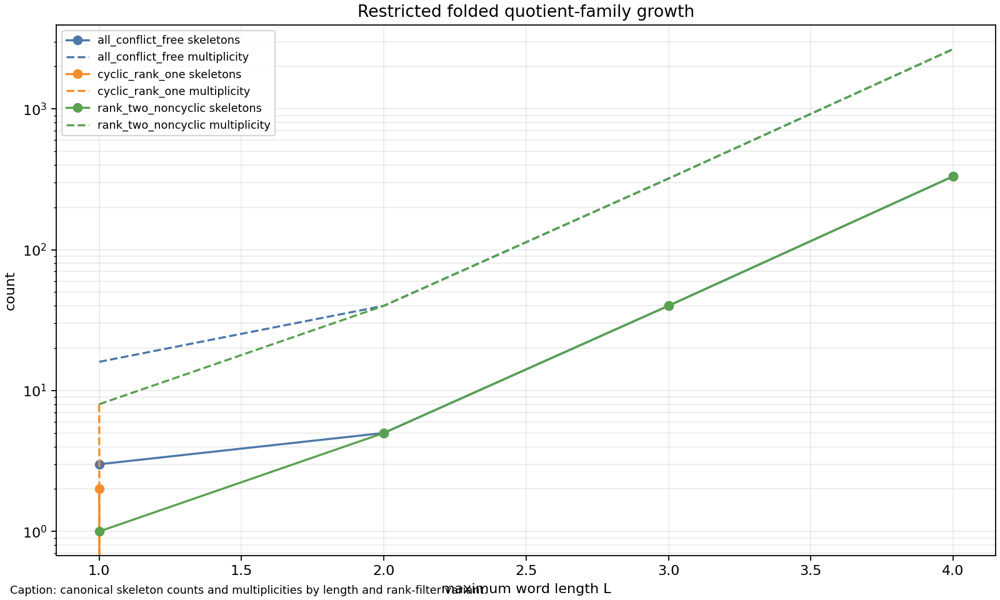
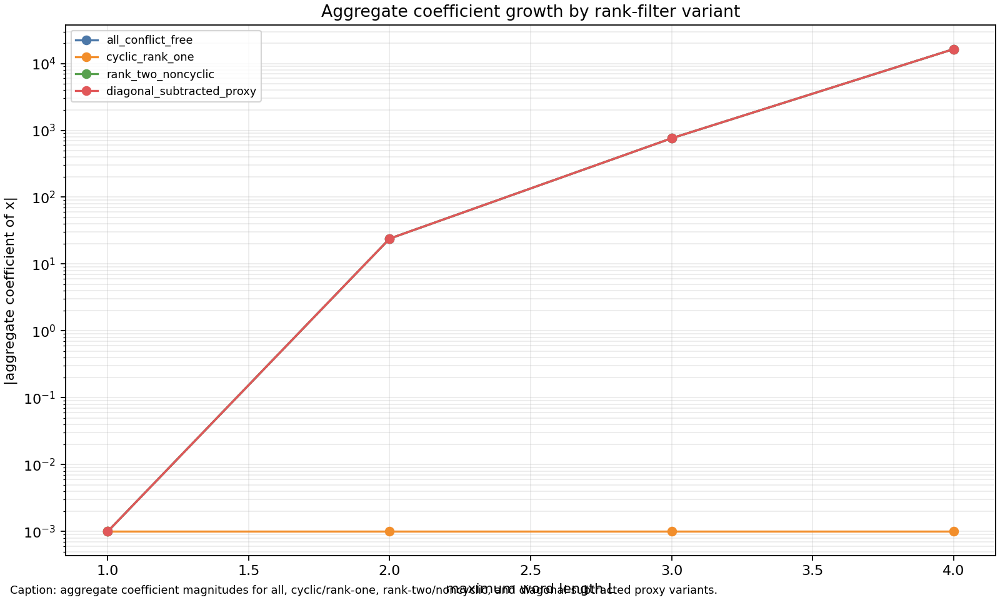

# M10 Restricted Quotient Aggregate

## Model

This cycle tests a deliberately restricted aggregate model after M9.  The alphabet is the free-group alphabet `a,A,b,B`, reduced words are enumerated up to a maximum length `L`, and each ordered pair `(u,v)` contributes the two simultaneous fixed-point loops `u(i)=i` and `v(i)=i` with a shared basepoint.  Inverse labels are normalized by reversing orientation, so an `A` edge from `s` to `t` becomes an `a` constraint from `t` to `s`, matching the M4/M8 convention.

The script builds two based word loops, folds same-label outgoing and incoming collisions by vertex identification, and canonicalizes the resulting labelled skeleton by deterministic basepoint-first relabeling.  It records partial-injection conflicts when a raw same-label outgoing or incoming collision was present before folding; conflict rows are counted in the profile table but excluded from product-ratio coefficient summaries.  This is not the Kim--Tao surface-group probability law, does not model Witten-zeta normalization, and does not include MP23 rank-sensitive decay.

The initial target was `L_max=6` or `7`, but direct ordered-pair folding was too slow for the efficient-cycle budget.  The validated run uses `L_max=4`, which is enough to expose rapid folded profile growth while remaining fully reproducible.

## Results

Generated artifacts:

- `data/extension_candidates/restricted_quotient_family_profiles.csv`
- `data/extension_candidates/restricted_quotient_aggregate_summary.csv`
- `reports/figures/m10_restricted_quotient_family_growth.png`
- `reports/figures/m10_restricted_quotient_aggregate_coefficients.png`

Profile counts by length:

| L | profiles | conflict profiles | conflict multiplicity | conflict-free multiplicity |
|---:|---:|---:|---:|---:|
| 1 | 3 | 0 | 0 | 16 |
| 2 | 18 | 13 | 216 | 40 |
| 3 | 211 | 171 | 2384 | 320 |
| 4 | 2208 | 1876 | 22944 | 2656 |

Conflict-free aggregate coefficient summaries at order `k=1`:

| L | variant | skeletons | total multiplicity | aggregate coefficient | M7/M9 aggregate proxy |
|---:|---|---:|---:|---:|---:|
| 1 | all conflict-free | 3 | 16 | 0 | 16 |
| 1 | cyclic/rank-one | 2 | 8 | 0 | 8 |
| 1 | rank-two/noncyclic | 1 | 8 | 0 | 8 |
| 2 | all conflict-free | 5 | 40 | -24 | 160 |
| 2 | rank-two/noncyclic | 5 | 40 | -24 | 160 |
| 3 | all conflict-free | 40 | 320 | -760 | 2880 |
| 3 | rank-two/noncyclic | 40 | 320 | -760 | 2880 |
| 4 | all conflict-free | 332 | 2656 | -16392 | 42496 |
| 4 | rank-two/noncyclic | 332 | 2656 | -16392 | 42496 |

## Interpretation

The restricted model gives a mixed but useful bridge result.  Folding collapses the raw ordered-word-pair family substantially, but the number of canonical profiles still grows quickly over `L=1..4`: all profiles rise from `3` to `2208`, and conflict-free profiles rise from `3` to `332`.  Conflict rows dominate by multiplicity for `L>=2`, so partial-injection compatibility is already a strong aggregate constraint.

The rank-one/cyclic filter is only visible at `L=1` in this conflict-free summary.  After excluding conflict rows, all `L>=2` contribution is classified by this proxy as rank-two/noncyclic, so the toy diagonal-subtracted summary equals the all-summary beyond `L=1`.  This does not invalidate Kim--Tao diagonal subtraction; it says this restricted free-word folding proxy is too crude to reproduce the structural `S` removal once raw conflicts are excluded.

The M7/M9 aggregate proxy remains valid: for every generated summary row, the absolute aggregate coefficient is bounded by `L^(2k)` times total multiplicity.  However, the observed multiplicity growth is the active issue.  At `L=4`, the order-one rank-two coefficient magnitude is `16392`, controlled by the proxy `42496`, but the proxy is useful only because the finite folded family count was computed directly.

## Finding

This cycle supports a restricted theorem candidate only with an explicit family-count or compatibility hypothesis: for fixed `k`, conflict-free folded skeletons of this two-loop model obey the M7/M9 coefficient bound after summing over observed multiplicities.  It does not yet support a Kim--Tao bridge theorem, because the tested model shows fast profile growth, conflict domination, and no meaningful rank-one subtraction beyond the first length.  The next bridge point should either optimize the enumerator enough to reach `L=5..6` or replace raw ordered-pair multiplicity by a more Kim--Tao-like weighted quotient class where cyclic diagonals and rank-two remnants are structurally separated before folding.
