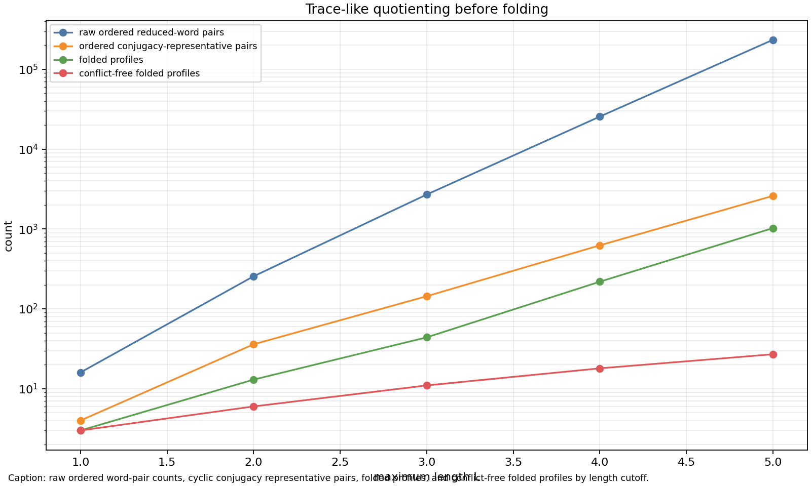
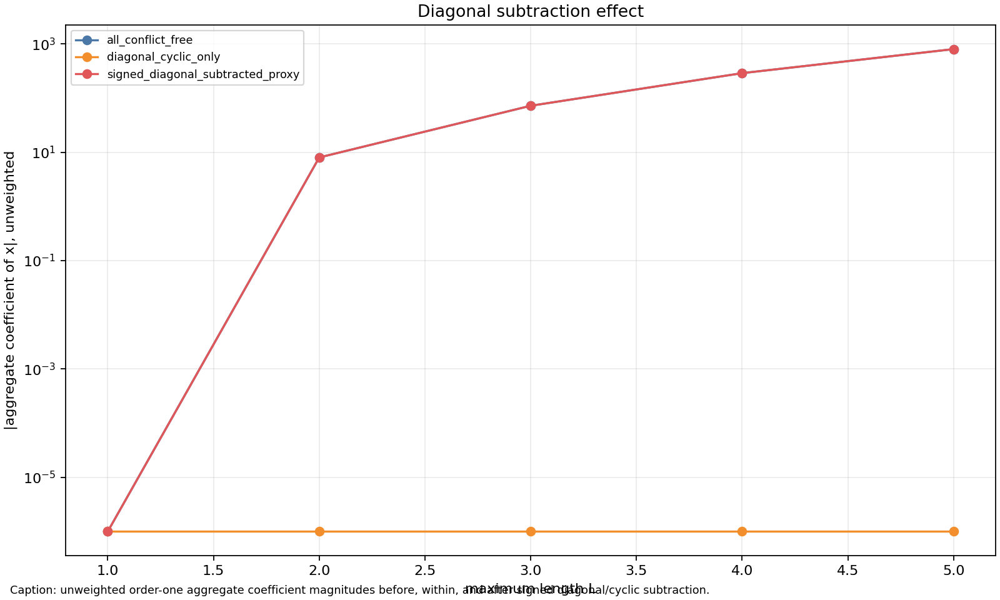
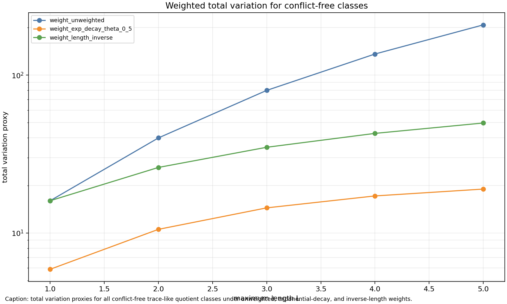

# M11 Trace-Like Weighted Quotient Class

## Scope

M11 tests a narrower aggregate toy model after M10. The model replaces raw ordered reduced-word pairs by ordered pairs of cyclically reduced conjugacy-class representatives, classifies primitive powers and diagonal/cyclic pairs before folding, keeps explicit length weights, and then applies the same folded partial-permutation skeleton and product-ratio coefficient recurrence used in M10.

This is still not the Kim--Tao surface-group random-cover law: there is no Witten-zeta normalization, no Nau boundedness input, no MP23 rank-two estimate, and no actual Selberg trace weight. The point is only to test whether trace-like quotienting and pre-fold diagonal separation supply the aggregate total-variation input that M9 showed is missing from per-template M7 bounds.

## Model

Words are reduced over `a,b,A,B`; only cyclically reduced words are kept. Each word is canonicalized by cyclic rotation and inversion, and its original rotation/inversion orbit size is retained as pre-fold multiplicity.

For each cutoff `L <= 5`, the script enumerates ordered pairs `(u,v)` of trace-like representatives with `|u|, |v| <= L`. It assigns three weights:

| weight scheme | definition |
|---|---|
| `weight_unweighted` | orbit-size product |
| `weight_exp_decay_theta_0_5` | orbit-size product times `exp(-0.5(|u|+|v|))` |
| `weight_length_inverse` | orbit-size product divided by `max(1, |u||v|)` |

Each pair is folded into a labelled partial-permutation skeleton. The report separates the global power

```text
n_power = C - V, where C = C_a + C_b
```

from the normalized product-ratio factor. Product-ratio coefficients through order `k=4` are computed only for the normalized factor; conflict rows are counted but excluded from coefficient summaries.

## Main Results

Trace-like quotienting materially reduces raw aggregate mass at the tested cutoffs. At shared `L=4`, the M10 raw ordered-pair model had 332 conflict-free folded profiles and conflict-free multiplicity 2656. M11 has 18 conflict-free folded profiles and unweighted conflict-free total variation 136.

| L | M10-style raw ordered reduced-word pairs | M11 folded profiles | M11 conflict-free profiles | M11 conflict-free unweighted TV |
|---:|---:|---:|---:|---:|
| 1 | 16 | 3 | 3 | 16 |
| 2 | 256 | 16 | 6 | 40 |
| 3 | 2704 | 49 | 11 | 80 |
| 4 | 25600 | 227 | 18 | 136 |
| 5 | 234256 | 1039 | 27 | 208 |

The improvement is real for family-count and total-variation accounting in this toy model, but it does not come from diagonal subtraction. The diagonal/cyclic class remains tiny and has zero low-order contribution here; subtracting it leaves the aggregate coefficients unchanged and reduces total variation only by the small diagonal/cyclic mass.

| L | variant | order-1 coefficient | unweighted TV | profiles | pair classes |
|---:|---|---:|---:|---:|---:|
| 1 | all conflict-free | 0 | 16 | 3 | 4 |
| 1 | signed diagonal-subtracted | 0 | 8 | 1 | 2 |
| 2 | all conflict-free | -8 | 40 | 6 | 10 |
| 2 | signed diagonal-subtracted | -8 | 32 | 4 | 8 |
| 3 | all conflict-free | -72 | 80 | 11 | 20 |
| 3 | signed diagonal-subtracted | -72 | 72 | 9 | 18 |
| 4 | all conflict-free | -288 | 136 | 18 | 34 |
| 4 | signed diagonal-subtracted | -288 | 128 | 16 | 32 |
| 5 | all conflict-free | -800 | 208 | 27 | 52 |
| 5 | signed diagonal-subtracted | -800 | 200 | 25 | 50 |

At `L=5`, length weights reduce total variation but do not create cancellation. The aggregate bound remains controlled by weighted total variation exactly as in M9.

| weight scheme | order-1 coefficient | total variation | M7/M9 proxy `L^2 * TV` |
|---|---:|---:|---:|
| `weight_unweighted` | -800 | 208 | 5200 |
| `weight_exp_decay_theta_0_5` | -19.1824613678 | 18.9599422329 | 473.998555823 |
| `weight_length_inverse` | -59.0422222222 | 49.7088888889 | 1242.72222222 |

The `L=5` diagonal decomposition shows where the mass sits:

| category | pair classes | pre-fold multiplicity | folded profiles | unweighted TV |
|---|---:|---:|---:|---:|
| conflict | 2549 | 138176 | 1012 | 138176 |
| diagonal/cyclic | 2 | 8 | 2 | 8 |
| primitive non-diagonal | 2 | 8 | 1 | 8 |
| rank-two after diagonal | 50 | 200 | 25 | 200 |







## Interpretation

H1 is supported in this restricted toy model: cyclic conjugacy and inversion quotienting reduce folded profile growth and unweighted conflict-free mass by more than a constant factor relative to M10 at shared cutoffs.

H2 is not supported here: primitive/cyclic diagonal subtraction does not suppress the dominant low-order coefficient sums, because the surviving coefficient mass already lies in the rank-two/noncyclic remainder.

H3 is partly supported: explicit length weights reduce the total-variation proxy, especially exponential decay, but the mechanism is still weighted total variation rather than cancellation. This reinforces M9's conclusion that a Kim--Tao bridge theorem needs an actual aggregate input: family-count control, summable trace weights, cancellation, or rank-sensitive decay.

## Notes and Null Results

The example `abA` from the brief is not cyclically reduced because the first and last letters are inverse. The implemented canonicalization is intentionally strict; the test uses `aba`, `baa`, and `aab` as the valid rotation example.

The same folded canonical key can arise from both conflict and non-conflict pre-fold pairs. Profile rows therefore group by `(canonical_key, conflict)`; otherwise conflict mass leaks into conflict-free coefficient totals.

## Reproduction

```bash
python3 -m py_compile scripts/enumerate_trace_like_weighted_quotients.py tests/test_trace_like_weighted_quotients.py
python3 scripts/enumerate_trace_like_weighted_quotients.py
python3 tests/test_trace_like_weighted_quotients.py
figure check reports/figures/m11_trace_like_family_growth.png
figure check reports/figures/m11_diagonal_subtraction_effect.png
figure check reports/figures/m11_weighted_total_variation.png
```
