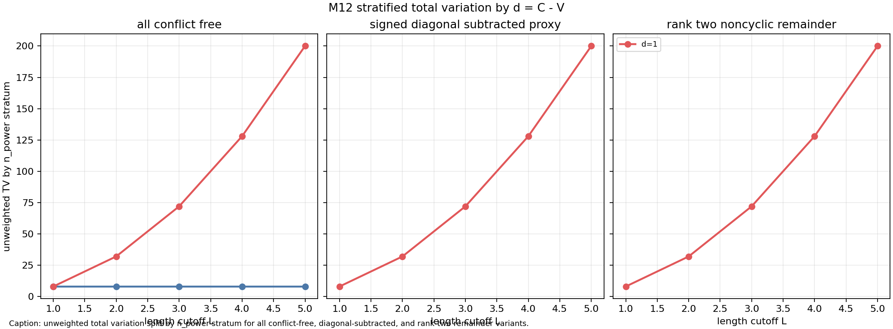
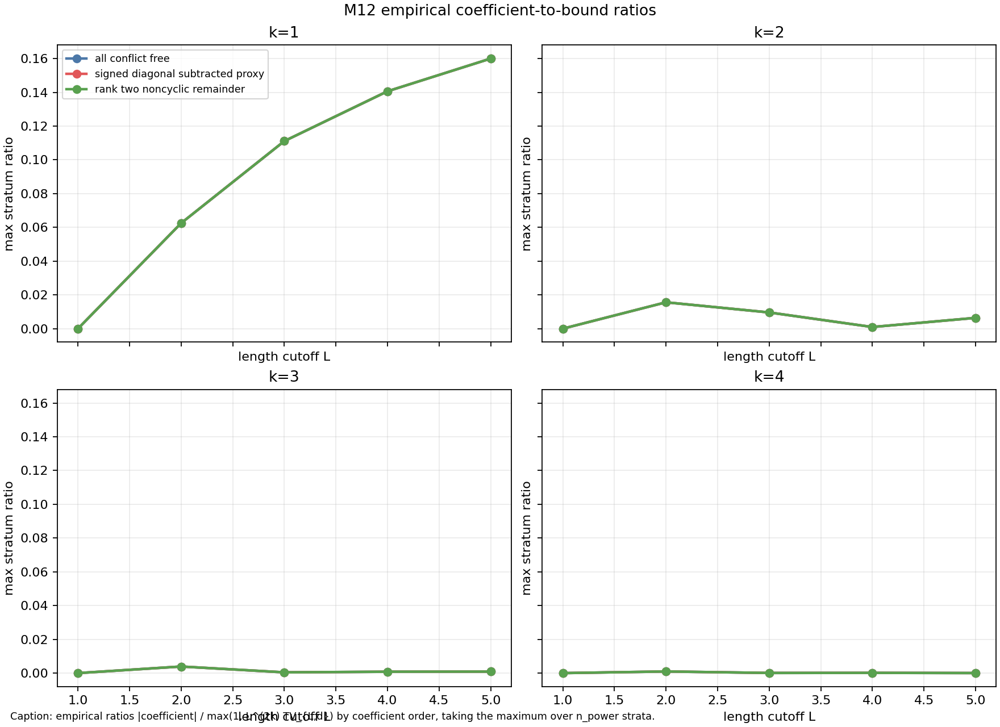

# M12 Restricted Aggregate Theorem Template

## Scope

This note extracts the strongest theorem template currently supported by M7, M9, and M11. It is an independent-permutation labelled-template aggregate statement. It is not a Kim--Tao trace theorem, and it does not replace the MPvH/Witten-zeta, Nau boundedness, MP23 rank-two, surface-group law, or Selberg trace formula inputs isolated in M8.

The new point relative to M9 is that templates with different powers
`d_T = C_T - V_T` cannot be merged into one coefficient sum. Each template contributes

```text
E_T(n) = n^{d_T} R_T(1/n),
```

so the coefficient of `n^{d-k}` is meaningful only after grouping templates by the same `d`.

## Proposition

Fix a coefficient order `k >= 0`. Let `F_L` be a finite family of conflict-free labelled skeletons over finitely many independent permutation labels. For each `T in F_L`, let `V_T` be its vertex count and `C_T` the total number of distinct normalized label constraints. Assume:

1. `d_T = C_T - V_T`.
2. The exact expectation factorizes as
   ```text
   E_T(n) = n^{d_T} R_T(1/n),
   ```
   where `R_T(x)` is the normalized falling-factorial product-ratio factor.
3. The M7 support/index hypotheses hold uniformly: skeleton support and all falling-factorial indices are `O(L)`.
4. For this fixed `k`, M7 gives a constant `C_k` such that
   ```text
   |[x^k] R_T(x)| <= C_k L^{2k}
   ```
   for every `T in F_L`.

For each integer `d`, define

```text
F_{L,d} = {T in F_L : d_T = d},
TV_{L,d} = sum_{T in F_{L,d}} |w_T|.
```

Then

```text
|[n^{d-k}] sum_{T in F_{L,d}} w_T E_T(n)|
  <= C_k L^{2k} TV_{L,d}.
```

Proof: within a fixed `d` stratum,

```text
sum_{T in F_{L,d}} w_T E_T(n)
  = n^d sum_{T in F_{L,d}} w_T R_T(1/n).
```

The coefficient of `n^{d-k}` is `sum_T w_T [x^k]R_T(x)`. Apply the triangle inequality and the M7 fixed-order product-ratio bound:

```text
|sum_T w_T [x^k]R_T(x)|
  <= sum_T |w_T| C_k L^{2k}
  = C_k L^{2k} TV_{L,d}.
```

This is exactly M9's total-variation obstruction, but applied after the required `d=C-V` stratification.

## Corollaries

Polynomial TV: if `TV_{L,d} <= A_d L^s` for a fixed stratum, then

```text
|[n^{d-k}] aggregate_d| <= C_k A_d L^{2k+s}.
```

Exponentially weighted TV: if a trace-like weight gives `TV_{L,d}` bounded or polynomial after length damping, the same bound is inherited with that weighted TV. The theorem does not prove such damping for Kim--Tao quotient families; it only identifies it as a sufficient hypothesis.

Signed cancellation: if a stronger estimate is known for the signed coefficient sum itself, it can improve the bound. Total variation alone cannot see that cancellation.

Diagonal/cyclic removal: subtracting a diagonal subset improves this sufficient bound only by reducing `TV_{L,d}` in the relevant stratum. If the diagonal classes lie in a different `d` stratum or have zero normalized coefficients, removal does not affect the dominant coefficient stratum.

## M11 Empirical Check

The checker `scripts/analyze_restricted_aggregate_theorem_template.py` uses the validated M11 record builder and M11 CSV inputs. Record-level M11 data is needed because a single folded profile can receive both diagonal and non-diagonal pre-fold records.

Generated data:

- `data/extension_candidates/restricted_aggregate_theorem_strata.csv`
- `data/extension_candidates/restricted_aggregate_theorem_bound_checks.csv`

At `L=5` with unweighted M11 data:

| Variant | `d` | TV | profiles | pair classes | coeff `k=1` | coeff `k=2` | coeff `k=3` | coeff `k=4` |
|---|---:|---:|---:|---:|---:|---:|---:|---:|
| all conflict-free | 0 | 8 | 2 | 2 | 0 | 0 | 0 | 0 |
| all conflict-free | 1 | 200 | 25 | 50 | -800 | 800 | 2800 | 3392 |
| signed diagonal-subtracted | 1 | 200 | 25 | 50 | -800 | 800 | 2800 | 3392 |
| rank-two remainder | 1 | 200 | 25 | 50 | -800 | 800 | 2800 | 3392 |

The largest empirical ratio

```text
|actual coefficient| / max(1, L^(2k) TV_{L,d})
```

over all M12 rows is `0.16`, attained at `L=5`, unweighted, `d=1`, `k=1`. This is not a sharp constant claim; it is a sanity check that the M7/M9 sufficient bound is being applied to the correct stratum.





## Interpretation

H1 is supported: the clean theorem exists only after grouping by `d=C-V`; without this, powers of `n` are mixed.

H2 is partly supported in the M11 toy model: trace-like conjugacy quotienting produces small conflict-free TV at `L<=5`, especially under exponential length weights. This remains empirical evidence about a toy family, not a proof for Kim--Tao quotient sums.

H3 is supported in the negative direction: diagonal/cyclic removal is not the main sufficient input in this model. The diagonal/cyclic contribution sits in `d=0` with zero low-order normalized coefficients, while the nonzero aggregate coefficient mass is already in the `d=1` rank-two/noncyclic remainder.

## Open Gap

To turn this template into a Kim--Tao-level statement, one would still need to prove that the actual trace or pre-trace quotient family decomposes into conflict-free labelled templates satisfying the M7 support/index hypotheses, with controlled `TV_{L,d}` or coefficient-level cancellation after Witten-zeta normalization, boundedness, diagonal subtraction, and rank-sensitive decay.
