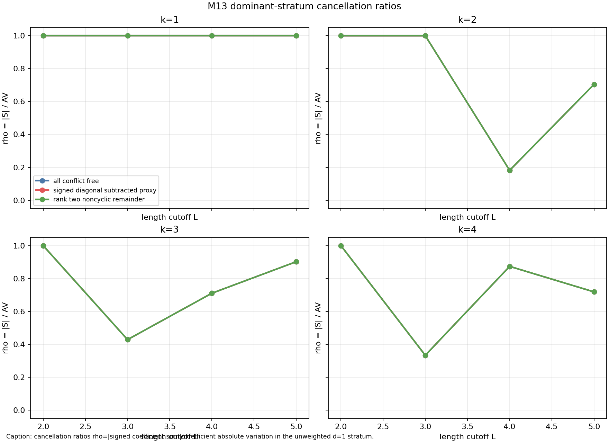
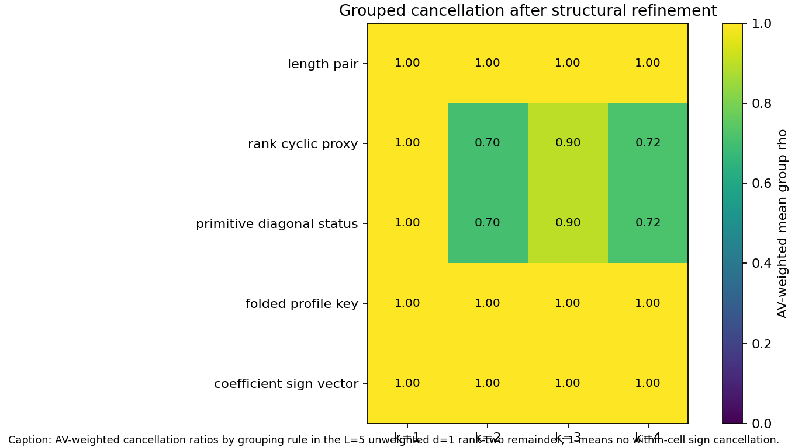
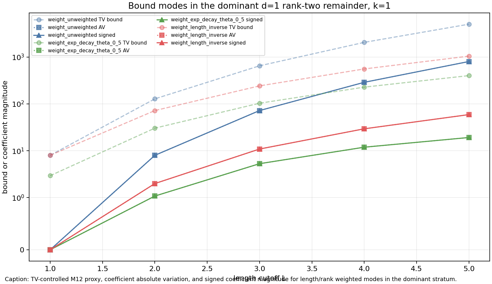

# M13 Cancellation Mechanism Diagnostics

## Purpose

M12 proved a conditional aggregate theorem of the form

\[
\left|[n^{d-k}]\sum_{T\in F_{L,d}} w_T E_T(n)\right|
  \le L^{2k}\sum_{T\in F_{L,d}} |w_T|,
\]

after stratifying by \(d=C-V\).  M13 tests whether the M11 trace-like toy family contains a sharper measurable mechanism: coefficient-level cancellation, stable structural pairings, or length/rank decay in the dominant \(d=1\) rank-two remainder.

The diagnostic uses M11 record-level pair data rather than profile CSV rows, because profile rows can merge diagonal and non-diagonal pre-fold records with the same folded key.  Conflict templates remain excluded through the same M11 variant filters used in M12.

## Metrics

For each fixed \(L\), variant, weight scheme, \(d=C-V\), and coefficient order \(k\le 4\), the script computes

\[
S_{d,k}=\sum_T w_T c_{T,k},\qquad
AV_{d,k}=\sum_T |w_T c_{T,k}|,\qquad
B_{d,k}=L^{2k}\sum_T |w_T|.
\]

The cancellation ratio is

\[
\rho_{d,k}=|S_{d,k}|/AV_{d,k}
\]

when \(AV_{d,k}>0\).  Rows with \(AV_{d,k}=0\) are marked separately.

## Main Results

For the unweighted \(L=5\), \(d=1\), rank-two/noncyclic remainder:

| \(k\) | signed sum \(S\) | coefficient AV | \(\rho\) | M12 ratio \(|S|/B\) |
|---:|---:|---:|---:|---:|
| 1 | -800 | 800 | 1.000 | 0.160 |
| 2 | 800 | 1136 | 0.704 | 0.0064 |
| 3 | 2800 | 3104 | 0.902 | 0.000896 |
| 4 | 3392 | 4720 | 0.719 | 0.0000434 |

Order \(k=1\) has no coefficient cancellation in the dominant stratum: every contributing term has the same sign.  Higher orders show partial cancellation, but not a stable small-\(\rho\) pattern.

Length weights reduce the effective total variation, but they do not create order-one cancellation.  At \(L=5,d=1,k=1\), the rank-two remainder has \(\rho=1\) for all three tested weights:

| weight scheme | signed sum | coefficient AV | weighted TV |
|---|---:|---:|---:|
| unweighted | -800 | 800 | 200 |
| exp decay \(\theta=0.5\) | -19.1824613678 | 19.1824613678 | 16.0169067036 |
| inverse length | -59.0422222222 | 59.0422222222 | 41.7088888889 |

Thus the improvement from length weights is genuine decay of weighted variation in this toy model, not sign cancellation.



## Grouping Diagnostics

The analyzer repeats the cancellation computation after grouping by length pair, rank/cyclic proxy, primitive/diagonal status, folded profile key, and coefficient sign vector.  Grouped signed sums refine the ungrouped total: summing the group signed totals recovers the fixed-stratum signed total.

For \(L=5\), unweighted \(d=1\), rank-two remainder, the AV-weighted mean group cancellation ratios are:

| grouping rule | \(k=1\) | \(k=2\) | \(k=3\) | \(k=4\) |
|---|---:|---:|---:|---:|
| length pair | 1.000 | 1.000 | 1.000 | 1.000 |
| rank/cyclic proxy | 1.000 | 0.704 | 0.902 | 0.719 |
| primitive/diagonal status | 1.000 | 0.704 | 0.902 | 0.719 |
| folded profile key | 1.000 | 1.000 | 1.000 | 1.000 |
| coefficient sign vector | 1.000 | 1.000 | 1.000 | 1.000 |

Length-pair and folded-profile refinements destroy the observed higher-order cancellation: each refined cell is one-sided in coefficient sign.  Rank/cyclic and primitive/diagonal groupings are too coarse to explain the cancellation; they reproduce the global \(\rho\) rather than identifying a stable local mechanism.



## Candidate Pairings

The search for opposite-sign structural cells used the rank-two/noncyclic remainder and required fixed \(d\), coefficient order, weight scheme, and a structural key

```text
length=(|u|,|v|) | rank proxy | primitive/diagonal status.
```

No opposite-sign structural cells were found.  The candidate-pairing CSV therefore contains a null result rather than examples.  This is important: the observed higher-order cancellation is not explained by a persistent local sign-pairing rule at this resolution.

## Bound Mode Comparison

M13 compared four modes:

1. M12 TV bound \(B=L^{2k}\sum |w_T|\).
2. Coefficient absolute-variation bound \(AV=\sum |w_Tc_{T,k}|\).
3. Signed coefficient magnitude \(|S|\).
4. Length/rank weighted versions of the same quantities.

The coefficient AV bound is sharper than the M12 proxy because it uses actual coefficients instead of the uniform \(L^{2k}\) envelope.  This is diagnostic, not a theorem replacement: a Kim--Tao-relevant theorem would need an a priori coefficient-AV or cancellation estimate.  The length-decay modes reduce all three curves by reducing weighted mass in the dominant stratum.



## Interpretation

**H1: signed cancellation is substantial in dominant strata.** Unsupported for \(k=1\), and only weakly/unstably supported for \(k=2,3,4\).  The dominant \(d=1\) rank-two remainder has \(\rho=1\) at order one across tested \(L\) and weight schemes.

**H2: cancellation has a stable structural explanation.** Unsupported at the tested resolution.  Refinement by length pair or folded profile key leaves one-sided sign cells, and no persistent opposite-sign structural pairings across \(L=3,4,5\) were found.

**H3: length/rank weights supply a usable aggregate hypothesis.** Partly supported for length decay only.  Exponential and inverse-length weights substantially reduce weighted TV in the dominant stratum, but this is a total-variation/decay mechanism, not algebraic cancellation.  No rank-sensitive probability-law decay was modeled beyond the rank-two filter already inherited from M11.

## Candidate Hypothesis

**Candidate rank/length aggregate hypothesis, status: unresolved by this toy evidence.**

For Kim--Tao quotient families after diagonal subtraction and \(d=C-V\) stratification, suppose there is an external trace/probability-law weight \(\omega(T)\) such that the rank-two remainder satisfies a summable weighted coefficient-variation estimate

\[
\sum_{T\in F_{L,d}^{\mathrm{rank2}}} |\omega(T)c_{T,k}| \le A_{d,k} L^{s_{d,k}}
\]

for fixed \(k\), with \(s_{d,k}\) small enough for the trace/pre-trace interpolation step.  M13 supports the need for this kind of hypothesis, but does not prove it: the toy family shows length decay can reduce effective variation, while coefficient cancellation alone is absent or structurally unexplained in the dominant stratum.

## Non-Claims

- This is not a Kim--Tao trace theorem and does not improve the rigidity exponent.
- The null pairing result is for the M11 two-generator trace-like toy family through \(L=5\), not for actual surface-group quotient families.
- The coefficient-AV bound is an observed diagnostic quantity; replacing M12 TV by AV in a theorem would require a new independent estimate.

## Artifacts

- `scripts/analyze_cancellation_mechanisms.py`
- `tests/test_cancellation_mechanisms.py`
- `data/extension_candidates/cancellation_coefficient_summary.csv`
- `data/extension_candidates/cancellation_group_summary.csv`
- `data/extension_candidates/cancellation_candidate_pairings.csv`
- `reports/figures/m13_cancellation_ratios.png`
- `reports/figures/m13_grouped_cancellation_heatmap.png`
- `reports/figures/m13_bound_mode_comparison.png`
