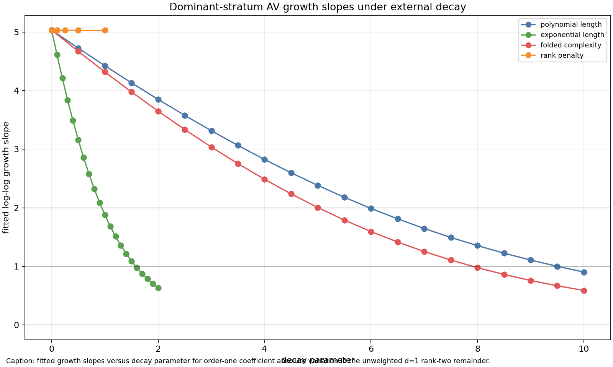
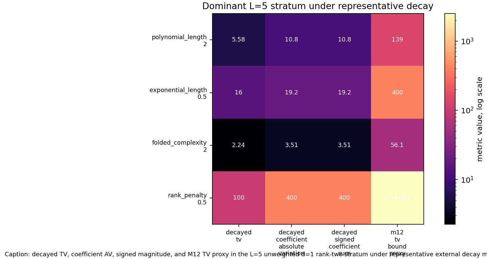
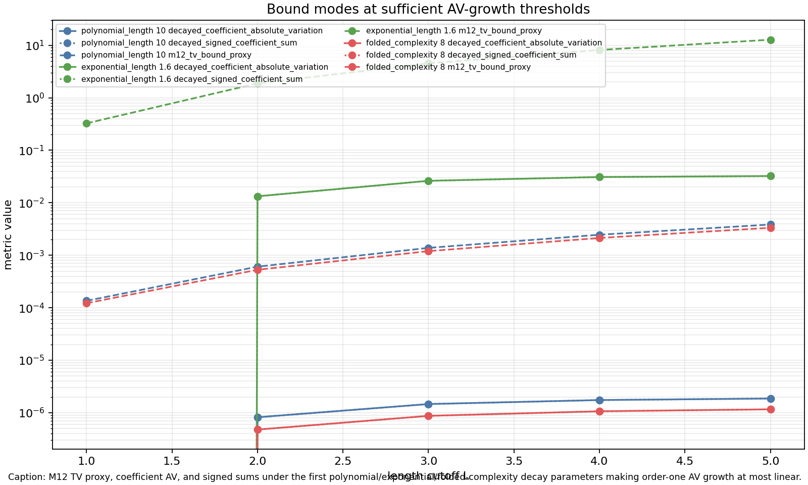

# M14 External Decay Thresholds

## Purpose

M13 found no robust coefficient-cancellation mechanism in the dominant M11/M12 trace-like toy stratum.  M14 therefore asks a different question: if an external Kim--Tao-facing input supplied rank, length, or folded-complexity decay, how strong would that decay need to be to control the M12 aggregate quantities?

The model keeps the M11 record-level trace-like quotient data, the M12 fixed \(d=C-V\) stratification, and coefficient orders \(k=1,\dots,4\).  Conflict templates remain excluded by the same M11 variant filters.  This is a threshold diagnostic, not a theorem about Kim--Tao quotient families.

## Decay Models

For each record \(T=(u,v)\), the script computes

\[
\sum |w_T|D(T),\qquad
\sum |w_Tc_{T,k}|D(T),\qquad
\left|\sum w_Tc_{T,k}D(T)\right|,\qquad
L^{2k}\sum |w_T|D(T).
\]

The tested decay functions are:

| model | parameter grid | formula |
|---|---:|---|
| polynomial length | \(\sigma=0,0.5,\dots,10\) | \((1+|u|+|v|)^{-\sigma}\) |
| exponential length | \(\beta=0,0.1,\dots,2\) | \(\exp(-\beta(|u|+|v|))\) |
| folded complexity | \(\tau=0,0.5,\dots,10\) | \((1+V_T+C_T)^{-\tau}\) |
| rank penalty | \(\eta=1,0.5,0.25,0.1,0.01\) | \(\eta^{\mathrm{rank}(T)-1}\) |

Empirical growth slopes are least-squares slopes of \(\log(\text{metric})\) against \(\log L\), using only metrics with at least three positive \(L\)-values.  Zero-variation strata do not produce artificial slopes.

## Dominant-Stratum Thresholds

The main diagnostic stratum is the unweighted \(d=1\) rank-two/noncyclic remainder.  For coefficient absolute variation, the fitted baseline slopes and first grid parameters reaching target slopes are:

| \(k\) | baseline slope | polynomial \(\sigma\le1\) | exponential \(\beta\le1\) | folded \(\tau\le1\) | rank-only \(\le1\) |
|---:|---:|---:|---:|---:|---:|
| 1 | 5.033 | 10.0 | 1.6 | 8.0 | none |
| 2 | 5.195 | 9.0 | 1.5 | 7.5 | none |
| 3 | 6.578 | none | 1.7 | 9.0 | none |
| 4 | 7.121 | none | 1.9 | 10.0 | none |

No tested model made the dominant coefficient absolute variation non-growing.  Exponential length decay is the most efficient tested axis for making growth at most linear across \(k=1,\dots,4\).  Polynomial length and folded-complexity decay require large exponents and fail the \(\le1\) target for \(k=3,4\) within the tested grid.

For order one, the threshold comparison by metric is:

| metric | baseline slope | polynomial \(\sigma\le1\) | exponential \(\beta\le1\) | folded \(\tau\le1\) | rank-only \(\le1\) |
|---|---:|---:|---:|---:|---:|
| decayed TV | 2.000 | 2.5 | 0.6 | 2.0 | none |
| coefficient AV | 5.033 | 10.0 | 1.6 | 8.0 | none |
| signed magnitude | 5.033 | 10.0 | 1.6 | 8.0 | none |
| M12 TV proxy | 4.000 | none | none | none | none |

The TV and coefficient-AV thresholds separate sharply.  Controlling \(\sum |w_T|\) is easier than controlling \(\sum |w_Tc_{T,k}|\), because the observed coefficients grow with the larger folded profiles.  The M12 proxy \(L^{2k}\sum |w_T|D(T)\) remains harder because it retains the uniform \(L^{2k}\) product-ratio envelope.

## Rank and Complexity Findings

Rank-only decay is too coarse in this toy family.  Inside the dominant rank-two/noncyclic remainder, every surviving record has the same rank proxy, so \(\eta^{\mathrm{rank}-1}\) only rescales all metrics by a constant.  It changes magnitudes but not fitted growth slopes.

Folded complexity performs similarly to polynomial length rather than decisively better.  The best order-one folded-complexity threshold for linear coefficient-AV growth is \(\tau=8\), compared with polynomial length \(\sigma=10\) and exponential length \(\beta=1.6\).  On this dataset, folded \(V+C\) is a reasonable complexity proxy but not an obviously superior one.

The dominant \(L=5\) profile table shows why decay must be strong: the largest order-one AV profiles have length sums \(8\) to \(10\), \(V=7\) to \(9\), and coefficients from \(-8\) to \(-16\), so coefficient variation concentrates in the longest folded profiles available at the cutoff.

## Future-Facing Hypothesis

**Candidate external-decay hypothesis.**  If a Kim--Tao quotient-family estimate, after diagonal subtraction and \(d=C-V\) stratification, supplied coefficient-variation decay at least comparable in this restricted model to exponential length decay

\[
D_\beta(T)=\exp(-\beta(|u|+|v|)),\qquad \beta \approx 1.6\text{ to }1.9,
\]

then M12-style aggregate product-ratio control would become plausible at the level of mildly growing coefficient absolute variation for \(k\le4\).  A weaker statement controlling only total variation would need much less decay, roughly \(\beta\approx0.6\) at order one, but it would not control the coefficient-variation quantity that M13 identified as the sharper obstruction.

The M11-M13 data do not internally prove this hypothesis.  They support it only as a calibrated requirement: product-ratio algebra and rank filtering alone do not supply the needed decay, while explicit length decay can reduce the observed growth if it is strong enough.  A Kim--Tao-facing theorem would need an independent probability-law, rank-sensitive, Selberg-weight, or quotient-family estimate that proves such coefficient-variation decay before any rigidity-exponent improvement claim is justified.

## Sufficiency Check

M14 meets the threshold-analysis criterion: it outputs grid and sufficient-exponent tables distinguishing TV, coefficient AV, signed sums, and M12 TV proxies.  It also records a negative result: no tested decay makes the dominant coefficient-AV metric non-growing, and rank-only decay cannot change the rank-two remainder's growth slope.  The strongest positive signal is that exponential length decay with \(\beta\) near \(1.6\) to \(1.9\) makes dominant coefficient-AV growth at most linear across tested orders.

## Artifacts

- `scripts/model_external_decay_thresholds.py`
- `tests/test_external_decay_thresholds.py`
- `data/extension_candidates/external_decay_threshold_grid.csv`
- `data/extension_candidates/external_decay_sufficient_exponents.csv`
- `data/extension_candidates/external_decay_dominant_profiles.csv`
- `reports/figures/m14_decay_threshold_curves.png`
- `reports/figures/m14_dominant_stratum_decay_heatmap.png`
- `reports/figures/m14_bound_mode_decay_comparison.png`
