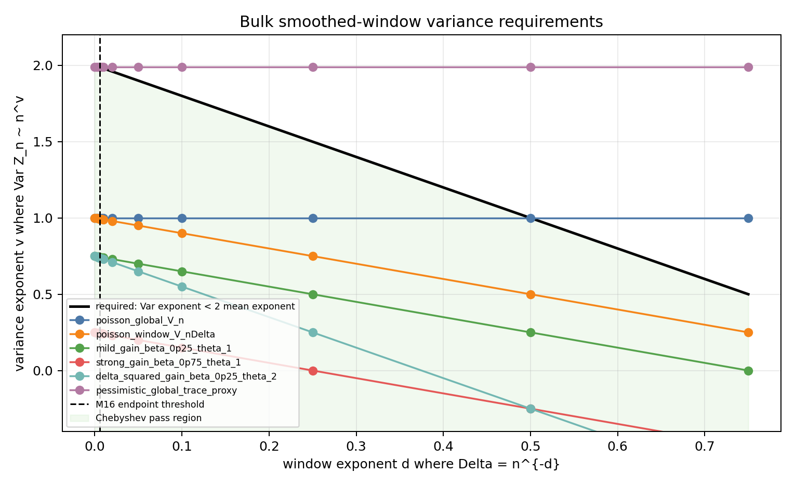
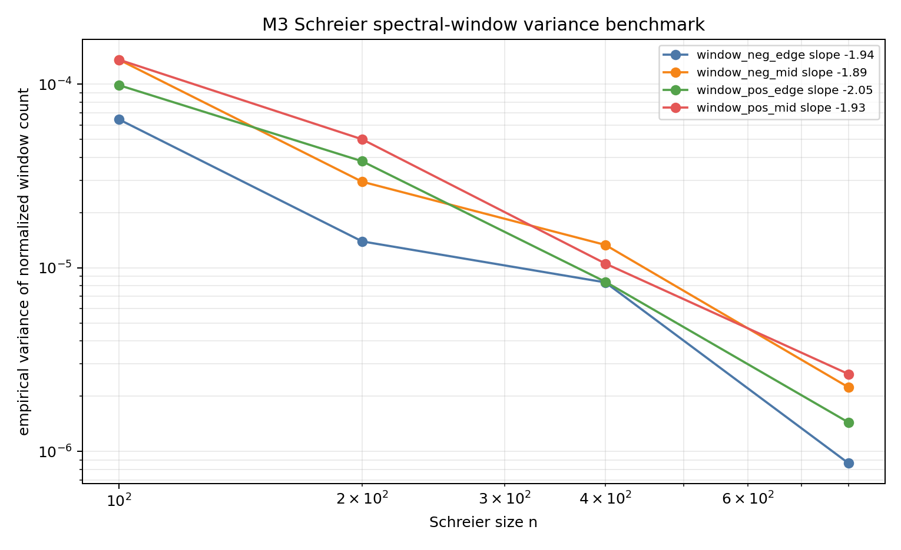

# M17 Local Window Variance Input

## Purpose

M16 showed that subtracting two global Weyl-law estimates controls a local window only above the inherited endpoint-error scale. M17 replaces endpoint subtraction with a conditional smoothed statistic:

```text
Z_n(phi; Lambda, Delta)
  = sum_j phi((lambda_j(X_n)-Lambda)/Delta)
    - main_n(phi; Lambda, Delta).
```

The point is not to prove a new Kim--Tao variance theorem here. The point is to state exactly what such a theorem would need to imply.

## Proposition Template

**Conditional proposition.** In the bulk `Lambda>1/4`, let `phi >= 0` be smooth, compactly supported, and have positive integral. If

```text
Var Z_n(phi; Lambda, Delta) <= V(n,Lambda,Delta)
```

and

```text
sqrt(V(n,Lambda,Delta))
  = o((2g-2)n Delta F'(Lambda) int phi),
```

then the smoothed window count has relative error `o(1)` with high probability. For `Delta=n^{-d}` and `Var Z_n <= n^v`, the bulk exponent condition is

```text
v/2 < 1-d.
```

This beats the M16 endpoint-subtraction threshold only in regimes with

```text
d > alpha_W.
```

At the edge, replace the bulk mean `n Delta` by the edge mass `n Delta^(3/2)`, so the mean exponent is `1-3d/2` and the endpoint threshold exponent is `2 alpha_W/3`.

## Requirement Grid

The analyzer `scripts/analyze_local_window_variance_requirements.py` writes `data/extension_candidates/local_window_variance_requirements.csv`. It uses normalized constants with

```text
alpha_W=0.006, epsilon=0.1, genus=2.
```

For bulk windows, the M16 endpoint threshold exponent is `0.006`. Rows with `Delta_exponent > 0.006` test genuinely smaller windows than M16 endpoint subtraction. In those rows, the pessimistic global-trace proxy `v=2-2 alpha_W=1.988` fails the Chebyshev test, while window-scaled laws such as `V ~ n Delta` pass over a wide mesoscopic exponent range. This is the key separation: a direct localized variance law can add information only if its fluctuation scale tracks the window, not the global endpoint error.



## Schreier Benchmark

The benchmark script `scripts/analyze_schreier_window_variance_benchmark.py` reuses the M3 file `data/polynomial_method/schreier_spectral_toy_trials.csv`. It estimates empirical variance of normalized window counts for four fixed Schreier spectral windows.

| window | fitted normalized-variance slope vs. `n` |
|---|---:|
| `window_neg_edge` | `-1.9409` |
| `window_neg_mid` | `-1.8929` |
| `window_pos_edge` | `-2.0488` |
| `window_pos_mid` | `-1.9315` |

At `n=800`, the normalized variances are between `8.62e-7` and `2.64e-6`, while the raw-count variance proxies remain order one. This is consistent with coarse normalized window counts concentrating in the M3 toy model. It is not evidence that Kim--Tao random covers satisfy the needed hyperbolic trace-window variance estimate; it is only a sanity benchmark for the variance question.



## Bridge To Kim--Tao

The missing input attaches closest to the trace/pre-trace test-function and variance steps, not to the M10-M15 quotient enumeration route. A future theorem would need to construct a spectral test function at width `Delta`, control the geometric-side growth and derivative losses induced by that localization, and prove a random-cover variance bound for the resulting localized statistic.

If the goal is a sharp interval count, one more conditional step is required: smooth majorants/minorants must approximate the indicator with error smaller than the main window mass. M17 proves no such de-smoothing theorem.

## Conservative Conclusion

M17 identifies a precise future target:

```text
Find a localized trace/pre-trace variance theorem with
sqrt(Var Z_n(phi; Lambda, Delta)) = o(n F'(Lambda) Delta)
for at least one Delta << Delta_global.
```

The endpoint-subtraction route cannot supply this because it charges each local interval with two global errors. The Schreier benchmark says the question is empirically meaningful in a finite toy model, but the hyperbolic theorem requires new local trace variance input.
