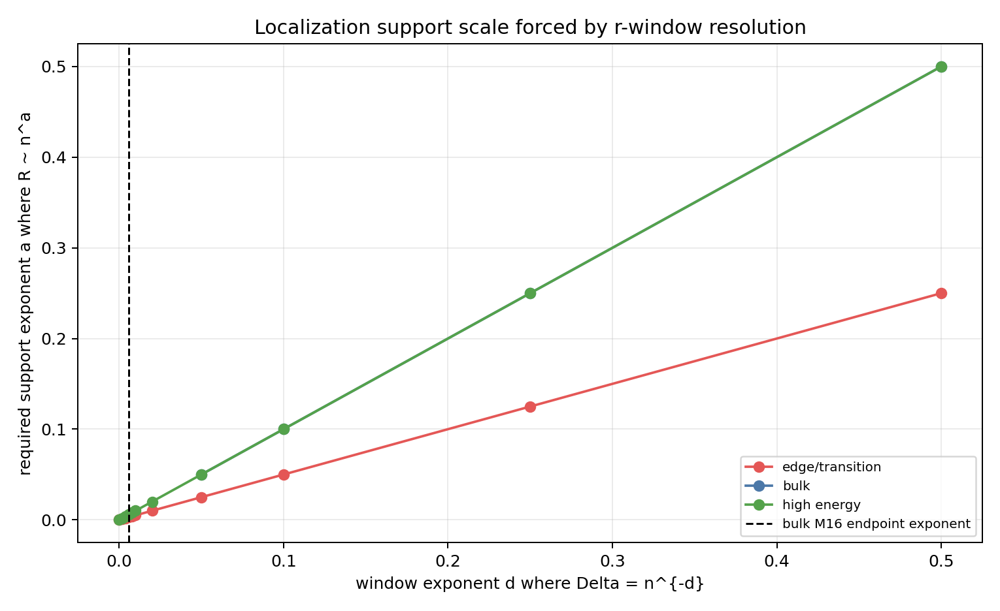
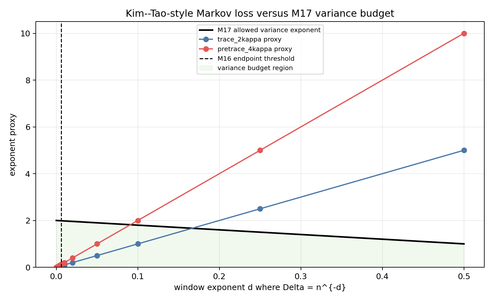

# M18 Test-Function Localization Feasibility

## Purpose

M17 isolated the desired local-window variance condition

```text
sqrt(Var Z_n(phi; Lambda, Delta)) << n F'(Lambda) Delta
```

in the bulk. M18 asks whether the existing Kim--Tao trace/pre-trace architecture can naturally support the spectral localization needed for such a statistic.

## Paper-Grounded Parameter Map

In §2.4, Kim--Tao use

```text
hat phi(x) = h o f_{Lambda0}(x),
f_{Lambda0}(x) = f(c0 Lambda0^{-1/2} x),
deg h = q,
h(x)=x htilde(x).
```

The key support relation used in the trace and pre-trace proofs is

```text
supp((h o f_{Lambda0})^vee) subset [-c0 Lambda0^{-1/2} q, c0 Lambda0^{-1/2} q].
```

Thus the paper's `q` controls both polynomial degree and geometric-side support length, up to the fixed-energy factor `Lambda0^{-1/2}`. Proposition 3.1 then pays a trace-side Markov/interpolation loss `q^(2 kappa)`, while Proposition 4.1/4.2 pays the pre-trace analogue `q^(4 kappa)`.

## Window Conversion

For `lambda = r^2 + 1/4`, a `lambda`-window of width `Delta` has exact `r`-width

```text
delta_r = sqrt(Lambda + Delta - 1/4) - sqrt(Lambda - 1/4).
```

In the fixed bulk regime this is

```text
delta_r ~ Delta / (2 sqrt(Lambda-1/4)).
```

At `Lambda=1/4`, this bulk formula is invalid and `delta_r=sqrt(Delta)`. At high energy, fixed `lambda`-width corresponds to a smaller `r`-width by a factor comparable to `sqrt(Lambda)`.

## Generated Tradeoff Tables

The script `scripts/analyze_test_function_localization_tradeoffs.py` writes:

- `data/extension_candidates/test_function_localization_tradeoffs.csv` with 330 rows.
- `data/extension_candidates/test_function_localization_regime_summary.csv` with 18 rows.

The tables keep the three scales separate: `Delta_exponent_d`, exact `r_width_exact`, and support exponent `support_exponent_R_n_power`.
For exact edge rows, inverse-width support uses the square-root scale `R ~ Delta^(-1/2)`, so `Delta=n^{-d}` contributes support exponent `d/2` rather than the bulk exponent `d`.

Representative bulk rows for `Lambda=4`, `kappa=5`, and `q ~ R ~ n^d`:

| `d` | side | Markov-loss proxy | M17 allowed variance exponent | classification |
|---:|---|---:|---:|---|
| 0.008 | trace `q^(2 kappa)` | 0.08 | 1.984 | requires new test-function construction |
| 0.008 | pre-trace `q^(4 kappa)` | 0.16 | 1.984 | requires new test-function construction |
| 0.02 | trace `q^(2 kappa)` | 0.20 | 1.960 | requires new test-function construction |
| 0.02 | pre-trace `q^(4 kappa)` | 0.40 | 1.960 | requires new test-function construction |
| 0.10 | trace `q^(2 kappa)` | 1.00 | 1.800 | requires new test-function construction |
| 0.10 | pre-trace `q^(4 kappa)` | 2.00 | 1.800 | blocked by support/interpolation growth |

Across all generated rows, the classification counts are:

| classification | rows |
|---|---:|
| compatible with existing architecture | 68 |
| requires new test-function construction | 106 |
| requires new random-cover variance estimate | 110 |
| blocked by support/interpolation growth | 46 |





## Classification

**Compatible with existing architecture.** Rows at or above the M16 endpoint-subtraction scale are compatible in the weak sense that Kim--Tao's existing global cutoff architecture already addresses that range. They do not produce a new M17 improvement.

**Requires new test-function construction.** Bulk rows just below the M16 endpoint threshold are not immediately killed by the exponent proxy, especially on the trace side, but the paper does not supply a translated smoothed window with leakage controlled at width `Delta`. This is the best possible positive reading.

**Requires new random-cover variance estimate.** Logarithmic-support rows are included as the Kim--Tao-compatible benchmark. If a smoothed test achieved enough localization with `R ~ c log n`, the support obstruction would weaken, but M17 would still need a new local variance estimate for that statistic.

**Blocked by support/interpolation growth.** For compact-support inverse-width localization with `q ~ n^d`, the pre-trace `q^(4 kappa)` proxy becomes prohibitive faster than the trace `q^(2 kappa)` proxy. This makes pre-trace/eigenfunction local-window variance a poor first target.

## Answer To The Key Questions

1. The spectral cutoff is controlled by `f_{Lambda0}` and a polynomial `h`; geometric support and polynomial degree are controlled by `q`, with support `O(Lambda0^{-1/2} q)`.
2. A bulk `lambda`-window of width `Delta` requires `delta_r ~ Delta/(2 sqrt(Lambda-1/4))`.
3. Candidate localized tests must either increase support/degree like `1/delta_r`, tolerate leakage, or prove a new logarithmic-support smoothing lemma.
4. For `Delta=n^{-d}`, inverse-width localization forces `q` polynomial in `n`, making the existing `q^(2 kappa)` and especially `q^(4 kappa)` losses compete directly against the M17 variance budget.
5. Trace and pre-trace fail for the same support/localization reason, but pre-trace is less plausible because it adds the stronger fourth-moment/interpolation loss.

## Recommendation

Do not pursue M17 by directly retuning the existing §2.4 cutoff. The next cycle should pursue a specific smoothed test-function lemma: construct a translated Paley-Wiener or approximate-window test, quantify its leakage against `n F'(Lambda) Delta`, and only then ask whether a random-cover variance estimate can be proved for that statistic. If that lemma still requires `R ~ Delta^{-1}`, record a negative obstruction and pivot away from local-window variance inside the current Kim--Tao architecture.
