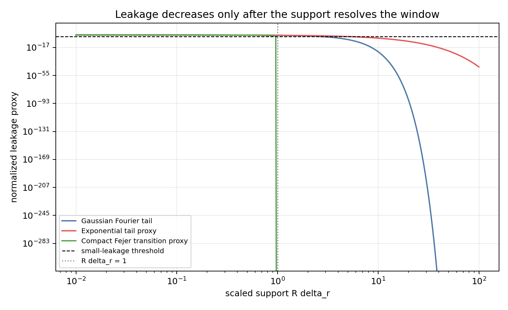
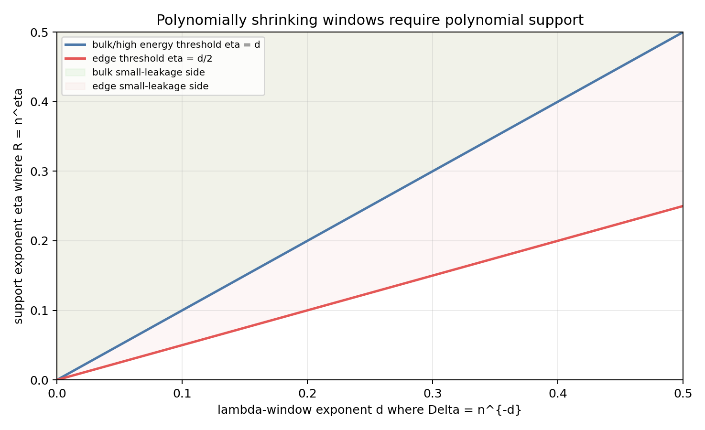

# M19 Smoothed Window Paley-Wiener Lemma

## Purpose

M18 showed that direct inverse-width localization in Kim--Tao's test-function architecture forces the geometric support/polynomial degree to grow with the reciprocal r-window width. M19 tests the only plausible escape route left there: a translated smoothed Paley-Wiener window with logarithmic or sub-polynomial support and tolerable leakage.

## Lemma

For the Fourier convention

```text
hat h(t) = int h(r) exp(-i r t) dr,
```

the translated and rescaled window

```text
h_delta(r) = phi((r-r0)/delta)
```

has transform

```text
hat h_delta(t) = delta exp(-i r0 t) hat phi(delta t).
```

Truncating the geometric side to `|t|<=R` loses

```text
int_{|u|>R delta} |hat phi(u)| du.
```

Therefore fixed-quality localization requires `R delta` bounded below, and small leakage for standard Schwartz kernels requires `R delta -> infinity`.

## Lambda-To-r Translation

For `lambda=r^2+1/4`, the exact r-width of `[Lambda,Lambda+Delta]` is

```text
delta_r = sqrt(Lambda + Delta - 1/4) - sqrt(Lambda - 1/4).
```

In fixed bulk energy this is `Delta/(2 sqrt(Lambda-1/4)) + O(Delta^2)`. At the spectral edge it is exactly `sqrt(Delta)`. Thus for `Delta=n^{-d}`, bulk and fixed high-energy windows have r-width exponent `d`, while edge windows have exponent `d/2`.

## Generated Diagnostics

The analyzer `scripts/analyze_smoothed_window_leakage.py` writes:

- `data/extension_candidates/smoothed_window_leakage_tradeoffs.csv`.
- `data/extension_candidates/smoothed_window_leakage_summary.csv`.
- `reports/figures/m19_kernel_leakage_profiles.png`.
- `reports/figures/m19_support_resolution_phase_diagram.png`.

The Wolfram certificate `scripts/certify_smoothed_window_scaling.wls` writes:

- `data/extension_candidates/smoothed_window_symbolic_checks.csv`.

The symbolic checks verify Gaussian Fourier scaling, the bulk lambda-to-r expansion, the edge formula, and the limiting behavior of a Gaussian Fourier tail as `R delta` goes to zero or infinity.

The generated tradeoff table has 2376 rows. Classification counts are:

| classification | rows |
|---|---:|
| negative obstruction | 1116 |
| fixed-quality only | 168 |
| small leakage asymptotically | 1092 |

The negative-obstruction rows include all tested `R=log n` cases with fixed positive `d`; the nonnegative polynomial-support rows are exactly the exponent-threshold cases `eta>=d` in the bulk/high-energy regimes and `eta>=d/2` at the edge.





## Classification

**Final classification: negative obstruction.**

For every fixed `d>0` in the bulk,

```text
R=O(log n),   delta_r ~= n^{-d}
```

gives

```text
R delta_r ~= (log n)n^{-d} -> 0.
```

The Fourier tail retained by a support-truncated smoothed window is then not a small error; it remains order one in the scaled transform. More generally, `R=n^eta` resolves a bulk window only at `eta>=d`, and gives vanishing model leakage only at `eta>d`. At the edge the threshold is `eta>=d/2`, which is milder but still polynomial for polynomially shrinking `Delta`.

## Answers To M19 Questions

1. A bulk r-window of width `delta_r` requires `R delta_r` bounded below for fixed-quality approximation, and `R delta_r -> infinity` for small standard Fourier-tail leakage.
2. With `delta_r=n^{-a}`, logarithmic support gives `R delta_r -> 0` for every `a>0`; polynomial support `R=n^eta` gives zero, bounded, or infinite scaled support according as `eta<a`, `eta=a`, or `eta>a`.
3. Gaussian kernels only trade compact support for geometric tails; they do not beat the `R delta_r` scaling. Compact Fourier kernels fit finite-support trace formulas but have transition width `~1/R`.
4. The edge changes `a=d` to `a=d/2`; it does not remove the uncertainty obstruction.
5. The carried-forward proposition is the scaling obstruction in `docs/proof_ledger/smoothed_window_paley_wiener_obstruction.md`: polynomially shrinking spectral windows require polynomially growing support inside the compactly supported Kim--Tao architecture.

## Conservative Conclusion

M19 closes the logarithmic-support escape route identified in M18 for fixed-quality local windows. The local-window program can still continue only by changing one of the assumptions: accept noncompact geometric tails and prove new random-cover tail estimates, tolerate leakage large enough that it no longer gives M17 relative control, or prove a long-support localized variance theorem with support growing polynomially in `n`.
