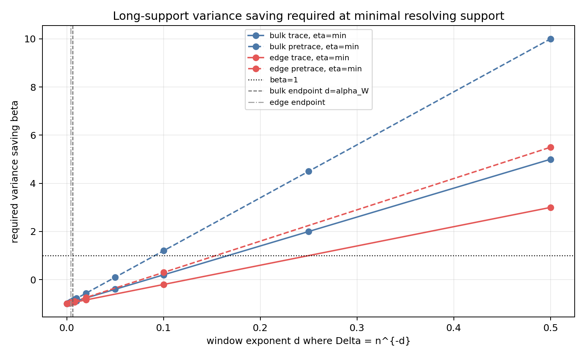
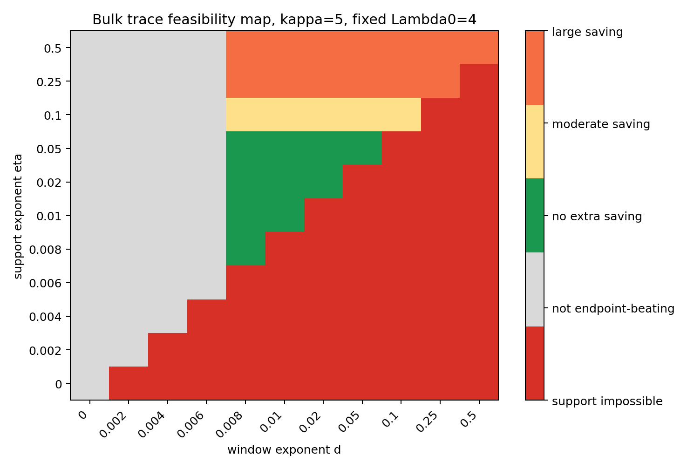

# M20 Long-Support Trace Variance Requirement

## Purpose

M19 showed that standard smoothed local windows cannot keep logarithmic geometric support: resolving `Delta=n^{-d}` needs `R=n^eta` with `eta>=d` in the bulk and `eta>=d/2` at the edge. M20 asks what random-cover variance theorem would be required if we accept that polynomial support.

## Exponent Budget

Start from the M17 criterion:

```text
sqrt(Var Z_n) << n F'(Lambda) Delta
```

in the bulk. For `Delta=n^{-d}`, the mean exponent is `1-d`. At the edge, the mean exponent is `1-3d/2`.

Model a future long-support theorem as

```text
Var Z_n <= n^(1 + L(eta) - beta(eta)).
```

Then Chebyshev requires:

```text
bulk: beta(eta) > L(eta) + 2d - 1
edge: beta(eta) > L(eta) + 3d - 1
```

Kim--Tao's support map from M18 is

```text
supp((h o f_Lambda0)^vee) <= c0 Lambda0^(-1/2) q.
```

For fixed `Lambda0`, `R=n^eta` means `q_exponent=eta`. The trace-side proxy is `L_trace=2 kappa eta`; the pre-trace proxy is `L_pretrace=4 kappa eta`.

At minimal resolving support and `kappa=5`, the required saving is:

```text
bulk trace:      beta > 12d - 1
bulk pre-trace:  beta > 22d - 1
edge trace:      beta > 8d - 1
edge pre-trace:  beta > 13d - 1
```

These are feasibility thresholds, not proved estimates.

## Generated Diagnostics

The analyzer `scripts/analyze_long_support_variance_budget.py` writes:

- `data/extension_candidates/long_support_variance_budget.csv`.
- `data/extension_candidates/long_support_variance_summary.csv`.
- `reports/figures/m20_required_variance_saving.png`.
- `reports/figures/m20_long_support_feasibility_map.png`.

The generated grid has 4356 rows. Classification counts are:

| feasibility class | rows |
|---|---:|
| impossible_by_support | 1872 |
| outside_current_architecture | 1284 |
| requires_no_extra_saving | 510 |
| requires_moderate_new_saving | 192 |
| requires_large_new_saving | 498 |

For `kappa=5`, fixed `Lambda0=4`, and endpoint-beating rows that meet the M19 support threshold:

| regime | architecture | rows | min beta | median beta |
|---|---|---:|---:|---:|
| bulk | trace | 28 | -0.904 | 0.15 |
| bulk | pre-trace | 28 | -0.824 | 1.15 |
| edge | trace | 44 | -0.942 | -0.091 |
| edge | pre-trace | 44 | -0.902 | 0.659 |
| high_energy | trace | 28 | -0.904 | 0.15 |
| high_energy | pre-trace | 28 | -0.824 | 1.15 |





## Interpretation

There is a narrow trace-side exponent band where the bookkeeping does not immediately kill the local-window route. For small endpoint-beating bulk windows, minimal support `eta=d` and trace loss `2 kappa eta` require only moderate or even no additional `beta` in the crude model. The pre-trace route is much less credible because `4 kappa eta` shifts the same rows toward order-one or larger saving.

The remaining obstacle is not algebraic. It is the missing theorem: a localized random-cover trace variance estimate for polynomially long support. Existing Kim--Tao inputs do not provide it, and M18/M19 show that one cannot evade it by keeping support logarithmic.

## Decision

**Continue with a concrete long-support trace theorem template.**

The branch should stay trace-side, not pre-trace-side. The next target should be stated as a conjectural theorem: for bulk `Delta=n^{-d}`, support `R=n^eta` with `eta>=d`, prove or refute a localized trace variance bound

```text
Var Z_n <= n^(1 + 2 kappa eta - beta(eta))
```

with

```text
beta(eta) > 2 kappa eta + 2d - 1.
```

If that theorem cannot be attached to actual Kim--Tao trace-polynomial objects, the compact-support local-window branch should be closed and the campaign should pivot to noncompact-tail trace methods.
