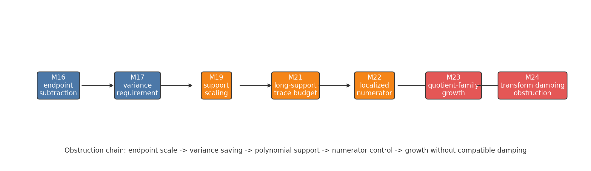
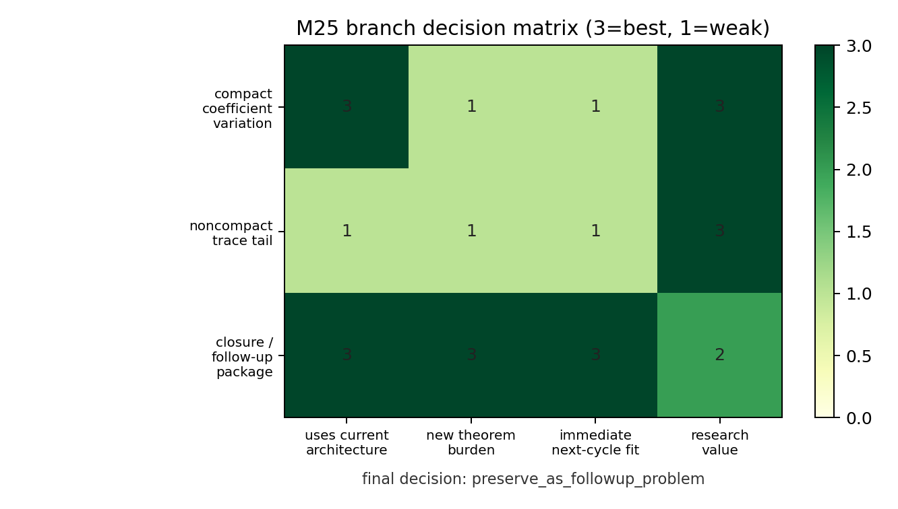

# M25 Local-Window Route Synthesis And Branch Decision

## Summary

M25 turns M16-M24 into a branch decision record. The local-window trace route is not closed as a mathematical problem, but it is closed as an immediate transform-damping/support-tuning program. The final decision is:

```text
preserve_as_followup_problem
```

## Evidence Table

| milestone | label | implication |
|---|---|---|
| M16 | proved from Kim--Tao | Inherited global estimates only control windows above endpoint-subtraction scales. |
| M17 | conditional theorem template | Endpoint-beating local windows require a direct smoothed-window variance saving. |
| M18 | analytic obstruction | Retuning Kim--Tao test functions is insufficient; trace-side localization is the plausible route. |
| M19 | analytic obstruction | Bulk `Delta=n^{-d}` forces polynomial support `q=n^eta` with `eta>=d`. |
| M20 | conditional theorem template | Polynomial support creates a long-support variance-saving budget. |
| M21 | conditional theorem template | `LSTV_trace(eta,beta)` suffices if `beta>2 kappa eta+2d-1`. |
| M22 | open theorem | The trace variance target reduces upstream to localized Corollary 3.4 numerator control. |
| M23 | toy/proxy evidence | Quotient-family growth dominates absent extra damping; surface-group-law uncertainty remains. |
| M24 | analytic obstruction | Compact-support transform/geodesic weights decay in `t delta_r`, not `t`, so they do not supply the needed damping. |

Machine-readable versions:

- `data/extension_candidates/local_window_route_evidence_index.csv`
- `data/extension_candidates/local_window_route_decision_table.csv`





## Compact-Support Routes

No compact-support route remains except direct coefficient-variation or small-`x` control of the actual surface-group quotient-polynomial numerator in Lemma 3.3 / Corollary 3.4.

The required theorem cannot be a restatement of "prove the missing variance theorem." It must control the weighted numerator

```text
p_{Delta,q}(x)
  = sum W_{Delta,q}(gamma1,k1) W_{Delta,q}(gamma2,k2)
      Q_{gamma1^k1,gamma2^k2}(x)
```

for the actual Kim--Tao quotient family, after the localized compact Paley-Wiener test is inserted. A sufficient rate would have the form

```text
E G_n(h_{Delta,q})^2 <= n q^A n^{-sigma+o(1)}
```

with

```text
(2 kappa - A) eta + sigma > 2 kappa eta + 2d - 1.
```

This is an open theorem target. M23 is useful only as a schema for strata and uncertainty tags; it is not evidence that the actual surface-group family satisfies the theorem.

## Noncompact Alternative

A noncompact trace-tail branch would need:

1. a noncompact spectral localizer that still approximates the fixed-energy window,
2. a trace-formula theorem controlling the noncompact geometric side and omitted tails, and
3. a tail rate stronger than the actual geodesic/quotient-family growth rate.

The repaired M24 contrast matters: `exp(-0.18 t)` is not enough for the growth proxies tested there. A future noncompact branch should begin with a theorem template whose rate condition is explicitly `c > rho_actual`, where `rho_actual` is the relevant geometric/family growth exponent.

## Boxed Candidate Outcomes

**Outcome 1: compact-support coefficient-variation theorem.**
The compact route remains viable only if one proves localized Corollary 3.4 numerator control for the actual folded surface-group quotient-polynomial family with rate enough to pass the M21 beta inequality. This is the most precise compact follow-up problem.

**Outcome 2: noncompact trace-tail architecture.**
The noncompact route is a different proof architecture, not a tweak of M19-M24. It requires spectral localization plus geometric-side tail control with decay rate exceeding quotient/geodesic growth.

**Outcome 3: branch closure/obstruction statement.**
The following subroutes are closed: inherited endpoint subtraction, direct retuning of Kim--Tao test functions, logarithmic support localization, and compact-support transform/geodesic damping. The branch should be preserved as a precise follow-up problem rather than continued immediately.

## Final Branch Decision

`preserve_as_followup_problem`

Reason: every surviving route requires a new theorem that is now stated clearly but not made attackable by another same-branch empirical cycle. The campaign should pivot to another high-value target while retaining the local-window package as a publication-facing problem statement.

## Validation Plan

The synthesis package is validated by:

```text
python3 -m py_compile scripts/build_local_window_route_synthesis.py tests/test_local_window_route_synthesis.py
python3 scripts/build_local_window_route_synthesis.py
python3 tests/test_local_window_route_synthesis.py
figure check reports/figures/m25_local_window_obstruction_chain.png
figure check reports/figures/m25_branch_decision_matrix.png
python3 -m long_exposure.tools.promise_check .
python3 -m long_exposure.tools.org_check .
```
