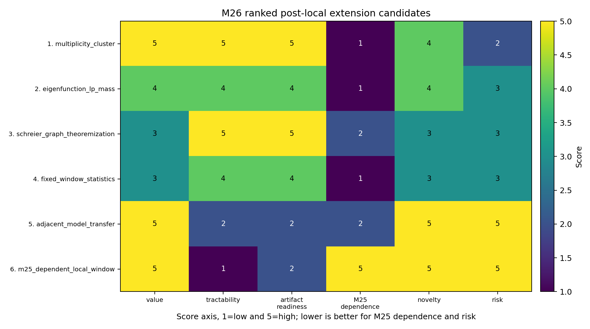
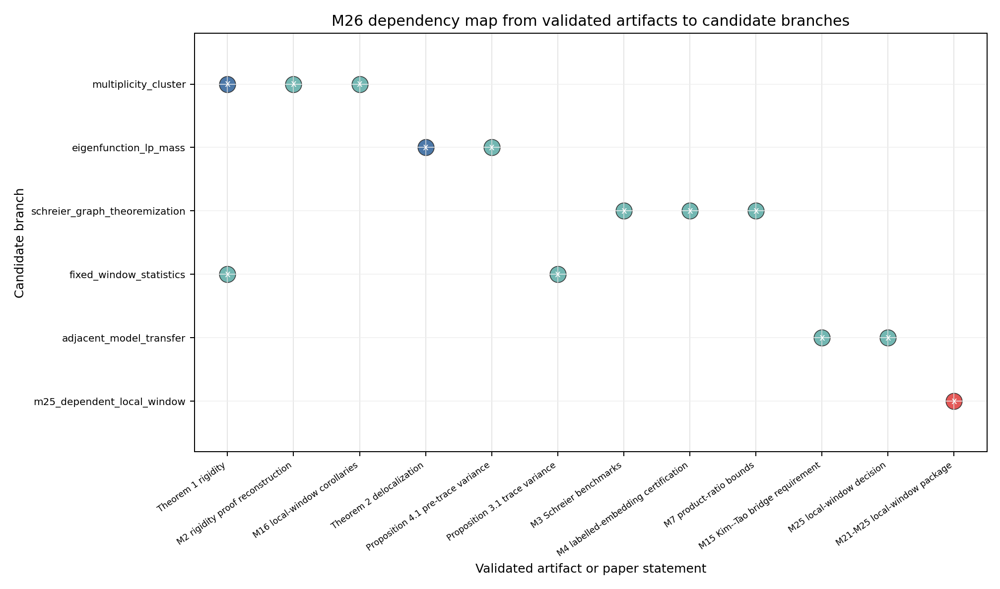

# M26 Post-Local Extension Reprioritization

## Decision

M25 preserved the shrinking fixed-energy local-window problem as a follow-up rather than an immediate workstream. M26 therefore scores post-local branches by value, tractability, artifact readiness, dependence on the M25 open theorem, novelty, and risk.

The unique recommended next milestone is:

```text
M27-multiplicity-and-cluster-corollaries-from-rigidity
```

The reason is conservative: multiplicity and cluster consequences attach directly to Theorem 1, the M2 rigidity proof ledger, and the M16 scale analysis, while requiring no new localized Corollary 3.4 coefficient-variation theorem.

## Ranked Candidate Table

| order | candidate | attachment point | deliverable | obstruction | new input | feasibility |
|---:|---|---|---|---|---|---|
| 1 | multiplicity/spectral-cluster consequences from rigidity | Theorem 1 rigidity; M2; M16 | Explicit multiplicity and mesoscopic cluster corollaries with scale limits. | Exact multiplicity must handle coincident deterministic reference locations and edge/bulk spacing. | No new trace theorem; deterministic Weyl/rigidity bookkeeping. | high |
| 2 | eigenfunction `L^p`/mass-distribution consequences from delocalization | Theorem 2; M2; Proposition 4.1 | Corollary map for `L^p`, small-ball mass, or averaged mass distribution. | Theorem 2 may already encode the strongest statement. | Mostly deterministic interpolation; maybe a local mass lemma. | medium |
| 3 | finite-window but non-shrinking spectral statistics | Theorem 1; Proposition 3.1; M16 | Fixed-width counting corollaries and variance-to-count checklist. | Could be a repackaging of global rigidity if not centered carefully. | No M25 theorem; fixed-window smoothing and boundary handling. | medium |
| 4 | random-regular-graph/Schreier benchmark theoremization | M3; M4; M7 | Toy theorem and benchmark suite for labelled-template expectations. | Toy-only unless the M15 bridge obstruction is overcome. | Bounded model theorem; Kim--Tao transfer needs new quotient-family structure. | high |
| 5 | transfer template to adjacent random-surface models | M1; M2; M15; M25 | Checklist for Weil-Petersson or variable-curvature transfer. | High model-specific uncertainty. | New model trace, injectivity, and variance theorems. | low |
| 6 | M25-dependent shrinking local-window continuation | M21-M25 | Localized Corollary 3.4 coefficient-variation theorem. | Immediate next step is the unresolved M25 open theorem. | Actual folded surface-group quotient-family control. | low |

Machine-readable outputs:

- `data/extension_candidates/post_local_extension_candidate_scores.csv`
- `data/extension_candidates/post_local_extension_candidate_dependencies.csv`





## Why Multiplicity/Cluster Next

The M27 branch is not expected to improve Kim--Tao's trace estimates. Its value is to convert rigidity into inspectable corollaries about how many random-cover eigenvalues can lie in a deterministic cluster scale, and where exact multiplicity bounds become limited by reference-spectrum collisions.

The one-cycle deliverable should be a proof-ledger note and small exponent-check script. It should derive cluster bounds from Theorem 1 displacement plus Weyl spacing/counting inputs, explicitly separating theorem-level corollaries from limitations at deterministic collisions and near spectral edges.

## Deprioritized Routes

The M25-dependent shrinking local-window route is intentionally not ranked first. Its immediate next step is still the localized Corollary 3.4 coefficient-variation theorem or a new noncompact trace-tail theorem, both preserved as follow-up problems rather than reopened here.

The Schreier benchmark branch remains useful, but after M15 it is a toy/model theoremization branch unless it states exactly what bridge input is missing. Adjacent-model transfer has high value but is not a one-cycle falsifiable theorem/probe deliverable.

## Reversal Criteria

The M27 recommendation should be reversed if its first derivation produces only a tautological restatement of M16 or no nontrivial multiplicity/cluster scale. It should also be replaced if the Theorem 2 delocalization branch yields a sharper named `L^p` or mass-distribution corollary with no new theorem input.

## Validation Plan

```text
python3 -m py_compile scripts/score_post_local_extension_candidates.py tests/test_post_local_extension_candidates.py
python3 scripts/score_post_local_extension_candidates.py
python3 tests/test_post_local_extension_candidates.py
figure check reports/figures/m26_post_local_candidate_matrix.png
figure check reports/figures/m26_extension_dependency_map.png
python3 -m long_exposure.tools.promise_check .
python3 -m long_exposure.tools.org_check .
```
