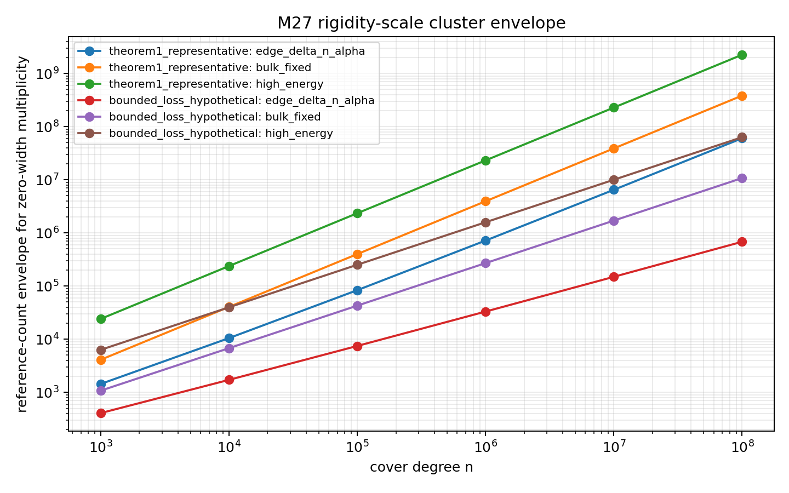
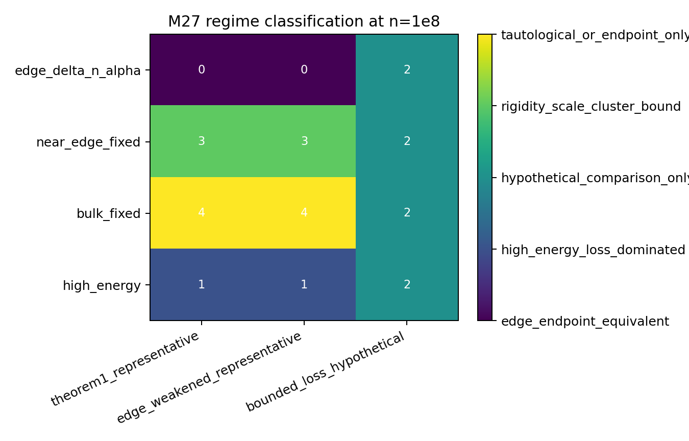

# M27 Multiplicity And Cluster Corollaries

## Decision

`preserve_as_bookkeeping_corollary`.

Kim--Tao Theorem 1 gives a clean rigidity-scale cluster theorem and recovers the multiplicity scale noted in the paper. It does not produce level repulsion, simplicity, or endpoint-beating local statistics. The result should be recorded as a useful corollary and the next extension branch should pivot to Theorem 2 \(L^p\)/mass-distribution consequences.

## Corollary

On the Theorem 1 high-probability event, for every interval \(I\subset[1/4,\Lambda_{\max}]\),
\[
N_{X_n}(I)
\le
\#\{j:\lambda_j\in I^{+R}\},
\qquad
R=C_\epsilon \Lambda_{\max}^{1/2+\epsilon}n^{-\alpha_R}.
\]
In particular,
\[
\operatorname{mult}_{X_n}(\lambda)
\le
\#\{j:|\lambda_j-\lambda|\le R\}.
\]
Using \(F(\lambda_j)=j/((2g-2)n)\), this becomes
\[
\operatorname{mult}_{X_n}(\lambda)
\le
1+(2g-2)n\left(F(\lambda+R)-F((\lambda-R)_+)\right),
\]
with \((\lambda-R)_+=\max(1/4,\lambda-R)\).

## Regimes

**Fixed bulk \(\Lambda_0>1/4\).** Since
\[
F'(\Lambda_0)=\frac12\tanh(\pi\sqrt{\Lambda_0-1/4}),
\]
the zero-width envelope is
\[
1+2(2g-2)nF'(\Lambda_0)C_\epsilon\Lambda_0^{1/2+\epsilon}n^{-\alpha_R}
+O(nR^2).
\]
This is theorem-level and deterministic, but for the known small \(\alpha_R\) it is much larger than \(O(1)\).

**Edge \(\Lambda=1/4+\Delta\).** The correct count is integral, not linear:
\[
1+(2g-2)n\frac{\pi}{3}(\Delta+R)^{3/2}+O(n(\Delta+R)^{5/2}).
\]
This is a genuinely different formula from the bulk density approximation, but it is endpoint-equivalent to the M16 edge bookkeeping.

**High energy.** Since \(F'(\Lambda)\to1/2\), high energy does not reduce the count. The radius grows as \(\Lambda^{1/2+\epsilon}n^{-\alpha_R}\), so the envelope is high-energy-loss dominated.

## Numerical Regime Check

The script uses representative proved-shape labels, not optimized exponents. At \(n=10^8\), the generated classification table marks proved-shape edge rows as `edge_endpoint_equivalent`, proved-shape fixed bulk rows as `tautological_or_endpoint_only`, and proved-shape high-energy rows as `high_energy_loss_dominated`.

Generated data:

- `data/extension_candidates/m27_cluster_bound_grid.csv`
- `data/extension_candidates/m27_cluster_regime_classification.csv`

## Limitations

The result controls indexed displacement, not random level repulsion. It cannot rule out many random eigenvalues landing at the same value if many reference locations lie inside the rigidity ball. It also inherits deterministic edge degeneration and high-energy \(\Lambda^{1/2+\epsilon}\) loss.

The branch is not a failure mathematically: it gives a compact corollary worth citing. It is a failure as a novel extension branch because the scale is still the M16 endpoint/rigidity scale.
