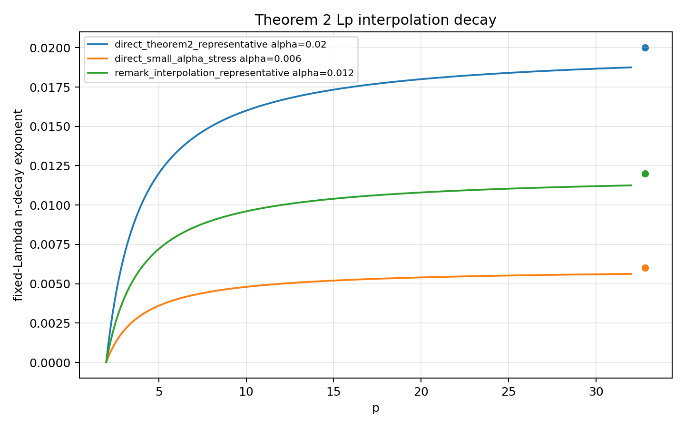
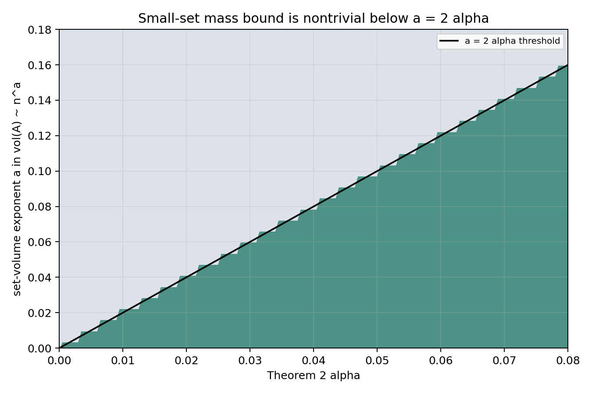

# M28 Theorem 2 Lp and Mass Corollaries

## Decision

`advance_theorem2_consequence_branch`

The branch is worth preserving as a theorem-level corollary package because it gives a clean high-probability exclusion of fixed-energy eigenfunction concentration on sets of volume `o(n^{2alpha})`. The individual inequalities are standard deterministic consequences of a sup-norm bound, but their random-cover interpretation is distinct from the M27 rigidity-scale bookkeeping: Theorem 2 controls eigenfunction amplitude directly rather than transporting reference eigenvalue counts.

## Corollary Package

On the Kim--Tao Theorem 2 high-probability event, let `u` be `L^2`-normalized and `lambda <= Lambda`. If

```text
M_direct = C Lambda^{3/2} n^{-alpha},
M_remark = C_epsilon Lambda^{1/4+epsilon} n^{-alpha'},
```

then either admissible model gives:

```text
||u||_p <= M^{1-2/p},             2 <= p <= infinity,
int_A |u|^2 <= M^2 vol(A),
vol(E) >= theta M^{-2}            if int_E |u|^2 >= theta.
```

The consequences classify as follows:

| Consequence | Classification | Reason |
|---|---|---|
| The event-level sup-norm statement | `direct_theorem2_corollary` | This is Kim--Tao Theorem 2 or Remark 1.1. |
| `L^p` interpolation | `standard_interpolation` | Deterministic interpolation between `L^2` and `L^infty`. |
| Small-set mass upper bound | `nontrivial_mass_delocalization` | At fixed energy it rules out unit-mass concentration on sets below polynomial volume `n^{2alpha}`. |
| Effective-support lower bound | `nontrivial_mass_delocalization` | Any mass-`theta` carrier has volume at least `theta M^{-2}`. |
| QE, equidistribution, nodal claims | `unsupported_stronger_claim` | Sup-norm upper bounds alone do not force mass into specified regions. |

## Area-Normalized Comparison

The cover volume is `vol(X_n)=n vol(X)`. A fully equidistributed normalized eigenfunction would have amplitude scale `n^{-1/2}` on fixed-size base geometry. Theorem 2 gives `n^{-alpha}` with an unspecified small `alpha`, so the effective support lower exponent is `2alpha`, not the full volume exponent `1`.

Thus the fixed-energy conclusion is meaningful but partial:

```text
vol_eff(u) >= c_Lambda n^{2alpha}
```

and the fraction of the full cover volume guaranteed by this lower bound is only

```text
n^{2alpha-1}.
```

## High-Energy Limitation

If `Lambda` grows with `n`, the Lambda factor can erase the polynomial `n` gain. In the direct model, writing `Lambda = n^b`, the small-set threshold exponent becomes

```text
2alpha - 3b.
```

For the Remark 1.1 model it becomes

```text
2alpha' - (1/2+2epsilon)b.
```

The interpolation-improved Lambda exponent is therefore a real high-energy improvement, but it uses a different alpha and should be compared as a separate theorem input.

## Figures





## Branch Assessment

M28 satisfies the theorem-level corollary criteria but does not create a new proof mechanism. The next cycle should either refine the Theorem 2 local-mass input into a controlled family of fixed-scale spatial statements, or pivot to finite non-shrinking spectral statistics / Schreier benchmark theoremization if the campaign prioritizes non-bookkeeping novelty.
