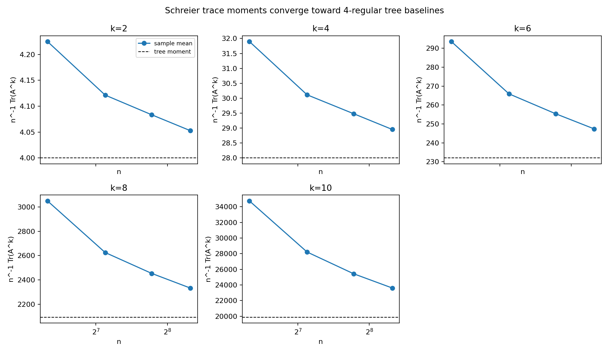
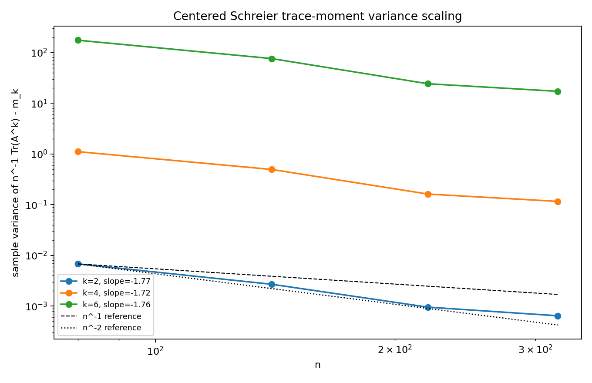
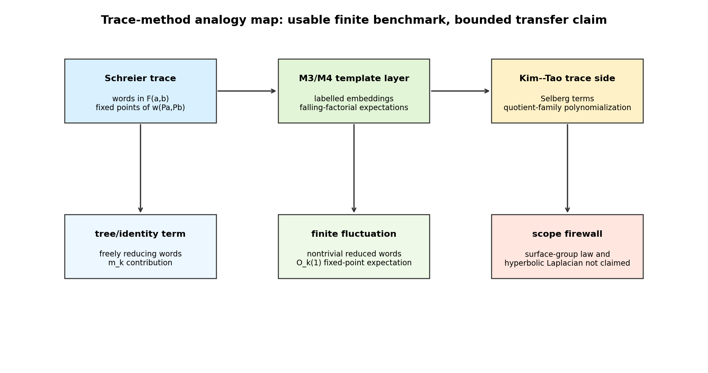

# M30 Schreier Benchmark Theoremization

## Decision

```text
advance_schreier_benchmark_program
```

M30 is strong enough to preserve as a standalone finite benchmark: it has an exact fixed-k expectation theorem template, exact tree moments through `k=10`, reproducible centered-variance evidence, and a clear scope firewall against overclaiming hyperbolic transfer.

## Benchmark Package

The random model is

```text
A_n = P_a + P_a^{-1} + P_b + P_b^{-1},
```

with independent uniform permutations. For fixed `k`,

```text
Tr(A_n^k) = sum_w Fix(w(P_a,P_b)).
```

Free-reducing words are the deterministic tree contribution. Nontrivial reduced words contribute only `O_k(1)` expected fixed points, giving the theorem template

```text
E[n^{-1} Tr(A_n^k)] = m_k + O_k(n^{-1}).
```

The regenerated 4-regular tree moments are:

```text
m_2=4, m_4=28, m_6=232, m_8=2092, m_10=19864.
```

This extends the M3 benchmark while explaining why those values are the right subtraction baseline.

## Numerical Evidence

The command

```bash
python3 scripts/analyze_schreier_trace_benchmark.py
```

generated `960` trial rows from `n=80,140,220,320`, `24` trials, seed `20260516`. The centered variance slopes were:

| k | slope | status |
|---:|---:|---|
| 2 | -1.765 | compatible with `n^{-2}` or better on this grid |
| 4 | -1.716 | compatible with `n^{-2}` or better on this grid |
| 6 | -1.762 | compatible with `n^{-2}` or better on this grid |







## Relation To M3, M4, And Kim--Tao

M3 built the operator-level Schreier spectral probe and observed that centered trace moments decreased after subtracting tree moments. M30 turns that observation into a benchmark theorem/conjecture package: the expectation statement is theorem-level, while variance scaling remains empirical.

M4 certified the finite labelled-template expectation identity for independent permutations. M30 uses the same exposure principle in a less formalized word-by-word proof sketch: fixed nontrivial words create bounded-size permutation constraint systems, so their expected fixed-point count is `O_k(1)`.

The analogy to Kim--Tao Proposition 3.1 is structural, not transfer-theoretic. Both workflows expand traces into combinatorial fixed-point or embedding statistics and subtract identity/diagonal contributions before studying fluctuations. M30 does not prove a surface-group quotient-family estimate and does not replace the MPvH/Nau/MP23 inputs.

## Scope Firewall

Not claimed:

- no hyperbolic random-cover theorem;
- no statement about the Selberg trace formula;
- no result for Kim--Tao quotient-family polynomial numerators;
- no adjacency-to-Laplacian transfer;
- no shrinking spectral-window result.

The useful output is a finite benchmark suite for testing future trace-statistic heuristics before attempting the surface-group model.
