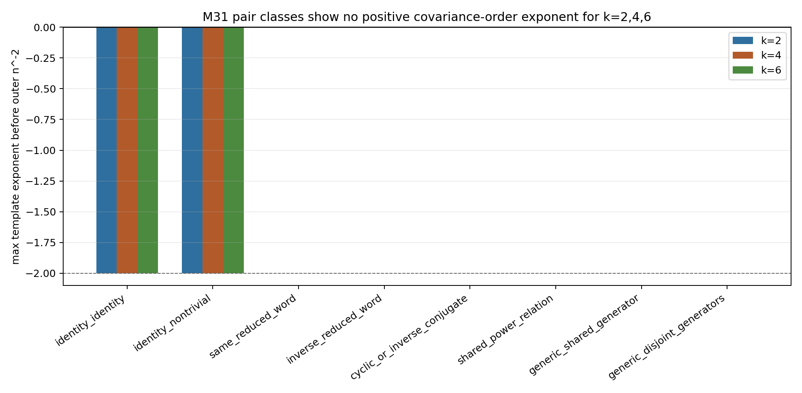
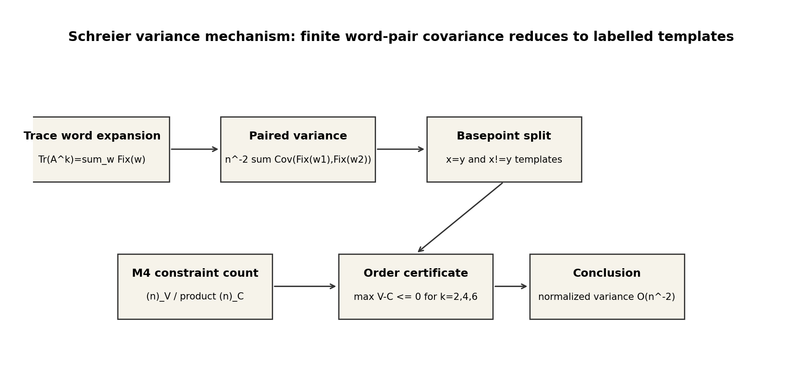
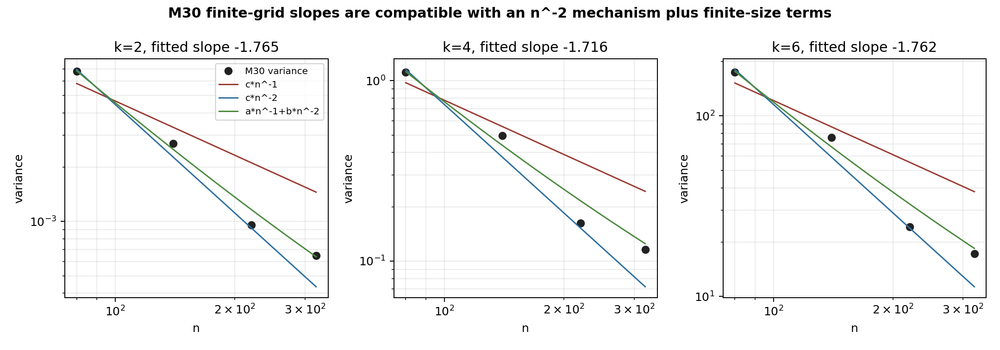

# M31 Schreier Variance Mechanism

## Decision

`advance_schreier_variance_theorem`

M31 upgrades M30's numerical variance evidence to a theorem-template mechanism. For `k=2,4,6`, every checked nontrivial reduced paired-word class has covariance order `O(1)` before the outer `n^{-2}` normalization, and identity-containing classes are deterministic covariance-zero terms. This supports the fixed-`k` target

```text
Var(n^{-1}Tr(A_n^k)) = O_k(n^{-2})
```

as the right Schreier benchmark theorem to prove next.

## Generated Evidence

The analyzer `scripts/analyze_schreier_variance_pair_templates.py` writes:

- `data/extension_candidates/m31_pair_template_classes.csv`;
- `data/extension_candidates/m31_pair_covariance_orders.csv`;
- `data/extension_candidates/m31_variance_order_summary.csv`;
- `data/extension_candidates/m31_variance_mechanism_classification.csv`.

The headline summary is:

| k | word pairs | reduced word types | pair classes | maximum covariance order | normalized order |
|---:|---:|---:|---:|---|---|
| 2 | 256 | 13 | 7 | `O(1)` | `O(n^-2)` |
| 4 | 65536 | 121 | 8 | `O(1)` | `O(n^-2)` |
| 6 | 16777216 | 1093 | 8 | `O(1)` | `O(n^-2)` |

No checked class has a positive-power obstruction; the order tables record the maximum distinct-basepoint and same-basepoint template exponents across all reduced pair templates in each class. The detected relation classes include same reduced words, inverse reduced words, cyclic/inverse-conjugate pairs, shared powers, and generic pairs.





## Relation to M30 Slopes

M30 observed fitted variance slopes near `-1.7` for `k=2,4,6` on `n=80,140,220,320`. M31 does not reinterpret those as an `n^{-1}` law. The pair-template evidence finds no `O(n)` covariance mechanism, so the conservative reading is finite-size crossover toward an `n^{-2}` fixed-`k` asymptotic, possibly with mixed lower-order terms on the tested grid.



## Comparison With Kim--Tao

The real analogy is structural. Kim--Tao's Theorem 1 variance proof expands a two-trace statistic and reduces the random part to common fixed-point or labelled-quotient expectations. M31 performs the same separation in the free two-permutation Schreier model:

```text
variance -> paired words -> common fixed-point constraints -> labelled templates.
```

The analogy stops there. The Schreier model has independent free generators and no surface-group relation, no Selberg transform, no Witten-zeta normalization, and no MPvH/Nau/MP23 quotient-family machinery. M31 supplies a benchmark theorem target, not a random hyperbolic cover transfer.

## Remaining Proof Target

The missing general lemma is finite and explicit:

```text
For every fixed nontrivial reduced pair (u,v), every consistent quotient
template contributing to E Fix(u)Fix(v) has |V|-sum_l |C_l| <= 0.
```

M31 checked the main relation classes through `k=6` and found no obstruction. A complete proof of this lemma would turn the theorem template into a fixed-`k` variance theorem.

## Scope Firewall

M31 does not prove a hyperbolic random-cover theorem, a Selberg trace variance statement, a surface-group quotient-family bound, adjacency-to-Laplacian transfer, or any shrinking-window statistic.
