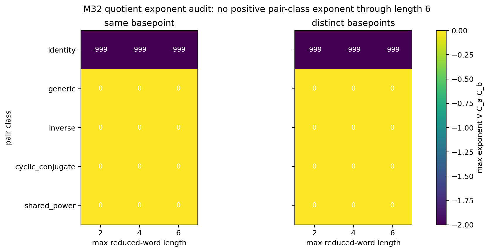
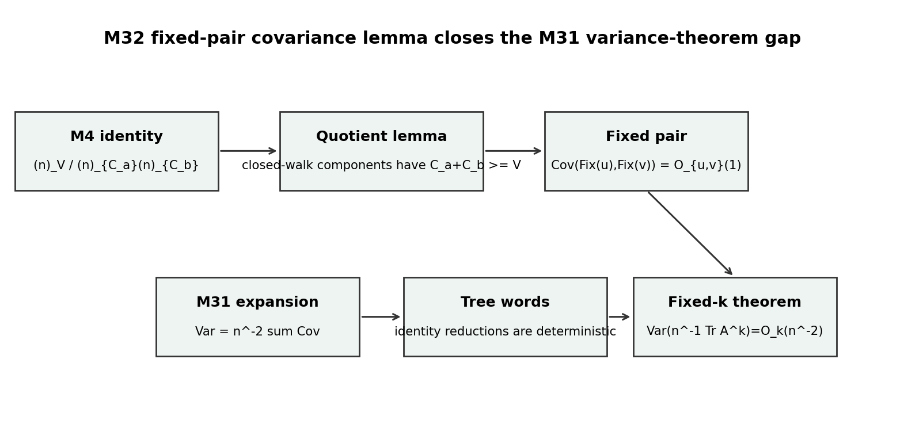

# M32 Schreier Fixed-Pair Covariance Lemma

## Decision

```text
prove_schreier_fixed_k_variance_theorem
```

M32 closes the proof gap left by M31 for the two-permutation Schreier
benchmark. For every fixed nontrivial reduced pair `u,v`,

```text
Cov(Fix(u),Fix(v)) = O_{u,v}(1).
```

The fixed-`k` theorem consequence is therefore

```text
Var(n^{-1}Tr(A_n^k)) = O_k(n^{-2}).
```

## Mechanism

The M4 expectation identity assigns a conflict-free quotient template `H` the
scale

```text
(n)_{V(H)} / ((n)_{C_a(H)}(n)_{C_b(H)}),
```

so the exponent is `V(H)-C_a(H)-C_b(H)`. After cyclically reducing nonidentity
words, every admissible quotient component contains the image of a closed
labelled trajectory. Each quotient vertex in that image has at least one
outgoing labelled constraint, and conflict-freeness prevents collapsed
occurrences from becoming anything other than well-defined partial-permutation
constraints. Such a component has at least as many distinct labelled
constraints as quotient vertices. Hence every admissible quotient has exponent
at most `0`.

Partial-injection failures contribute exactly zero. Identity/tree words are
deterministic and are removed before the covariance estimate.

## Audit Outputs

The checker is a companion to the proof, not a substitute for it:

```text
python3 scripts/prove_schreier_fixed_pair_covariance.py
```

It generated:

- `data/extension_candidates/m32_pair_quotient_classification.csv` with 90
  length/class rows through length 6, including representative base-template
  exponents and proof-bound scope markers.
- `data/extension_candidates/m32_covariance_exponent_proof_checks.csv` with 180
  same/distinct-basepoint representative audit rows; rows that exceed the cheap
  partition cutoff are bounded by the general lemma rather than by exhaustive
  enumeration.
- `data/extension_candidates/m32_variance_theorem_implication.csv` with the
  fixed-pair, exceptional-class, fixed-`k`, and scope-firewall conclusions.





## Relation Classes

The exceptional classes are bounded rather than obstructive:

| class | effect |
|---|---|
| `inverse` | can increase quotient coincidences but still has exponent at most `0` |
| `cyclic_conjugate` | same fixed-point count up to conjugacy, bounded by the same lemma |
| `shared_power` | may change constants through common primitive roots, not the exponent |
| `generic` | no positive exponent mechanism |
| `identity` | deterministic covariance zero after tree-word separation |

## Scope Firewall

This is a theorem for independent uniform permutations in the free
two-generator Schreier model. It does not prove a random hyperbolic cover
variance theorem, a Selberg trace estimate, a surface-group quotient-family
bound, or a shrinking-window statistic.

## Remaining Work

The next natural Schreier-facing follow-up is publication cleanup: rewrite the
M30-M32 benchmark as a standalone proposition package with the expectation
theorem, fixed-pair covariance lemma, and fixed-`k` variance theorem in one
place. The main Kim--Tao-facing open branches remain the M25 local-window
coefficient-variation target and the pending finite non-shrinking spectral
statistics branch.
