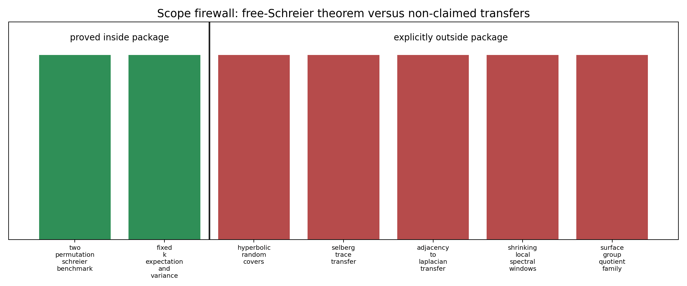

# M33 Schreier Benchmark Package Synthesis

## Result

M30-M32 now form a standalone theorem-grade benchmark for the operator

```text
A_n=P_a+P_a^{-1}+P_b+P_b^{-1}
```

with `P_a,P_b` independent uniform permutations. For every fixed `k`,

```text
E[n^{-1}Tr(A_n^k)] = m_k + O_k(n^{-1}),
Var(n^{-1}Tr(A_n^k)) = O_k(n^{-2}).
```

The package contributes a clean finite analogue of trace-method bookkeeping:
tree words are deterministic, nontrivial fixed-word pairs are controlled by
labelled quotient templates, and the normalized variance inherits the outer
`n^{-2}` factor from the paired trace expansion.

## Claim Ledger

The generated claim ledger
`data/final/m33_schreier_theorem_claim_ledger.csv` records:

| claim | class | status |
|---|---|---|
| fixed-`k` expectation | theorem | proved for Schreier benchmark |
| deterministic tree-word separation | lemma | proved for Schreier benchmark |
| paired variance expansion | identity | proved for Schreier benchmark |
| fixed-pair covariance | lemma | proved for Schreier benchmark |
| fixed-`k` variance | theorem | proved for Schreier benchmark |
| M30 variance slopes | numerical evidence | illustrative only |
| no hyperbolic transfer | scope firewall | not claimed |

M30 empirical slopes for `k=2,4,6` are displayed in
`reports/figures/m33_schreier_variance_package_summary.png` as supporting
benchmark context only; they are not used in the theorem proof.


## Dependency Map

The proof chain is auditable from existing validated artifacts:

1. M4 supplies the finite labelled-template expectation identity.
2. M30 supplies the word trace expansion, tree moments, and expectation result.
3. M31 supplies the paired covariance expansion for normalized trace variance.
4. M32 supplies the fixed-pair covariance lemma for nontrivial reduced pairs.
5. M33 packages these into fixed-`k` expectation and variance theorems.


## Scope Firewall

The package is useful to the broader Kim--Tao campaign because it isolates a
case where a trace expansion, deterministic tree subtraction, and quotient
template covariance bounds close cleanly. Its value is as a benchmark and
analogy, not as a transfer theorem.



Explicit nonclaims in `data/final/m33_schreier_scope_firewall.csv` include:

- no Kim--Tao random hyperbolic cover theorem;
- no Selberg trace transfer;
- no adjacency-to-Laplacian transfer;
- no shrinking local spectral-window statistic;
- no surface-group quotient-family theorem.

## Decision

`preserve_as_standalone_benchmark_theorem_package`.

This closes the M30-M32 branch as a coherent finite free-Schreier theorem
package. The next independent branch can return to finite non-shrinking
spectral statistics or to the open surface-group quotient-family problem.
