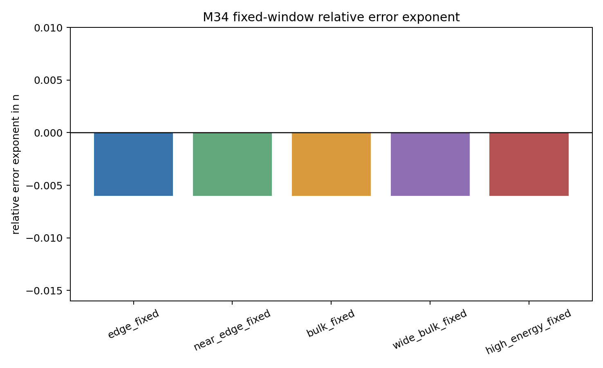
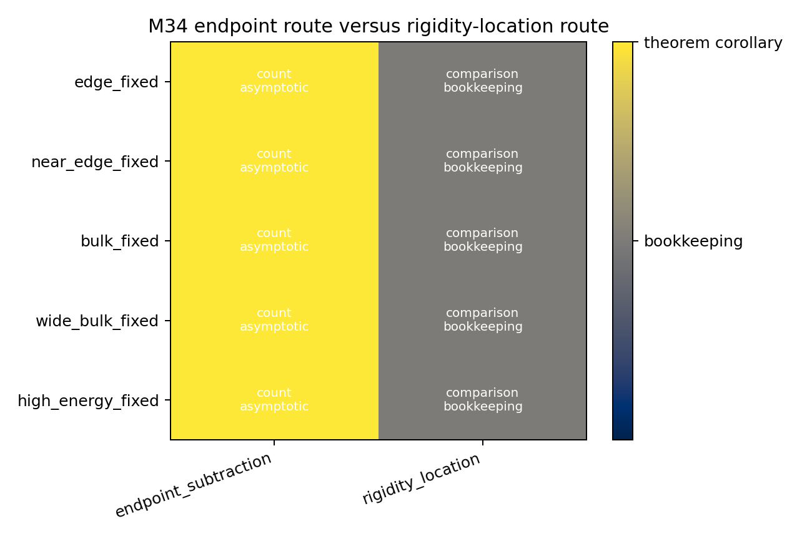
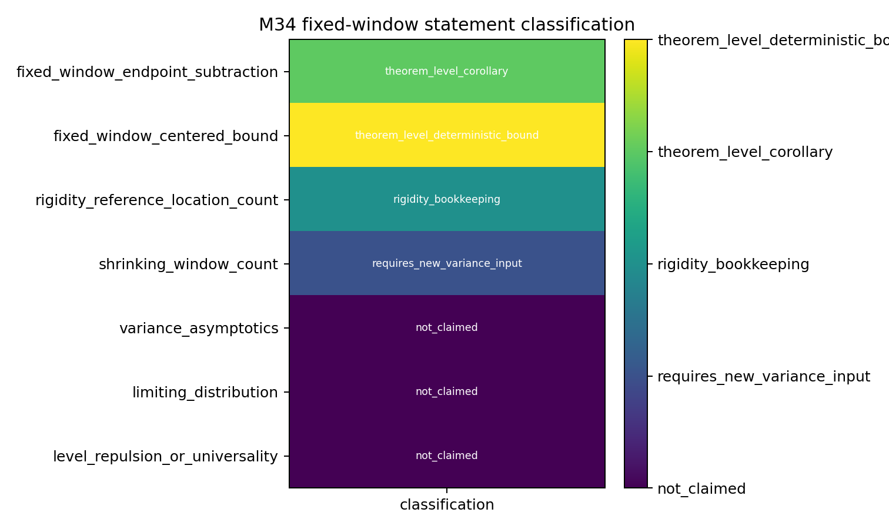

# M34 Finite Non-Shrinking Spectral Statistics

## Purpose

M34 returns from the closed Schreier benchmark branch to a surface-facing question: what fixed-window spectral count statements already follow from Kim--Tao Theorem 1?  The answer is useful but conservative.  Fixed positive-width windows give a theorem-level count asymptotic and centered high-probability bound, but the proof is endpoint subtraction from M16 rather than a new local-statistics mechanism.

## Fixed-Window Corollary

For fixed \(1/4\le a<b\),
\[
N_{X_n}([a,b])
=(2g-2)n(F(b)-F(a))
+O_\epsilon(n^{1-\alpha_W}b^{1/2+\epsilon}).
\]
Because \(F(b)-F(a)>0\), the main term is order \(n\) and the relative error is \(O(n^{-\alpha_W})\) up to a fixed energy/window constant.

The centered version
\[
N_{X_n}([a,b])-(2g-2)n(F(b)-F(a))
=O_\epsilon(n^{1-\alpha_W}b^{1/2+\epsilon})
\]
is also theorem-level, but it is only a deterministic high-probability bound.  It does not identify variance, limiting law, or eigenvalue correlation behavior.

## Generated Diagnostics

`data/extension_candidates/m34_fixed_window_thresholds.csv` contains fixed edge, near-edge, bulk, wide-bulk, and high-energy rows plus explicit shrinking-window exclusion rows.  For the representative theorem-shape alpha model, all fixed positive-width rows have relative exponent `-0.006`, while shrinking rows are marked `outside_m34_scope`.

`data/extension_candidates/m34_endpoint_vs_rigidity_comparison.csv` compares the endpoint route with the rigidity-location route.  Endpoint subtraction gives the count asymptotic; rigidity gives interval inclusion after an \(n^{-\alpha_R}\) expansion and is classified as bookkeeping for fixed-window count asymptotics.

`data/extension_candidates/m34_fixed_window_classification.csv` is the no-claim ledger.  It keeps the fixed-window endpoint corollary and centered bound, but excludes shrinking windows, variance asymptotics, limiting laws, level repulsion, and local universality.

## Classification

| Candidate | Classification | Reason |
|---|---|---|
| Fixed-window endpoint count | theorem-level corollary | Direct simultaneous endpoint subtraction. |
| Fixed-window centered count | theorem-level deterministic bound | Same estimate after subtracting the Weyl main term. |
| Rigidity reference count comparison | rigidity bookkeeping | Gives expanded-window comparison, not a sharper count scale. |
| \(\Delta=n^{-d}\) windows | requires new variance input | Returns to M16-M25 local-window obstruction thresholds. |
| Variance and limiting laws | not claimed | No variance/correlation input is supplied by Theorem 1. |

## Decision

M34 should be preserved as a theorem-level fixed-window corollary package with a strict no-local-statistics boundary.  It is mathematically legitimate and surface-facing, but it does not supersede the M25 follow-up problem for shrinking spectral windows.
