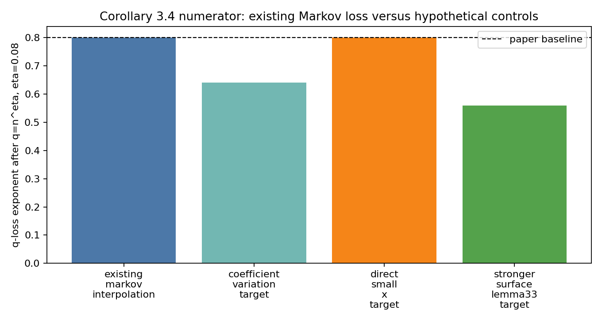
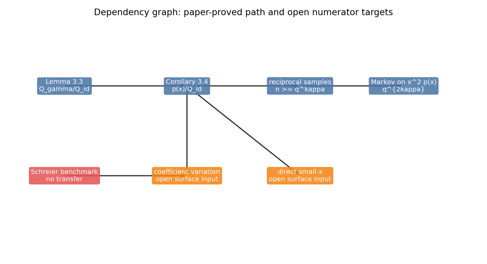
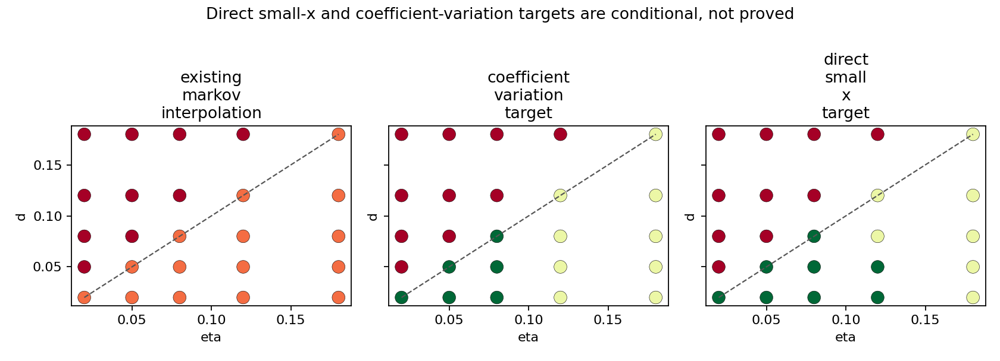

# M35 Surface Corollary 3.4 Numerator Obstruction

## Summary

M35 localizes the remaining compact-support bottleneck to a precise paper-defined object: the Corollary 3.4 numerator `p(x)` divided by `Q_id(x)`. The existing `q^(2 kappa)` trace-side loss is not already forced by the definition of `p`; it enters when the proof uses reciprocal-integer bounds and Markov brothers control of `x^2 p(x)`. This keeps direct small-`x` or coefficient-variation control logically open, but only as a new surface-group theorem, not as a consequence of M30-M33 Schreier benchmarks.

## Mechanism Classification

| Mechanism | Status | Decision |
|---|---|---|
| `existing_markov_interpolation` | theorem-level existing proof | Keep as baseline; it reproduces `q^(2 kappa)`. |
| `coefficient_variation_target` | conditional theorem target | Open only if it controls the actual geodesic-weighted surface numerator after denominator normalization. |
| `direct_small_x_target` | conditional theorem target | Open and potentially stronger; must bound `p(1/n)/Q_id(1/n)` at the target point, not only at `x=0`. |
| `signed_cancellation_target` | conditional theorem target | Open but requires cancellation in the paper-defined aggregate, not toy-profile cancellation. |
| `stronger_surface_lemma33_target` | conditional stronger input | Open but more ambitious because it would improve or refine Lemma 3.3 before aggregation. |
| `blocked_by_missing_surface_input` | toy-only insufficient | Rejected as proof route; independent-permutation evidence does not transfer to Kim--Tao. |

The generated classification table records all mechanisms with overclaim guards:

```text
data/extension_candidates/m35_candidate_mechanism_classification.csv
```

Every row has `claims_proved_exponent_improvement=False`, `claims_local_statistics=False`, `claims_variance_law=False`, and `claims_shrinking_window_theorem=False`.

## Exponent Budget

The baseline from Proposition 3.1 is:

```text
Var-style trace bound scale: n q^(2 kappa).
```

After `q=n^eta`, this contributes exponent `2 kappa eta`. A hypothetical numerator theorem

```text
E G_n(h)^2 <= n q^A n^(-sigma+o(1))
```

would produce the M22 saving algebra

```text
beta = (2 kappa - A) eta + sigma.
```

For the compact-support local-window follow-up, this would need

```text
beta > 2 kappa eta + 2d - 1,
eta >= d,
d > alpha_W.
```

The regenerated budget table is:

```text
data/extension_candidates/m35_interpolation_loss_budget.csv
```

It verifies that `existing_markov_interpolation` reproduces the `q^(2 kappa)` row. The regime grid

```text
data/extension_candidates/m35_direct_vs_markov_regime_grid.csv
```

marks all apparent direct/CV wins as conditional on a new surface-group theorem, never as paper-proved improvements.



## Dependency Graph

The proof path is:

```text
Lemma 3.3 fixed-pair rational expansion
-> Corollary 3.4 weighted numerator p(x)/Q_id(x)
-> reciprocal-integer control for n >= q^kappa
-> Markov on x^2 p(x)
-> q^(2 kappa) Proposition 3.1 loss.
```

The open branches leave from `p(x)/Q_id(x)` and require either coefficient-variation, direct small-`x`, signed-cancellation, or a strengthened surface Lemma 3.3 input.



## Input Gap Matrix

The gap matrix is:

```text
data/extension_candidates/m35_surface_input_gap_matrix.csv
```

The important rows are:

| Input | Status | Gap |
|---|---|---|
| Lemma 3.3 fixed-pair rational expansion | paper proved | No aggregate coefficient saving. |
| Corollary 3.4 weighted numerator | paper-defined target | Weighted variation/cancellation not controlled beyond Markov. |
| `Q_id(1/n)` normalization | paper proved in range | Any new bound must preserve denominator control. |
| M4/M7/M33 independent-permutation evidence | toy theorem | Insufficient for Kim--Tao surface numerator. |
| new surface-group coefficient-variation theorem | open | Must control actual geodesic-weighted folded quotient-polynomial family. |

## Direct Versus Coefficient Variation

Coefficient variation is more structured and audit-friendly: it would expose which coefficients or strata are controlled. Direct small-`x` control is logically stronger because it may use cancellation invisible to coefficient norms, but it is also harder to attack because it must hold at `x=1/n` in the reciprocal range and after division by `Q_id(1/n)`.



## Decision

M35 preserves the compact-support numerator problem as an open theorem target. It rules out only shallow routes: Markov has not been improved, M30-M33 do not transfer, and M9-M15 toy aggregate negatives do not prove a surface negative theorem. The next serious attack should choose one of two narrow targets: a coefficient-variation theorem for the actual Corollary 3.4 numerator, or a direct denominator-normalized small-`x` bound for `p(1/n)/Q_id(1/n)`.

## Artifacts

- `docs/proof_ledger/surface_corollary34_numerator_obstruction.md`
- `scripts/analyze_surface_corollary34_numerator_obstruction.py`
- `tests/test_surface_corollary34_numerator_obstruction.py`
- `data/extension_candidates/m35_interpolation_loss_budget.csv`
- `data/extension_candidates/m35_candidate_mechanism_classification.csv`
- `data/extension_candidates/m35_surface_input_gap_matrix.csv`
- `data/extension_candidates/m35_direct_vs_markov_regime_grid.csv`
- `reports/figures/m35_corollary34_interpolation_loss.png`
- `reports/figures/m35_mechanism_dependency_graph.png`
- `reports/figures/m35_direct_vs_coefficient_variation_map.png`
