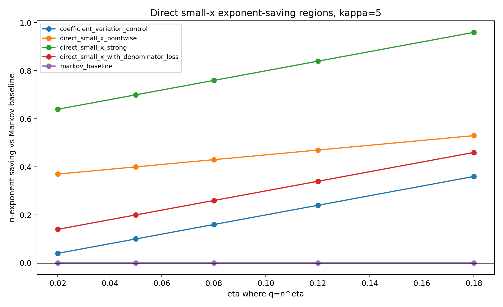
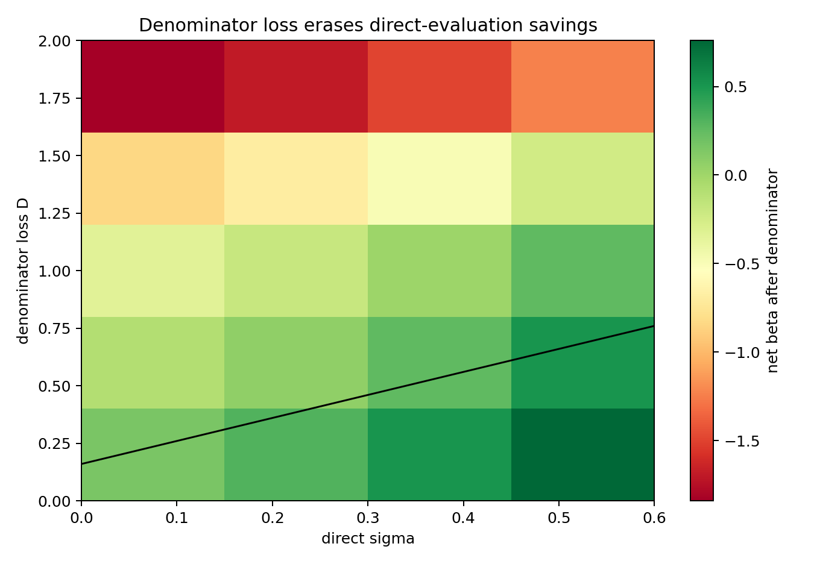
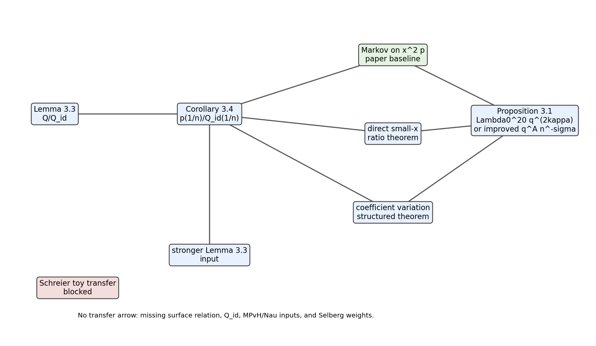

# M36 Direct Small-x Surface Numerator Target

M36 tests the narrowest replacement for the M35 Markov bottleneck: bound the paper-defined Corollary 3.4 ratio `p(1/n)/Q_id(1/n)` directly at `x=1/n`.  The repaired baseline is

```text
E S_n(h)^2 <= C n Lambda0^20 ||htilde||^2 q^(2 kappa),
```

coming from reciprocal-integer control plus Markov brothers applied to `x^2 p(x)`.

## Mechanism Classification

| mechanism | classification | M36 decision |
|---|---|---|
| Markov interpolation | paper-proved baseline | Reproduces `A=2 kappa`, `sigma=0`, `Lambda0^20`. |
| Direct small-`x` ratio bound | conditional surface theorem target | Distinct from coefficient variation if it proves the ratio at `x=1/n` using signed pointwise cancellation. |
| Denominator control | paper-proved in range, obstruction outside | Safe for `n >= q^kappa`; near-zero loss `D` subtracts from every saving. |
| Coefficient variation | stronger structured theorem target | Implies pointwise control, but is more data-rich than the direct target. |
| Signed cancellation | conditional comparable input | Useful only if proved for the actual Selberg-weighted surface aggregate. |
| Stronger Lemma 3.3 | stronger input | Could improve the ratio before aggregation but is more ambitious. |
| Schreier/toy transfer | blocked | No theorem-level surface consequence. |

## Exponent Budget

The generated budget table uses the direct target

```text
|p(1/n)/Q_id(1/n)|
  <= C n Lambda0^20 ||htilde||^2 q^A n^(-sigma).
```

For `q=n^eta`, the saving against Markov is

```text
beta = (2 kappa - A) eta + sigma - D.
```

The Markov row in `m36_direct_small_x_budget.csv` has `A=2 kappa`, `sigma=0`, `D=0`, `Lambda0_power=20`, and zero saving.  Direct rows improve the exponent only conditionally, and denominator rows show that a loss `D` erases the gain once `D >= (2 kappa-A)eta+sigma`.



## Denominator Analysis

The paper already gives the needed denominator normalization in the working range:

```text
Q_id(1/n) in [C^(-1), C],  n >= q^kappa.
```

So denominator normalization is not a new obstruction for the exact Corollary 3.4 regime.  It becomes a real obstruction only if a proposed direct theorem leaves that regime, permits `Q_id(1/n)=0`, or loses `|Q_id(1/n)|^{-1} <= n^D`.



## Direct Versus Coefficient Variation

Direct evaluation is genuinely distinct as a statement: it asks for one value of the normalized aggregate, while coefficient variation controls a structured expansion.  But the proof burden may be comparable.  Any proof that starts from fixed-pair `Q` estimates and sums absolutely needs essentially coefficient or total-variation control; only signed cancellation at `x=1/n` would keep direct evaluation independent.



## Firewalls

M36 preserves the M35 no-transfer firewall.  The M30-M33 Schreier package remains a standalone benchmark and gives no Kim--Tao surface numerator estimate.  No generated row claims a proved exponent improvement, local spectral statistics theorem, variance law, shrinking-window theorem, or coefficient-variation theorem.

## Decision

Direct small-`x` control is ruled in as a precise conditional theorem target:

```text
|p(1/n)/Q_id(1/n)|
  <= C n Lambda0^20 ||htilde||^2 q^A n^(-sigma+o(1)).
```

It is not ruled in as a proved route.  The next attack must either prove signed direct cancellation for the actual surface aggregate at `x=1/n`, or concede that the route collapses into the broader coefficient-variation problem.
