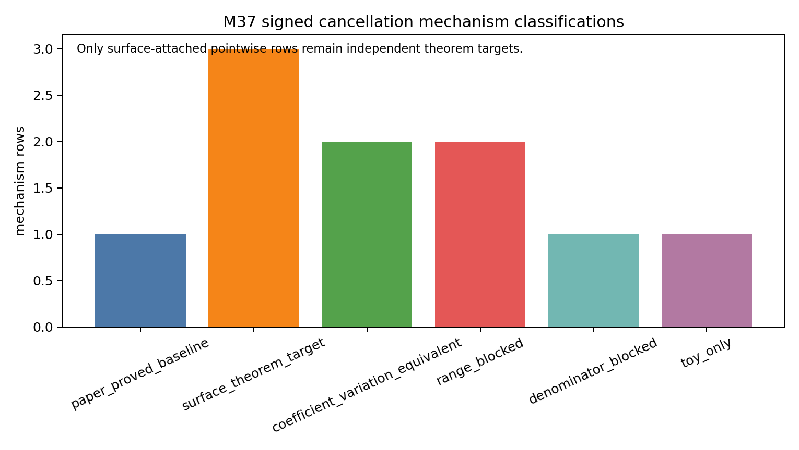
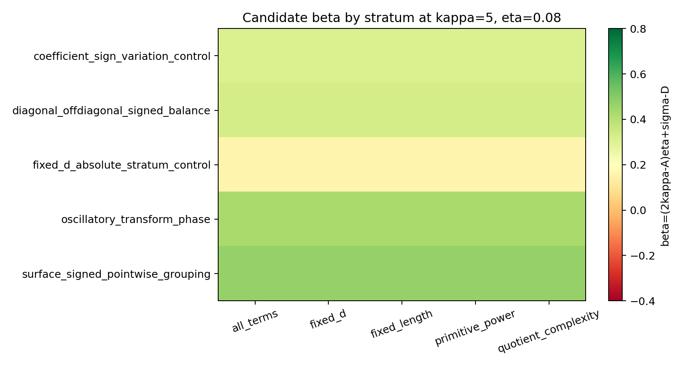
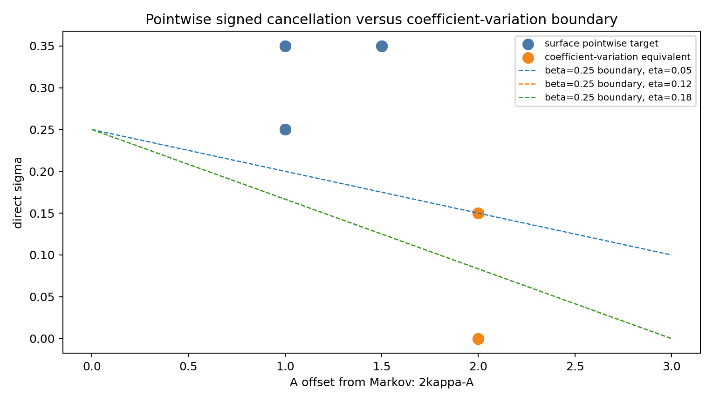

# M37 Signed Pointwise Cancellation Surface Aggregate

M37 tests whether M36's direct small-`x` route is still an independent target.  The answer is yes, but only in a narrow form: a new surface-group theorem must prove signed cancellation for the actual denominator-normalized Corollary 3.4 value `p(1/n)/Q_id(1/n)`.

## Signed Aggregate

The numerator is the weighted two-trace aggregate

```text
p(x) = sum_{gamma1,gamma2,k1,k2}
       w(gamma1,k1) w(gamma2,k2)
       Q_{gamma1^k1,gamma2^k2}(x),
```

where

```text
w(gamma,k) =
  ell_gamma / (2 sinh(k ell_gamma/2))
  * (h o f_Lambda0)^vee(k ell_gamma).
```

The length denominator is positive.  Possible signs come from the transform values and from `Q_{gamma1^k1,gamma2^k2}(1/n)`.  The denominator `Q_id(1/n)` is safe only in the paper range, where it is bounded between constants.

## Target

The falsifiable signed theorem target is

```text
SPC(A,sigma):
|p(1/n) / Q_id(1/n)|
  <= C n Lambda0^20 ||htilde||^2 q^A n^(-sigma+o(1)).
```

The Markov baseline is `A=2 kappa`, `sigma=0`, `D=0`, and `Lambda0_power=20`.  For `q=n^eta`, a modeled denominator loss changes the signed saving to

```text
beta = (2 kappa - A) eta + sigma - D.
```

## Results

The generated mechanism table classifies the only genuinely independent rows as `surface_theorem_target`: surface signed pointwise grouping, diagonal/off-diagonal signed balance, and transform-phase cancellation.  These remain targets, not proved inputs.

Rows that take absolute values in fixed `d=C-V`, length, primitive-power, quotient-complexity, or coefficient strata are classified as `coefficient_variation_equivalent`.  They may be useful, but they are no longer a narrower direct route.

Rows that cancel only at `x=0`, use reciprocal values outside the Corollary 3.4 range, or rely on near-zero denominators are blocked.  Schreier and independent-permutation pairings remain `toy_only`.







## Decision

Signed pointwise cancellation should not be abandoned yet: it is a distinct theorem target if the next proof attacks the evaluated surface aggregate itself.  But if the next proof attempt expands coefficients and bounds absolute variation within every fixed stratum, the direct route has collapsed into coefficient variation.  No exponent improvement, local statistics, variance law, or shrinking-window theorem is claimed in M37.
