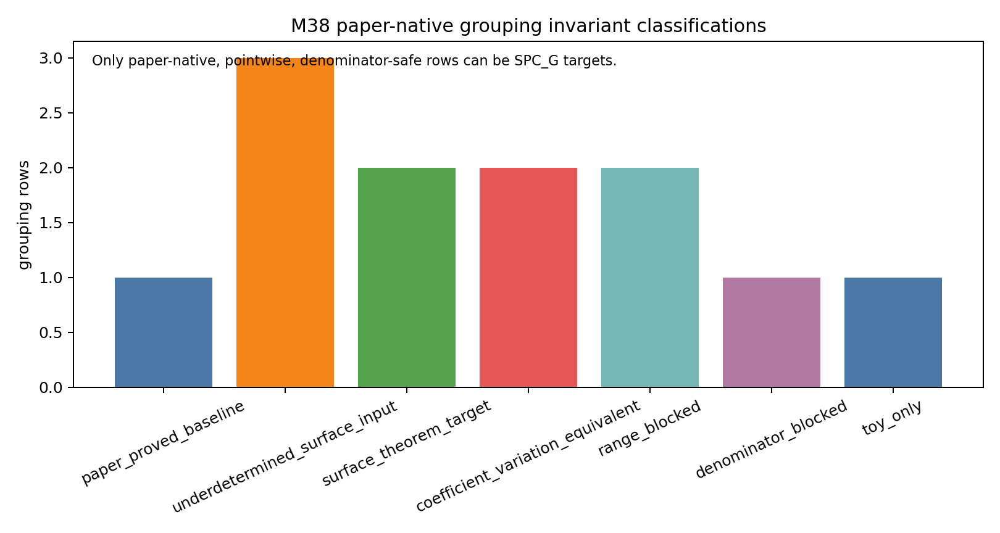
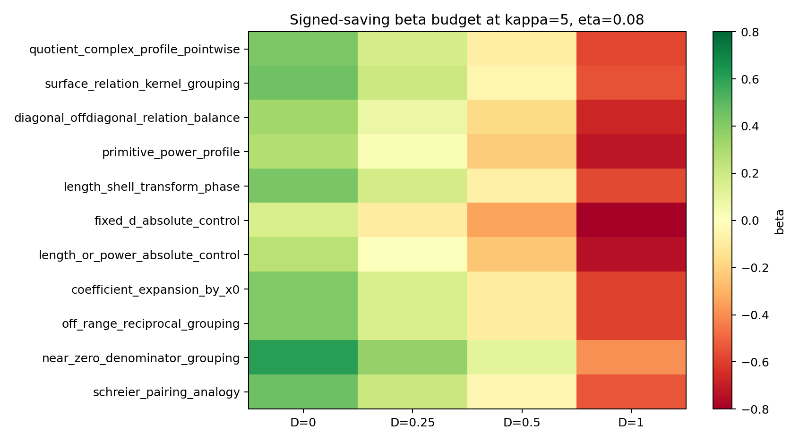
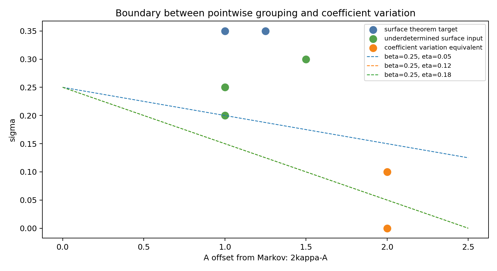

# M38 Surface-Native Grouping Problem

M38 asks whether the M37 signed pointwise route can be made proof-facing by grouping actual Kim--Tao Corollary 3.4 summands, rather than importing toy pairings or taking absolute values.  The conclusion is conservative: two groupings remain theorem-shaped targets, several are underdetermined surface inputs, and every absolute fixed-stratum route collapses to coefficient variation.

## Object

The normalized summand is

```text
w(gamma1,k1) w(gamma2,k2)
Q_{gamma1^k1,gamma2^k2}(1/n) / Q_id(1/n).
```

The Selberg length denominator is positive.  The only sign sources are transform values and the evaluated quotient-polynomial values at `x=1/n`.  Denominator normalization is harmless only in the paper-safe range; modeled loss `|Q_id(1/n)|^(-1) <= n^D` subtracts `D` from every beta saving.

## Results

The deterministic classifier generated four tables:

- `data/extension_candidates/m38_grouping_invariant_classification.csv`
- `data/extension_candidates/m38_grouping_beta_budget.csv`
- `data/extension_candidates/m38_grouping_dependency_matrix.csv`
- `data/extension_candidates/m38_candidate_spc_theorem_templates.csv`

The rows classify candidate groupings as `surface_theorem_target`, `coefficient_variation_equivalent`, `denominator_blocked`, `range_blocked`, `toy_only`, `underdetermined_surface_input`, or the baseline `paper_proved_baseline`.

The most useful theorem template is:

```text
SPC_G(A,sigma):
|sum_{i in G} w_i Q_i(1/n) / Q_id(1/n)|
  <= C n Lambda0^20 ||htilde||^2 q^A n^(-sigma+o(1)).
```

with

```text
beta = (2 kappa - A) eta + sigma - D.
```

The rows marked `surface_theorem_target` are:

| grouping | why it survives |
|---|---|
| surface-relation kernel grouping | it is paper-native, pointwise at `x=1/n`, denominator-safe, and could use structure absent from Schreier toy models |
| length-shell transform phase grouping | it uses a real sign source in the Selberg-weighted summand and remains pointwise after normalization |

The rows marked `underdetermined_surface_input` are quotient-complex profile grouping, diagonal/off-diagonal balance, and primitive-power profile.  They are paper-visible and may become useful, but current inputs do not yet supply cancellation.

Rows requiring absolute fixed-stratum control are `coefficient_variation_equivalent`.  Rows using only `x=0`, off-range reciprocal values, near-zero denominators, or Schreier/independent-permutation pairing are blocked or toy-only.







## Decision

M38 does not prove cancellation.  It sharpens the next possible direct theorem attempt to an `SPC_G(A,sigma)` statement for either surface-relation kernel classes or length-shell transform-phase classes.  If the next proof attempt must bound absolute mass inside every fixed `d`, length, primitive-power, or quotient-complexity stratum, the campaign should stop calling it signed pointwise cancellation and pivot to a coefficient/signed-variation theorem target.
