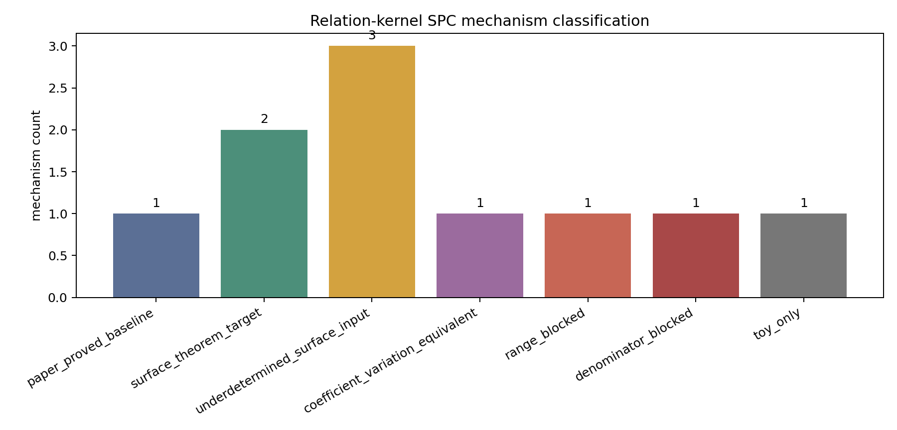

# M39 Surface-Relation Kernel SPC Probe

## Result

Decision: `kernel_spc_not_currently_theorem_ready`.

The Lemma 3.3 kernel-closure condition is genuinely paper-native, but in the
paper proof it functions as an admissibility condition for folded quotient
targets `W_r`.  It feeds the embedding expectations `E_emb_n(W_r)` and then
the numerator polynomial `Q_{gamma1,gamma2}`, but the proof does not expose a
sign-pairing or orthogonality mechanism for evaluated values at `x=1/n`.

## Classification

`kernel_class_signed_pairing` and `quotient_polynomial_sign_grouping` remain
conditional `surface_theorem_target` rows because they would be genuine
`SPC_kernel(A,sigma)` statements if proved at the evaluated point.  The
available paper input does not prove them.  `kernel_closure_admissibility` and
`relation_word_orientation_pairing` are underdetermined surface inputs;
`absolute_kernel_stratum_control` is coefficient-variation-equivalent;
`x0_kernel_coefficient_cancellation` is wrong-point; denominator-loss and toy
free-group proxy routes are blocked or toy-only.

## Pivot Recommendation

The next honest target is
`surface_numerator_coefficient_signed_variation_first_attack`.  Continue the
direct kernel SPC branch only if a new Lemma 3.3-level input can prove
evaluated `Q_i(1/n)` cancellation across relation-kernel classes without
absolute kernel-stratum control.

