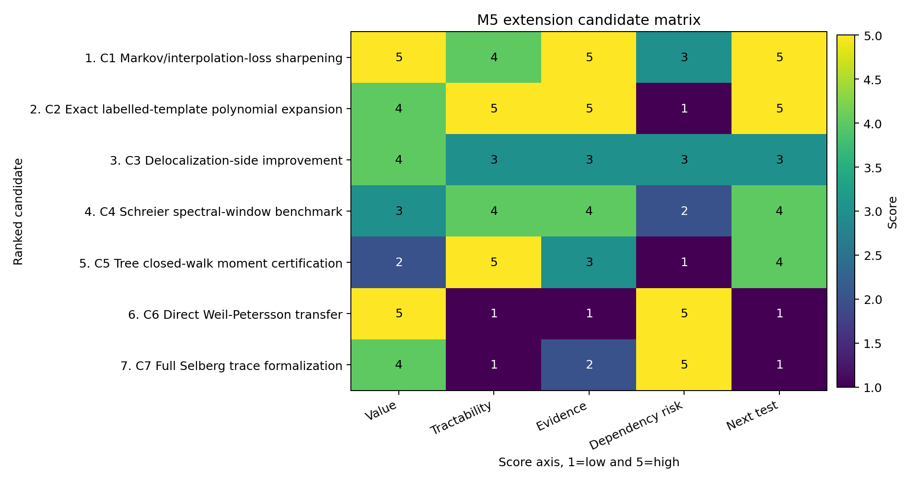

# M5 Extension Candidate Ranking

## Executive Decision

The highest-value next direction is a narrow Markov/interpolation-loss program: isolate when the visible `q^{2 kappa}` and `q^{4 kappa}` amplification reflects genuine polynomial-method complexity, and when it is an artifact of reconstructing stable low-degree reciprocal-`n` structure from sparse windows. This is not a claim that Kim--Tao's exponent can already be improved. It is a candidate research path grounded in three validated internal facts: M2 identifies the shared Markov/interpolation loss, M3 shows low-degree normalized labelled-template observables are stable while high-degree fits become ill-conditioned, and M4 certifies an exact falling-factorial expectation identity for one bounded labelled-template class.



The next cycle should attack the primary candidate through symbolic/asymptotic expansion of the M4 formula, especially the benchmark

```text
E(eight_word_rank2_toy) = (n)_7 / (n)_4^2
```

and its normalized form in `x=1/n`. The goal is to separate stable finite-template expectation structure from interpolation instability.

## Evidence Inventory

| Evidence source | Role in M5 ranking |
|---|---|
| `docs/proof_ledger/m2_loss_map.md` | Identifies the trace-side `q^{2 kappa}` and delocalization-side `q^{4 kappa}` Markov losses as shared, visible, and technical rather than structural. |
| `reports/computational_probes/m3_polynomial_window_diagnostics.md` | Shows degree-3 Chebyshev-window fits are accurate for normalized labelled embeddings, while degree 6/8 fits blow up in derivative and coefficient norms. |
| `reports/computational_probes/m3_computational_probe_synthesis.md` | Consolidates the mechanism ladder: quotient normalization explains much cyclic/rank-two raw separation; interpolation conditioning remains a separate bottleneck. |
| `reports/formal_certification/labelled_embedding_expectation_identity.md` | Certifies the exact falling-factorial expectation formula and inverse-label normalization for conflict-free labelled templates. |
| `data/formal_certification/labelled_embedding_expectation_symbolic.csv` | Gives exact formulas for special cases, including `eight_word_cyclic_toy = 1` and `eight_word_rank2_toy = (n)_7/(n)_4^2`. |
| `data/polynomial_method/polynomial_window_fit_summary.csv` | Quantifies low-degree stability and high-degree instability on the canonical M3 benchmark pair. |

## Candidate Ranking

| Rank | Candidate | Decision | Evidence-grounded rationale |
|---:|---|---|---|
| 1 | Markov/interpolation-loss sharpening | advance-primary | This attacks the shared bottleneck named in M2. M3 makes the failure mode concrete: low-degree normalized observables are stable near `x=0`, but high-degree interpolation from sparse reciprocal grids produces large derivatives and coefficients. M4 supplies a certified exact-template source for a next symbolic test. |
| 2 | Exact labelled-template polynomial expansion | advance-technical-lemma | This is the cleanest immediately provable subproblem. It extends M4 without touching Selberg trace formula machinery: for fixed conflict-free templates, expand `(n)_{|V|} prod_a (n)_{-|C_a|}` in `x=1/n` and identify leading and first-correction terms. It may become the formal core supporting the top candidate. |
| 3 | Delocalization-side improvement | advance-secondary | Theorem 2 has extra losses from fourth moments, fiber union, and local-mass-to-`L^\infty` conversion. M2 indicates some are downstream technical or analytic-conversion losses, but the shared polynomial bottleneck should be understood first because it feeds both Theorem 1 and Theorem 2. |
| 4 | Schreier spectral-window benchmark | advance-benchmark | Cycle 10 found stable operator-level windows such as `window_pos_mid` and `window_pos_edge`. This is useful for future diagnostics, but it is less theorem-facing than the labelled-template expansion because Schreier adjacency spectra are not hyperbolic Laplacian spectra. |
| 5 | Tree closed-walk moment certification | defer-supporting | Certifying the 4-regular tree moments `4,28,232` would cleanly support Cycle 10 trace baselines. Its mathematical value is lower for M5 because it does not attack the Kim--Tao exponent losses. |
| 6 | Direct Weil-Petersson transfer | reject-defer | High value but weak internal support. The current evidence chain is for random covers and finite permutation analogues, not Weil-Petersson random surfaces; attempting transfer now would depend on unsupported geometric assumptions. |
| 7 | Full Selberg trace formalization | reject-defer | Too broad for current leverage. M4 showed value in certifying isolated finite identities; full trace-formula formalization would be expensive and would not directly resolve the Markov/interpolation bottleneck. |

The scoring data are in `data/extension_candidates/m5_candidate_scores.csv`.

## Primary Candidate

**Candidate conjecture.** For fixed conflict-free labelled template families with bounded generator-label constraint sets, normalized injective embedding expectations have stable low-degree expansions in `x=1/n`; their first coefficients are determined by the falling-factorial identity certified in M4. High-degree interpolation instability on sparse reciprocal grids is therefore not evidence that the underlying finite-template expectation is unstable.

This candidate connects to Kim--Tao only at the mechanism level. The paper's actual polynomials arise from trace/pre-trace expansions using imported MPvH/Nau/MP23 inputs, not merely from fixed labelled templates. The M5 claim is that one visible source of instability can be isolated and tested in an exact finite class before making any theorem-level claim.

## Rejections And Deferrals

Direct hyperbolic spectral simulation is deferred for the same reason M2 already identified: it is not the most direct diagnostic for the proof bottleneck. The unresolved mechanism is combinatorial and polynomial in `1/n`, and M3/M4 already provide stronger finite evidence.

Direct Weil-Petersson transfer is rejected for this phase. It may become meaningful after a precise random-cover extension exists, but current artifacts do not justify importing a different random surface model.

Full Selberg trace formalization is rejected for this phase. Focused certification of finite identities and asymptotic expansions is providing better return per cycle.

## Next-Cycle Falsification Plan

The top candidate is weakened if symbolic expansion of the M4 identity does not produce stable low-degree coefficients for the canonical templates, if the normalized `eight_word_rank2_toy` expansion fails to explain the Cycle 8/Cycle 9 finite-size trend, or if every apparent improvement route requires assumptions as strong as the imported MPvH/MP23 machinery.

The most direct next test is:

1. Symbolically expand fixed-template expectations in `x=1/n` through at least third order.
2. Compare exact coefficients for `eight_word_cyclic_toy`, `eight_word_rank2_toy`, `trace_pair_toy`, and at least one conflict case.
3. Re-evaluate Cycle 9 low-degree fits against those exact coefficients rather than against sampled/interpolated values alone.
4. Record whether the observed high-degree instability is explained by interpolation conditioning rather than by the exact expectation.

## Sufficiency Judgment

M5 ranking is sufficient for a `validated/high` Cycle 13 event. It ranks more than five candidates, rejects weak routes explicitly, and formulates a primary conjecture with a concrete next-cycle symbolic/asymptotic falsification test grounded in validated M2-M4 artifacts.
