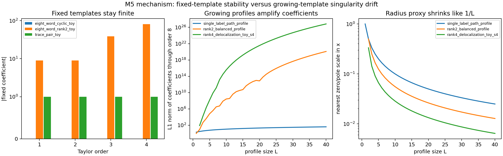

# M5 Extension Synthesis and Toy Principle

## Executive Conclusion

M5 closes with a conservative toy principle for the Markov/interpolation-loss pathway. In the labelled-template model certified in M4, fixed conflict-free templates are analytically tame after the natural normalization, while controlled growing profiles can develop large Taylor coefficients and derivatives because zeros and poles of the falling-factorial product ratio move toward `x=0` at scale `1/L`.

This is a reproducible benchmark principle, not a Kim--Tao theorem. It explains why the fixed-template evidence from Cycle 14 is stable and why the growing-template evidence from Cycle 15 amplifies derivatives without invoking noisy curve fitting.



## Toy Principle

**Proved toy identity.** Let `H` be a finite labelled directed template. Normalize inverse-labelled edges by reversing orientation. If, for every generator `a`, the normalized constraints form a partial injection, then the M4 identity gives

```text
E_H(n) = (n)_V / Product_a (n)_{C_a},
N_H(n) = n^{C-V} E_H(n)
       = n^{C-V} (n)_V / Product_a (n)_{C_a},
```

where `V=|V(H)|`, `C_a` is the number of distinct constraints with label `a`, and `C=sum_a C_a`. If any label has a source or image conflict, then `E_H(n)=0`.

After setting `x=1/n`, every conflict-free normalized expectation is a finite product ratio

```text
N_H(x) = Product_{j in A_H} (1 - j x) / Product_{j in B_H} (1 - j x).
```

For any fixed template, the nonzero zeros and poles are at fixed distances from `x=0`, so `N_H` is analytic near `0` and has finite fixed-order Taylor coefficients.

**Growing-profile mechanism.** For a profile family indexed by `L`, the same product ratio can have factors with `j=O(L)`. Then the nearest zero or pole is at `x=1/j=O(1/L)`, so the analytic control radius shrinks toward the expansion point as `L` grows. This gives an exact toy-model source of derivative amplification.

## Log-Coefficient Identity

For

```text
N_L(x)=Product_{j in A_L}(1-jx) / Product_{j in B_L}(1-jx),
```

the formal logarithmic expansion before the nearest singularity is

```text
log N_L(x)
  = Sum_{r>=1} ((Sum_{j in B_L} j^r - Sum_{j in A_L} j^r) / r) x^r.
```

Thus, if the indices in `A_L` or `B_L` run up to `O(L)`, the `r`th log-coefficient can grow like polynomial powers of `L`. Ordinary Taylor derivatives inherit this growth through the exponential relation between `N_L` and `log N_L`.

Cycle 16 records these coefficients in `data/extension_candidates/m5_log_coefficient_summary.csv`. At `L=40`, the order-4 log-coefficients already show the scale:

| family | radius proxy | log coeff. `x` | log coeff. `x^2` | log coeff. `x^4` |
|---|---:|---:|---:|---:|
| `single_label_path_profile` | `1/40` | `-40` | `-800` | `-640000` |
| `rank2_balanced_profile` | `1/78` | `-1521` | `-120159/2` | `-557657919/4` |
| `rank4_delocalization_toy_s4` | `1/155` | `-8970` | `-585585` | `-9053087823/2` |

This is the analytic explanation of the Cycle 15 growth curves: the amplification is already present in exact product-ratio coefficients.

## Evidence Classification

**Certified / proved in the toy model.** Cycle 12 proved the falling-factorial labelled-template expectation identity and conflict-zero rule by exact symbolic and exhaustive finite checks. This supports the formula for `E_H(n)` and the normalization `N_H(n)`.

**Validated by exact fixed-template computation.** Cycle 14 expanded fixed templates through `x^4`. The cyclic eight-word template is exactly `1`, and the rank-two eight-word normalized template is

```text
1 - 9x + 9x^2 + 39x^3 + 81x^4 + O(x^5).
```

These fixed-template coefficients are stable; they do not explain the Cycle 9 high-degree sparse-grid blowup by themselves.

**Validated by exact growing-profile computation.** Cycle 15 generated exact rational coefficients through order 8 for profiles with `L=1..40`. Cyclic profiles remain exactly `1`; path profiles are exactly `1-Lx`; rank-two and rank-four ratio profiles show large coefficient and derivative growth while radius proxies shrink like `1/L`.

**Numerical visualization.** The M5 figures visualize fixed-template stability, growing coefficient norms, derivative amplification, and shrinking radius proxies. They are summaries of exact CSV data, not independent proof.

**Conjectural bridge to Kim--Tao.** The toy principle is a mechanism analogue for the Kim--Tao Markov/interpolation bottleneck: fixed local templates are not the main source of instability; growing support, degree, and derivative budgets are where amplification enters.

## Not Claimed

M5 does not prove an improved Kim--Tao rigidity exponent. It does not replace the MPvH embedding expansion, Nau boundedness input, or MP23 rank-two fixed-point estimate. It does not formalize the Selberg trace formula, pre-trace formula, or hyperbolic spectral side. It does not show that the exact falling-factorial toy profile is quantitatively sharp for the full random-cover trace polynomial.

## Closure Readiness

The artifact index `data/extension_candidates/m5_extension_synthesis_index.csv` records the key M5 dependencies from Cycles 13-16 and confirms that the expected files exist after this report is produced. The strongest supported M5 contribution is now precise:

```text
Fixed conflict-free labelled-template expectations are analytically stable
after normalization; growing support/profile size can force coefficient and
derivative amplification because product-ratio singularities drift toward
x=0 at scale 1/L.
```

`M5-extension-candidates` is ready to remain closed as `validated/high`. The next campaign step should be `M6-final-synthesis`, with this M5 toy principle listed as the strongest extension candidate and mechanism benchmark.
