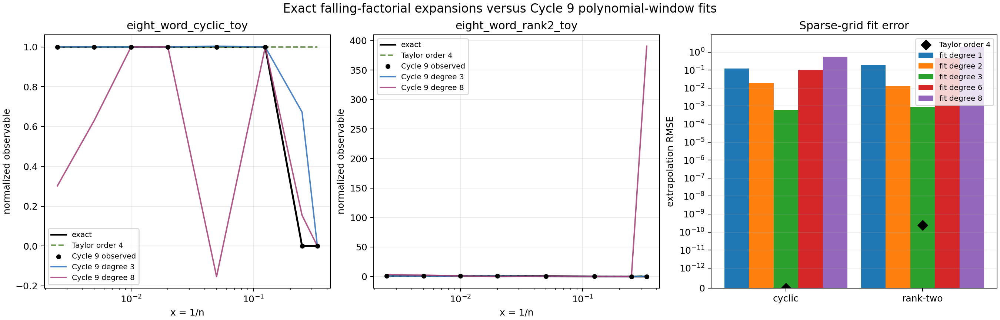

# M5 Falling-Factorial Expansion Test

## Result

This cycle advances the M5 primary candidate to a concrete finite-template benchmark lemma. For a fixed conflict-free labelled template with vertex count `V` and per-generator constraint counts `C_a`, the M4 identity gives

```text
E_H(n) = (n)_V / Product_a (n)_{C_a}
N_H(n) = n^{sum_a C_a - V} E_H(n).
```

After setting `x=1/n`, every factor is a finite product of terms `(1 - j x)`, so `N_H(1/x)` is analytic at `x=0` for fixed templates. Conflict templates are excluded before expansion because the M4 identity makes their expectation identically zero.

## Coefficients Through `x^4`

The Wolfram script `scripts/derive_labelled_embedding_expansions.wls` exported `data/extension_candidates/labelled_embedding_expansion_coefficients.csv`.

| template | normalized expansion through `x^4` |
|---|---|
| `single_label_cycle` | `1` |
| `eight_word_cyclic_toy` | `1` |
| `trace_pair_toy` | `1 - x - x^2 - x^3 - x^4 + O(x^5)` |
| `eight_word_rank2_toy` | `1 - 9x + 9x^2 + 39x^3 + 81x^4 + O(x^5)` |
| `no_edge_control` | `1 - x` |
| `single_edge_control` | `1 - x` |
| `conflicting_domain` | `0` |

For the primary rank-two benchmark,

```text
N_H(n) = n (n)_7 / (n)_4^2
       = ((n - 6)(n - 5)(n - 4)) / ((n - 1)(n - 2)(n - 3)).
```

The first four nonconstant coefficients are moderate fixed-template numbers, not a source of the Cycle 9 high-degree blowup by themselves.

## Cycle 9 Comparison

The comparison script `scripts/compare_expansions_to_cycle9.py` wrote `data/extension_candidates/labelled_embedding_expansion_fit_comparison.csv` and `reports/figures/m5_expansion_vs_cycle9_fits.png`.



For `eight_word_rank2_toy`, the exact order-4 Taylor expansion has extrapolation RMSE `2.45e-10` on the Cycle 9 extrapolation split, while Cycle 9 degree-3 extrapolation RMSE was `8.90e-4`. Degree 6 and 8 fits had much larger instability: extrapolation RMSE `4.68e-1` and `1.98`, coefficient norms `2.01e6` and `7.24e8`.

For `eight_word_cyclic_toy`, the asymptotic expansion is exactly `1` for `n >= 8`, matching the large-`n` extrapolation split to machine precision. Its Taylor series intentionally does not model the finite-domain cutoff `n < V`; Cycle 9 included `n=3,4` rows with zero embeddings for this template, which explains the larger train/holdout Taylor residuals and is not a failure of the asymptotic expansion.

`trace_pair_toy` was recovered from Cycle 8 and expanded, but Cycle 9 did not fit this template. The comparison CSV records it as `skipped_no_cycle9_rows` rather than failing the cycle.

## Interpretation

This proves a reusable toy lemma for fixed finite labelled templates: after M4 normalization, conflict-free expectations have explicit Taylor expansions at `x=0` with computable coefficients. It supports the M5 candidate's separation between a stable exact finite-template expectation and unstable reconstruction from sparse reciprocal grids.

The result does not improve Kim--Tao exponents. The paper's Markov/interpolation bottleneck concerns polynomial control over growing families, support length, derivative budgets, and imported trace-expansion inputs; this cycle only certifies the fixed-template analogue.

## Decision

Advance the primary M5 candidate as a validated template expansion benchmark. The next useful target is a short formal statement parameterized by `V` and the multiset `{C_a}`, plus a stress-test family where template size grows and exact Taylor coefficients can be compared against Markov-type degree growth.
