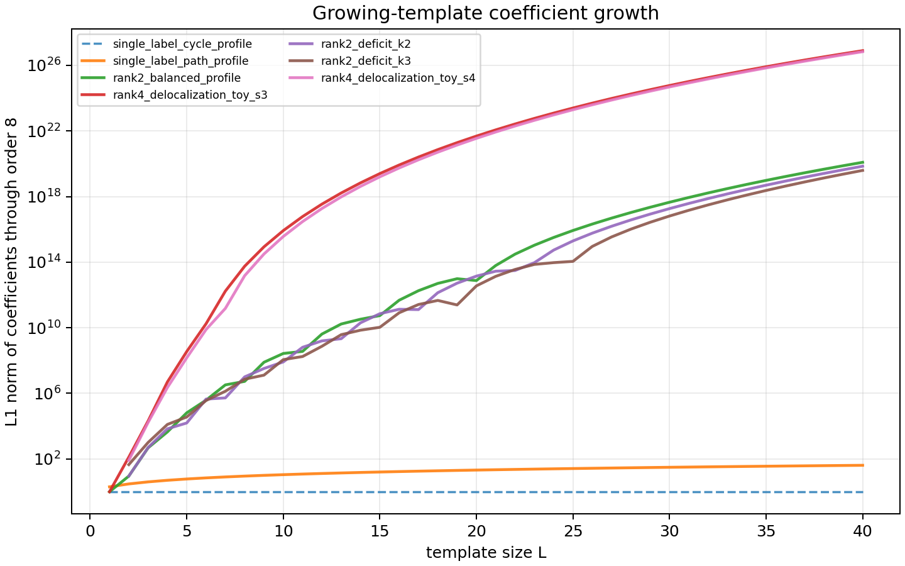
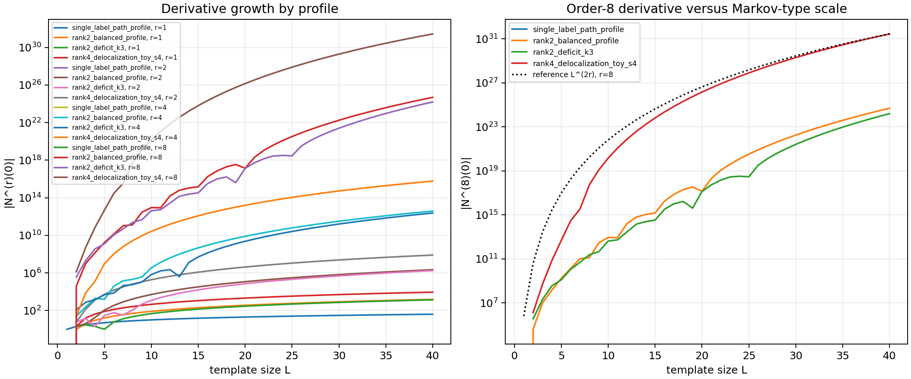
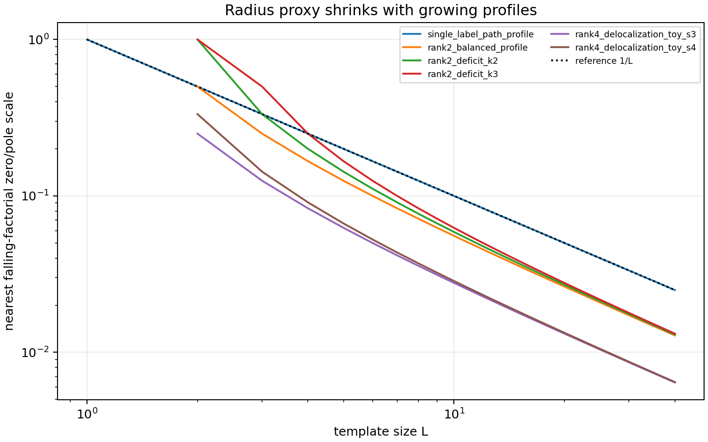

# M5 Growing-Template Expansion Growth

## Result

This cycle extends the Cycle 14 fixed-template expansion test to controlled growing count profiles. Under the M4 conflict-free labelled-embedding identity, the normalized expectation

```text
N_H(n) = n^{C-V} (n)_V / Product_a (n)_{C_a}
```

depends only on the vertex count `V` and the per-label constraint counts `C_a`, not on the topology of a labelled template with the same conflict-free count profile. With `x=1/n`, this is a finite product/ratio of factors `(1-jx)`, so each fixed profile is regular at `x=0`; ill-conditioning enters when `V` and `C_a` grow with `L`.



## Hand Checks

Two profile families match exact formulas:

```text
single_label_cycle_profile: V=L, C_a=[L]
N_L(1/x) = 1

single_label_path_profile: V=L+1, C_a=[L]
N_L(1/x) = 1 - L x
```

The generated coefficients satisfy these identities exactly for `L=1..40`. This is the profile sanity check: the expansion machinery distinguishes true cancellation from ordinary growing-factor amplification.

## Growth Findings

The nontrivial rank-two and rank-four profiles develop large coefficients and derivatives through order 8:

| family | L | L1 coefficient norm through order 8 | max derivative through order 8 | radius proxy |
|---|---:|---:|---:|---:|
| `single_label_cycle_profile` | 40 | 1 | 1 | exact cancellation |
| `single_label_path_profile` | 40 | 41 | 40 | `1/40` |
| `rank2_balanced_profile` | 40 | `1.222740960544758e20` | `4.887997076237615e24` | `1/78` |
| `rank2_deficit_k3` | 40 | `3.9254589694304007e19` | `1.5663067375849087e24` | `1/76` |
| `rank4_delocalization_toy_s4` | 40 | `6.802812940161747e26` | `2.7401689056357774e31` | `1/155` |

For example, at `L=40`,

```text
rank2_balanced_profile:
  coeff x^1 = -1521
  coeff x^2 = 1096641
  coeff x^4 = 159366366081
  coeff x^8 = 121230086216210685441

rank4_delocalization_toy_s4:
  coeff x^1 = -8970
  coeff x^2 = 39644865
  coeff x^4 = 246786530977701
  coeff x^8 = 679605383342206704540099501
```



The data are compatible with the Markov-loss heuristic in the limited sense needed here: fixed profiles are stable, while growing profiles produce derivative amplification on polynomial scales in `L`. The clean path family only has linear first derivative. Rank-two and rank-four ratio families have high-order derivatives that grow rapidly; the order-8 curves are at least Markov-like over the tested range, although the exact finite-`L` slopes are profile-dependent and not claimed as asymptotic exponent theorems.

## Radius Proxy

The nearest falling-factorial factor scale shrinks like `1/L`: path has `1/L`, rank-two balanced has `1/(2L-2)`, and the rank-four toy has about `1/(4L)`.



This localizes the mechanism. The source of growth is analytic conditioning of the product/ratio as the closest zero or pole approaches the expansion point, not sampling noise or a Cycle 9 fitting artifact.

## Limitation

This is still a finite profile-level benchmark, not a Kim--Tao exponent improvement. It does not prove any sharpening of the MPvH, Nau, or MP23 trace-polynomial inputs. The justified benchmark principle is narrower: fixed conflict-free templates are analytically tame at `x=0`, but growing template size naturally creates coefficient and derivative amplification through falling-factorial zero/pole scales.

## Validation Note

The requested Wolfram script is present as `scripts/probe_growing_template_expansions.wls`, but `wolfram-batch` could not run in this environment because the Wolfram Engine license is expired. The CSVs and figures were generated by `scripts/plot_growing_template_expansions.py`, which uses the same exact truncated product recurrence over rational coefficients and is covered by direct tests.
