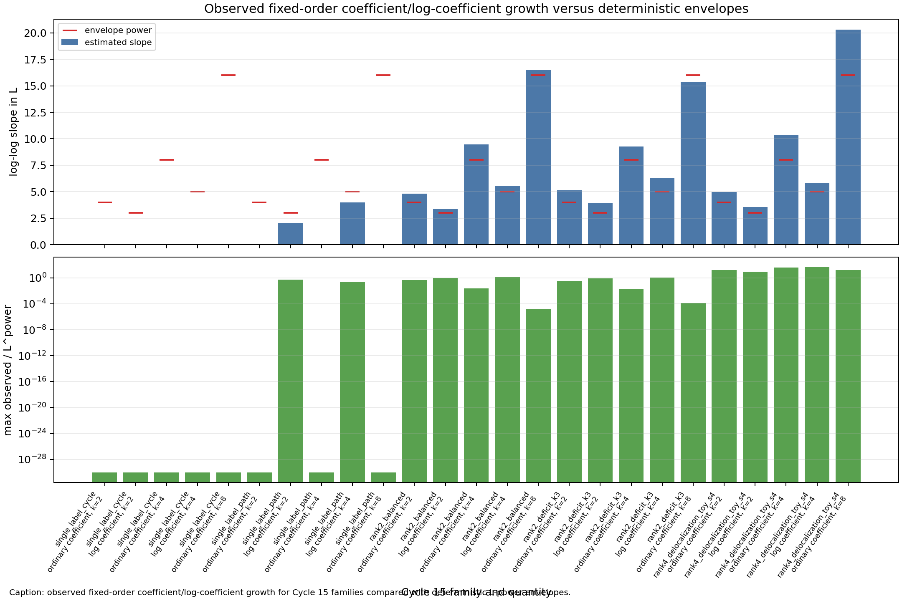

# M7 Product-Ratio Coefficient Bounds

## Scope

This note formalizes the Cycle 16 toy mechanism for normalized labelled-template expectations. It is a deterministic lemma about finite product ratios, not a Kim--Tao trace theorem and not an improved rigidity exponent. The intended use is to make the M5 follow-up direction inspectable: growing support size can force fixed-order coefficient and derivative amplification even when each fixed profile is analytic at `x = 0`.

## Setup

Let

```text
N_L(x) = Product_{a in A_L} (1 - a x) / Product_{b in B_L} (1 - b x),
```

where `A_L` and `B_L` are finite multisets of nonnegative integers. Assume there are constants `C_0, C_1` such that

```text
max(A_L union B_L) <= C_0 L,
|A_L| + |B_L| <= C_1 L.
```

The Cycle 15 normalized labelled-template profiles have this form after writing falling factorials as products of `(1 - jx)` with `x = 1/n`.

## Lemma 1: Log-Coefficient Identity

For `|x| < 1 / max(A_L union B_L)`,

```text
log N_L(x)
  = Sum_{r>=1} gamma_r(L) x^r,
gamma_r(L)
  = (Sum_{b in B_L} b^r - Sum_{a in A_L} a^r) / r.
```

Proof. Use the convergent series

```text
log(1 - tx) = - Sum_{r>=1} t^r x^r / r.
```

Summing this over numerator factors and subtracting the denominator logarithms gives

```text
Sum_a log(1 - ax) - Sum_b log(1 - bx)
  = Sum_{r>=1} ((Sum_b b^r - Sum_a a^r) / r) x^r.
```

This proves the identity as a power series at zero. Since both sides are analytic in the stated disk, the coefficient identity is deterministic.

## Lemma 2: Fixed-Order Log Bounds

For each fixed `r >= 1`,

```text
|[x^r] log N_L(x)| <= (C_1 C_0^r / r) L^{r+1}.
```

Proof. Each support index has size at most `C_0 L`, and there are at most `C_1 L` total factors. Therefore

```text
|Sum_b b^r - Sum_a a^r|
  <= Sum_b |b|^r + Sum_a |a|^r
  <= C_1 L (C_0 L)^r.
```

Divide by `r`.

## Lemma 3: Fixed-Order Ordinary Coefficient Envelope

For each fixed `k >= 1`, there is a constant `D_k = D_k(C_0,C_1)` such that

```text
|[x^k] N_L(x)| <= D_k L^{2k}.
```

Consequently,

```text
|N_L^{(k)}(0)| <= k! D_k L^{2k}.
```

Proof. Write

```text
log N_L(x) = Sum_{r>=1} gamma_r(L) x^r.
```

The exponential formula gives

```text
[x^k] N_L(x)
  = Sum_{m_1 + 2m_2 + ... + k m_k = k}
      Product_{j=1}^k gamma_j(L)^{m_j} / m_j!.
```

By Lemma 2, `|gamma_j(L)| <= E_j L^{j+1}` for fixed constants `E_j`. A partition term with multiplicities `m_j` has size at most

```text
C(m) L^{Sum_j m_j(j+1)}
  = C(m) L^{k + Sum_j m_j}.
```

Since `Sum_j m_j <= k`, every partition term is `O_k(L^{2k})`. There are finitely many partitions of `k`, so their sum is also `O_k(L^{2k})`. The derivative bound follows from `N_L^{(k)}(0) = k! [x^k]N_L(x)`.

This is a crude worst-case envelope. It does not optimize cancellations between numerator and denominator factors, and it does not claim observed finite-window slopes must be below `2k`.

## Cycle 15 Comparison

The script

```bash
python3 scripts/analyze_product_ratio_bounds.py
```

reads:

- `data/extension_candidates/growing_template_expansion_summary.csv`
- `data/extension_candidates/growing_template_expansion_coefficients.csv`
- `data/extension_candidates/m5_log_coefficient_summary.csv`

and writes:

- `data/extension_candidates/product_ratio_bound_summary.csv`
- `reports/figures/m7_product_ratio_bounds.png`



Selected output rows:

```text
single_label_cycle_profile, ordinary coefficient k=8: max 0, ratio to L^16 = 0
single_label_path_profile, log coefficient k=4: slope 4, max 640000, ratio to L^5 = 0.25
rank2_balanced_profile, ordinary coefficient k=8: slope 16.502, max 1.21230086216e20, ratio to L^16 = 1.52587890625e-05
rank2_balanced_profile, log coefficient k=4: slope 5.5348, max 1.3941447975e8, ratio to L^5 = 1.36146952881
rank4_delocalization_toy_s4, ordinary coefficient k=8: slope 20.299, max 6.79605383342e26, ratio to L^16 = 15.8232958834
rank4_delocalization_toy_s4, log coefficient k=4: slope 5.85559, max 4.5265439115e9, ratio to L^5 = 44.2045303857
```

The rank-four order-8 finite-window slope is larger than `16`, but this does not contradict Lemma 3. The proof gives an existence-of-constant envelope for fixed `k`; the fitted slope is a descriptive regression over `L <= 40`, not an asymptotic theorem. The finite ratios to the stated envelope are the relevant compatibility check.

## Cancellations and Improvements

Complete cancellation: if `A_L = B_L` as multisets, then `N_L(x) = 1` and every positive coefficient vanishes. This is tested directly by matched supports in `tests/test_product_ratio_bounds.py`.

Cycle profile cancellation: `single_label_cycle_profile` has identical numerator and denominator falling-factorial supports, so the normalized product ratio is exactly `1`.

Path profile improvement: `single_label_path_profile` reduces to `1 - Lx`; all ordinary coefficients of order `k >= 2` vanish, while the log coefficients are `-L^k/k`. The ordinary coefficient envelope `L^{2k}` is therefore highly non-sharp for this family.

Rank-two and rank-four profiles: these show the expected amplification from growing supports. Their log coefficients fit the `O(L^{r+1})` mechanism, while ordinary coefficients can be much larger because partition products of the log coefficients combine.

## Conclusion

M7 turns the M5 product-ratio mechanism into a standalone toy lemma: under linear support size and linear maximum index, fixed-order log coefficients are `O_r(L^{r+1})`, ordinary coefficients are `O_k(L^{2k})`, and derivatives at zero satisfy the same envelope up to `k!`. The exact Cycle 15 families fit inside this deterministic framework and expose cancellation cases where the envelope is far from sharp. The result is credible as a follow-up toy lemma for the final report's ranked research direction, but it remains outside the Kim--Tao hyperbolic trace expansion until actual growing quotient families are connected to these product-ratio profiles.
