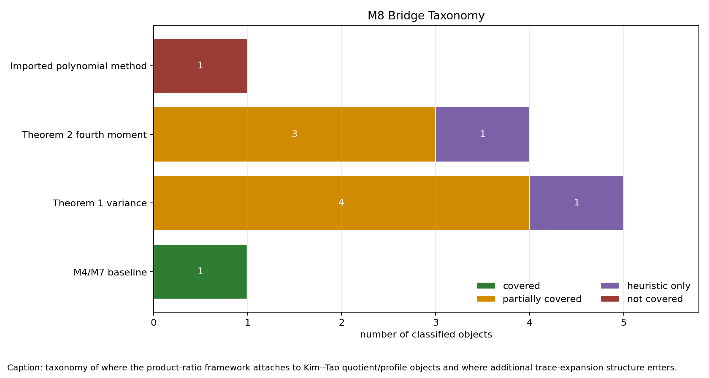

# M8 Quotient-Family Bridge

## Scope

This cycle tests the bridge from the M4/M7 labelled-template product-ratio framework back to the actual polynomialized common-fixed-point objects in Kim--Tao §§3-4. It does not claim a new rigidity exponent. The question is narrower: when the paper replaces trace or pre-trace randomness by folded quotient graphs, which pieces have the same constraint skeleton as product-ratio template expectations, and which pieces require extra structure outside M7?

Inputs used:

- `docs/proof_ledger/proposition31_internal_reconstruction.md`
- `docs/proof_ledger/two_trace_expansion_ledger.md`
- `docs/proof_ledger/eigenfunction_fourth_moment_ledger.md`
- `reports/extension_candidates/m7_product_ratio_coefficient_bounds.md`
- `reports/final/final_report.md`
- local paper text around Lemma 3.3, Corollary 3.4, and Proposition 4.2.

## Taxonomy



The generated classification table is `data/extension_candidates/quotient_family_bridge_table.csv`. It contains eleven rows:

| bridge status | count | meaning |
|---|---:|---|
| `covered` | 1 | The independent-permutation M4/M7 baseline is exactly a labelled-template product-ratio expectation. |
| `partially_covered` | 7 | The Kim--Tao object has the same labelled-template constraint skeleton or exposed falling-factorial profile, but surface-group relations, Witten-zeta normalization, summing, centering, denominator control, or geometry weights remain outside the framework. |
| `heuristic_only` | 2 | Product-ratio language matches the shape of falling-factorial terms, but the paper uses an imported aggregate theorem for the decisive bound. |
| `not_covered` | 1 | The full MPvH/MP23 imported machinery is not derivable from isolated product-ratio envelopes. |

## Theorem 1 Pipeline

Lemma 3.3 is the cleanest attachment point. For fixed nontrivial words `gamma_1,gamma_2` with total word length at most `q`, the paper builds a two-cycle labelled graph `C_{gamma_1,gamma_2}`. Every morphism into the random Schreier graph factors through a folded quotient

```text
C_{gamma_1,gamma_2} ->> W_r -> X_phi,
```

and the trace product expectation becomes a finite sum of injective embedding expectations `E_n^emb(W_r)`. A single conflict-free quotient `W_r` has the same labelled constraint skeleton certified in M4 after normalizing inverse-labelled edges. The actual Kim--Tao expectation, however, is over `Hom(Gamma,S_n)` rather than independent generator permutations, so MPvH/Witten-zeta machinery is already needed to expose the falling-factorial rational form. Once that form is exposed, M7 supplies fixed-order product-ratio coefficient and derivative envelopes termwise for controlled growing support.

That is not yet Proposition 3.1. Corollary 3.4 forms the weighted polynomial

```text
p(x) = sum a(gamma_1,k_1) a(gamma_2,k_2)
       (h o f_Lambda0)^vee(k_1 ell_gamma1)
       (h o f_Lambda0)^vee(k_2 ell_gamma2)
       Q_{gamma_1^k1,gamma_2^k2}(x).
```

The bridge becomes partial here. M7 controls individual product-ratio profiles, but it does not count quotient types, control the geodesic weights, prove cancellation in `p`, or replace the denominator/boundedness input `Q_id(1/n) in [C^{-1},C]`. In particular, the Nau boundedness step that removes negative powers of `1/n` is external to the M4/M7 framework.

The cyclic or diagonal two-trace pairs are also only partially covered. They are visible as quotient templates and can be analyzed through the same constraint skeleton, but Kim--Tao do not isolate them as a separate diagonal theorem in §3.2; they are absorbed into `p(1/n)` and then controlled by the spectral-side uniform bound plus Markov interpolation.

## Theorem 2 Pipeline

Proposition 4.2 has the same termwise attachment point with a harder statistic. Equation (4.15) replaces the two-cycle graph by `C_{gamma_1,...,gamma_8}`, the quotient of eight loops with their first vertices identified. For a fixed folded quotient of this graph, the labelled constraints are M4-like, and M7 gives a per-profile growing-support envelope after the product-ratio structure has been isolated. This is still only partial coverage for Kim--Tao, because the expectation is in the surface-group random-cover law and the proof invokes the MP23 rank-two common-fixed-point input.

The fourth-moment proof adds two obstructions that are not present in the M7 toy lemma.

First, the primitive-power diagonal term `S` is structurally subtracted before the rank-two estimate applies. Product ratios can describe individual diagonal templates, but they do not explain why `S` is the right centering term or how its deterministic contribution is balanced in the pre-trace argument.

Second, after diagonal removal the proof uses an MP23 common-fixed-point theorem for a rank-two subgroup to obtain the `n^{-2}` scale. M7 has no rank-sensitive decay theorem. It controls coefficient growth of already selected product ratios, not the probability that two non-commensurable words have a common fixed point at the needed aggregate scale.

Thus the eight-word quotient family has termwise product-ratio structure after the external polynomialization input, but the full expression

```text
p(1/n) / (n^2 Q_id(1/n))
```

is only partially covered. The second-derivative Markov step, rank-two decay, diagonal subtraction, denominator control, and geometry weights are extra axes.

## Strongest Justified Bridge Claim

**Conditional bridge statement.** Suppose a Kim--Tao trace or pre-trace polynomial can be decomposed as a geometry-weighted sum of conflict-free folded quotient templates whose exposed falling-factorial profiles have supports of size `O(q)` and indices `O(q)`. Then M4 identifies the corresponding independent-permutation template expectation, while the MPvH/Witten-zeta expansion is still required to transfer that template skeleton to the surface-group random-cover law. Once transferred, M7 gives fixed-order `1/n` coefficient envelopes for each exposed product-ratio term. To upgrade this to a Proposition 3.1 or Proposition 4.2 level estimate, one still needs independent control of quotient-family counts, geometry weights, denominator normalization, cancellation, diagonal subtraction, and rank-two common-fixed-point decay.

This is a genuine partial bridge, not merely an analogy: the individual quotient templates used in Lemma 3.3 and equation (4.15) have the same labelled-template constraint skeleton certified in M4. The bridge is not exact at the Kim--Tao probability-law level, where even fixed quotient expectations pass through the MPvH/Witten-zeta expansion. It also fails as a complete proof strategy at the aggregate polynomial estimate, where Kim--Tao rely on imported MPvH/MP23 and Nau inputs that M7 does not reproduce.

## Clearest Obstruction

The clearest obstruction is not the combinatorial shape of a single template. That shape is solved in the independent-permutation toy model by M4 and bounded by M7 after normalization. For Kim--Tao, there is already a probability-law transfer from independent labelled constraints to the surface-group homomorphism model, and then an aggregate transition:

```text
individual quotient product ratios
  -> finite/growing quotient-family sum
  -> Q_gamma(1/n) / Q_id(1/n)
  -> p(1/n) or p(1/n)/(n^2 Q_id(1/n))
  -> Markov-interpolated trace/pre-trace bound.
```

At this transition, the paper uses external polynomial-method structure: Witten-zeta normalization, boundedness removing negative powers, rank-two common-fixed-point estimates, and cancellations or summability across many quotient types. M7 identifies how growing supports can amplify coefficients, but it does not bound the number of quotient types or prove the hidden cancellations needed in the full random-cover polynomial estimates.

## Next Theorem Target

The next useful theorem would be a quotient-family enumeration and cancellation statement:

```text
For the folded quotients generated by two-cycle or eight-loop word graphs
with total word length <= q, the weighted sum of normalized product-ratio
coefficients up to fixed order k is bounded by an explicit q-power after
separating cyclic diagonal families and rank-two remnants.
```

For Theorem 1 this would target the gap between termwise `E_n^emb(W_r)` and Corollary 3.4's polynomial `p`. For Theorem 2 it would need an explicit rank-two hypothesis or would remain dependent on MP23. Without such a theorem, the M7 product-ratio framework is best viewed as a diagnostic for where derivative amplification can arise, not as a replacement for the imported Kim--Tao polynomial machinery.
