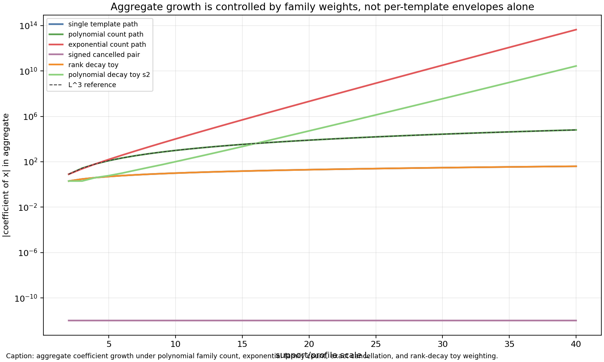

# M9 Aggregate Product-Ratio Obstruction and Enumeration Requirements

## Purpose

M7 proved a deterministic per-template statement: for normalized product ratios with support size and indices `O(L)`, every fixed-order coefficient is bounded by `O_k(L^{2k})`. M8 showed where that statement attaches to the Kim--Tao trace/pre-trace quotient skeleton: it applies termwise to independent-permutation labelled templates, but the full surface-group random-cover estimates also require quotient-family aggregation, geometry weights, denominator normalization, diagonal subtraction, and rank-sensitive probability input.

This note formalizes the resulting obstruction. Per-template bounds alone do not imply polynomial control of an aggregate quotient-family sum. They imply polynomial aggregate control only after adding a polynomial total-variation/family-count hypothesis, a cancellation theorem, or a decay mechanism strong enough to offset family growth.

## Conditional Aggregate Lemma

**Lemma (weighted aggregate coefficient bound).** Fix `k`. Let `F_L` be a finite family of templates and suppose each normalized template product ratio `N_T(x)` satisfies

```text
|[x^k] N_T(x)| <= C_k L^{2k}
```

for all `T in F_L`. For weights `w_T`, define

```text
A_L(x) = sum_{T in F_L} w_T N_T(x),
W_L = sum_{T in F_L} |w_T|.
```

Then

```text
|[x^k] A_L(x)| <= C_k L^{2k} W_L.
```

**Proof.** Coefficient extraction is linear, so

```text
[x^k] A_L(x) = sum_T w_T [x^k]N_T(x).
```

The triangle inequality gives

```text
|[x^k] A_L(x)|
  <= sum_T |w_T| |[x^k]N_T(x)|
  <= C_k L^{2k} sum_T |w_T|
  = C_k L^{2k} W_L.
```

This is sharp as a general statement: if many summands have the same sign and comparable coefficient, the aggregate grows like `W_L` times the per-template scale.

## Consequence

For fixed `k`, M7 supplies the factor `L^{2k}` but says nothing about `W_L`. Therefore polynomial aggregate control follows from M7 only if one additionally proves at least one of:

- `W_L <= L^B` for some fixed `B`;
- coefficient-level cancellation reducing `sum_T w_T [x^k]N_T(x)` below its total-variation bound;
- rank-sensitive or probability-law decay in the weights strong enough to offset the number of templates.

Without such information, the best universal conclusion is `O_k(L^{2k} W_L)`, not `O_k(L^B)`.

## Deterministic Negative Examples

The script `scripts/analyze_aggregate_product_ratio_obstruction.py` uses the path profile

```text
N_L(x) = prod_{j=1}^{L}(1-jx) / prod_{j=1}^{L-1}(1-jx) = 1 - Lx.
```

Thus each individual template has `|[x]N_L| = L`, well below the M7 proxy `L^2` for `k=1`.

Generated examples for `L=2..40`:

| Family | Weight/family structure | Aggregate `[x]` coefficient at `L=40` | Interpretation |
|---|---:|---:|---|
| `single_template_path` | one copy | `-40` | direct per-template control |
| `polynomial_count_path` | `L^2` positive copies | `-64000` | polynomial count preserves polynomial growth with shifted degree |
| `exponential_count_path` | `2^L` positive copies | `-43980465111040` | per-template control does not prevent exponential aggregate growth |
| `signed_cancelled_pair` | identical copies with weights `+1,-1` | `0` | cancellation is independent information |
| `rank_decay_toy` | `2^L` copies, each weight `2^-L` | `-40` | decay offsets exponential family count |
| `polynomial_decay_toy_s2` | `2^L` copies, each weight `L^-2` | `-137438953472/5` | polynomial decay does not offset exponential count |



These examples prove the logical negative theorem intended here: for arbitrary aggregate families, per-template product-ratio coefficient bounds are insufficient as a standalone hypothesis for polynomial aggregate control.

## Bridge Requirements

The generated requirements table `data/extension_candidates/aggregate_bridge_requirements.csv` separates the inputs:

| Requirement | Present in M7 | Role |
|---|---|---|
| per-template product-ratio envelope | yes | controls isolated summands only |
| polynomial family-count control | no | prevents positive template proliferation |
| polynomial total variation of weights | no | is the exact hypothesis in the conditional lemma |
| signed cancellation | no | can beat total variation, but must be proved separately |
| rank-sensitive decay | no | can offset large families, matching the conceptual role of rank estimates |
| denominator and boundedness control | no | handles `Q_id`, negative-power cancellation, and aggregate analytic boundedness |

## Kim--Tao Interpretation

This result does not assert that Kim--Tao quotient families grow exponentially or lack cancellation. It says only that M7 does not decide those questions. M8 already identified the missing aggregate layer: the MPvH/Witten-zeta/Nau estimates and the MP23 rank-two common-fixed-point input control probability-law and rank-sensitive behavior that isolated labelled-template product ratios do not see.

For Theorem 1, the full transition from folded two-trace quotient templates to `p(1/n)/Q_id(1/n)` requires quotient enumeration, geodesic weights, denominator normalization, and boundedness. For Theorem 2, the eight-loop quotient templates are likewise only termwise controlled; diagonal subtraction and rank-two decay are separate structural inputs.

## Next Bridge Theorem

The next meaningful target before any exponent-improvement claim is:

```text
For folded quotients generated by the two-cycle and eight-loop word graphs
with total word length <= q, prove that the weighted sum of normalized
product-ratio coefficients up to fixed order k is bounded by an explicit
q-power after separating cyclic diagonal families and rank-two remnants.
```

Such a theorem must specify which aggregate input it proves: polynomial quotient-family count, polynomial total variation, cancellation, rank-sensitive decay, or a combination of these. M9 shows that a per-template envelope cannot substitute for that aggregate statement.
