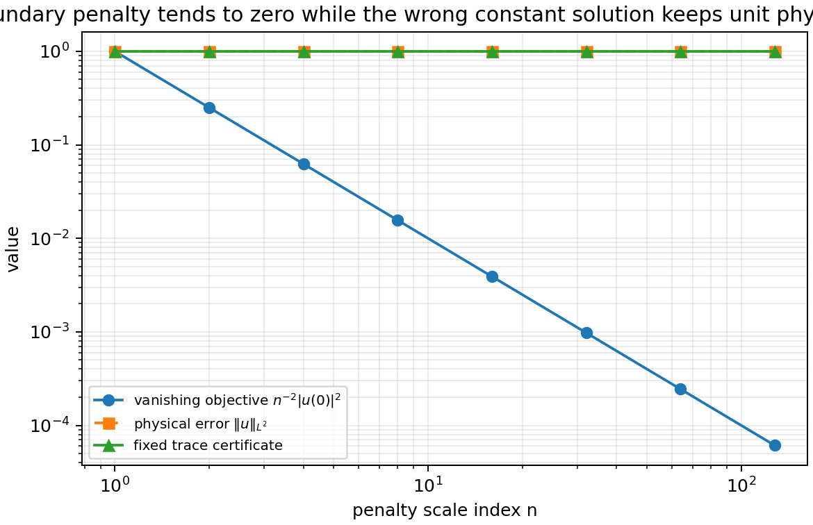
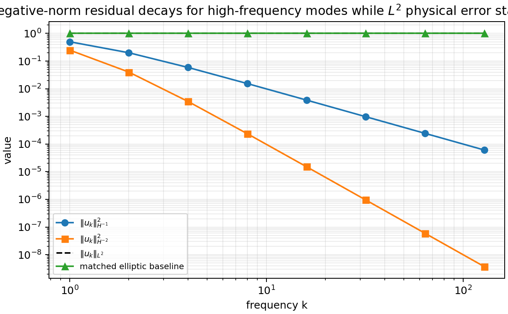
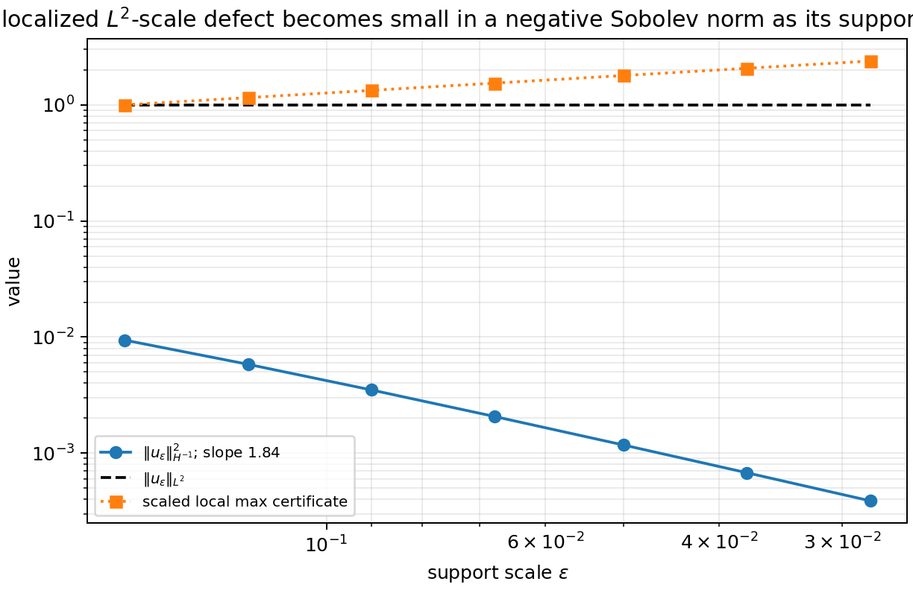
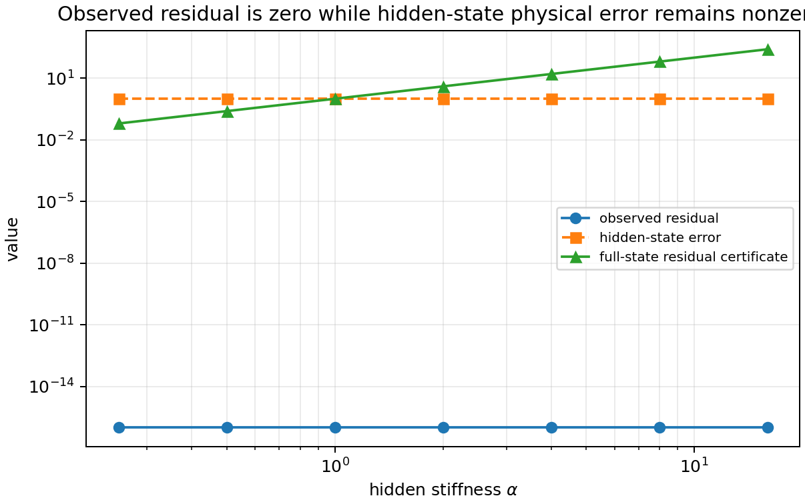
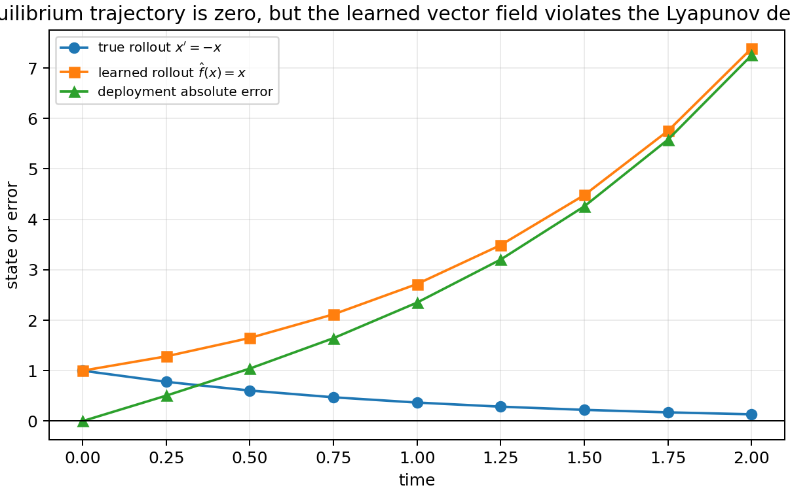
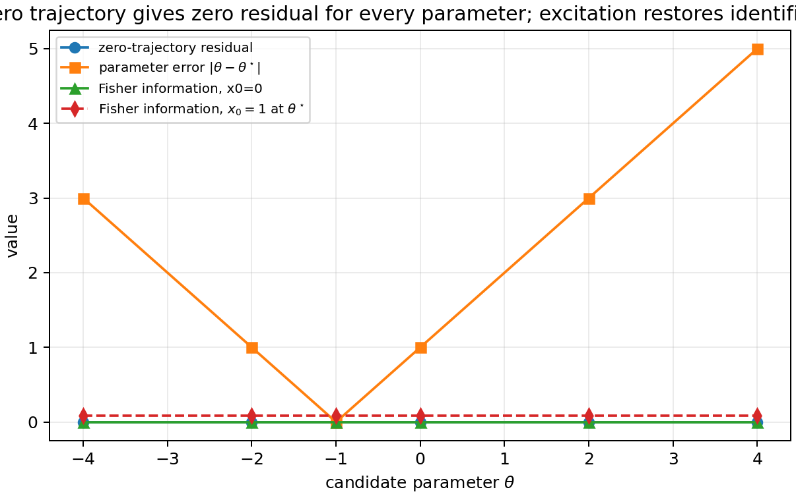
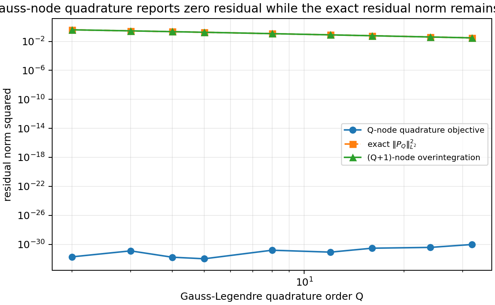
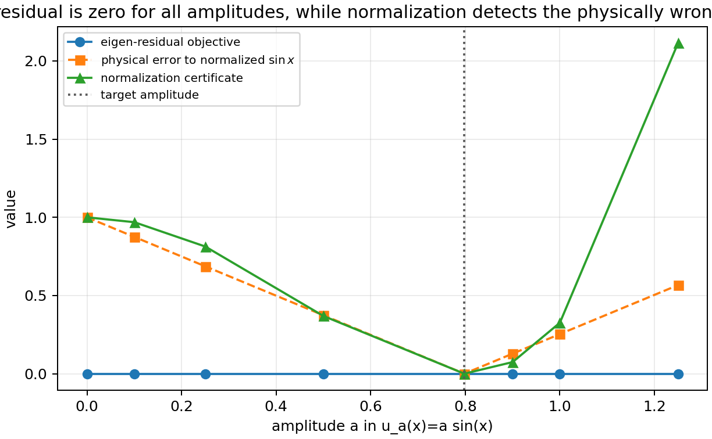
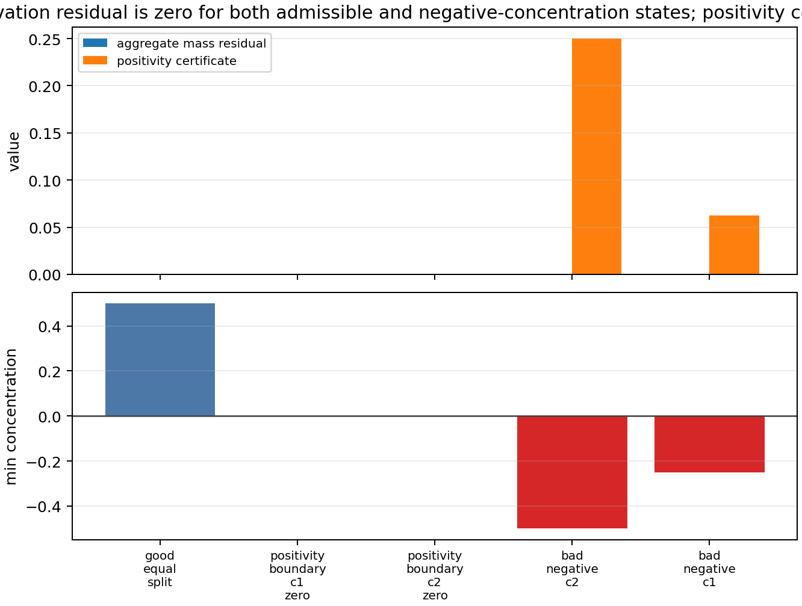

# Toy Simulation Results: M-11 Toy Suite Tranches

These tranches add explicit, low-dimensional objective-function failures from the M-7 catalogue. Each case uses a closed-form bad family rather than neural-network training, so the computation isolates the residual objective from optimizer behavior.

## CAT-02: Boundary/Trace Leakage

Task: solve \(u'(x)=0\) on \([0,1]\) with intended trace \(u(0)=0\), whose true solution is \(u^\star=0\). The tested objective is
\[
J_n(u)=\|u'\|_{L^2(0,1)}^2+n^{-2}|u(0)|^2.
\]
For the bad family \(u_n(x)=1\), the derivative residual is exactly zero, \(J_n(u_n)=n^{-2}\to0\), and the physical error remains \(\|u_n-u^\star\|_{L^2}=1\). The fixed trace certificate \(\lambda |u(0)|^2\) with \(\lambda=1\) remains equal to 1 at the failure point \(u(0)=1\), so it detects precisely what the vanishing penalty loses.

Artifacts: `scripts/trace_leakage_toy.py`, `data/trace_leakage_scaling.csv`, `data/trace_leakage_scaling.png`, `tests/test_trace_leakage_toy.py`.

Status: theorem-quality toy demonstration for CAT-02 and M-11; supports trace-penalty correction claims but does not claim novelty beyond the residual-learning framing.

## CAT-06: Weak-Norm High-Frequency Mismatch

Task: test whether residual measured directly in a weak topology certifies \(L^2\) physical accuracy. On \((0,2\pi)\), take \(L^2\)-normalized sine modes \(u_k\). The direct objective
\[
J_k(u_k)=\|u_k\|_{H^{-s}}^2=(1+k^2)^{-s}
\]
vanishes as \(k\to\infty\) for \(s>0\), while \(\|u_k\|_{L^2}=1\). The certificate row records that a strong \(L^2\) check or compactness/regularity bound remains nonzero on the bad family.

The script also includes a negative-control stability baseline: for \(L=-d^2/dx^2+I\), the matched elliptic quantity \(\|Lu_k\|_{H^{-2}}\) stays equal to 1 on normalized modes. That row is classified as a stability baseline, not a counterexample, because the operator/norm pairing does not suppress the target \(L^2\) error.

Artifacts: `scripts/weak_norm_high_frequency_toy.py`, `data/weak_norm_scaling.csv`, `data/weak_norm_scaling.png`, `tests/test_weak_norm_high_frequency_toy.py`.

Status: theorem-quality objective-design warning for CAT-06 and M-8; the direct weak norm is a genuine topology mismatch, while matched elliptic residuals are explicitly not promoted as failures.

## CAT-06 / WT-2: Weak-Norm Localized Defect

Task: test whether concentration defects can also become invisible to a direct negative Sobolev objective. On the periodic unit interval, the script builds a mean-zero interior bump-dipole \(u_\epsilon\), normalizes it to \(\|u_\epsilon\|_{L^2}=1\), and measures
\[
J_\epsilon=\|u_\epsilon\|_{H^{-1}}^2.
\]
The mean-zero choice suppresses the constant Fourier mode. Over the tested range, \(J_\epsilon\) decreases from \(9.40\times10^{-3}\) at \(\epsilon=0.16\) to \(3.89\times10^{-4}\) at \(\epsilon=0.028125\), with fitted log-log slope \(1.84\). The \(L^2\) and local maximum certificates remain nonzero, so a stronger norm, local defect sampling, or compactness/regularity bound detects what the weak objective misses.

Artifacts: `scripts/weak_norm_localized_defect.py`, `data/weak_norm_localized_defect.csv`, `data/weak_norm_localized_defect.png`, `tests/test_weak_norm_localized_defect.py`.

Status: toy demonstration for M-8 weak/topology closure; this is a direct weak-measurement failure, not a matched elliptic residual failure.

## CAT-11: Partial-Observation Hidden Mode

Task: solve a two-state linear ODE
\[
x_1'=-x_1,\qquad x_2'=-\alpha x_2
\]
with target \(x^\star=(0,0)\), but train or verify only the first observed component. The bad family \(x(t)=(0,1)\) has zero observed residual and zero observed state error, but hidden-state error remains \(\|x_2\|_{L^2(0,1)}=1\). The full-state residual certificate gives \(\|x_2'+\alpha x_2\|_{L^2}^2=\alpha^2\), and the observability matrix for \(C=[1,0]\) has rank 1 in a 2D state space, exposing a one-dimensional hidden nullspace.

Artifacts: `scripts/hidden_mode_observability_toy.py`, `data/hidden_mode_observability.csv`, `data/hidden_mode_observability.png`, `tests/test_hidden_mode_observability_toy.py`.

Status: theorem-quality partial-observation objective failure for CAT-11 and M-10; it is not a full-state residual failure.

## CAT-14: Lyapunov / Deployment-Region Mismatch

Task: verify a learned vector field for the stable scalar ODE \(x'=-x\) when the residual/data support contains only the equilibrium trajectory \(x(t)=0\). The bad learned field \(\hat f(x)=x\) satisfies the training residual exactly because \(\hat f(0)=0\), but it is unstable on the deployment region. From \(x_0=1\), the true rollout is \(e^{-t}\), the learned rollout is \(e^t\), and the absolute deployment error grows from 0 at \(t=0\) to \(7.2537\) at \(t=2\).

The Lyapunov certificate separates the two fields on the region where deployment occurs. For \(V(x)=x^2\), \(\dot V_f(1)=-2\) for the true field and \(\dot V_{\hat f}(1)=2\) for the learned field. The failure is therefore a trajectory-support mismatch for vector-field learning, not a claim that a full-domain ODE residual would accept \(\hat f\).

Artifacts: `scripts/lyapunov_stability_mismatch_toy.py`, `data/lyapunov_stability_mismatch.csv`, `data/lyapunov_stability_mismatch.png`, `tests/test_lyapunov_stability_mismatch_toy.py`.

Status: theorem-quality toy demonstration for CAT-14 and M-10.

## CAT-17: ODE Parameter Non-Identifiability

Task: identify \(\theta\) in \(x'=\theta x\) from the zero-excitation trajectory \(x(0)=0,\;x(t)\equiv0\). Every tested parameter \(\theta\in\{-4,-2,-1,0,2,4\}\) has zero state residual and zero state-data error. With target \(\theta^\star=-1\), the parameter error remains nonzero for every wrong \(\theta\), reaching 5 at \(\theta=4\).

The sensitivity certificate records the obstruction directly:
\[
\mathcal I(\theta)=\int_0^T \left(\partial_\theta x(t;\theta)\right)^2dt.
\]
For \(x_0=0\), \(\partial_\theta x=t x_0e^{\theta t}=0\), so the Fisher/sensitivity information is zero. With the nonzero-excitation check \(x_0=1\) at \(\theta^\star=-1\), the computed information is \(0.0808309>0\).

Artifacts: `scripts/ode_parameter_nonidentifiability_toy.py`, `data/ode_parameter_nonidentifiability.csv`, `data/ode_parameter_nonidentifiability.png`, `tests/test_ode_parameter_nonidentifiability_toy.py`.

Status: theorem-quality toy demonstration for CAT-17 and M-10.

## CAT-07: Quadrature Aliasing

Task: approximate the residual integral for \(u'(x)=0\) on \([-1,1]\) with endpoint constraints \(u(-1)=u(1)=0\) using \(Q\)-point Gauss-Legendre quadrature:
\[
J_Q(u)=\sum_{i=1}^Q w_i |u'(x_i)|^2+|u(-1)|^2+|u(1)|^2.
\]
For the bad family \(u_Q'(x)=P_Q(x)\) and \(u_Q(x)=\int_{-1}^x P_Q(t)\,dt\), the quadrature nodes are exactly the roots of \(P_Q\), so the sampled residual term is zero. The endpoint penalties also vanish because \(\int_{-1}^1P_Q(t)\,dt=0\), but the true continuous residual is
\[
\|u_Q'\|_{L^2(-1,1)}^2=\|P_Q\|_{L^2(-1,1)}^2=\frac{2}{2Q+1}>0.
\]
This is a quadrature/discretization failure for an integral residual approximation, not a continuous-residual failure. A \(Q+1\)-node Gauss rule overintegrates the squared residual exactly in this polynomial example and recovers the true residual norm.

Artifacts: `scripts/quadrature_aliasing_toy.py`, `data/quadrature_aliasing.csv`, `data/quadrature_aliasing.png`, `tests/test_quadrature_aliasing_toy.py`.

Status: theorem-quality toy demonstration for CAT-07 and M-11; structurally relevant to spectral residual objectives and pseudospectral scientific-ML workflows.

## CAT-15: Eigenmode Normalization

Task: recover the first normalized Sturm-Liouville eigenmode \(u^\star(x)=\sqrt{2/\pi}\sin x\) for
\[
-u''=u,\qquad u(0)=u(\pi)=0.
\]
For \(u_a(x)=a\sin x\), the unnormalized eigen-residual
\[
J(a)=\|-u_a''-u_a\|_{L^2(0,\pi)}^2+|u_a(0)|^2+|u_a(\pi)|^2
\]
is zero for every amplitude \(a\), including \(a=0\). The physical error \(\|u_a-u^\star\|_{L^2(0,\pi)}\) is nonzero unless \(a=\sqrt{2/\pi}\) up to the usual sign convention, and the normalization certificate
\[
C(a)=\left|\|u_a\|_{L^2(0,\pi)}^2-1\right|^2
\]
detects the zero and small-amplitude failures. Higher-mode recovery would also need orthogonality or phase/sign conventions, but this toy isolates the missing normalization certificate.

Artifacts: `scripts/eigenmode_normalization_toy.py`, `data/eigenmode_normalization.csv`, `data/eigenmode_normalization.png`, `tests/test_eigenmode_normalization_toy.py`.

Status: theorem-quality toy demonstration for CAT-15 and M-11; this is a homogeneous-eigenproblem certificate failure, not a PDE inconsistency.

## CAT-12/CAT-13: Positivity And Mass Admissibility

Task: verify a two-species concentration state \(c=(c_1,c_2)\) using only aggregate conservation,
\[
R(c)=\left|\frac{d}{dt}(c_1+c_2)\right|^2+|c_1+c_2-1|^2.
\]
For constant paths, the admissible states \(c=(0.5,0.5)\), \(c=(0,1)\), and \(c=(1,0)\) all have zero residual. The bad path \(c=(1.5,-0.5)\) also has zero aggregate residual and correct total mass, but violates positivity. The certificate
\[
C_{\rm pos}(c)=\max(0,-c_1)^2+\max(0,-c_2)^2
\]
is zero on the simplex boundary and positive on the negative-concentration states.

Artifacts: `scripts/positivity_mass_toy.py`, `data/positivity_mass_toy.csv`, `data/positivity_mass_toy.png`, `tests/test_positivity_mass_toy.py`.

Status: toy demonstration for M-9 admissibility/invariant certificates; it tests an aggregate objective that omits species positivity, not a full species ODE residual.

## Mechanism Separation

The added cases are independent mechanisms rather than variants of fixed collocation aliasing. CAT-02 fails because the trace coefficient tends to zero and the residual seminorm does not control constants. CAT-06 fails because the residual topology is weaker than the physical topology: high frequencies and localized concentration defects disappear in \(H^{-s}\) while \(L^2\) scale remains. CAT-11 fails because the observation map has a nontrivial kernel, so the objective projects away a hidden state component. CAT-14 fails because training support is only one trajectory and does not certify off-trajectory Lyapunov decrease. CAT-17 fails because the zero trajectory has no parameter sensitivity. CAT-07 fails because an insufficient quadrature rule creates a discrete residual seminorm with a polynomial nullspace at the integration nodes. CAT-15 fails because a homogeneous eigen-residual is scale-invariant without a normalization certificate. CAT-12/CAT-13 fails because an equality aggregate-conservation residual does not imply inequality/simplex admissibility.

Together with the previously validated CAT-01 fixed-collocation blind-spot toy, the toy suite now includes at least ten completed simulations or simulation variants: CAT-01, CAT-02, CAT-06 high-frequency, CAT-06/WT-2 localized defect, CAT-07, CAT-11, CAT-12/CAT-13, CAT-14, CAT-15, and CAT-17. M-8, M-9, M-10, and M-11 have been validated separately; M-12 now synthesizes those validated pieces.

