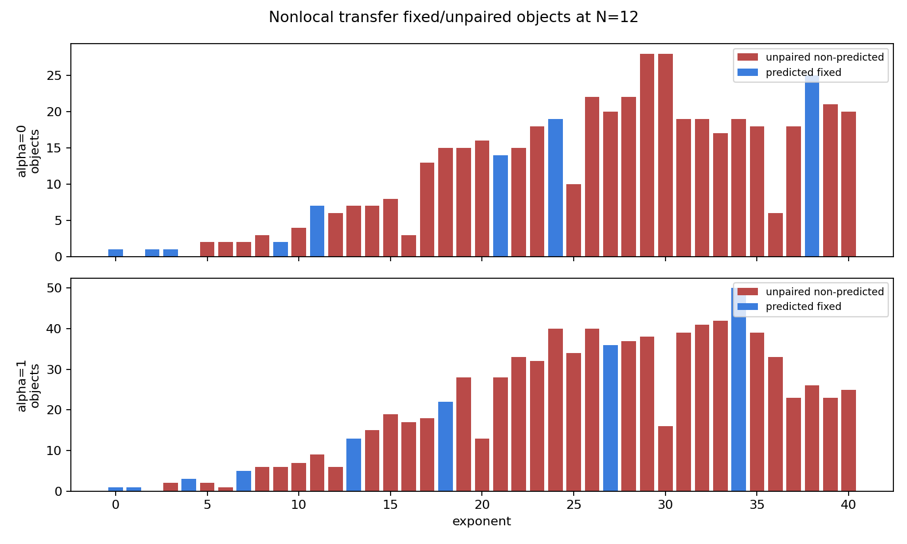
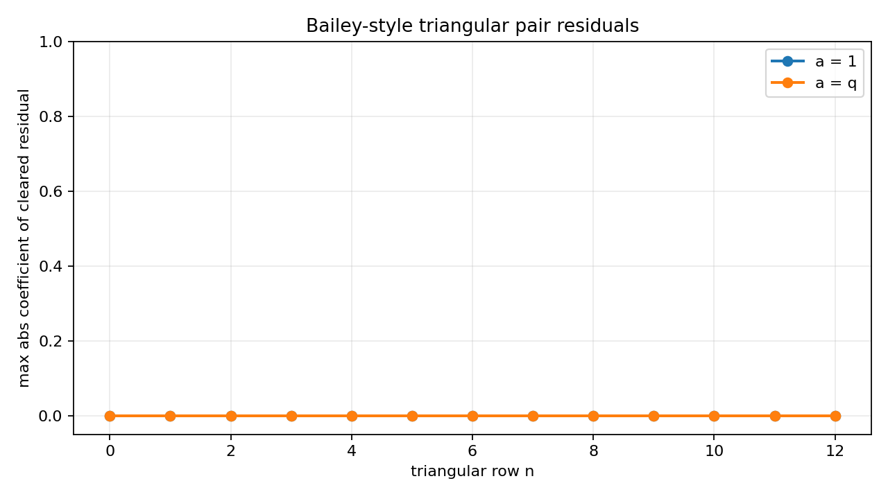

# Validation: Finite Rogers-Ramanujan Foundation

Coefficient checks are discovery evidence only. They are not proofs of the infinite identities.
Formal claims promoted to proof are only the coefficientwise/truncation lemmas and staircase bijections in `docs/lemmas/lemma_catalogue.md`.

## Commands Run

```bash
KMAX=40 OUTDIR=data/finite_experiments wolfram-batch -script scripts/rr/finite_rr_experiments.wls
figure plot scripts/rr/plot_rr_difference_heatmap.py --out data/finite_experiments/rr_difference_heatmap.png
figure check data/finite_experiments/rr_difference_heatmap.png
KMAX=40 RMAX=12 TAILR=45 OUTDIR=data/finite_experiments wolfram-batch -script scripts/rr/q_difference_probe.wls
figure plot scripts/rr/plot_q_difference_residuals.py --out data/finite_experiments/q_difference_residuals.png
figure check data/finite_experiments/q_difference_residuals.png
KMAX=40 NMAX=30 OUTDIR=data/finite_experiments wolfram-batch -script scripts/rr/finite_gap_probe.wls
KMAX=50 NMAX=24 OUTDIR=data/finite_experiments wolfram-batch -script scripts/rr/product_transform_probe.wls
figure plot scripts/rr/plot_product_transform_residuals.py --out data/finite_experiments/product_transform_residuals.png
figure check data/finite_experiments/product_transform_residuals.png
KMAX=40 NMAX=12 OUTDIR=data/finite_experiments wolfram-batch -script scripts/rr/transformed_cancellation_probe.wls
figure plot scripts/rr/plot_transformed_cancellation_survivors.py --out data/finite_experiments/transformed_cancellation_survivors.png
figure check data/finite_experiments/transformed_cancellation_survivors.png
KMAX=12 NMAX=6 OUTDIR=data/finite_experiments/test_transformed_cancellation_k12 wolfram-batch -script scripts/rr/transformed_cancellation_probe.wls
KMAX=40 NMAX=12 OUTDIR=data/finite_experiments wolfram-batch -script scripts/rr/nonlocal_involution_probe.wls
KMAX=12 NMAX=6 OUTDIR=data/finite_experiments/test_nonlocal_involution_k12 wolfram-batch -script scripts/rr/nonlocal_involution_probe.wls
figure plot scripts/rr/plot_nonlocal_involution_fixed_points.py --out data/finite_experiments/nonlocal_involution_fixed_points.png
figure check data/finite_experiments/nonlocal_involution_fixed_points.png
KMAX=50 NMAX=60 WMAX=12 OUTDIR=data/finite_experiments python3 scripts/rr/mod5_state_recurrence_probe.py
KMAX=12 NMAX=18 WMAX=5 OUTDIR=data/finite_experiments/test_mod5_state_k12 python3 scripts/rr/mod5_state_recurrence_probe.py
figure plot scripts/rr/plot_mod5_state_support.py --out data/finite_experiments/mod5_state_support.png
figure check data/finite_experiments/mod5_state_support.png
KMAX=40 NMAX=16 DEGMAX=3 OUTDIR=data/finite_experiments wolfram-batch -script scripts/rr/euler_tail_telescoping_probe.wls
KMAX=12 NMAX=8 DEGMAX=2 OUTDIR=data/finite_experiments/test_euler_tail_k12 wolfram-batch -script scripts/rr/euler_tail_telescoping_probe.wls
figure plot scripts/rr/plot_euler_tail_lattice_residuals.py --out data/finite_experiments/euler_tail_lattice_residuals.png
figure check data/finite_experiments/euler_tail_lattice_residuals.png
KMAX=28 OUTDIR=data/finite_experiments python3 scripts/rr/direct_bijection_probe.py
KMAX=12 OUTDIR=data/finite_experiments/test_direct_bijection_k12 python3 scripts/rr/direct_bijection_probe.py
figure plot scripts/rr/direct_bijection_probe.py --out data/finite_experiments/direct_bijection_abacus_examples.png
figure check data/finite_experiments/direct_bijection_abacus_examples.png
```

## Experiment Table

| experiment | observation | proof status |
|---|---|---|
| Formal coefficientwise equality in `Z[[q]]` | Equality is coefficientwise by definition; stabilization gives a unique limit series. | `proved` in L0-L2 |
| Safe truncation of series sides | Terms with `n^2>K` or `n^2+n>K` do not affect coefficients through degree `K`. | `proved` in L3 |
| Safe truncation of residue products | Product factors with part size `j>K` are `1 mod q^(K+1)`. | `proved` in L4 |
| Staircase interpretation for `q^(n^2)/(q;q)_n` | Subtracting `(2n-1,2n-3,...,1)` bijects gap-two partitions with ordinary partitions of length at most `n`. | `proved` in L5 |
| Staircase interpretation for `q^(n^2+n)/(q;q)_n` | Subtracting `(2n,2n-2,...,2)` gives the same residual class with smallest part at least `2`. | `proved` in L6 |
| RR1 coefficient check | `S1 - P14` has first nonzero coefficient `none_through_KMax` for `KMax=40`. | `experimentally_verified` |
| RR2 coefficient check | `S2 - P23` has first nonzero coefficient `none_through_KMax` for `KMax=40`. | `experimentally_verified` |
| Negative control `{1,3}` | `S1 - P13` first fails at coefficient degree `3`. | `experimentally_verified` implementation check |
| Negative control `{2,4}` | `S2 - P24` first fails at coefficient degree `3`. | `experimentally_verified` implementation check |
| Negative control shifted exponent `n^2+2n` | Shifted series minus `P14` first fails at coefficient degree `1`. | `experimentally_verified` implementation check |
| Product recurrence probe | The residue products satisfy the logged logarithmic-derivative recurrence with max residual `0` through `KMax=40`. | `proved` for finite products by algebra; matching series recurrence remains `conjectured` |
| Auxiliary q-difference identity | `F(z,q)-F(zq,q)=zqF(zq^2,q)` follows by coefficient cancellation and reindexing. | `proved` in L8 |
| Infinite ladder uniqueness | `A_r=A_{r+1}+q^(r+1)A_{r+2}` plus coefficientwise tail `A_r->1` uniquely determines all states. | `proved` in L9-L10 |
| q-difference residual probe | Exact residuals for `0<=r<=12`, `0<=k<=40` are all zero. | symbolic sanity check for proved L9 |
| Product/backsolve comparison | Tail-normalized backsolve has `C0-P14` and `C1-P23` first nonzero coefficient `none_through_KMax`; product-forced states match backsolve through checked range. | `experimentally_verified`; not a product proof |
| Finite largest-part recurrence | `G_N^(a)=G_(N-1)^(a)+q^N G_(N-2)^(a)` follows by splitting on whether part `N` appears. | `proved` in L11 |
| Naive bounded finite product comparison | At `N=30`, `G_N^(1)` vs bounded `P14` first differs at `k=32`; `G_N^(2)` vs bounded `P23` first differs at `k=31`. | diagnostic; naive finite product is not the finite identity |
| Euler complement product reduction | Multiplying by `(q;q)_infinity` converts the target products to the complementary products with residues `{2,3,0}` and `{1,4,0}` modulo 5. | `proved` in L12 |
| Finite q-binomial theorem | `(z;Q)_N` expands with Gaussian coefficients via Pascal recurrence. | `proved` in L13 |
| Derived Jacobi-type product identity | Finite Jacobi product-minus-sum residual is zero in the probe; the proof is by q-binomial convolution and coefficientwise limit. | `proved` in L14; probe is a sanity check |
| Euler-multiplied finite series recurrence | `H_(alpha,N)=(1-q^N)H_(alpha,N-1)+q^(N^2+alpha N)` has residual zero for `alpha=0,1,2`, `N<=24`. | `proved` in L15; probe is a sanity check |
| Natural transformed bilateral comparison | For `N=24`, `H_0,N` and `H_1,N` first differ from the target bilateral sums at `k=25`, matching coefficientwise stabilization through degree `N`. | `experimentally_verified`; not proof of the limit |
| Finite Jacobi triple comparison | For `N=24`, `H_0,N` and `H_1,N` first differ from the same-`N` finite Jacobi triple products at `k=25`. | diagnostic; no exact finite identity |
| Schur-style Gaussian-window search | For shifts `0..6`, every tested `H_(alpha,N)` Gaussian-window candidate at `N=24` first fails at `k=1`. | `rejected` as exact finite candidate family |
| Product-transform negative controls | Shifted `alpha=2` vs alpha-0 bilateral first fails at `k=1`; wrong specialization first fails at `k=0`. | implementation check |
| Finite signed-object expansion | Expanding `(q;q)_N/(q;q)_n` gives signed objects `(n,S)` with weight `n^2+alpha*n+sum(S)` and sign `(-1)^|S|`. | `proved` in L17 |
| Local absorb/release involution search | The hard-filtered local boundary move accepts only weight-preserving, sign-reversing involutive moves, but is not total. | `rejected` in L18 |
| Transformed survivor pattern | For `N=12`, early nonzero signed coefficients match the expected pentagonal-support degrees before finite boundary corrections appear. | diagnostic; supports L19 but is not proof |
| Transformed scalar recurrence fallback | `H_(alpha,N)-H_(alpha,N-1)` has lowest possible degree at least `N`, proving coefficientwise stabilization. | `proved` in L20; insufficient for product identification |
| Pure nonlocal subset-transfer search | Accepted transfers have no weight/sign/tail failures, but both lexicographic tie-breakers leave stable non-pentagonal no-move objects and have involution failures. | `rejected` in L21-L23 |
| Singleton-tail obstruction | `(0,{5})` for `alpha=0` and `(0,{3})` for `alpha=1` cannot move under pure subset transfer and are not target pentagonal fixed points. | `proved` obstruction in L22 |
| Coefficient recurrence for `H_(alpha,N)` | The recurrence `h_(alpha,N)(k)=h_(alpha,N-1)(k)-h_(alpha,N-1)(k-N)+1_(k=N^2+alpha*N)` follows from L15. | `proved` in L24 |
| Shifted diagonal recurrence | The exact update for `T_(alpha,N)(d)=h_(alpha,N)(N+d)` has residual zero in the recurrence probe. | `proved` in L25; probe is a sanity check |
| Fixed diagonal-window modulo-5 closure | Updating a fixed window `0<=d<=W` requires the outside state `T_(alpha,N-1)(W+1)`, and five-step updates require `W+5`. | `rejected` in L26 as a sufficient finite state system |
| Euler-tail double-sum expansion | Expanding `(q^(n+1);q)_infinity` from finite q-binomial algebra gives the signed double sum for `T_alpha`. | `proved` in L27 |
| Low-order Euler-tail divergence certificates | Polynomial certificates in `q^n,q^k` through total degree 3, including monomial-support diagnostics by `(2n+k+alpha) mod 5`, have no exact symbolic solution. | `rejected` in L28 for the tested ansatz |
| Euler-tail finite truncation check | With `NMAX=16,KMAX=40`, the finite double sum matches both corrected bilateral targets through the checked range. | consistency check only; not proof of collapse |
| Direct gap/residue partition enumeration | With `KMAX=28`, exact finite sets `G_alpha(K)` and `R_alpha(K)` have equal cardinality for all checked weights and both alpha values. | `experimentally_verified` in L30; not proof |
| Static beta/abacus signature maps | Length, beta-runner counts, shifted-runner counts, and quotient-sum signatures fail at low weights by signature mismatch or non-injectivity. | `rejected` in L31 for the tested signatures |
| Independent nearest-runner bead slide | Sliding each beta or shifted-beta bead independently to the nearest allowed residue runner changes total weight in minimal examples. | `rejected` in L32 |

## Raw Output Summary

From `data/finite_experiments/rr_recurrence_candidates.csv`:

| check | value |
|---|---:|
| product `P14` recurrence max absolute residual | 0 |
| product `P23` recurrence max absolute residual | 0 |
| first nonzero true RR1 difference | none through 40 |
| first nonzero true RR2 difference | none through 40 |
| first nonzero `{1,3}` negative-control difference | 3 |
| first nonzero `{2,4}` negative-control difference | 3 |
| first nonzero shifted-exponent negative-control difference | 1 |

First coefficient rows from `data/finite_experiments/rr_coefficients.csv`:

| k | S1 | P14 | S2 | P23 | P13 | P24 | shifted |
|---:|---:|---:|---:|---:|---:|---:|---:|
| 0 | 1 | 1 | 1 | 1 | 1 | 1 | 1 |
| 1 | 1 | 1 | 0 | 0 | 1 | 0 | 0 |
| 2 | 1 | 1 | 1 | 1 | 1 | 1 | 0 |
| 3 | 1 | 1 | 1 | 1 | 2 | 0 | 1 |
| 4 | 2 | 2 | 1 | 1 | 2 | 2 | 1 |
| 5 | 2 | 2 | 1 | 1 | 2 | 0 | 1 |
| 6 | 3 | 3 | 2 | 2 | 4 | 2 | 1 |
| 7 | 3 | 3 | 2 | 2 | 4 | 1 | 1 |
| 8 | 4 | 4 | 3 | 3 | 5 | 3 | 2 |
| 9 | 5 | 5 | 3 | 3 | 7 | 2 | 2 |
| 10 | 6 | 6 | 4 | 4 | 7 | 3 | 3 |


From `data/finite_experiments/q_difference_backsolve.csv`:

| check | first nonzero coefficient | max abs coefficient |
|---|---:|---:|
| series ladder residuals | none through 40 | 0 |
| backsolve `C0-P14` | none through 40 | 0 |
| backsolve `C1-P23` | none through 40 | 0 |
| forward product state `B14-1` | 15 | 6 |


From `data/finite_experiments/product_transform_recurrence.csv` and
`data/finite_experiments/product_transform_candidates.csv`:

| check | first nonzero coefficient | max abs coefficient |
|---|---:|---:|
| `H` recurrence, alpha 0, N 24 | none through 50 | 0 |
| `H` recurrence, alpha 1, N 24 | none through 50 | 0 |
| finite Jacobi product-minus-sum, alpha 0, N 24 | none through 50 | 0 |
| finite Jacobi product-minus-sum, alpha 1, N 24 | none through 50 | 0 |
| `H_0,24` minus plain bilateral target | 25 | 1 |
| `H_1,24` minus plain bilateral target | 25 | 1 |
| `H_0,24` minus finite Jacobi triple | 25 | 1 |
| `H_1,24` minus finite Jacobi triple | 25 | 1 |
| shifted alpha-2 negative control | 1 | 2 |
| wrong Jacobi specialization negative control | 0 | 2 |


From `data/finite_experiments/transformed_cancellation_pair_summary.csv`:

| alpha | N | objects tested | paired | unpaired | not involutive | not weight preserving | not sign reversing |
|---:|---:|---:|---:|---:|---:|---:|---:|
| 0 | 12 | 4059 | 2172 | 1887 | 0 | 0 | 0 |
| 1 | 12 | 3865 | 0 | 3865 | 0 | 0 | 0 |

Main transformed-cancellation output:

```text
KMax=40
NMax=12
alpha=0 nonzero signed coefficient exponents at NMax:
  {0, 2, 3, 9, 11, 13, 14, 16, 17, 18, 19, 20, 21, 25, 26, 27, 28, 29, 30, 33}
alpha=1 nonzero signed coefficient exponents at NMax:
  {0, 1, 4, 7, 13, 17, 18, 19, 26, 28, 29, 30, 31, 32, 33, 35, 36, 37, 38, 39}
Local absorb/release summary at NMax:
{0, 12, 4059, 2172, 1887, 0, 0, 0}
{1, 12, 3865, 0, 3865, 0, 0, 0}
```

Small repro output:

```text
KMax=12
NMax=6
alpha=0 nonzero signed coefficient exponents at NMax:
  {0, 2, 3, 7, 8, 9, 10, 12}
alpha=1 nonzero signed coefficient exponents at NMax: {0, 1, 4, 7, 11, 12}
Local absorb/release summary at NMax:
{0, 6, 70, 40, 30, 0, 0, 0}
{1, 6, 65, 0, 65, 0, 0, 0}
```


From `data/finite_experiments/nonlocal_involution_summary.csv`:

| tie breaker | alpha | objects | paired up | paired down | predicted fixed | no move | involution failures | weight/sign/tail failures |
|---|---:|---:|---:|---:|---:|---:|---:|---:|
| lex largest | 0 | 4059 | 1250 | 1250 | 70 | 423 | 1066 | 0 |
| lex smallest | 0 | 4059 | 1241 | 1241 | 70 | 423 | 1084 | 0 |
| lex largest | 1 | 3865 | 714 | 714 | 131 | 738 | 1568 | 0 |
| lex smallest | 1 | 3865 | 701 | 701 | 131 | 738 | 1594 | 0 |

The structural no-move examples are `(0,{5})` for `alpha=0` and `(0,{3})`
for `alpha=1`; these survive for all sufficiently large `N`, so the
rejection is not a finite-boundary artifact.



Modulo-5 shifted-state recurrence output:

```text
KMax=50
NMax=60
WMax=12
Diagonal recurrence max residual: 0
Stable defects against corrected bilateral target: none_through_KMax
N=k non-stability examples: []
Finite offset window obstruction rows: 74
Wrote outputs in data/finite_experiments
```

The stable coefficient agreement through degree 50 is a consistency check
only. The proof-bearing result is the exact diagonal recurrence, which
also proves the fixed-window non-closure obstruction.


Euler-tail telescoping output:

```text
KMax=40
NMax=16
DegMax=3
Certificate candidates tested: 48
Solved candidates: 0
alpha=0 partial double sum minus bilateral first nonzero: none_through_KMax
alpha=1 partial double sum minus bilateral first nonzero: none_through_KMax
Wrote outputs in data/finite_experiments
```

Small Euler-tail repro output:

```text
KMax=12
NMax=8
DegMax=2
Certificate candidates tested: 36
Solved candidates: 0
alpha=0 partial double sum minus bilateral first nonzero: none_through_KMax
alpha=1 partial double sum minus bilateral first nonzero: none_through_KMax
Wrote outputs in data/finite_experiments/test_euler_tail_k12
```

The certificate rejection is symbolic: the probe clears the denominator
`1-q^(k+1)` in the normalized divergence identity and solves the resulting
polynomial coefficient equations. Its mod-5 check is a monomial-support
diagnostic, not a full piecewise residue-class certificate. The finite
coefficient agreement above is logged only as a truncation sanity check.


Direct partition-bijection output:

```text
KMax=28
alpha=0 gap/residue counts match through KMax
alpha=1 gap/residue counts match through KMax
Candidate diagnostics tested: 40
Candidate failures recorded: 12
failure alpha=0 candidate=length_and_shifted_runner_counts weight=1 reason=gap_signature_missing_on_residue_side;residue_signature_missing_on_gap_side examples=gap=1
failure alpha=0 candidate=length_beta_runner_counts weight=2 reason=gap_signature_missing_on_residue_side;residue_signature_missing_on_gap_side examples=gap=2
failure alpha=0 candidate=shifted_runner_counts_and_quotient_sum weight=1 reason=gap_signature_missing_on_residue_side;residue_signature_missing_on_gap_side examples=gap=1
failure alpha=0 candidate=beta_runner_counts_and_quotient_sum weight=2 reason=gap_signature_missing_on_residue_side;residue_signature_missing_on_gap_side examples=gap=2
failure alpha=0 candidate=standard_beta_nearest_allowed_slide weight=2 reason=nearest_allowed_runner_slide_changes_weight_or_has_no_target examples=gap=2;image_weight=1
failure alpha=0 candidate=shifted_beta_nearest_allowed_slide weight=2 reason=nearest_allowed_runner_slide_changes_weight_or_has_no_target examples=gap=2;image_weight=1
failure alpha=1 candidate=length_and_shifted_runner_counts weight=4 reason=gap_signature_missing_on_residue_side;residue_signature_missing_on_gap_side examples=gap=4
failure alpha=1 candidate=length_beta_runner_counts weight=4 reason=gap_signature_missing_on_residue_side;residue_signature_missing_on_gap_side examples=gap=4
Wrote outputs in data/finite_experiments
```

Small direct-bijection repro output:

```text
KMax=12
alpha=0 gap/residue counts match through KMax
alpha=1 gap/residue counts match through KMax
Candidate diagnostics tested: 40
Candidate failures recorded: 12
...
Wrote outputs in data/finite_experiments/test_direct_bijection_k12
```


Bailey-style triangular matrix output:

```text
KMax=50
NMax=12
Alpha solve max residual: 0
Triangular transform max residual: 0
Limit inner residual max coefficient: 0
Wrote outputs in data/finite_experiments
```

From `data/finite_experiments/bailey_transform_residuals.csv`:

| check | alpha case | n range | first nonzero degree | max abs coefficient |
|---|---:|---:|---|---:|
| triangular pair residual | 0 | 0..12 | none through 50 | 0 |
| triangular pair residual | 1 | 0..12 | none through 50 | 0 |

From `data/finite_experiments/bailey_alpha_solve.csv`, the recursively
solved triangular inverse agrees with the closed alpha forms for both
cases through `r=12` after clearing denominators. From
`data/finite_experiments/bailey_limit_residuals.csv`, the inner limiting
q-binomial residual has zero coefficients through degree `50` for
`r=0..6` in both cases. These are symbolic regression checks for the
proved matrix inversion and limiting transform in
`docs/proof/bailey_matrix_transform.md`; they are not used as coefficient
agreement proofs.



Product-side formalization output:

```text
KMax=40
Transformed identity max residual: 0
Jacobi product max residual: 0
Final product identity max residual: 0
Wrote outputs in data/finite_experiments
```

From `data/finite_experiments/product_side_residuals.csv`, all six
residual families have first nonzero degree `none_through_KMax` and
maximum absolute coefficient `0`: `E*S1-B0`, `B0-(q^2,q^3,q^5;q^5)_∞`,
`S1-1/(q,q^4;q^5)_∞`, and the corresponding three checks for `S2`.
This is a transcription and regression check for
`docs/proof/product_side.md`; the proof itself is the formal cancellation
using L14 and L33-L40, not coefficient agreement.

## M4 Final Proof Synthesis

`docs/proof/final_proof.md` is the proof-bearing final synthesis. It
restates the formal setting, the finite q-binomial input, the derived
Jacobi product identity, the internally derived Bailey-style triangular
transform, and the two final residue-class cancellations. Its final theorem
statements match the directive exactly.

Artifact roles:

| artifact | role |
|---|---|
| `docs/proof/final_proof.md` | proof-bearing final synthesis |
| `docs/proof/bailey_matrix_transform.md` | proof-bearing M2 transfer mechanism |
| `docs/proof/product_side.md` | proof-bearing M3 formal product cancellation |
| `docs/lemmas/lemma_catalogue.md` | lemma status catalogue, including final theorem lemmas L41-L42 |
| `scripts/rr/finite_rr_experiments.wls` | discovery and coefficient-regression harness |
| `scripts/rr/q_difference_probe.wls` and `scripts/rr/finite_gap_probe.wls` | proof-supporting sanity checks for proved recurrences; product closure route not used |
| `scripts/rr/product_transform_probe.wls` | proof-supporting regression for q-binomial/Jacobi formulas |
| `scripts/rr/bailey_matrix_probe.wls` | symbolic regression for the derived triangular transform |
| `scripts/rr/product_side_formal_check.wls` | transcription regression for the final product identities |

Rejected or diagnostic routes are not part of the proof chain: product-side
q-difference closure, local and nonlocal transformed involutions,
fixed-window modulo-5 recurrences, low-order Euler-tail telescoping
certificates, static abacus signatures, and independent bead-slide maps.
Their failures are retained because they constrain future attempts, but
they do not support any final equality. Coefficient checks never serve as
proof; the proof obligations are discharged by formal algebra and
coefficientwise limiting arguments in the proof notes.

## Candidate Next Mechanisms

1. Optional independent route: a direct partition bijection remains mathematically interesting, but it is no longer needed for the primary proof chain.

## Issues and Uncertainties

The positive coefficient agreements are not proof. The Bailey-matrix cycle
now supplies a proof-bearing transfer from the Rogers-Ramanujan series to
the bilateral Jacobi sums, and the product-side cycle supplies the formal
residue-class cancellation. M4 now supplies the final linear proof
synthesis, pending independent audit closure. No external references were
used.
