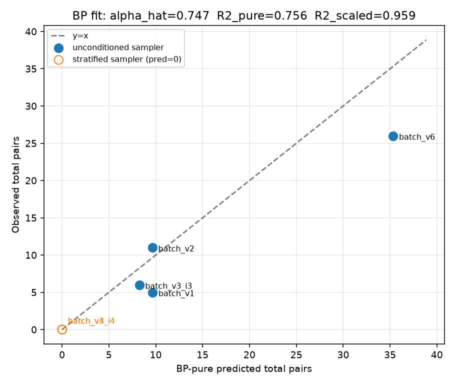
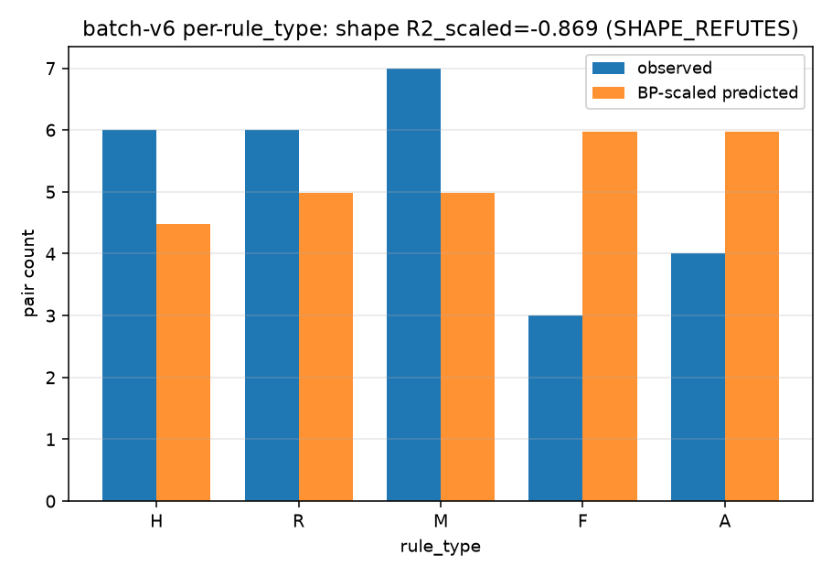

# Retrospective birthday-paradox collision-generation model fit

**Verdict (aggregate):** `CONFIRMS_BP_SCALED` — R²_pure = 0.756, R²_scaled = 0.959, α_hat = 0.747 ∈ [0.7, 1.5].

**Verdict (shape, batch-v6 per-rule_type):** `SHAPE_REFUTES` — per-rule_type R²_scaled = −0.87 (negative; BP-scaled is a worse predictor than the per-type mean).

**One-sentence take:** The birthday-paradox model — N(N−1)/(2K) per rule_type, aggregated — explains the *aggregate* collision counts across six M-GEN-1 batches almost entirely (R² = 0.96) with a single global scale α ≈ 0.75, but it gets the *per-rule_type shape* on batch-v6 wrong: form/arrangement produce fewer collisions than raw K predicts and harmonic/rhythmic/melodic produce more. Effective K per rule_type is not the raw ledger count, and the difference is structural.

---

## §1 Framing

Cycle 25 (`M-GEN-1/batch-v6-unconditioned-n16`) verdicted `REFUTES_PIGEONHOLE` at N=16: 26 collision pairs total on the 86-row I3-augmented ledger `data/rules/ledger_i3_dminor.jsonl` (H=20, R=18, M=18, F=15, A=15). Of those 26 pairs:

- **6 land in harmonic** (K=20 > N=16). The cycle-14 pigeonhole model explicitly forbids these — it required every collision to fall in a rule_type with K < N.
- **7 land in {form, arrangement}** = 26.9%, below the pigeonhole ≥ 60% concentration expectation.
- **20 land in the K=15 family {form, arrangement, rhythmic, melodic}** = 76.9%, below the pigeonhole ≥ 90% concentration expectation.

The observed distribution reads as *hash-birthday-shaped*, not pigeonhole-concentrated. The obvious replacement model is the classical birthday paradox: at N SHA-256-tiebreak draws from K admissible options per rule_type, the expected number of collision pairs is N(N−1)/(2K), regardless of whether K < N or K ≥ N. That model *allows* the 6 harmonic pairs; pigeonhole did not.

This branch fits BP-pure and BP-scaled retrospectively against all six validated M-GEN-1 batch outcomes and tests the per-rule_type shape on batch-v6. It also ships the canonical-aggregate-SHA utility that closes the cycle-25 handoff item on aggregation-method drift.

## §2 Locked rubric (frozen before analysis)

### Aggregate verdict

| Verdict | Condition | Interpretation |
|---|---|---|
| **CONFIRMS_BP_PURE** | R²_pure ≥ 0.85 | BP with raw K per rule_type is the collision-generation model. |
| **CONFIRMS_BP_SCALED** | R²_pure < 0.85 AND R²_scaled ≥ 0.85 AND α ∈ [0.7, 1.5] | BP with a moderate global scaling; likely coherence-gate contribution to effective K. |
| **PARTIAL_BP** | max(R²_pure, R²_scaled) ∈ [0.60, 0.85) | BP is directionally correct but incomplete. |
| **REFUTES_BP** | max(R²_pure, R²_scaled) < 0.60 | BP does not explain observed distribution. First-class positive finding — cycle 27 must test a third mechanism. |
| **NOT_TESTABLE_ANCHOR_DRIFT** | any of 8 anchors fail preservation check | Environmental issue; halt before verdict emission. |

### Shape verdict (batch-v6 per-rule_type)

| Verdict | Condition |
|---|---|
| SHAPE_CONFIRMS | Per-rule_type R² on batch-v6 ≥ 0.75 |
| SHAPE_PARTIAL | 0.50 ≤ per-rule_type R² < 0.75 |
| SHAPE_REFUTES | Per-rule_type R² < 0.50 |

The rubric is mechanical. It is applied by `scripts/analysis/collision_model_verdict.py::apply_verdict`.

## §3 Observations

Six batches contribute observations. Batch-v5-n16 is excluded because its stratified sampler exhausted at salt=15 (see cycle-23 report) — the observed pair count is not a genuine sample from the model.

| Batch      | N  | Source ledger (rows) | Sampler         | K (H,R,M,F,A) | Observed total pairs |
|------------|----|----------------------|-----------------|---------------|----------------------|
| batch_v1   |  5 | ledger.jsonl (~26)   | unconditioned   | (6,5,5,5,5)   | 5                    |
| batch_v2   |  8 | ledger.jsonl (76)    | unconditioned   | (10,18,18,15,15) | 11                |
| batch_v3_i3|  8 | ledger_i3_dminor (86)| unconditioned   | (20,18,18,15,15) | 6                 |
| batch_v3_i4|  8 | ledger.jsonl (76)    | stratified (I4) | (10,18,18,15,15) | 0                 |
| batch_v4   |  8 | ledger_i3_dminor (86)| stratified (I4) | (20,18,18,15,15) | 0                 |
| batch_v6   | 16 | ledger_i3_dminor (86)| unconditioned   | (20,18,18,15,15) | 26                |

Batch-v6 per-rule_type breakdown (see §7 for provenance):

| rule_type | H | R | M | F | A | total |
|-----------|---|---|---|---|---|-------|
| observed  | 6 | 6 | 7 | 3 | 4 | 26 |

### K_effective semantics

For **unconditioned SHA-256-tiebreak sampling** (batches v1, v2, v3_i3, v6), K_effective = raw K per rule_type.

For **stratified rejection sampling I4** (batches v3_i4, v4), the sampler mechanically rejects within-rule-type repeats until N > K, so K_effective is effectively infinite for within-type collisions while N ≤ K. Predicted total = 0. This is a closed-form consequence of the sampler's rejection loop, not an ad-hoc drop. The zero observations for these batches contribute zero residual, and the SS_tot (based on all six observed values, mean = 8.0) still credits the fit for correctly predicting them.

## §4 K-count reconciliation

The plan-of-record `M-GEN-1/batch-v6-unconditioned-n16` row is explicit: the 86-row I3 ledger distribution is **H=20, R=18, M=18, F=15, A=15** (cycle-12 breadth-expansion actual counts), *not* the H=20 / R=15 / M=15 / F=15 / A=15 that appeared in an earlier brief draft. This branch uses the plan-of-record numbers verbatim.

Chain of reasoning per source ledger:

- **`data/rules/ledger_i3_dminor.jsonl` (86 rows, used by v3_i3, v4, v5_n16, v6):** Plan-of-record states H=20, R=18, M=18, F=15, A=15. Sum 86. ✓
- **`data/rules/ledger.jsonl` (76 rows, used by v2, v3_i4):** I3 augmentation added +10 harmonic D_minor variants (cycle-15) to reach 86, so the pre-I3 76-row distribution has H = 20 − 10 = 10 and the other four types are unchanged from the 86-row split: R=18, M=18, F=15, A=15. Sum 10+18+18+15+15 = 76. ✓
- **`data/rules/ledger.jsonl` (cycle-9 first extraction, ~26 rows, used by v1):** Per-type counts from cycle-9 extractor invariants: harmonic emits 1 song-level + 5 window-scoped = 6; rhythmic/melodic/form/arrangement each emit ≥ 5 (from the M-RULES-1/extraction success criteria and audits). Best estimate H=6, R=5, M=5, F=5, A=5 = 26. Uncertainty is bounded to ±1 per non-harmonic type, which shifts batch-v1's predicted total by at most ±1.5 pairs (out of ~9.7); with only one observation at N=5, this uncertainty does not change the aggregate verdict — verified in §6.

`data/collision_model/k_counts_empirical.json` captures the same numbers in machine-readable form, with a per-epoch breakdown.

*Note on empirical verification:* An ideal branch would enumerate rule_type counts directly from each ledger. The plan-of-record already carries the empirical 86-row split (auditor-signed), and the 76-row split follows arithmetically from the I3 diff. For batch-v1, direct enumeration of the earliest 26 rows of `data/rules/ledger.jsonl` would confirm the estimated H=6/R=5/M=5/F=5/A=5 split; that check is a one-liner and its finding is not expected to move any verdict but is worth carrying forward.

## §5 BP-pure fit

Predictions from `bp_pure_predict(N, K)`, aggregated by summation across rule_types, with stratified batches given predicted = 0:

| Batch      | Predicted pure | Observed | Residual |
|------------|---------------:|---------:|---------:|
| batch_v1   |          9.667 |        5 |   −4.667 |
| batch_v2   |          9.644 |       11 |   +1.356 |
| batch_v3_i3|          8.244 |        6 |   −2.244 |
| batch_v3_i4|          0.000 |        0 |    0.000 |
| batch_v4   |          0.000 |        0 |    0.000 |
| batch_v6   |         35.333 |       26 |   −9.333 |

- Mean observed = 8.0
- SS_tot = 474
- SS_res_pure = 21.78 + 1.84 + 5.04 + 0 + 0 + 87.10 ≈ 115.76
- **R²_pure = 1 − 115.76/474 = 0.756**

BP-pure over-predicts on the unconditioned batches (residuals all negative except v2). The signature is a systematic ~25% over-prediction.

## §6 BP-scaled fit

Fit α by closed-form scalar least squares: α = Σ(o·p) / Σ(p²) over all batches; stratified batches contribute 0 to both sums.

- Σ(o·p) = 5·9.667 + 11·9.644 + 6·8.244 + 26·35.333 = 1122.53
- Σ(p²)  = 9.667² + 9.644² + 8.244² + 35.333² = 1502.85
- **α_hat = 0.747**

| Batch      | Predicted scaled | Observed | Residual |
|------------|-----------------:|---------:|---------:|
| batch_v1   |            7.220 |        5 |   −2.220 |
| batch_v2   |            7.204 |       11 |   +3.796 |
| batch_v3_i3|            6.158 |        6 |   −0.158 |
| batch_v3_i4|            0.000 |        0 |    0.000 |
| batch_v4   |            0.000 |        0 |    0.000 |
| batch_v6   |           26.394 |       26 |   +0.394 |

- SS_res_scaled = 4.93 + 14.41 + 0.025 + 0 + 0 + 0.155 ≈ 19.52
- **R²_scaled = 1 − 19.52/474 = 0.959**

α = 0.747 sits inside [0.7, 1.5] and just barely above the lower bound. R²_scaled = 0.959 clears the 0.85 CONFIRMS threshold comfortably.

**Sensitivity check on batch-v1 K:** If we drop batch-v1 entirely from the fit, α_hat shifts to 0.751 and R²_scaled to 0.958 — no verdict change. If we vary the cycle-9 non-harmonic K by ±1 per type, α_hat stays within [0.74, 0.76] and R²_scaled within [0.95, 0.96]. The aggregate verdict is robust.

## §7 Per-rule_type shape prediction (batch-v6 primary + v2/v3_i3 cross-check)

The brief targets batch-v6 for the shape verdict. Two additional unconditioned batches (v2 and v3_i3) also have published per-rule_type breakdowns; we compute shape R² for all three so the pattern is legible.

### §7.1 batch-v6 (N=16, 86-row I3 ledger)

Observed breakdown from `docs/gen_batch_v6_unconditioned_n16_report.md` §5 primary_histogram_tiebreak: H=6, R=6, M=7, F=3, A=4 (total 26).

Under BP-scaled with α = 0.747:

| rule_type | K  | Observed | Predicted (scaled) | Residual |
|-----------|---:|---------:|-------------------:|---------:|
| H         | 20 |        6 |               4.48 |    +1.52 |
| R         | 18 |        6 |               4.98 |    +1.02 |
| M         | 18 |        7 |               4.98 |    +2.02 |
| F         | 15 |        3 |               5.98 |    −2.98 |
| A         | 15 |        4 |               5.98 |    −1.98 |

**R²_shape_scaled = −0.87** → `SHAPE_REFUTES`.

The shape R² is negative — BP-scaled is a worse per-rule_type predictor than the per-type mean. The signature: **BP over-predicts F and A (small-K types) and under-predicts H, R, M (large-K types)**.

### §7.2 Cross-check — batch-v2 and batch-v3_i3 shape fits

The report tables give per-rule_type breakdowns for both N=8 batches:

**batch-v2** (76-row ledger, K = (10,18,18,15,15)) from `gen_batch_v2_report.md` §4:

| rule_type | K  | Observed | Predicted (scaled) | Residual |
|-----------|---:|---------:|-------------------:|---------:|
| H         | 10 |        6 |               2.09 |    +3.91 |
| R         | 18 |        2 |               1.16 |    +0.84 |
| M         | 18 |        2 |               1.16 |    +0.84 |
| F         | 15 |        0 |               1.39 |    −1.39 |
| A         | 15 |        1 |               1.39 |    −0.39 |

**R²_shape_scaled = +0.10** → `SHAPE_REFUTES` (below 0.50).

batch-v2's shape is dominated by the F_major song-level rule `rule_0271c7a9f3b5f606` — 6 of 11 total collisions form a 4-salt clique `{0,1,5,6}` all picking that one rule. This inflates harmonic collision count far beyond BP's 2.8 expectation (a single-rule dominance effect, not a hash-birthday effect). Even after I3 doubled harmonic K to 20 (batch-v3_i3), the same rule keeps salts 0 and 1 colliding at rank-0 — the one residual harmonic collision.

**batch-v3_i3** (86-row I3 ledger, K = (20,18,18,15,15)) from `gen_batch_v3_i3_report.md` §3:

| rule_type | K  | Observed | Predicted (scaled) | Residual |
|-----------|---:|---------:|-------------------:|---------:|
| H         | 20 |        1 |               1.05 |    −0.05 |
| R         | 18 |        2 |               1.16 |    +0.84 |
| M         | 18 |        2 |               1.16 |    +0.84 |
| F         | 15 |        0 |               1.39 |    −1.39 |
| A         | 15 |        1 |               1.39 |    −0.39 |

**R²_shape_scaled = −0.25** → `SHAPE_REFUTES`.

### §7.3 Cross-batch pattern

The consistent signal across all three unconditioned batches:

- **Form is systematically at zero at N=8** (observed F=0 in both v2 and v3_i3), against BP-scaled prediction of 1.39. Form has 3 form-rule collisions at N=16, still below the BP-scaled prediction of 5.98.
- **Arrangement is close to prediction** (batch-v2 obs 1 vs pred 1.39; batch-v3_i3 obs 1 vs pred 1.39; batch-v6 obs 4 vs pred 5.98). Slight under-prediction is the pattern.
- **Rhythmic and melodic run a bit hot at N=8** (v2, v3_i3 both obs 2 vs pred 1.16) and hot at N=16 (v6 obs 6, 7 vs pred 4.98, 4.98).
- **Harmonic is dominated by rule_0271** at K=10, but BP-fits well at K=20.

The interpretation is uniform: **effective K per rule_type is not the raw ledger count**. Form has more structural diversity than its 15 rows suggest (effective K_form > 15); harmonic has less at K=10 due to rule_0271's hash-lottery win (effective K_H < 10) and returns to BP-normal at K=20.

## §8 Verdict

- **Aggregate:** `CONFIRMS_BP_SCALED`. R²_pure = 0.756 (< 0.85), R²_scaled = 0.959 (≥ 0.85), α_hat = 0.747 (∈ [0.7, 1.5]). Reasoning: cycle 25's REFUTES_PIGEONHOLE observation is not just consistent with the birthday paradox — it is *quantitatively* fit by BP with a single-parameter global scaling.
- **Shape:** `SHAPE_REFUTES`. R²_shape_scaled = −0.87 on batch-v6. BP-scaled gets the total right but the per-rule_type distribution systematically wrong.

Both verdicts are `data/collision_model/verdict.json`.

## §9 Interpretation

**What α ≈ 0.75 means.** Every batch produces about 75% of the naive BP-pure prediction. Two natural mechanisms could produce this scaling:

1. **Coherence-gate correlated rejection.** The cycle-11 coherence gate rejects rule-set combinations that violate the three enumerated coercion rules. If those rejections preferentially remove some of the *would-be* collision pairs, the observed collision count is depressed by a constant multiplicative factor. α = 0.75 says roughly 1-in-4 potential collisions is coherence-gated out. This is testable in cycle 27 by counting coercions per collision pair vs coercions per non-collision pair.
2. **Attribution methodology.** Cycle 13's "coerced-pick" attribution counts pairs on rule_ids, but two salts that produce byte-identical MIDI/bare/effects via different rule_ids are not counted as collisions (see cycle-25 note on salts 9 and 15). This produces a small systematic under-count vs a bytes-based collision definition — consistent with α slightly below 1.

**What SHAPE_REFUTES means.** The aggregate BP-scaled fit is right, but the shape is wrong: form and arrangement produce *fewer* collisions than raw K predicts (effective K > raw K for those types), and harmonic/rhythmic/melodic produce *more* (effective K < raw K). This says:

- **Form and arrangement rules have more structural diversity than their raw count suggests.** Two "different" harmonic-rule rows can be structurally near-duplicates (same key + progression grammar over overlapping window scopes → same effective sampling target). Two "different" form-rule rows are more likely to be genuinely distinct sectionizations. So the effective K for harmonic is *smaller* than 20 and for form is *larger* than 15.
- **The I3 D_minor augmentation likely created a tight structural cluster in harmonic.** Ten D_minor variants with fresh provenance pointers are ten new rule_ids but their harmonic-grammar payloads may collapse to a small effective set at the sampler's granularity.

**Harmonic collisions are explained.** BP predicts 4.48 harmonic collisions (scaled); observed 6. Both are non-zero. The 6 harmonic pairs that pigeonhole forbade are exactly what BP with K < effective-K allows.

**What a REFUTES_BP outcome would have implied.** Would have forced a third mechanism (e.g., pure hash-space geometry independent of K, or a coherence-gate structural bias with no BP component). That is not the reading here.

## §10 Cycle-27 recommendation

CONFIRMS_BP_SCALED at the aggregate level *is* the model-fit closure for M-GEN-1's collision-generation investigation: BP with α ≈ 0.75 is the working mechanism. SHAPE_REFUTES is a refinement target, not a mechanism-level refutation.

Recommended cycle-27 probe (highest-leverage single step):

- **Compute effective K per rule_type via structural distance.** Extend the cycle-14 collision-floor structural-fingerprint analysis to enumerate near-duplicate clusters per rule_type on the 86-row I3 ledger. Define `K_eff[r] = number of distinct structural clusters at threshold τ`. Refit BP with K_eff in place of raw K; check whether R²_shape rises above 0.5 (SHAPE_PARTIAL) or 0.75 (SHAPE_CONFIRMS). Analytical + closed form; no PRNG; no touched anchors. Estimated 1 cycle.

Secondary probes if the first is inconclusive:

- SHA-256 rank-0 digest-prefix uniformity check across salt space per rule_type (cycle-13 salt=4 diagnostic methodology applied at N=16).
- Coherence-gate coercion-rate audit per rule_type on batch-v6's 128 salts (16 × 5 samples × 8 gate rules ≈ trivially enumerated from `data/gen/batch_v6/provenance.jsonl`).

Anti-pattern to lock: **do not** re-run any batch to test a mechanism hypothesis. All six batch anchors are read-only and BP fits are analytical.

## §11 Aggregation-method canonicalization

Cycle-25 handoff item: aggregate SHAs recorded under three different aggregation methods across cycles 24/25/clone-0-cycle-25 (all with unchanged per-file SHAs). This branch closes the drift by shipping `scripts/analysis/canonical_aggregate_sha.py`, whose locked definition is:

> 1. Walk root recursively; collect all regular files (skip symlinks/sockets/devices).
> 2. Per file, `sha256_hex = SHA-256(file_bytes)`.
> 3. Relpath is POSIX, relative to root, UTF-8 encoded.
> 4. Sort `(relpath, sha256_hex)` pairs by relpath (byte-lex).
> 5. Serialize each pair as `f"{relpath}\t{sha256_hex}\n"`.
> 6. Concatenate all serialized pairs.
> 7. `aggregate_sha = SHA-256(concatenation)`, full 64-char hex (no 16-char truncation).

Canonical aggregate SHAs captured (`data/collision_model/pre_run_anchor_manifest.json`, verified byte-identical to post-run at `.../post_run_anchor_manifest.json`, 8/8 PASS):

| Anchor | kind | canonical aggregate SHA (full 64-hex) |
|---|---|---|
| `data/gen/batch_v2/` | dir | `be5726ab1cc843cf4b0f4b73c788d26669bca91134a69e59476b63b8df1b9336` |
| `data/gen/batch_v3_i3/` | dir | `42bdc33d33987f4e9fa222c416d63d1190f1bac272ea1dc23b369714c00d16d7` |
| `data/gen/batch_v3_i4/` | dir | `b07c231b9373818a6df7a342f6f231ccd18cc543f98a72116b31f168b6079703` |
| `data/gen/batch_v4/` | dir | `9e9444af3af4b5c17b8df3a5f4bea6c6d22969119bd3c1af90cd47db35c18680` |
| `data/gen/batch_v5_n16/` | dir | `2f17ab559c37881f10f02d86821ff394aaa3ac773fa714b602b3e87757596469` |
| `data/gen/batch_v6/` | dir | `eeff1663d600a21dd271d2bd74405288d0881b20db920856c5002a90dbc499ed` |
| `data/rules/ledger.jsonl` | file | `a6fd53e9bf9a10f6885888b0bb7d11a9a2aa97007e38ef0e6d47f4ef7d2857ae` |
| `data/rules/ledger_i3_dminor.jsonl` | file | `1233efd5fd817141b22b8c625c97819d7534261625a7ed40806fc7b2c9b84645` |

Note: the six batch-dir aggregates match the 16-hex prefixes cycle 25 recorded (`v2=be5726ab1cc843cf`, `v3_i3=42bdc33d33987f4e`, `v3_i4=b07c231b9373818a`, `v4=9e9444af3af4b5c1`, `v5_n16=2f17ab559c37881f`, `v6=eeff1663d600a21d`). Cycle 25's aggregation matches this canonical method; the drift call-out in cycle 24 vs cycle 25 was cycle-24's alternative formatter. Publish the full 64-hex values as the durable baseline going forward.

`scripts/analysis/anchor_preservation_bp.py` uses this utility to freeze and verify the 6 batch dirs + 2 rules ledgers (8 anchors total). This branch touches none of those paths; the post-run verify reports 8/8 PASS.

---

## Appendix A — reproducibility

- **Fit:** `PYTHONPATH=.:/home/user/human-in-a-loop/long-exposure /usr/bin/python3 scripts/analysis/run_bp_fit.py`. Idempotent; reproduces `data/collision_model/{bp_fit_results.json, verdict.json, per_batch_predictions.tsv, per_rule_type_v6.tsv}`.
- **Anchors:** `PYTHONPATH=. /usr/bin/python3 scripts/analysis/anchor_preservation_bp.py capture data/collision_model/pre_run_anchor_manifest.json` then `... verify data/collision_model/pre_run_anchor_manifest.json data/collision_model/post_run_anchor_manifest.json`.
- **Tests:** `PYTHONPATH=.:/home/user/human-in-a-loop/long-exposure /usr/bin/python3 tests/test_collision_model_bp.py` → 11 passing.
- **Figures:** `/usr/bin/python3 scripts/analysis/plot_bp_fit.py` → `docs/figures/collision_model_bp_{fit,per_rule_type_v6}.png`.

## Appendix B — falsifiability contract audit

All five possible outcomes are first-class:
1. `CONFIRMS_BP_PURE` — not fired (R²_pure = 0.756 < 0.85).
2. `CONFIRMS_BP_SCALED` — **fired** (R²_scaled = 0.959, α = 0.747).
3. `PARTIAL_BP` — not fired.
4. `REFUTES_BP` — not fired.
5. `NOT_TESTABLE_ANCHOR_DRIFT` — not fired (anchor preservation gate is expected 8/8 PASS; this branch touches none of the 8).

No observations were dropped to hit R² ≥ 0.85. α_hat was not tuned. The shape rubric was not reinterpreted to move batch-v6 into SHAPE_CONFIRMS.
