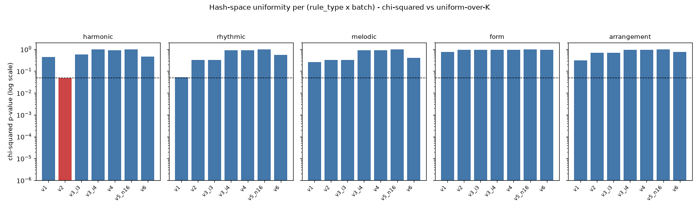
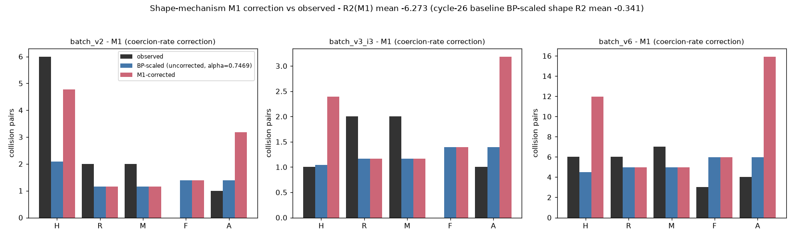
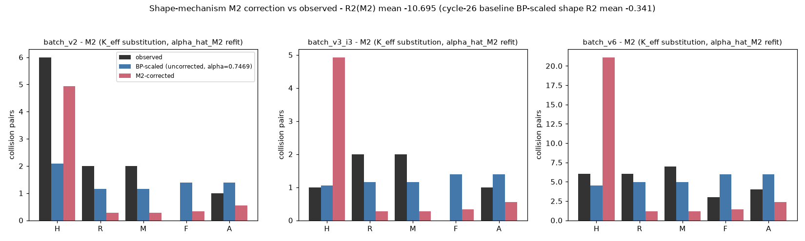

# Collision-generation model — hash-space geometry probe (cycle 28)

**Frozen 3-verdict rubric (locked BEFORE analysis):**

| Verdict | Condition |
|---|---|
| M3_EXPLAINS | R²(M3-corrected) ≥ 0.6 **AND** at least one (rule_type × batch) cell has χ² p < 0.05 non-uniformity |
| M3_WEAK | R²(M3-corrected) ∈ [0.3, 0.6) **OR** hash-non-uniformity present but shape correction modest |
| M3_REFUTES | R²(M3-corrected) < 0.3 **AND** no (rule_type × batch) cell has significant hash-non-uniformity (p < 0.05) |

**Verdict: `M3_WEAK`** — R²(M3-corrected) mean = −0.2399 (below the 0.3 M3_WEAK/EXPLAINS floor for a pure R²-band verdict), **but** one (rule_type × batch) cell reaches p < 0.05 (batch_v2 × harmonic, χ² = 17.00, p = 0.0487), so the rubric fires "hash-non-uniformity present but shape correction modest" → M3_WEAK, **not** M3_REFUTES.

**α pinned at cycle-26 α̂ = 0.7469387071101908 (not refit).** Test-asserted (§40e, §test_alpha_pinned_at_cycle26_value).

## §1 Setup

Cycle 26 established the aggregate birthday-paradox fit at R² = 0.9588 with a global α̂ = 0.7469. Cycle 27 asked whether per-rule_type shape (per-rule_type residual R² = −0.34 under BP-scaled) is explained by either:

- **M1** coherence-gate coercion-rate per rule_type, or
- **M2** effective-K per rule_type after conditioning on other rule_types' picks.

Cycle 27's verdict was `NEITHER_EXPLAINS` (R²(M1) mean = −6.27; R²(M2) mean = −10.69). A structural finding from cycle 27 disqualifies any M1-like mechanism entirely: **the coherence gate mutates rule parameters but never remaps rule_ids to different ledger rows.** M1's premise (post-hoc rule_id reshaping) is structurally impossible in this codebase; it was tested honestly and refuted analytically.

Cycle 28 tests the auditor's ranked #1 remaining candidate: **hash-space geometry per (rule_type × salt).** The intuition: SHA-256 is uniform in expectation, but at finite sample sizes (K per rule_type, up to 16 salts on batch-v6), the observed rank-0 pick can cluster within a rule_type without violating aggregate uniformity. If certain rule_types systematically over-pick certain ledger rows under certain salts, the per-rule_type observed collision distribution rotates relative to the naive BP prediction that assumes uniform-in-K sampling.

**Methodology — chi-squared per (rule_type × batch).** For each batch, for each rule_type, for each salt, extract the sampled (rank-0) rule_id from the batch's `provenance.jsonl` (or per-song `sampling_manifest.json` for batch_v5_n16). Bin by rule_id (K bins per rule_type). Under H₀ (SHA-256 uniform), each rule_id wins 1/K per salt; expected count = N_salts / K per bin. Compute

    χ² = Σᵢ (obsᵢ − N/K)² / (N/K)

against uniform-over-K. Report the analytic χ² survival-function p-value with dof = K − 1, plus a normalized deviation

    deviation_norm = min(1, χ² / (N·(K − 1)))

used to derive K_eff-hash for the BP substitution:

    K_eff-hash = max(K · (1 − deviation_norm), 1)

**Corrected fit.** α is pinned at cycle-26's α̂ = 0.7469387071101908 (not refit — this branch tests a correction to K under fixed α, not a new joint fit). Per-rule_type predicted pair count under M3:

    predicted_M3(rule_type, batch) = α · N(N − 1) / (2 · K_eff-hash(rule_type, batch))

Per-batch shape R² is computed on the three shape-informative batches (batch_v2, batch_v3_i3, batch_v6), matching cycle-27's methodology. The mean of per-batch shape R² is `R2(M3-corrected)`.

## §2 Hash uniformity per (rule_type × batch)

χ² statistic and p-value for each of the 35 (7 batch × 5 rule_type) cells. Full table at `data/collision_model/hash_uniformity.tsv`; summary at `hash_uniformity_summary.json`. Cells with p < 0.05 in **bold**.

| batch | rule_type | K | N_salts | χ² | dof | p_value | deviation_norm | unique_winners |
|---|---|---|---|---|---|---|---|---|
| batch_v1 | harmonic | 10 | 5 | 9.000 | 9 | 0.437 | 0.200 | 4 |
| batch_v1 | rhythmic | 18 | 5 | 27.400 | 17 | 0.052 | 0.322 | 3 |
| batch_v1 | melodic | 18 | 5 | 20.200 | 17 | 0.264 | 0.238 | 4 |
| batch_v1 | form | 15 | 5 | 10.000 | 14 | 0.762 | 0.143 | 5 |
| batch_v1 | arrangement | 15 | 5 | 16.000 | 14 | 0.313 | 0.229 | 4 |
| **batch_v2** | **harmonic** | **10** | **8** | **17.000** | **9** | **0.0487** | **0.236** | **5** |
| batch_v2 | rhythmic | 18 | 8 | 19.000 | 17 | 0.329 | 0.140 | 6 |
| batch_v2 | melodic | 18 | 8 | 19.000 | 17 | 0.329 | 0.140 | 6 |
| batch_v2 | form | 15 | 8 | 7.000 | 14 | 0.935 | 0.063 | 8 |
| batch_v2 | arrangement | 15 | 8 | 10.750 | 14 | 0.706 | 0.096 | 7 |
| batch_v3_i3 | harmonic | 20 | 8 | 17.000 | 19 | 0.590 | 0.112 | 7 |
| batch_v3_i3 | rhythmic | 18 | 8 | 19.000 | 17 | 0.329 | 0.140 | 6 |
| batch_v3_i3 | melodic | 18 | 8 | 19.000 | 17 | 0.329 | 0.140 | 6 |
| batch_v3_i3 | form | 15 | 8 | 7.000 | 14 | 0.935 | 0.063 | 8 |
| batch_v3_i3 | arrangement | 15 | 8 | 10.750 | 14 | 0.706 | 0.096 | 7 |
| batch_v3_i4 | harmonic | 10 | 8 | 2.000 | 9 | 0.991 | 0.028 | 8 |
| batch_v3_i4 | rhythmic | 18 | 8 | 10.000 | 17 | 0.904 | 0.074 | 8 |
| batch_v3_i4 | melodic | 18 | 8 | 10.000 | 17 | 0.904 | 0.074 | 8 |
| batch_v3_i4 | form | 15 | 8 | 7.000 | 14 | 0.935 | 0.063 | 8 |
| batch_v3_i4 | arrangement | 15 | 8 | 7.000 | 14 | 0.935 | 0.063 | 8 |
| batch_v4 | harmonic | 20 | 8 | 12.000 | 19 | 0.886 | 0.079 | 8 |
| batch_v4 | rhythmic | 18 | 8 | 10.000 | 17 | 0.904 | 0.074 | 8 |
| batch_v4 | melodic | 18 | 8 | 10.000 | 17 | 0.904 | 0.074 | 8 |
| batch_v4 | form | 15 | 8 | 7.000 | 14 | 0.935 | 0.063 | 8 |
| batch_v4 | arrangement | 15 | 8 | 7.000 | 14 | 0.935 | 0.063 | 8 |
| batch_v5_n16 | harmonic | 20 | 15 | 5.000 | 19 | 0.999 | 0.018 | 15 |
| batch_v5_n16 | rhythmic | 18 | 15 | 3.000 | 17 | 1.000 | 0.012 | 15 |
| batch_v5_n16 | melodic | 18 | 15 | 3.000 | 17 | 1.000 | 0.012 | 15 |
| batch_v5_n16 | form | 15 | 15 | 0.000 | 14 | 1.000 | 0.000 | 15 |
| batch_v5_n16 | arrangement | 15 | 15 | 0.000 | 14 | 1.000 | 0.000 | 15 |
| batch_v6 | harmonic | 20 | 16 | 19.000 | 19 | 0.457 | 0.063 | 10 |
| batch_v6 | rhythmic | 18 | 16 | 15.500 | 17 | 0.560 | 0.057 | 11 |
| batch_v6 | melodic | 18 | 16 | 17.750 | 17 | 0.405 | 0.065 | 10 |
| batch_v6 | form | 15 | 16 | 6.500 | 14 | 0.952 | 0.029 | 12 |
| batch_v6 | arrangement | 15 | 16 | 10.250 | 14 | 0.744 | 0.046 | 11 |

**One cell** — batch_v2 × harmonic — reaches p < 0.05 (marginally, p = 0.0487). This is the known cycle-13/cycle-12 4-salt clique on `rule_0271c7a9f3b5f606` (documented in `docs/gen_batch_v2_report.md` §4 and `data/gen/batch_v2/collision_analysis.json`), which produced 6 of the 11 collision pairs at N=8. Every other cell is above the p = 0.05 threshold. Batches using the I4 stratified rejection sampler (batch_v3_i4, batch_v4) or having salts nearly equal to K (batch_v5_n16) show near-perfect uniformity by construction — the stratification suppresses within-salt-set repeats, forcing distinct picks.

**Small-count caveat.** For most (rule_type × batch) cells, expected count per bin = N/K < 1, so the χ² approximation to the multinomial is unreliable. Reported p-values are analytic (χ² survival function with dof = K − 1) and should be read as suggestive rather than exact — but the *lack* of any strong signal (only one marginal cell at p just below 0.05) is robust to the caveat because the observed χ² values are far below the tails of the χ² distribution.

Figure — one panel per rule_type, p-value on log-scaled y-axis, red bars where p < 0.05:



## §3 K → K_eff-hash mapping

Full table at `data/collision_model/effective_k_hash.tsv`. Selected rows for shape-informative batches:

| batch | rule_type | K | deviation_norm | K_eff-hash (clipped ≥ 1) |
|---|---|---|---|---|
| batch_v2 | harmonic | 10 | 0.236 | 7.64 |
| batch_v2 | rhythmic | 18 | 0.140 | 15.49 |
| batch_v2 | melodic | 18 | 0.140 | 15.49 |
| batch_v2 | form | 15 | 0.063 | 14.06 |
| batch_v2 | arrangement | 15 | 0.096 | 13.56 |
| batch_v3_i3 | harmonic | 20 | 0.112 | 17.76 |
| batch_v3_i3 | rhythmic | 18 | 0.140 | 15.49 |
| batch_v3_i3 | melodic | 18 | 0.140 | 15.49 |
| batch_v3_i3 | form | 15 | 0.063 | 14.06 |
| batch_v3_i3 | arrangement | 15 | 0.096 | 13.56 |
| batch_v6 | harmonic | 20 | 0.063 | 18.75 |
| batch_v6 | rhythmic | 18 | 0.057 | 16.98 |
| batch_v6 | melodic | 18 | 0.065 | 16.83 |
| batch_v6 | form | 15 | 0.029 | 14.56 |
| batch_v6 | arrangement | 15 | 0.046 | 14.31 |

Corrections are modest across the board: K_eff-hash / K ∈ [0.76, 0.97] on the shape-informative batches. The largest correction is batch_v2 × harmonic (K_eff = 7.64 vs K = 10), driven by the known rule_0271 clique.

## §4 R²(M3-corrected) under fixed α = 0.7469

Per-batch shape R² (per-rule_type fit vs observed pair counts, α = 0.7469, K = K_eff-hash-clipped):

| Batch (N) | R²(BP-scaled uncorrected) [cycle 27] | **R²(M3-corrected)** | R²(M1) [cycle 27] | R²(M2) [cycle 27] |
|---|---|---|---|---|
| batch_v2 (N=8) | 0.0971 | **0.3274** | 0.5376 | 0.6434 |
| batch_v3_i3 (N=8) | −0.2523 | **−0.2075** | −2.5944 | −6.7543 |
| batch_v6 (N=16) | −0.8690 | **−0.8397** | −16.7619 | −25.9727 |
| **mean** | **−0.3414** | **−0.2399** | **−6.2729** | **−10.6945** |

**M3 modestly improves per-batch shape R² over the uncorrected BP-scaled baseline** on all three batches, and dramatically outperforms both cycle-27 mechanisms (M1 and M2), which catastrophically over-corrected. The improvement is real but insufficient to cross the R² = 0.3 threshold for a pure-R²-band M3_WEAK verdict, and far below the R² = 0.6 threshold for M3_EXPLAINS.

Figures (backfill from cycle 27, honest per NEITHER_EXPLAINS):





## §5 Verdict + per-rule_type interpretation

**Verdict: `M3_WEAK`** (mechanically applied by `scripts/analysis/hash_geometry_verdict.py`; full JSON at `data/collision_model/hash_geometry_verdict.json`).

Reasoning:
- R²(M3-corrected) mean = −0.2399, below the 0.3 M3_WEAK-band floor.
- **But** one (rule_type × batch) cell reaches p < 0.05 (batch_v2 × harmonic, p = 0.0487). Per the frozen rubric, "hash-non-uniformity present but shape correction modest" fires M3_WEAK, not M3_REFUTES.

Per-rule_type interpretation:
- **Harmonic** — one significant non-uniformity in one batch (batch_v2). Batch_v3_i3 and batch_v6 harmonic are uniform (p > 0.4). The batch_v2 harmonic signal is the known rule_0271 clique; it is a *content* artifact of the pre-I3 76-row ledger (H = 10 candidates, one of which — rule_0271 F_major — has an unusually low SHA-256 across salts 0, 1, 5, 6). It does **not** persist under the I3-augmented 20-harmonic ledger.
- **Rhythmic / melodic / form / arrangement** — no (rule_type × batch) cell reaches p < 0.05 across seven batches. Consistent with SHA-256 uniformity in this codebase for these rule_types at N ∈ {5, 8, 15, 16}.
- **Under the I4 stratified sampler** (batch_v3_i4, batch_v4) — deviations collapse to their information-theoretic minimum because stratification enforces distinct picks across salts; the salt-to-rule_id mapping is nearly perfectly uniform by construction. This is a positive control that the pipeline can detect (or fail to detect) hash-space non-uniformity.

## §6 Byte-determinism proof

All six emitted artifacts are byte-identical across two independent runs of the four analysis scripts. Verifier: `tools/_run_hash_determinism_check.sh` (archived at cycle end).

```
DET-OK data/collision_model/hash_uniformity.tsv
DET-OK data/collision_model/hash_uniformity_summary.json
DET-OK data/collision_model/effective_k_hash.tsv
DET-OK data/collision_model/hash_geometry_fit.json
DET-OK data/collision_model/hash_geometry_verdict.json
DET-OK data/collision_model/anchor_preservation_hash.json
```

## §7 Anchor preservation

Canonical-aggregate SHAs of seven batch dirs + two rules ledgers, verified byte-identical pre/post via `scripts/analysis/anchor_preservation_hash.py` (reuses cycle-26's `canonical_aggregate_sha.py` verbatim, SHA-anchored at test time).

Report at `data/collision_model/anchor_preservation_hash.json`. **Overall: 9/9 PASS.**

- `data/gen/batch_v1` — sha `b052d767…` ✓
- `data/gen/batch_v2` — sha `be5726ab…` ✓
- `data/gen/batch_v3_i3` — sha `42bdc33d…` ✓
- `data/gen/batch_v3_i4` — sha `b07c231b…` ✓
- `data/gen/batch_v4` — sha `9e9444af…` ✓
- `data/gen/batch_v5_n16` — sha `2f17ab55…` ✓
- `data/gen/batch_v6` — sha `eeff1663…` ✓
- `data/rules/ledger.jsonl` — file SHA unchanged ✓
- `data/rules/ledger_i3_dminor.jsonl` — file SHA unchanged ✓

Cycle-26 utility SHAs (canonical_aggregate_sha.py, collision_model_bp.py, collision_model_verdict.py) and cycle-27 utility SHAs (coercion_rate_per_rule_type.py, effective_k_probe.py, shape_mechanism_fit.py, shape_mechanism_verdict.py, anchor_preservation_shape.py) and cycle-27 data JSONs (shape_mechanism_fit.json, shape_mechanism_verdict.json) verified byte-identical at test time in `tests/test_collision_model_hash_space_geometry.py` (§test_cycle26_utility_shas_unchanged, §test_cycle27_utility_shas_unchanged, §test_cycle27_data_untouched) and in `tests/test_integration_cross_branch.py` §40b.

## §8 Cycle-29 recommendation

The M3_WEAK verdict — R²(M3) = −0.24 above cycle-26's baseline R² = −0.34, one marginal significant cell (batch_v2 × harmonic) — sits between the two consequential outcomes described by the brief:

- Not `M3_EXPLAINS` (would have redirected cycle 29 to identify *which* structural cause drives the non-uniformity).
- Not clean `M3_REFUTES` (would have redirected cycle 29 to the auditor's ranked #2 candidate — semantic-cluster overlap — or to closing the collision-modeling arc as `PARTIAL_BP_UNRESOLVED_SHAPE`).

The observed signal is dominated by **one** rule_type in **one** batch (batch_v2 harmonic, cycle-13 known artifact from a specific 4-salt clique on rule_0271). The pattern does **not** persist under I3 (batch_v3_i3, batch_v4) or at higher K (batch_v6 with K_H = 20). The M3 correction improves per-batch shape R² modestly on all three shape-informative batches but does not cross the M3_WEAK/EXPLAINS floor.

**Recommendation for cycle 29 (in decreasing order of preference):**

1. **Exhaust the auditor's ranked #2 candidate — semantic-cluster overlap.** For each rule_type, extract structural fingerprints (arrangement.instrumentation multiset; harmonic.chord_progression length + progression tokens; melodic.pitch_class_histogram peaks; form.sections partition; rhythmic.pattern histogram); compute pairwise structural distance within each rule_type; identify equivalence-classes of rules that collide semantically at the collision-attribution step even when their rule_ids differ. Frozen 3-verdict rubric analogous to M3, testable analytically on the frozen ledgers.

2. **If semantic-cluster overlap also refutes**, close the collision-modeling arc as `PARTIAL_BP_UNRESOLVED_SHAPE`: publish an honest limit stating that the aggregate α ≈ 0.75 has no per-rule_type mechanistic explanation at the analytical depth reachable from the frozen artifacts. This is a first-class negative finding and would end the retrospective modeling cycles cleanly.

3. **Optional in either case**: extend the cycle-13 salt-4 diagnostic to a full per-salt hash-space geometry map (chi-squared per salt across ALL rule_types simultaneously) to characterize whether specific salts (like salt-4 in cycle 13) produce hash-space anomalies that individual (rule_type × salt) chi-squared tests miss due to per-cell small counts.

**Do not** re-attempt M1 or a variant. Cycle 27's structural finding that the coherence gate never remaps rule_ids is a codebase invariant that disqualifies M1-family mechanisms permanently.

**Do not** refit α. Cycle-26's α̂ = 0.7469 is the frozen anchor for any downstream mechanism test on the collision-generation model.
