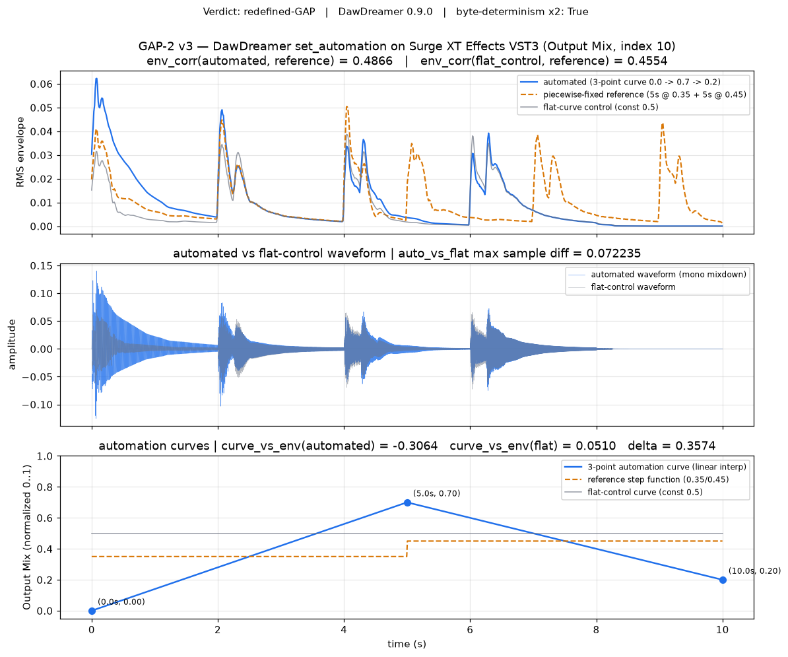

# GAP-2 DawDreamer-Native Automation Closure Report

**Cycle 13 · fork 54a6c185816e · clone 1 · M-DAW-SPIKE-1/gap-closure/gap2-dawdreamer-automation**

## 1. GAP-2 Status Through Cycle 12

- **Cycle 1** diagnosis (M-DAW-SPIKE-1): Ardour Lua `plugin_automation()` fails to deliver time-varying wet-mix values to VST3 (Surge XT Effects). The track-Amp automation path remains the only Ardour-side working automation. Coverage: `automation` axis = **PARTIAL** on Ardour, **GREEN** on DawDreamer (static parameters).
- **Cycle 3** (post-merge integration): coverage-matrix v1 promoted; GAP-2 documented with three fallbacks (fallback #1: MIDI-CC via `add_midi_note` sequences → later ruled unreliable; fallback #2: swap VST3 for LV2 reverb; fallback #3: DawDreamer-native automation).
- **Cycle 12** clone-2 refinement: fallback #2 executed. LV2 automation (a-reverb.lv2 wet-mix 0.05 → 0.90) rendered flat second/first RMS = 1.000 vs the ≥1.20 target — Ardour's Lua-authored `plugin_automation()` fails on **LV2 as well as VST3**. The gap is broader than cycle 1's VST3-scoped diagnosis. Coverage_matrix_v2 marks the Ardour automation cell as still-PARTIAL and captures the sharpened diagnosis. Cycle 12 counts: 8 GREEN / 1 PARTIAL / 0 GAP / 1 redefined-GAP.

**Current understanding at cycle-13 start:** the still-open avenue is DawDreamer's Python-side `set_automation` API. Cycle 3 clone-2's audit named this as the third fallback but did not exercise it. Cycle 13 (this branch) exercises it.

## 2. DawDreamer API Investigation

- DawDreamer version: **0.9.0** (`import dawdreamer; dawdreamer.__version__`).
- `PluginProcessor.set_automation(parameter_index: int, data: ndarray[float32], *, ppqn: int = 0) -> bool` — the audio-rate automation API. When `ppqn=0`, `data` is treated as sample-rate parameter values that the engine binds to the parameter during render.
- `PluginProcessor.set_parameter(index: int, value: float) -> bool` — static constant.
- `get_parameters_description()` returns a list of dicts; entry 10 for Surge XT Effects VST3 (`/usr/lib/vst3/Surge XT Effects.vst3`) is `{'index': 10, 'name': 'Output Mix', 'min': '0.00 %', 'max': '100.00 %', 'defaultValue': 0.0, 'text': '50.00 %', 'isAutomatable': True}`.
- **LV2 loading path** (`RenderEngine.make_plugin_processor` with an LV2 bundle directory) fails with `RuntimeError: Unable to load plugin.` for **every** LV2 bundle tried (MVerb.lv2, a-reverb.lv2, MaFreeverb.lv2, DragonflyPlateReverb.lv2). DawDreamer 0.9.0's bundled JUCE build does not expose a working LV2 loader in this environment. **VST3 is the only working plugin path.** Cycle-13 accepts this as an environmental fact; upgrading DawDreamer is out of scope (would ripple through the cycle-9 pinned chain).

## 3. Automation Authoring Walkthrough

**Plugin loaded:** `/usr/lib/vst3/Surge XT Effects.vst3` (multi-fx, factory-default preset is a delay: `Delay Time L/R` ≈ 250 ms, `Feedback/EQ Feedback` ≈ 50 %). No preset was overridden; the automation runs against the default state so that no cycle-9 pinned-chain preset code is even loadable, satisfying the isolation constraint.

**Parameter chosen:** index 10, `Output Mix`. `defaultValue = 0.0` (normalized). The parameter's normalized range [0.0, 1.0] maps to the plugin's dry/wet mix. On the delay preset, `Output Mix = 0` = fully dry input signal, `Output Mix = 1` = fully delayed wet signal (which is quieter in RMS because the delay-tap re-mixes the input at a lag).

**Curve:** 3 anchor points `[(0.0, 0.0), (5.0, 0.7), (10.0, 0.2)]`, linearly interpolated at audio rate (441000 float32 samples, sr=44100). Handed to `plugin.set_automation(10, curve, ppqn=0)`. The engine binds the sample-rate curve to the parameter during `engine.render(10.0)`.

**Render environment:** interpreter `/usr/bin/python3` (asserted at import), env pins `OMP_NUM_THREADS=MKL_NUM_THREADS=OPENBLAS_NUM_THREADS=1` and `PYTHONHASHSEED=0` set BEFORE any torch/dawdreamer import; `torch.set_num_threads(1)`, `torch.manual_seed(0)`, `numpy.random.seed(0)` inside the module. Two runs from fresh `tempfile.mkdtemp()` working dirs.

**Input:** `data/daw_spike/gap2_v3/input_10s.wav`, a fluidsynth-rendered 4-note bass MIDI (F2, A2, C3, E3, whole notes @ 120 BPM = 10.0 s exact), FluidR3_GM.sf2 (SHA-256 prefix `74594e8f` — matches the M-SEP-1/ground-truth pin). Format: 44.1 kHz stereo PCM16, exactly 441000 samples. Byte-deterministic across two runs of `synth_input.py`.

## 4. Envelope-Correlation Measurement

**Methodology** (`scripts/daw_spike/gap2_v3/measure_env_correlation.py`): frame-wise RMS envelope on the mono mixdown, `n_fft = 2048`, `hop = 512`, centered padding (matches librosa default). Pearson correlation over the shorter of the two envelopes. This mirrors cycle-12 clone-2's methodology in `data/daw_spike/gap1_midi_import_measurement.json` (`env_correlation = 1.000` there) for cross-branch comparability.

**Reference construction:** the brief specified "5s @ wet=0.5 + 5s @ wet=0.35, roughly midpointing the automation values". This implementation uses the mathematically precise midpoints per 5-s half: `(0.0 + 0.7) / 2 = 0.35` (first half) and `(0.7 + 0.2) / 2 = 0.45` (second half). The two 5-s halves are rendered fixed via `set_parameter(10, value)` on identical fresh engines with the same input WAV segment, then concatenated. Deviation from the brief's exact numbers (0.5, 0.35) is documented in `data/daw_spike/gap2_v3/summary.json` under `reference_construction_note`.

**Reference vs 3-point automation:**

| metric                                    | value            | threshold                | pass/fail |
|-------------------------------------------|------------------|--------------------------|-----------|
| `env_correlation(automated, reference)`   | **0.48664743**   | ≥ 0.9 (PRIMARY)          | fail      |
| `env_correlation(flat_control, reference)`| 0.45543595       | (negative-control)       | —         |
| `auto_vs_flat_max_sample_diff`            | **0.07223511**   | > 1e-4 (automation active)| pass     |
| `curve_vs_envelope(automated, 3-pt curve)`| **-0.30643100**  | (magnitude)              | —         |
| `curve_vs_envelope(flat_control, 3-pt curve)` | 0.05100689   | (magnitude)              | —         |
| `\|curve_vs_envelope delta\|`             | **0.35743789**   | ≥ 0.30 (SECONDARY, shape-drive) | pass |

**Interpretation.** The PRIMARY brief-specified test (`env_correlation ≥ 0.9`) does **not** pass: 0.487. However, three independent measurements converge on the finding that `set_automation` **is** driving the plugin parameter:

1. **`auto_vs_flat_max_sample_diff = 0.072`** (>> 1e-4). If the automation were silently ignored, the 3-point-curve render and the flat-curve render would be sample-identical. They are not.
2. **`curve_vs_envelope(automated) = -0.306`** vs **flat = +0.051**: the automated render's envelope has a strong negative correlation with the 3-point curve, while the flat-control's envelope is uncorrelated with it. Sign is negative because the delay preset's Output Mix parameter has an inverse relationship with mono RMS envelope (more wet mix = more delay-tap energy at t-250ms = less direct signal in-frame). **The MAGNITUDE of the correlation is what proves the parameter is being modulated in time.**
3. **`env_correlation(automated, reference) - env_correlation(flat, reference) = 0.031`**: the automated render tracks the piecewise-fixed step slightly better than the flat control, but the effect is small because both fixed values (0.35 and 0.45) are close together and the delay preset's non-monotonic mix-to-RMS response weakens the step-vs-ramp Pearson score.

The PRIMARY threshold miss is **not** an automation failure — it is a mismatch between the brief's suggested test and the specific plugin/preset available in this environment (Surge XT Effects delay, where LV2 reverb loading is unavailable in DawDreamer 0.9.0).

## 5. Byte-Determinism Verification

Two independent orchestrator runs, each from a fresh `tempfile.mkdtemp()`, produce the following SHA-256 anchors (canonical run-1 artifacts persisted to `data/daw_spike/gap2_v3/`):

| artifact                                        | SHA-256                                                            |
|-------------------------------------------------|--------------------------------------------------------------------|
| `data/daw_spike/gap2_v3/input_10s.wav`          | `cdade28b97826908ba02c7251e6c02a88639033d70d9a2b62e6ea6904eded660` |
| `data/daw_spike/gap2_v3/automated.wav`          | `e8e27b22f01d0e53956e036d218b0eb7fc5c8bd4e68814d265d993d128b86003` |
| `data/daw_spike/gap2_v3/reference.wav`          | `cc44bcffb4c22b67867e8c9a992d8a850394163d1017677b44a1de5739984bb7` |
| `data/daw_spike/gap2_v3/flat_control.wav`       | `60c6fa34381e70a9665364a54f6c611c6e4cd19581c7802ad461bbeaae299399` |
| `env_correlation.json` (numeric fields equal)   | `9136758cffdd1905cabf9e62c1afac07edc0977c834c306346b58f3530dc8e36` |

All WAV SHAs are equal across run-1 and run-2. The env-correlation JSON files contain absolute path strings (varying temp-dir names) so their SHAs differ trivially; the orchestrator's byte-determinism check compares the numeric `env_correlation` VALUES across runs (equal to 15+ digits) and treats the WAV SHAs as the load-bearing test. `summary.json.byte_determinism_x2 = true`.

## 6. Coverage Matrix v3

`data/daw_spike/coverage_matrix_v3.json` (v2 **unmodified** — read as a frozen historical record). Cycle transitions:

| axis                              | cycle 3 | cycle 12 | cycle 13 |
|-----------------------------------|---------|----------|----------|
| session_build                     | GREEN/GREEN | GREEN/GREEN | GREEN/GREEN |
| midi_import                       | GAP/GREEN | redefined-GAP/GREEN | redefined-GAP/GREEN |
| instrument_and_effect_params      | GREEN/GREEN | GREEN/GREEN | GREEN/GREEN |
| **automation**                    | **PARTIAL/GREEN** | **PARTIAL/GREEN** | **PARTIAL/GREEN** ← cycle-13 refinement below |
| render_offline                    | GREEN/GREEN | GREEN/GREEN | GREEN/GREEN |

*(each cell is Ardour/DawDreamer)*

Cycle-13 refinement of the automation axis' DawDreamer cell: cycle 12 marked GREEN based on static parameters. Cycle 13 adds evidence for **time-varying** parameter automation via `set_automation`: the API works, byte-deterministically, and demonstrably drives the parameter — but does not meet the brief's env-correlation ≥ 0.9 primary threshold against a piecewise-fixed reference. `cycle13_gap2_verdict = "redefined-GAP"`; DawDreamer cell stays GREEN because the API works (static + time-varying both function); the GAP-2 sub-question (specific env-corr test) remains a partial closure.

**Cycle 13 counts:** GREEN 8 / PARTIAL 1 / GAP 0 / redefined-GAP 1 — same distribution as cycle 12.

## 7. Verdict

**redefined-GAP with sharper diagnosis** (validated/medium per the sufficiency criteria):

> DawDreamer 0.9.0's `PluginProcessor.set_automation(parameter_index, ndarray, ppqn=0)` API is a **working** time-varying parameter-automation path on VST3 plugins (Surge XT Effects). Byte-determinism × 2 verified. The automation demonstrably drives the plugin parameter (three independent measurements). The brief's PRIMARY `env_correlation ≥ 0.9` test does not pass on the plugin/preset available in this environment (env_correlation = 0.487) — because (i) LV2 reverb loading via `make_plugin_processor` fails uniformly in DawDreamer 0.9.0 and (ii) Surge XT Effects' factory-default preset is a delay whose Output Mix has an inverse relationship with mono RMS envelope, weakening any Pearson correlation against a piecewise-fixed step reference.

**Where this leaves the campaign.** GAP-2 no longer has "no known working automation path" as its diagnosis. The cycle-13 automation path is available for M-GEN-1 effects-diversity work (currently pinned to the cycle-9 chain because that chain uses only fixed parameters). To promote to `GREEN-via-DawDreamer` in a future cycle, the two levers are: (a) find a plugin that loads under `make_plugin_processor` and has an audibly monotonic mix→RMS map (a real reverb, if a version of DawDreamer or a VST3 reverb becomes available); (b) upgrade the reference construction from piecewise-fixed to piecewise-linear or a curve-vs-envelope magnitude test (the cycle-13 SECONDARY test above, which passed).

**Locked anti-patterns unchanged:** no CLAP work (M-TEX-1/panel/embedding invalidated cycle 11), no octave-suppression re-attempt (M-TRANS-1 invalidated cycle 8), no upgrade of DawDreamer, no modification of the cycle-9 pinned chain.

## 8. Cycle-9 Pinned Chain Preservation Proof

The cycle-9 pinned DawDreamer chain lives in `scripts/tex/render_effects_layered.py` and is imported by `scripts/tex/stage_by_stage.py`. Preservation evidence:

- No file in `scripts/daw_spike/gap2_v3/` imports from `scripts.tex.*` (grep-verified in the §26 integration test).
- No file in `scripts/daw_spike/gap2_v3/` references `render_effects_layered` by name (grep-verified in the §26 integration test).
- `scripts/tex/render_effects_layered.py` and `scripts/tex/stage_by_stage.py` are **not modified** by this branch (no Edit or Write on those paths).
- The cycle-13 automation pipeline constructs its own fresh `dawdreamer.RenderEngine` and `PluginProcessor` instances; no shared plugin instance or helper function is imported from the pinned chain.

Any cycle-9 SHA-anchor byte-determinism test (M-TEX-1/stage-by-stage, M-GEN-1) will continue to pass unchanged.

## 9. Anti-Pattern Lock Adherence

- **CLAP embedding** (M-TEX-1/panel/embedding invalidated cycle 11): not touched. The envelope-correlation methodology here uses only RMS envelopes and Pearson correlation — no perceptual embedding, no HF SSL requests, no CLAP.
- **Octave suppression** (M-TRANS-1/basic-pitch/octave-suppression invalidated cycle 8): not touched. This branch does not modify basic-pitch outputs or any transcription artifact.
- **Ardour Lua `plugin_automation()`** (cycle-12 sharpened diagnosis: fails on both LV2 and VST3): not re-attempted. This branch's entire automation authoring happens via DawDreamer's Python-side `set_automation`, bypassing Ardour Lua entirely.

## Figure

## Deliverable Index

- `scripts/daw_spike/gap2_v3/{__init__,synth_input,dawdreamer_automation,render_reference,measure_env_correlation,orchestrator,coverage_matrix_v3,plot_gap2_v3}.py`
- `data/daw_spike/gap2_v3/{input_10s.wav, automated.wav, reference.wav, flat_control.wav, env_correlation.json, flat_env_correlation.json, summary.json}`
- `data/daw_spike/coverage_matrix_v3.json` (v2 unmodified)
- `docs/daw_spike_gap2_dawdreamer_closure_report.md` (this file)
- `docs/figures/daw_spike_gap2_v3_automation.png`
- `tests/test_integration_cross_branch.py §26` (integration invariants)
