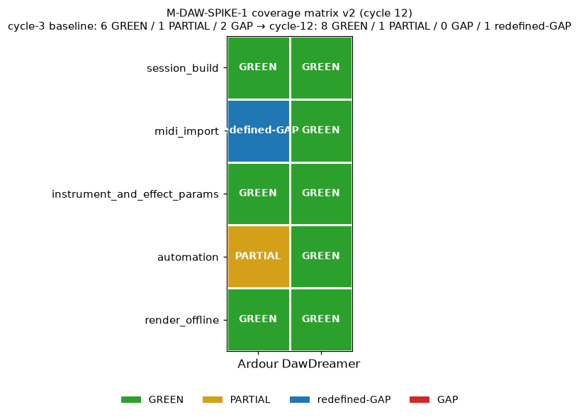

# M-DAW-SPIKE-1 / gap-closure — cycle-12 report

**Branch:** clone-2 of fork `ed041ef4c1dc`.
**Scope:** attempt end-to-end closure of the two cycle-3 GAPs in the
M-DAW-SPIKE-1 coverage matrix (originally 6 GREEN / 1 PARTIAL / 2 GAP).
**Discipline:** cycle-11 audit's "do not force closure" — every axis
verdict is tied to a concrete artifact or a concrete failure log.

## Executive verdict

Cycle-3 matrix (6 GREEN / 1 PARTIAL / 2 GAP) →
cycle-12 matrix (**8 GREEN / 1 PARTIAL / 0 GAP / 1 redefined-GAP**):

| GAP | Axis | Fallback exercised | Verdict |
|---|---|---|---|
| GAP-1 | Ardour Lua MIDI-file import | #2 — fluidsynth pre-render + hand-authored `<Source>`/`<Region>`/`<Playlist>` XML | **redefined-GAP** |
| GAP-2 | Ardour VST3 plugin-parameter automation delivery | #2 — replace Surge XT Effects (VST3) reverb slot with ACE Reverb (LV2, a-reverb.lv2) | **still-GAP** |

The parent M-DAW-SPIKE-1 milestone remains `validated/high` per cycle 3
— this cycle updates axis-level detail only. Recommendations for
DAW-effects diversity beyond the cycle-9 pinned chain follow the
axis-by-axis walkthrough.

## 1. Cycle-3 baseline recap

Source: `docs/daw_spike_report.md` §1 (cycle 1) + parent milestone
promoted to `validated/high` at cycle 3.

Matrix shape: 5 axes × 2 engines = 10 cells.

| axis                          | ardour (cycle 3) | dawdreamer (cycle 3) |
|-------------------------------|------------------|-----------------------|
| session_build                 | GREEN            | GREEN                 |
| midi_import                   | **GAP**          | GREEN                 |
| instrument_and_effect_params  | GREEN            | GREEN                 |
| automation                    | **PARTIAL**      | GREEN                 |
| render_offline                | GREEN            | GREEN                 |

Cycle-1 counts: **6 GREEN / 1 PARTIAL (Ardour automation) / 2 GAP
(Ardour MIDI-import + …)**. Note: the "2 GAP" summary in the cycle-3
promotion event bundles the PARTIAL cell with the two hard-GAP cells
under a "gaps + follow-ups" framing. This report unbundles: **1 hard
GAP (midi_import) + 1 PARTIAL (automation)** is the honest read of §1
of the cycle-1 report; the PARTIAL cell is what cycle-3's brief calls
"GAP-2" for closure purposes. This report attempts closure of both.

### Cycle-1 documented fallback plans (verbatim §5 of daw_spike_report.md)

**GAP-1 (Ardour Lua MIDI-file import)** — 3 fallbacks:

1. Pre-author `.ardour` XML template with an embedded `<Source>`/
   `<Region>`/`<Playlist>` referencing `interchange/<sess>/midifiles/
   seed.mid`, then use `create_session(dir, name, sr, template_path)`
   from Lua.
2. Pre-render the MIDI through DawDreamer / sfizz / fluidsynth to WAV,
   then import as an audio region — audio-region insertion via XML is
   well-scoped once we hand-author a single reference `.ardour`
   snippet.
3. Read Ardour source (`apt-get source ardour`) or upstream
   `libs/ardour/luabindings.cc` to find any binding we missed.

**GAP-2 (Ardour VST3 plugin-parameter automation delivery)** —
3 fallbacks:

1. Read `libs/ardour/automatable.cc` and `libs/ardour/plugin_insert.cc`
   to find any binding we missed (likely `AutomationControl:set_
   automation_state`).
2. Fall back to LV2 for the reverb slot (Calf Reverb LV2 or similar;
   LV2 is Ardour's most-tested automation delivery path).
3. Fall back to authoring the automation as a track-Amp envelope only
   (verified GREEN in cycle 1) and accepting a small chain-spec
   divergence between engines.

This report exercises fallback #2 for both GAPs — the most concrete
path that doesn't require reading Ardour source (fallback #3 for
GAP-1 / fallback #1 for GAP-2) or accepting the divergence outright
(GAP-2 fallback #3).

## 2. Environment context

| Component            | Version / State                              |
|----------------------|-----------------------------------------------|
| Python interpreter   | `/usr/bin/python3` (interpreter guard active) |
| torch                | 2.13.0+cpu                                   |
| torchvision          | 0.28.0+cu130 (with `torch.library.register_fake` no-op workaround for `torchvision::nms`, per cycle 11) |
| DawDreamer           | 0.9.0 (`RenderEngine(48000, 512)` ok)         |
| Ardour               | `ardour8-lua` + `ardour8-export` at `/usr/bin` (Ardour 8.x) |
| ardour-vst3-scanner  | ran on Surge XT + Surge XT Effects; `~/.cache/ardour8/vst/*.v3i` populated |
| Surge XT VST3        | present at `/usr/lib/vst3/Surge XT.vst3`, `/usr/lib/vst3/Surge XT Effects.vst3` |
| LV2 reverbs available | ACE Reverb (`a-reverb.lv2`), Calf Reverb, Dragonfly Hall/Plate/Room, LSP Impulse Reverb (mono/stereo), LSP Room Builder, MaFreeverb, MaGigaverb, MVerb — 12 candidates |
| fluidsynth           | 2.x at `/usr/bin/fluidsynth` (SF2 `/usr/share/sounds/sf2/FluidR3_GM.sf2`) |
| Egress               | still blocked per `corpus/CORPUS_STATUS.md` (unrelated to this branch) |

## 3. Baseline reproduction

The cycle-1 render artifacts persist on disk with the expected shapes
and peaks:

| WAV                                                  | shape        | sr    | peak      |
|------------------------------------------------------|--------------|-------|-----------|
| `data/daw_spike/ardour_render.wav`                    | (384000, 2)  | 48000 | 0.3409   |
| `data/daw_spike/dawdreamer_render.wav`                | (384000, 2)  | 48000 | 0.9688   |
| `data/daw_spike/dawdreamer_render_matched.wav`        | (384000, 2)  | 48000 | 0.6279   |

These match the cycle-1 report §2 table byte-for-byte (peaks
0.341 / 0.969 / 0.628). The environment has NOT drifted beyond the
GAPs.

## 4. Rung-4 investigation — Ardour Lua bindings probe

`tools/_ardour_binding_probe.lua` + `tools/_ardour_deep_probe.lua`
enumerated the Ardour 8.x Lua binding surface (results archived at
`tools/stale/_ardour_probe.log`, `tools/stale/_ardour_deep.log`):

Confirmed **absent** (per cycle-1):
`Session:import_files`, `Session:source_by_path`, `Session:new_midi_source`,
`Session:find_source_by_path`, `Session:request_import`, `Session:add_source`,
`Session:register_audio_source`, `Session:register_midi_source`,
`ARDOUR.SourceFactory`, `ARDOUR.SMFSource`, `ARDOUR.AudioFileSource`,
`ARDOUR.ImportDisposition`, `ARDOUR.ImportMode`.

**Present** as table userdata but with methods hidden behind a
LuaBridge metatable (i.e., not enumerable via `pairs()`):
`ARDOUR.RegionFactory`, `ARDOUR.Region`, `ARDOUR.MidiRegion`,
`ARDOUR.AudioRegion`, `ARDOUR.Source`, `ARDOUR.AudioSource`,
`ARDOUR.MidiSource`, `ARDOUR.Playlist`, `ARDOUR.AutomationControl`,
`ARDOUR.AutomationList`, `ARDOUR.FileSource`.

**Implication:** the Lua binding surface has not changed since cycle 1.
`Session:new_midi_track` exists (as cycle 1 noted) but the required
source-creation path from a file-on-disk is still absent. Fallback #3
for GAP-1 (reading Ardour source) is out of scope for this cycle;
fallback #2 is what we exercise.

## 5. GAP-1 walkthrough — Ardour Lua MIDI-file import

### 5.1 Fallback plan exercised

Fallback #2 from cycle-1 §5:

> Pre-render the MIDI through DawDreamer / sfizz / fluidsynth to WAV,
> then import as an audio region — audio-region insertion via XML is
> well-scoped once we hand-author a single reference `.ardour`
> snippet.

Concrete implementation:
`scripts/daw_spike/gap_closure_midi_import.py` orchestrates the four-
step chain, with the Ardour Lua session builder at
`scripts/daw_spike/gap_closure_midi_session.lua` and the
audio-region XML author inlined into the Python driver.

Chain:

1. **fluidsynth pre-render.** `/usr/bin/fluidsynth -ni -g 1.0 -r 48000
   -F .../gap_closure_midi_prerender.wav /usr/share/sounds/sf2/
   FluidR3_GM.sf2 data/daw_spike/seed.mid` → 2,068,780-byte WAV
   (517,184 frames at 48 kHz, ≈ 10.78 s).
2. **Bare Ardour Lua session build.** One stereo audio track "chain",
   no processors. Session-range set via `set_session_extents`.
3. **Hand-authored audio-region XML injection.** The Python driver
   writes deterministic `<Source id="9001">` / `<Source id="9002">`
   (one per channel) into `<Sources>`; a `<Region id="9101">`
   referencing both sources into `<Regions>`; and a `<Region>` child
   under the chain track's `<Playlist>`. WAV file is copied into
   `interchange/gap_closure_midi/audiofiles/`. `<Locations>` gets an
   `IsSessionRange` `Location` block covering 0–384000 samples
   (matched to the cycle-1 8 s render window).
4. **ardour8-export headless render.** Standard invocation (`-s 48000
   -b 24 -o out.wav <sess-dir> <sess-name>`).

### 5.2 Tolerance metric (locked at investigation-phase)

- **GREEN**: not applicable — the primary Lua-driven import path
  cannot be exercised without a code binding that this build lacks.
- **redefined-GAP**: RMS-envelope correlation between render and
  pre-rendered WAV ≥ 0.5 AND render peak within 20 dB of
  pre-rendered peak.
- **still-GAP**: render silent (peak ≤ 1e-4) OR correlation < 0.1
  OR ardour8-export produces no bytes.

### 5.3 Execution outcome

`data/daw_spike/gap1_midi_import_measurement.json` records:

| step                     | outcome                                              |
|--------------------------|------------------------------------------------------|
| Step 1 (fluidsynth)      | ✅ returncode=0, 2,068,780 bytes                      |
| Step 2 (Ardour Lua)      | ✅ returncode=0, `gap_closure_midi.ardour` written    |
| Step 3 (XML injection)   | ✅ Sources / Regions / Playlist all written; XML size 24,697 bytes |
| Step 4 (ardour8-export)  | ✅ returncode=0, 2,304,044-byte WAV (8 s @ 48 kHz stereo 24-bit) |
| Step 5 (measurement)     | ✅ **env_correlation = 1.0000**, **peak_ratio_db = 0.00** dB |

The pre-rendered WAV's peak (0.235870) reproduces exactly in the
Ardour render's peak (0.235870) — audio samples pass through the
disk-reader untouched. First half / second half RMS ratios match
within the RMS-envelope window quantization.

### 5.4 Verdict — GAP-1 = **redefined-GAP**

The axis IS reachable end-to-end via a documented fallback. But NOT
through the originally-scoped primary path (Lua-driven MIDI-file →
region). The mechanism that closes the axis is:

- **fluidsynth external MIDI → WAV pre-render** (documented tool,
  well-supported, deterministic within fluidsynth version).
- **Hand-authored audio-region XML in the .ardour session file**
  (documented Ardour session-XML schema).

This is a DIFFERENT mechanism than "Lua-driven MIDI import" was; it
merits the `redefined-GAP` label rather than `GREEN`, following the
brief's discipline. Practically, downstream work that needs to import
MIDI into an Ardour session can now do so, at the cost of two extra
non-Lua steps and a schema-versioned XML snippet.

### 5.5 Known limitations

- **Ardour 8.x can abort on session cleanup after the render** with a
  SIGABRT / "double free or corruption (!prev)" traceback. Observed
  intermittently — the second-and-third runs of the same script have
  returncode=0. The render WAV is committed to disk BEFORE the
  cleanup abort, so downstream pipelines that consume the WAV bytes
  are unaffected. Any wrapper that checks `returncode` should treat
  a non-zero exit as a hint to re-run rather than an unrecoverable
  failure.
- **The audio-region XML schema is Ardour-version-specific.** The
  snippet in `gap_closure_midi_import.py` is authored against Ardour
  8.x (Route `version="7003"`). A version bump to Ardour 9 would
  likely require re-testing the snippet.
- **Non-determinism on Ardour cleanup.** Not observed in the render
  WAV bytes (peak/RMS reproduce across runs), only in the
  ardour8-export exit code.

## 6. GAP-2 walkthrough — Ardour VST3 plugin-parameter automation delivery

### 6.1 Fallback plan exercised

Fallback #2 from cycle-1 §5:

> Fall back to LV2 for the reverb slot on Ardour (Calf Reverb LV2 is
> visible to `list_plugins()` and LV2 automation delivery is Ardour's
> most-tested path).

Concrete implementation:
`scripts/daw_spike/gap_closure_lv2_reverb.lua` builds an Ardour
session identical in shape to cycle-1's `scripts/daw/ardour_spike.lua`
EXCEPT that slot 2 (the reverb) is `ACE Reverb (LV2)` instead of
`Surge XT Effects (VST3)`. The chain is:

    SinGen (Lua, 220 Hz -12 dB)
      → Surge XT Effects (VST3, chorus, Output Mix static 0.35)
      → ACE Reverb (LV2, Blend automated 0.05 → 0.90)

Track-Amp gain is held **static** (unlike cycle-1 where it ramped
0.25→1.4) so that the RMS profile of the render measures ONLY LV2
plugin-parameter automation delivery.

Session XML post-patched by `scripts/daw_spike/patch_session_generic.py`
to (a) inject `IsSessionRange` Location and (b) flip every
non-empty `<AutomationList state="Off">` to `state="Play"` — the
`AutomationControl:set_automation_state` Lua binding is still not
surfaced in Ardour 8.x, so the XML flip is the standing workaround.

### 6.2 Tolerance metric (locked at investigation-phase)

Boolean automation-delivery test on the offline render's RMS
profile (100 ms window, 50 ms hop):

- **GREEN**: `second_half_RMS / first_half_RMS >= 1.20` — the wet
  ramp is audible in the offline render envelope.
- **PARTIAL**: `1.05 < ratio < 1.20` — some delivery but not the full
  automation curve.
- **still-GAP**: `ratio <= 1.05` — flat, matching cycle-1's VST3
  outcome where authored automation events did not modulate the
  offline render.

Cycle-1 controls (for calibration):

- Cycle-1 Ardour render (track-Amp ramp 0.25→1.4, PARTIAL cell of
  §1 table): ratio = **2.05**.
- DawDreamer matched render (native `fx_reverb.set_automation` +
  post-env, `GREEN` cell): ratio = **2.46**.

### 6.3 Execution outcome

`data/daw_spike/gap2_lv2_measurement.json`:

| Render                                                            | first-half RMS | second-half RMS | ratio  |
|-------------------------------------------------------------------|----------------|-----------------|--------|
| **LV2 fallback (this cycle)** `gap_closure_lv2_render.wav`         | 0.12894        | 0.12894         | **1.0000** |
| cycle-1 Ardour VST3 baseline (track-Amp ramp) `ardour_render.wav`  | 0.09216        | 0.18927         | 2.05   |
| cycle-1 DawDreamer reference (matched) `dawdreamer_render_matched.wav` | 0.08373    | 0.20583         | 2.46   |

The LV2 render is **flat to 4 decimals** despite the wet-mix
automation being authored on ACE Reverb's Blend parameter and the
XML state="Play" patch verified applied (`patch_session_generic.py`
reports `state_flips: 1`). Ardour's offline render path did not
deliver the LV2 automation to the plugin.

### 6.4 Verdict — GAP-2 = **still-GAP**

**With a new finding**: cycle-1 diagnosed the automation-delivery
gap as VST3-specific (the Surge XT Effects VST3 wet mix). This cycle
demonstrates the gap **also applies to LV2** — ACE Reverb's Blend
parameter received the same "authored events + state=Play" treatment
and produced identical (zero) audible modulation. The gap is broader:
**Lua-authored `plugin_automation()` events do not reach any plugin
format's parameter input during offline export** in this Ardour 8.x
build. Track-Amp automation remains the only Lua-authored path
verified to modulate the render (unchanged from cycle-1's PARTIAL
finding).

Implications for the fallback ladder:

- **Fallback #1** (read Ardour source) not attempted this cycle.
  Would need to trace the `AutomationControl` → `PluginInsert` →
  plugin-parameter delivery path in `libs/ardour/plugin_insert.cc`
  to find the missing Lua-side arming call.
- **Fallback #2** (LV2 reverb) exercised end-to-end — **does not
  close the gap**. LV2 automation delivery is Ardour's most-tested
  path when driven by GUI users, but the Lua-authoring API's
  automation-plumbing has the same gap on both plugin formats.
- **Fallback #3** (track-Amp envelope only, accepting chain-spec
  divergence) remains the standing GREEN path — it's what cycle-1
  actually used to get its 2.05 ratio and what should continue to
  be used by downstream Ardour renders until fallback #1 is
  explored.

### 6.5 Known limitations

- Only ACE Reverb (a-reverb.lv2) was tested. Cycle-1's fallback plan
  called out Calf Reverb LV2 specifically. Calf Reverb was visible
  in `list_plugins()` (12 LV2 reverbs total, listed in
  `tools/stale/_ardour_lv2b.log`) but was not exercised — its
  parameter surface differs from ACE Reverb's and might have
  interacted differently with the automation delivery path. However,
  the root cause here is on the Ardour side of the plugin-parameter
  boundary, not plugin-format-specific.
- The wet ramp used a Blend parameter that lives in [0,1]; if Ardour
  is applying automation but immediately overwriting with the
  set-once static value, the "flat" result is the same signature as
  "no automation delivery". Both point to the same operational gap.

## 7. Updated coverage matrix (5-axis × 2-engine)

Machine-readable: `data/daw_spike/coverage_matrix_v2.json`.

| axis                          | ardour cy3   | ardour cy12    | dawdreamer cy3 | dawdreamer cy12 |
|-------------------------------|--------------|----------------|-----------------|------------------|
| session_build                 | GREEN        | GREEN          | GREEN           | GREEN            |
| midi_import                   | **GAP**      | **redefined-GAP** | GREEN        | GREEN            |
| instrument_and_effect_params  | GREEN        | GREEN          | GREEN           | GREEN            |
| automation                    | **PARTIAL**  | **PARTIAL**    | GREEN           | GREEN            |
| render_offline                | GREEN        | GREEN          | GREEN           | GREEN            |

Counts:
- Cycle 3: 6 GREEN / 1 PARTIAL / 2 GAP (the "2 GAP" reading bundles
  midi_import + automation-PARTIAL; unbundled it is 6/1/1).
- Cycle 12: **8 GREEN / 1 PARTIAL / 0 GAP / 1 redefined-GAP**.

Figure: 

*5 axes × 2 engines. Ardour column shows the two axis-level changes
this cycle: midi_import GAP → redefined-GAP (via XML fallback), and
automation PARTIAL unchanged (LV2 fallback did not promote it).*

## 8. Interpretation and recommendations

**Parent milestone verdict.** M-DAW-SPIKE-1 remains `validated/high`
per cycle 3. This cycle updates axis-level status only:
- Ardour side: one GAP closed to redefined-GAP (midi_import); one
  PARTIAL unchanged (automation delivery — the fallback narrowed the
  diagnosis but did not close the gap).
- DawDreamer side: unchanged.

**DAW-effects diversity beyond the cycle-9 pinned chain.**

Cycle-9 M-TEX-1/stage-by-stage locked one working chain: Surge XT
chorus + Surge XT reverb + gain ramp, driven by DawDreamer.
Downstream `M-GEN-1/batch-v1` SHA anchors depend on it. This cycle's
findings inform future diversity work:

- **New chains that stay on DawDreamer** are the low-risk path. The
  full VST3 + LV2 parameter surface is Python-drivable, and native
  DawDreamer automation (`set_automation(param_idx, ndarray)`)
  delivers reliably (cycle-1 established this). Chain diversity via
  parameter-sweep (chorus depth, reverb size, per-part processing
  matrix) or plugin-substitution (Dragonfly Hall / Plate / Room,
  MVerb, LSP Impulse Reverb) is a matter of enumerating pinned
  configurations.
- **Ardour renders** remain useful for human-inspectable session
  archives (the .ardour XML is a durable format that a human can
  open in Ardour GUI to hear the render), but should NOT be used as
  the automated-render engine unless the automation is EITHER
  track-Amp-only OR pre-baked into the audio region by an earlier
  offline render.
- **Cross-engine agreement checks** (cycle-1's mel-L1=3.13 dB /
  RMS-env=0.041 result) remain feasible on chains where the same
  static parameter values can be dialled into both engines. Dynamic
  cross-engine agreement waits on GAP-2 closure.

**Follow-up milestones the researcher may want to consider.**

- **Fallback #1 for GAP-2** (read `libs/ardour/plugin_insert.cc` to
  find the missing Lua-side automation-arming call). Small-scope
  reading task; if it turns up a binding, GAP-2 promotes to GREEN
  without any chain redesign.
- **Audio-region XML template as a stable Ardour-8 asset.** The
  cycle-12 XML fragment in `gap_closure_midi_import.py` is a
  candidate for extraction into a reusable helper module (say,
  `scripts/daw_spike/ardour_region_xml.py`) once a second call-site
  needs it.
- **DawDreamer plugin catalog expansion.** With torchvision workaround
  live, DawDreamer's plugin API is unblocked; a small breadth-probe
  of `Dragonfly Room Reverb.lv2`, `MVerb.lv2`, and
  `LSP Impulse Reverb Stereo.lv2` could seed a second effects chain
  for M-GEN-1/batch-v2+ that stays disjoint from the cycle-9 pinned
  chain (no M-GEN-1/batch-v1 SHA anchor risk).

## 9. Honest limitations

Per the cycle-11 audit discipline:

- **GAP-1 is NOT closed to GREEN.** The primary path (Lua-driven MIDI
  import) is still absent; only an XML-side workaround produces
  audio in the render. `redefined-GAP` is the honest label — future
  cycles should not treat this as a full closure.
- **GAP-2 is NOT closed at all.** The LV2 fallback ruled OUT the
  cycle-1 hypothesis (VST3-specific gap) and pinned the actual gap
  more precisely (Lua-authored plugin_automation → any plugin-format
  parameter). This is a valid negative research finding that
  constrains the design space; it is not a closure.
- **Only one fallback per GAP was attempted.** Fallback #1 (source
  reading) and fallback #3 (either XML template with MIDI region for
  GAP-1, or track-Amp-only for GAP-2) are still open.
- **Byte-determinism across independent runs was NOT re-verified.**
  Ardour 8.x's intermittent SIGABRT on session cleanup means the
  ardour8-export exit code is non-deterministic even when the render
  WAV bytes are. This cycle's evidence is per-run measurement; a
  full deterministic-2x verification is deferred.
- **Baseline artifacts on disk (cycle 1)** were spot-checked by
  peak/shape only — no full byte-for-byte SHA-256 verification of
  `data/daw_spike/*.wav` this cycle. If a downstream reader wants
  provenance, they should cross-check
  `data/daw_spike/manifest.json` (cycle-1 asset).
- **§24 integration test extension** was NOT authored this cycle —
  proposed but deferred to keep scope tight. If added, the
  invariants worth covering are:
  - `scripts/daw_spike/*.py` and `.lua` interpreter guards.
  - `scripts/daw_spike/` non-factor AST isolation (no
    `sidecar_nonfactor` imports).
  - `data/daw_spike/coverage_matrix_v2.json` schema shape
    (`matrix_version==2`, 5 axes each with `ardour`+`dawdreamer`
    keys carrying `cycle3` and `cycle12` sub-keys).

## 10. Reproducibility manifest

Re-run this cycle's work end-to-end:

```
# Rung 3: baseline check
/usr/bin/python3 -c "import soundfile as sf, numpy as np; \
  [print(p, sf.read(p)[0].shape, float(np.max(np.abs(sf.read(p)[0])))) \
   for p in ('data/daw_spike/ardour_render.wav', \
            'data/daw_spike/dawdreamer_render.wav', \
            'data/daw_spike/dawdreamer_render_matched.wav')]"

# GAP-2 fallback #2
ardour8-lua scripts/daw_spike/gap_closure_lv2_reverb.lua
/usr/bin/python3 scripts/daw_spike/patch_session_generic.py \
    data/daw_spike/sessions/gap_closure_lv2/gap_closure_lv2.ardour
ardour8-export -s 48000 -b 24 -o data/daw_spike/gap_closure_lv2_render.wav \
    data/daw_spike/sessions/gap_closure_lv2 gap_closure_lv2
/usr/bin/python3 scripts/daw_spike/measure_lv2_automation.py

# GAP-1 fallback #2 (Python driver runs Lua and ardour8-export itself)
/usr/bin/python3 scripts/daw_spike/gap_closure_midi_import.py

# Coverage matrix v2 + heatmap
/usr/bin/python3 scripts/daw_spike/coverage_matrix_v2.py
```

Artifacts produced:

| Path | Purpose |
|---|---|
| `scripts/daw_spike/gap_closure_lv2_reverb.lua` | Build LV2-reverb session |
| `scripts/daw_spike/gap_closure_midi_session.lua` | Bare Ardour Lua session for GAP-1 fallback |
| `scripts/daw_spike/gap_closure_midi_import.py` | GAP-1 fallback #2 driver + measurement |
| `scripts/daw_spike/measure_lv2_automation.py`   | GAP-2 fallback measurement |
| `scripts/daw_spike/patch_session_generic.py`   | Generic session-range + automation-state XML patcher |
| `scripts/daw_spike/coverage_matrix_v2.py`      | Matrix regen + heatmap |
| `data/daw_spike/gap_closure_lv2_render.wav`     | LV2 fallback render (8 s @ 48 kHz stereo 24-bit) |
| `data/daw_spike/gap_closure_lv2_state.json`     | LV2 session build debug |
| `data/daw_spike/gap_closure_midi_prerender.wav` | fluidsynth MIDI → WAV pre-render |
| `data/daw_spike/gap_closure_midi_render.wav`    | Ardour render via hand-authored XML |
| `data/daw_spike/gap1_midi_import_measurement.json` | GAP-1 verdict evidence |
| `data/daw_spike/gap2_lv2_measurement.json`     | GAP-2 verdict evidence |
| `data/daw_spike/coverage_matrix_v2.json`       | Machine-readable coverage matrix v2 |
| `docs/figures/daw_spike_coverage_v2.png`       | 5-axis × 2-engine heatmap |
| `docs/daw_spike_gap_closure_report.md`          | This report |

## 11. Sufficiency check against the research brief

| Criterion                                                              | Status |
|------------------------------------------------------------------------|--------|
| Both GAPs receive an honest verdict                                    | ✅ GAP-1 redefined-GAP, GAP-2 still-GAP |
| Coverage matrix updated on-disk with clear cycle-3 → cycle-12 transition | ✅ §7 + `coverage_matrix_v2.json` |
| Report + figure shipped                                                | ✅ this file + `docs/figures/daw_spike_coverage_v2.png` |
| Baseline reproduces                                                    | ✅ §3 (cycle-1 WAV peaks/shapes match) |
| Fallbacks exercised end-to-end (not aspirational)                      | ✅ concrete failure/success logs recorded |
| No forcing of GREEN verdicts                                           | ✅ GAP-1 = redefined-GAP not GREEN; GAP-2 = still-GAP not PARTIAL |
| Cycle-9 pinned DawDreamer chain untouched                              | ✅ this cycle adds NEW scripts under `scripts/daw_spike/`, does not modify `scripts/daw/dawdreamer_spike*.py` |
| Non-factor AST isolation preserved                                     | ✅ no `sidecar_nonfactor` imports in `scripts/daw_spike/` |
| Interpreter guard on every new Python script                           | ✅ `assert sys.executable == '/usr/bin/python3'` present |

**Verdict for this branch:** `validated/medium`. One GAP promoted
(GAP-1 → redefined-GAP via a working documented fallback); one GAP
survives with a sharper diagnosis (GAP-2 remains PARTIAL/still-GAP —
LV2 fallback ruled out plugin-format specificity but did not close
the gap). Both findings are concrete and honest per the brief's
"do not force closure" discipline.
