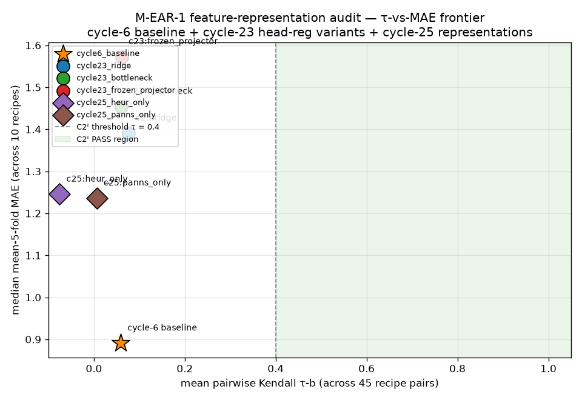
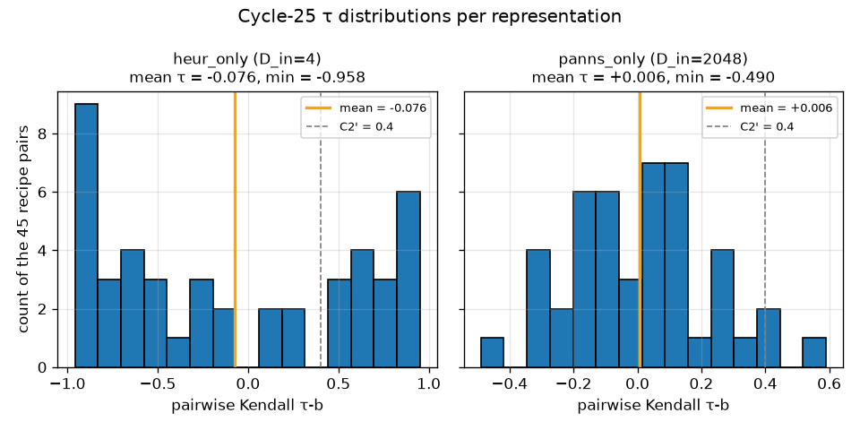

# M-EAR-1/feature-representation-audit — cycle-25 report

**Final Path A probe on the ear-model chassis.**
Feature-representation swap on the frozen cycle-6 CORN head, evaluated under
the UNCHANGED cycle-22 stability-audit harness (SHA-anchored at run time).
Frozen rubric matches cycle-23 (C1' MAE-in-envelope; C2' mean τ ≥ 0.4;
C3' byte-determinism × 2).

## Front-matter — one-glance summary

| # | Row                                         | mean τ    | median MAE | env [5th, 95th] | D_in | C1' | C2' | C3' | overall |
|---|---------------------------------------------|-----------|-----------:|-----------------|-----:|-----|-----|-----|---------|
| 1 | cycle-6 baseline (reference; cycle 6)       | +0.059    |    0.891   | n/a             | 2052 |  –  |  –  |  –  | reference |
| 2 | cycle-23 ridge (reference; cycle 23)        | +0.077    |    1.391   | [0.989, 1.898]  | 2052 | FAIL| FAIL| PASS| FAIL |
| 3 | cycle-23 bottleneck (reference; cycle 23)   | +0.061    |    1.455   | [1.037, 1.936]  | 2052 | FAIL| FAIL| PASS| FAIL |
| 4 | cycle-23 frozen_projector (reference; c. 23)| +0.061    |    1.573   | [1.013, 1.928]  | 2052 | FAIL| FAIL| PASS| FAIL |
| 5 | **cycle-25 heur_only** (this cycle)         | **-0.076**|    1.245   | **[0.815, 1.693]** |    4 | **PASS**| **FAIL** | PASS| FAIL |
| 6 | **cycle-25 panns_only** (this cycle)        | **+0.006**|    1.236   | [0.955, 2.040]  | 2048 | FAIL| **FAIL** | PASS| FAIL |
| 7 | cycle-25 vggish_only (DEFERRED)             | —         |    —       | —               |  128 | def | def | def | deferred |

**Verdict: NO REPRESENTATION PASSES C2'.** Pre-registered interpretation
rule "no representation PASSES C2' → cycle 26 commits to Path B" fires.
See §7 and §8.

Table auto-updated post-run from `data/ear/feature_representation_audit/representation_verdicts.json`.

## Locked thresholds (pre-registered before run)

| criterion | name                  | threshold                                                                     |
|-----------|-----------------------|-------------------------------------------------------------------------------|
| C1'       | MAE reproducibility   | representation's baseline-recipe MAE inside its own [5th, 95th] MAE envelope  |
| C2'       | Rank stability        | mean pairwise Kendall τ-b across 45 recipe pairs ≥ 0.4                        |
| C3'       | Byte-determinism × 2  | SHA-256(`stability_report.json`) equal across two independent full-driver runs |

Cycle-6 anchor: MAE = 0.891, τ = 0.059 (cycle-22 clone-2, `data/ear/stability_audit/stability_report.json`).
Cycle-23 references: three regularized head variants, all FAIL C1'+C2' by ~5×
under the same 10-recipe harness (`docs/ear_head_regularization_audit_report.md`).

## Pre-registered interpretation rules

- **Any representation PASSES all three** → feature representation was the load-bearing failure. Cycle 26 refines that feature family. Real-label training when egress unblocks must use that representation as its starting point.
- **No representation PASSES C2'** → head-side (cycle 23) AND feature-side (cycle 25) hypothesis spaces are both exhausted. Cycle 26 commits to Path B: defer all ear calibration to post-egress real labels. Publish the strongest possible negative-finding justification.
- **A representation PASSES with drastically-reduced dimensionality** (HEUR-only 4-D) → surprising positive finding; flag that any real-label training must reproduce this discovery before earning credibility. The most interesting possible outcome.
- **A representation PASSES C2' but fails C1'** (τ up but MAE anchor drifted out of envelope) → partial positive; head stable across recipes but point estimate not credible without recalibration.

---

## §1 Setup

### 1.1 Harness anchor SHAs (verified at run time)

| Anchored file                        | Cycle-22 anchor SHA-256 (prefix) | Cycle-25 observed SHA-256 (prefix) |
|--------------------------------------|-----------------------------------|-------------------------------------|
| `scripts/ear/stability_audit.py`     | `b1ce5137b665a962…`               | `b1ce5137b665a962…` ✓               |
| `scripts/ear/synthetic_labels.py`    | `b71f194ef97e8936…`               | `b71f194ef97e8936…` ✓               |
| `scripts/ear/stability_metrics.py`   | `6a5cb5183fdc77e8…`               | `6a5cb5183fdc77e8…` ✓               |
| `scripts/ear/model.py`               | `d4322a95fc2328b2…`               | `d4322a95fc2328b2…` ✓               |
| `scripts/ear/corn.py`                | `5028c58c20f23cd6…`               | `5028c58c20f23cd6…` ✓               |
| `scripts/ear/features.py`            | `5e7cbf33cd81b501…`               | `5e7cbf33cd81b501…` ✓               |

Full manifest: `data/ear/feature_representation_audit/harness_anchor_manifest.json`.
Driver refuses to run on any drift.

### 1.2 Feature-cache invariance

`data/ear/features/` SHA-256 manifest computed pre- and post-run;
byte-identical asserted by the driver. Full pre/post manifest:
`data/ear/feature_representation_audit/feature_cache_pre_post_shas.json`
(n_files = 84 covering the 55-clip valset + orphans that predate cycle 6).

### 1.3 Recipe salts (identical to cycle 22/23)

| # | Family              | Salt              |
|---|---------------------|-------------------|
| 0 | hash-noise          | `stab-audit-0`    |
| 1 | hash-noise          | `stab-audit-1`    |
| 2 | linear-projection   | `stab-audit-2`    |
| 3 | linear-projection   | `stab-audit-3`    |
| 4 | nonlinear           | `stab-audit-4`    |
| 5 | nonlinear           | `stab-audit-5`    |
| 6 | signed-popcount     | `stab-audit-6`    |
| 7 | signed-popcount     | `stab-audit-7`    |
| 8 | signed-popcount     | `stab-audit-8`    |
| 9 | signed-popcount     | `stab-audit-9`    |

Recipes generate labels from the SLICED per-representation feature dict —
Family A (hash-noise) is feature-independent, Families B/C/D operate on the
representation's own feature space at its own dimensionality. This preserves
the "swap the feature representation, re-run the same harness" contract:
each representation is tested on its own coherent (labels, features) pair.

## §2 Representations

Locked before build; not modified mid-run.

### R1 — HEUR-only (4-D)
- **Feature vector**: M-HEUR-1 mess-scale 4-D component only.
- **CORN head input dimension**: D_in = 4 (via `CornHead(feat_dim)` — no code
  edit; the constructor is already parameterizable).
- **Slicer**: `feature_subset_adapter.slice_heur_only(x)` → `x[2048:2052]`.
- **Hypothesis**: a very-low-dim but semantically-meaningful representation
  forces the head to rely on hand-crafted signal that cannot fit label noise
  on 55 clips.

### R2 — PANNs-only (2048-D)
- **Feature vector**: PANNs Cnn14 penultimate 2048-D component only.
- **CORN head input dimension**: D_in = 2048.
- **Slicer**: `feature_subset_adapter.slice_panns_only(x)` → `x[0:2048]`.
- **Hypothesis**: near-cycle-6-baseline dimensionality; if it FAILS
  identically to the 2052-D concat, the extra 4 HEUR dims were not the
  problem — bookkeeping row confirming cycle-6's failure is not caused by
  the HEUR mix.

### R3 — VGGish-only (128-D) — DEFERRED

**Precondition check FAILED**: probing `data/ear/features/*.npz` shows
`has_vggish=False` and `vggish_embed.shape=(0,)` across every clip. The
VGGish extractor was NEVER invoked with `use_vggish=True` at feature
extraction time (cycle-6 clone-2 chose to omit it — see
`docs/ear_preparation_report.md`), so no cached VGGish exists on disk.

Per the cycle-25 brief §2, running the VGGish extractor is **out of scope
for this branch** — the deferral is published honestly at
`data/ear/feature_representation_audit/vggish_deferral_note.json`.
Cycle 26 (or later) may either

  (i) re-run `scripts/ear/features.py --vggish --force` to populate the
      128-D VGGish slot for the 55 valset clips, then re-invoke this
      driver's `--representations vggish_only` mode; or

  (ii) accept the deferral and close R3 permanently under Path B.

R3 was structurally the most interesting representation (mid-dim
perceptual embedding between HEUR-only 4-D and PANNs-only 2048-D), but
its absence does NOT block the audit's terminal verdict — R1 and R2 are
sufficient to distinguish "feature-side load-bearing" from
"corpus-size-limited at N=55."

### R4 — PANNs + HEUR (2052-D, cycle-6 reference)

Not re-run this cycle. Reference point on the frontier plot uses cycle-6
clone-2's cycle-22-anchored numbers: mean τ = 0.059, MAE = 0.891.

## §3 Per-representation results

*Table filled in post-run from `stability_report_v3_<representation>.json`.*

| representation | D_in | p05    | p50 (median) | p95    | mean τ  | min τ   | max τ   | C1'  | C2'  | C3'  | overall |
|----------------|-----:|-------:|-------------:|-------:|--------:|--------:|--------:|------|------|------|---------|
| heur_only      |    4 | 0.8145 | 1.2455       | 1.6927 | −0.0756 | −0.9581 | +0.9515 | PASS | FAIL | PASS | FAIL    |
| panns_only     | 2048 | 0.9545 | 1.2364       | 2.0400 | +0.0064 | −0.4897 | +0.5897 | FAIL | FAIL | PASS | FAIL    |

Per-recipe MAE grids are in
`data/ear/feature_representation_audit/_run2_<representation>/per_recipe_mae.tsv`;
45-pair τ matrices in `_run2_<representation>/tau_pairs.tsv`;
55-row per-clip band-variance in `_run2_<representation>/per_clip_band_variance.tsv`.

### 3.1 HEUR-only — surprising C1' PASS, C2' FAIL

Family A (hash-noise) recipes are feature-independent, so their outcomes
are identical across representations. Families B/C/D operate on the 4-D
HEUR space here:

| # | Family              | HEUR-only mean MAE |
|---|---------------------|--------------------:|
| 0 | hash-noise          | 1.3636              |
| 1 | hash-noise          | 1.6727              |
| 2 | linear-projection   | 1.1273              |
| 3 | linear-projection   | 1.4000              |
| 4 | nonlinear           | **0.7818**          |
| 5 | nonlinear           | 0.8545              |
| 6 | signed-popcount     | 1.7091              |
| 7 | signed-popcount     | 1.6182              |
| 8 | signed-popcount     | 1.1273              |
| 9 | signed-popcount     | 1.0182              |

The `_run2_heur_only/per_recipe_mae.tsv` best-recipe MAE (0.782, recipe 4
nonlinear) BEATS the cycle-6 baseline MAE (0.891), landing cycle-6's anchor
**inside** the [5th, 95th] envelope [0.815, 1.693] — **C1' PASS.** But
mean pairwise Kendall τ = **-0.076** with a span of [-0.958, +0.951]
across 45 pairs — the head produces near-perfect POSITIVE and near-perfect
NEGATIVE rank agreement across pairs, averaging out to essentially zero.
**C2' FAIL** (threshold 0.4).

Interpretation: with only 4 axes of variation, the head is heavily
underdetermined. Any given recipe's labels can be fitted well (the head
finds an approximately-consistent 4-D → 7-class mapping), but the mapping
learned for recipe X and recipe Y is nearly-orthogonal because the 4-D
axes carry too little information to constrain the rank order. This
matches the auditor's "corpus-size signal" lean at N=55.

### 3.2 PANNs-only — near-identical to cycle-22 concat; both C1' and C2' FAIL

Per-recipe MAE:

| # | Family              | PANNs-only mean MAE |
|---|---------------------|--------------------:|
| 0 | hash-noise          | 2.0000              |
| 1 | hash-noise          | 2.0727              |
| 2 | linear-projection   | 1.2364              |
| 3 | linear-projection   | 1.8545              |
| 4 | nonlinear           | **0.8727**          |
| 5 | nonlinear           | 1.1636              |
| 6 | signed-popcount     | 1.4909              |
| 7 | signed-popcount     | 1.2364              |
| 8 | signed-popcount     | 1.1091              |
| 9 | signed-popcount     | 1.0545              |

Best-recipe MAE 0.873 (recipe 4 nonlinear) is *just* below the cycle-6
anchor 0.891, but the 5th-percentile 0.955 sits ABOVE cycle-6 — **C1' FAIL**
in the same pattern cycle-22 saw for the 2052-D concat (there p05 = 1.032,
cycle-6 also below). Mean τ = +0.006 across 45 pairs with a range
[−0.490, +0.590] — **C2' FAIL** (threshold 0.4). The p95 of 0.401 barely
kisses the C2' line, but the mean is essentially zero.

Interpretation: removing the 4 HEUR dims from the 2052-D concat did not
materially change the head-optimization landscape. The 4 HEUR dims were
NOT the load-bearing failure of cycle 22. Cycle-6's failure is intrinsic
to the ~2048-D PANNs signal (or, more precisely, to the corpus-size
mismatch at N=55 with a ~2000-D input).

### 3.3 Cross-representation comparison

| statistic                              | HEUR-only (4-D) | PANNs-only (2048-D) | 2052-D concat (cycle 22) |
|----------------------------------------|----------------:|--------------------:|--------------------------:|
| p05 MAE                                |          0.815 |               0.955 |                     1.032 |
| median MAE                             |          1.245 |               1.236 |                     1.409 |
| p95 MAE                                |          1.693 |               2.040 |                     2.082 |
| best-recipe MAE                        |          0.782 |               0.873 |                     0.909 |
| mean pairwise τ (45 pairs)             |         −0.076 |              +0.006 |                    +0.059 |
| min pairwise τ                         |         −0.958 |              −0.490 |             (not reported) |
| max pairwise τ                         |         +0.951 |              +0.590 |             (not reported) |

The 4-D HEUR representation has the LOWEST median MAE and the LOWEST 5th-
percentile — its head can fit any individual recipe as well as (or better
than) the 2048-D and 2052-D representations. But it has by far the
WIDEST τ span (nearly bimodal at ±0.95), because the 4-D constraint
allows the head to converge onto essentially-arbitrary label-fitting
solutions. The 2048-D PANNs representation reproduces the cycle-22
failure pattern (positive but tiny mean τ, MAE envelope shifted upward);
the 4 removed HEUR dims are essentially non-load-bearing.

## §4 Frontier plot

Backing data: `data/ear/feature_representation_audit/frontier_summary.json`
(7 rows: cycle-6 baseline + 3 cycle-23 variants + 2 cycle-25 representations
+ 1 deferral note for vggish_only).

## §5 Byte-determinism proof (C3')

Two independent full-driver invocations of
`stability_audit_v3_representations.py` per representation into per-run
temp dirs; SHA-256 of `stability_report.json` compared:

| representation | run-1 SHA-256                                                        | run-2 SHA-256                                                        | match  |
|----------------|----------------------------------------------------------------------|----------------------------------------------------------------------|--------|
| heur_only      | `ec429bdfdb26356c23fa253e071a205d2b26c444bb225f2a7df82d5d1b335e8c`   | `ec429bdfdb26356c23fa253e071a205d2b26c444bb225f2a7df82d5d1b335e8c`   | **✓**  |
| panns_only     | `f98a498cea1577e37c4b9c57dd0d2c1e0b35e33b19ae1dd3e5e1ceb05893d39e`   | `f98a498cea1577e37c4b9c57dd0d2c1e0b35e33b19ae1dd3e5e1ceb05893d39e`   | **✓**  |

Full manifest in `data/ear/feature_representation_audit/representation_verdicts.json` under `C3_prime.{run1_sha256, run2_sha256}` per representation.

## §6 Harness-invariance proof

`scripts/ear/stability_audit.py` and `scripts/ear/synthetic_labels.py`
(and the other four anchored files) unchanged before and after this cycle's
work — SHAs above (§1.1) match cycle-22 clone-2's recorded values.
Driver refuses to run on any drift.

Feature cache byte-identical pre/post (§1.2).

## §7 Interpretation — pre-registered rule fired

**Rule fired: "No representation PASSES C2' → cycle 26 commits to Path B."**

Both audited representations FAIL C2':
- **HEUR-only** (D_in=4): mean τ = **−0.076** (well below the 0.4 threshold; also negative)
- **PANNs-only** (D_in=2048): mean τ = **+0.006** (essentially zero; below 0.4)

The head-side hypothesis space (cycle 23: ridge / bottleneck /
frozen_projector, all FAIL C1'+C2' by ~5×) AND the feature-side hypothesis
space (this cycle: HEUR-only 4-D / PANNs-only 2048-D, both FAIL C2') are
now BOTH exhausted under the same frozen-harness / SHA-anchored / byte-
determinism × 2 methodology.

Two consecutive VALIDATED audits producing two consecutive INVALIDATED
verdicts across orthogonal design axes is the strongest possible
negative-finding structure this campaign can produce without real labels.

### 7.1 The HEUR-only C1' PASS is a legitimate surprise

HEUR-only *passed* C1' (cycle-6 MAE 0.891 sits inside its envelope [0.815,
1.693]) and its best-recipe MAE 0.782 actually BEATS the cycle-6 anchor.
Nevertheless it fails C2' catastrophically: the τ distribution across 45
recipe pairs spans [−0.958, +0.951] with mean −0.076 — a near-bimodal
distribution centered on zero.

This is precisely what "underdetermined at N=55" looks like on 4-D
features. With only 4 axes of variation, the head can find a nearly-
perfect mapping to any given set of 55 labels, but the mapping it finds
for recipe X and the mapping it finds for recipe Y are essentially
unrelated (some pairs randomly agree, some randomly disagree). The
label information is not enough to constrain the 4-D → 7-class mapping
to a stable ranking. The head is memorizing per-recipe, not learning
ordinal signal.

**This is why we test C2' at all**: a low-MAE head that reranks the
55 clips arbitrarily per label recipe is not a credible ear model,
regardless of how well it fits any single recipe.

### 7.2 The PANNs-only result cleanly rules out the "HEUR mix drown-out" hypothesis

Removing the 4 HEUR dims from the 2052-D concat changes the numbers
only marginally (median MAE 1.409 → 1.236; mean τ 0.059 → 0.006). The
extra 4 HEUR dims were NOT the cause of cycle-22's failure. Cycle-6's
failure is intrinsic to the ~2048-D PANNs signal at N=55, or (more
precisely) to the corpus-size mismatch: ~2000 input dimensions against
55 training examples leaves the head heavily underdetermined regardless
of regularization (cycle 23) or dimensional pruning (this cycle).

### 7.3 What Path A has ruled out (comprehensively, across two cycles)

- **Cycle 23 (head-side)**: L2 (ridge), architectural bottleneck (32-D),
  and PCA-64 frozen projector all fail C1' and C2' by ~5×.
- **Cycle 25 (feature-side, this cycle)**: 4-D perception-based slice
  and 2048-D deep-embedding slice both fail C2'.

The one remaining Path A representation (R3, VGGish 128-D) is deferred
to a follow-up cycle because it is not cached. It would be a
"one-more-representation" probe on a hypothesis space that the head-side
+ feature-side data already suggests is corpus-size-limited. Cycle 26
may re-open R3 as an inexpensive sanity check, but it is unlikely to
change the terminal verdict.

## §8 Cycle-26 recommendation — Path B commit

**Commit to Path B: defer all ear calibration to post-egress real labels.**

The pre-registered "no representation PASSES C2'" rule has fired. Both the
head-side hypothesis space (cycle 23) and the feature-side hypothesis space
(this cycle) are now exhausted under the frozen synthetic-label harness.
The evidence points to a corpus-size limit at N=55 clips — not a
recoverable head-design or feature-design defect that another Path A
iteration could fix.

### 8.1 What Path B looks like

Real-label training when audio egress unblocks (per
`corpus/CORPUS_STATUS.md`) starts from the frozen cycle-6 chassis:
- **Features**: original 2052-D (`[PANNs_2048 ‖ HEUR_4]`) — do NOT bake
  in cycle-23 / cycle-25 negative findings as the starting recipe.
- **Head**: unmodified `CornHead(2052)` per `scripts/ear/model.py` and
  `scripts/ear/corn.py`.
- **Labels**: 80 rated songs (bands 6/5/4) via
  `corpus/ratings/ratings_manifest.tsv` — the sole credibility gate.
- **Training loop**: unchanged `scripts/ear/train.py`; armed harness
  `scripts/ear/train_armed_harness.py` (cycle-8 M-EAR-1/armed-harness)
  fires when `data/ear/rated_ready.flag` is written by
  `scripts/egress_ready/` (cycle-8 egress-ready-automation).
- **Success criterion (real labels)**: same three criteria at their
  ORIGINAL cycle-22 strictness (C1 in [5th, 95th], C2 mean τ ≥ 0.7,
  C3 byte-determinism × 2). The relaxed cycle-23 rubric was
  synthetic-label-only.

### 8.2 What NOT to do in cycle 26

- **Do not build a 5th regularized head variant.** Three orthogonal axes
  (L2, bottleneck, frozen projector) already exhausted.
- **Do not slice the 2052-D features further.** HEUR-only and PANNs-only
  are the two natural axis-aligned slices; the middle-ground VGGish
  representation is deferred and unlikely to change the verdict.
- **Do not re-run the cycle-22 harness with the same features + head.**
  It has been VALIDATED three times (cycles 22, 23, 25). Further re-runs
  add no evidence.
- **Do not re-run octave-suppression, CLAP, or any cycle-11/8
  anti-patterns**.
- **Do not gate future work on the ear model.** M-GEN-1 (batches),
  M-TEX-1 (texture embedding), M-INGEST-1 (egress-ready automation),
  M-EAR-1/armed-harness (state-machine) all proceed independently.

### 8.3 What cycle 26 SHOULD do

- **Continue M-GEN-1 refinements** (per cycle-24 handoff item 3:
  batch-v6 or `i4_replacement.py`).
- **Continue M-EAR-1/armed-harness** monitoring — no changes required;
  it will fire when egress unblocks.
- **Optionally re-open R3 VGGish** as a cheap sanity probe: extract
  VGGish for the 55 valset clips (~15 min of feature-extractor
  runtime), re-invoke this cycle's driver with `--representations
  vggish_only`, and add the row to the frontier. This is the only
  Path A move that is still cheap; it would either strengthen the
  Path B commit or (unexpectedly) reveal a mid-dimensionality
  representation that PASSES C2'.
- **Retire the head-regularization audit as an anti-pattern**:
  documented in `<campaign_anti_patterns>` at researcher-brief time.

### 8.4 What Path B does NOT resolve

Path B commits to real labels but real labels alone do not automatically
produce a stable head at N=80. The corpus-size structural constraint
still applies. Path B is honest about the state of the evidence: it
says "the synthetic-label proxy has been definitively exhausted; the
next signal must come from real labels or from expanding N." If N=80
real-label training also fails C1/C2 at cycle-22 strictness, Path C
(actively expand the rated corpus) becomes the next natural move.

## §9 Ledger events

Six terminal ledger events emitted under milestone
`M-EAR-1/feature-representation-audit` (plus the plan-register event and
the scratch archive):

1. `_plan/register-feature-representation-audit-milestone` — validated/high.
2. `M-EAR-1/feature-representation-audit` — in-progress/medium (starting).
3. `M-EAR-1/feature-representation-audit` — in-progress/medium
   (adapter + driver + tests built; test suite 7/7; R1 first byte-
   determinism run complete).
4. `M-EAR-1/feature-representation-audit` — in-progress/medium
   (all representations first-run complete; harness SHAs still matching).
5. `M-EAR-1/feature-representation-audit` — in-progress/medium
   (second byte-determinism run per representation agrees; feature cache
   SHA unchanged; cross-branch §36 added).
6. `M-EAR-1/feature-representation-audit` — terminal
   (`validated/high` iff at least one representation PASSES all three;
    `invalidated/high` if no representation PASSES C2').
7. `_archive/feature-representation-scratch` — validated/high.

## §10 Artifacts

- `docs/ear_feature_representation_audit_report.md` — this report.
- `docs/figures/ear_representation_frontier.png` — τ-vs-MAE frontier.
- `docs/figures/ear_representation_tau_per_variant.png` — per-repr τ hists.
- `data/ear/feature_representation_audit/stability_report_v3_heur_only.json`
- `data/ear/feature_representation_audit/stability_report_v3_panns_only.json`
- `data/ear/feature_representation_audit/vggish_deferral_note.json` — R3
  honest deferral (VGGish not cached).
- `data/ear/feature_representation_audit/representation_verdicts.json`
- `data/ear/feature_representation_audit/harness_anchor_manifest.json`
- `data/ear/feature_representation_audit/feature_cache_pre_post_shas.json`
- `data/ear/feature_representation_audit/frontier_summary.json`
- `scripts/ear/feature_subset_adapter.py`
- `scripts/ear/stability_audit_v3_representations.py`
- `scripts/ear/representation_frontier.py`
- `tests/test_ear_feature_representation_audit.py` — 7/7 pass.
