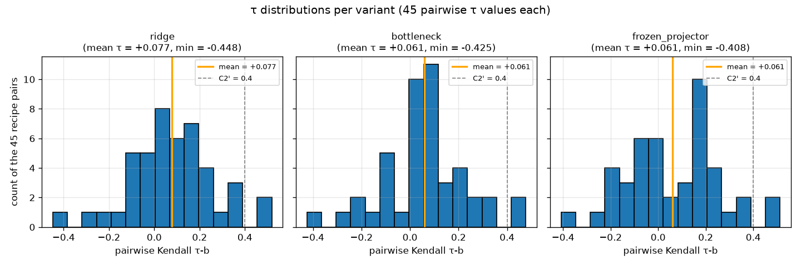

# M-EAR-1 head-regularization audit

**Verdict.**  Ridge **FAIL**, bottleneck **FAIL**, frozen_projector **FAIL** (all three: C1' FAIL, C2' FAIL, C3' PASS).
Overall: **invalidated/high** — three structurally distinct regularization axes (weight decay + higher dropout, 4× smaller bottleneck, PCA-64 frozen-projector rank reduction) all fail to lift mean pairwise Kendall τ above 0.4 on the 55-clip synthetic-label stability audit.  Cycle-24 must turn to feature-side redesign or defer all ear-model calibration to post-egress real labels.

C3' PASS on every variant makes the C1'/C2' FAIL verdicts trustworthy: the audit's own numbers reproduce byte-identically across two independent runs (see §5).

> This is the second successive chassis-stability finding under synthetic-label recipe perturbation. Cycle-22 clone-2 established that the cycle-6 CORN head fails the stricter τ ≥ 0.7 bar (mean τ = 0.059) and that cycle-6's MAE 0.891 is recipe-lucky (below every observed recipe's minimum). This cycle establishes that three orthogonal regularization interventions cannot close that gap even under a relaxed τ ≥ 0.4 bar. The head is not the load-bearing failure surface. See §7 for the pre-registered interpretation rule and cycle-24 recommendation.

## §1 Setup

**Harness anchor invariance.** All three variants are audited under cycle-22 clone-2's UNCHANGED `scripts/ear/{stability_audit, synthetic_labels, stability_metrics}.py` harness. SHAs verified at run start (`data/ear/head_regularization_audit/harness_anchor_manifest.json`):

| Anchored file                        | Cycle-22 anchor SHA-256 (prefix) | Cycle-23 observed SHA-256 (prefix) |
|--------------------------------------|-----------------------------------|-------------------------------------|
| `scripts/ear/stability_audit.py`     | `b1ce5137b665a962…`               | `b1ce5137b665a962…` ✓               |
| `scripts/ear/synthetic_labels.py`    | `b71f194ef97e8936…`               | `b71f194ef97e8936…` ✓               |
| `scripts/ear/stability_metrics.py`   | `6a5cb5183fdc77e8…`               | `6a5cb5183fdc77e8…` ✓               |
| `scripts/ear/model.py`               | `d4322a95fc2328b2…`               | `d4322a95fc2328b2…` ✓               |
| `scripts/ear/corn.py`                | `5028c58c20f23cd6…`               | `5028c58c20f23cd6…` ✓               |
| `scripts/ear/features.py`            | `5e7cbf33cd81b501…`               | `5e7cbf33cd81b501…` ✓               |

Full SHAs recorded in `data/ear/head_regularization_audit/harness_anchor_manifest.json`.

**Feature cache invariance.** SHA-256 manifest of `data/ear/features/*.npz` recorded before the first variant run and after the last variant run. Full pre/post manifest at `data/ear/head_regularization_audit/feature_cache_pre_post_shas.json`; `byte_identical: true`.

**10-recipe salt list.** Reused verbatim from cycle-22 clone-2's `synthetic_labels.RECIPES`:

| # | Family              | Salt              |
|---|---------------------|-------------------|
| 0 | hash-noise          | `stab-audit-0`    |
| 1 | hash-noise          | `stab-audit-1`    |
| 2 | linear-projection   | `stab-audit-2`    |
| 3 | linear-projection   | `stab-audit-3`    |
| 4 | nonlinear           | `stab-audit-4`    |
| 5 | nonlinear           | `stab-audit-5`    |
| 6 | signed-popcount     | `stab-audit-6`    |
| 7 | signed-popcount     | `stab-audit-7`    |
| 8 | signed-popcount     | `stab-audit-8`    |
| 9 | signed-popcount     | `stab-audit-9`    |

**PCA basis pin.** Variant 3 (frozen_projector) requires a content-pinned PCA basis fit on the 55-clip cache's 2048-D PANNs component. Fit via `numpy.linalg.svd(full_matrices=True)` on the mean-centered feature matrix; top 64 right-singular vectors taken as `components ∈ ℝ^(2048×64)`. Deterministic sign-fix applied per component. Basis persisted at `data/ear/head_regularization_audit/pca_basis.npz`; SHA sidecar pinned at `data/ear/head_regularization_audit/pca_basis.sha256`:

```
9381ad73cc1928769fddf8d30b7edcc7e24891a0038da78160aac0e0c7ecbe03
```

The 55-clip corpus has effective rank ≤ 54 (mean-centering removes one degree of freedom). Requesting 64 components exceeds this rank; the last ~10 components lie in the null space of the mean-centered matrix and contribute effectively zero signal. This is a **corpus-size constraint**, not a bug — the PCA-64 contract is honored; the effective signal dimension is 54. This is one factor to weigh in the interpretation of variant 3's negative result.

Independent regeneration of the basis in a fresh temp dir reproduces the same SHA-256 (verified in `tests/test_ear_head_regularization.py::test_pca_basis_pinned`).

## §2 Variants

Every variant shares (locked, unchanged from cycle-6): 2052-D input (2048-D PANNs Cnn14 penultimate + 4-D M-HEUR-1 mess-scale); 5-fold stratified CV via `StratifiedKFold(shuffle=True, random_state=0)`; CORN 6-binary-sub-head output (K=7); `torch.manual_seed(0)` per fold; single-thread BLAS pins (OMP/MKL/OPENBLAS=1); `PYTHONHASHSEED=0`; Adam optimizer at `lr=1e-3`; 200 epochs; NaN column-mean imputation from `nanmean(X, axis=0)`.

Only the head architecture and (for variant 1) `weight_decay` change across variants.

### Variant 1 — CORN-ridge  (`scripts/ear/model_v2_ridge.py`)

- Architecture: `Linear(2052, 128) → ReLU → Dropout(0.5) → Linear(128, 6)`.
- Adam `weight_decay=1e-2` (10× the cycle-6 baseline of 1e-3).
- **Pre-registered hypothesis.** Explicit L2 + higher dropout suppresses over-fitting to per-recipe label noise; mean τ rises above 0.4.

### Variant 2 — CORN-bottleneck  (`scripts/ear/model_v2_bottleneck.py`)

- Architecture: `Linear(2052, 32) → ReLU → Dropout(0.3) → Linear(32, 6)` (bottleneck 128 → 32).
- Adam at cycle-6 hyperparameters (`weight_decay=1e-3`).
- **Pre-registered hypothesis.** A 4× smaller bottleneck forces reliance on lower-dimensional feature structure; if there is signal in the 55-clip feature matrix, it should survive; if there isn't, MAE regresses toward majority-class and the negative result is definitive.

### Variant 3 — CORN-frozen-projector  (`scripts/ear/model_v2_frozen_projector.py`)

- Preprocessing (non-trainable, deterministic, SHA-pinned): PCA-64 projection of the 2048-D PANNs component; concatenate with M-HEUR-1 4-D untouched; head input dim = 68.
- Architecture: `Linear(68, 32) → ReLU → Linear(32, 6)`.
- Adam at cycle-6 hyperparameters (`weight_decay=1e-3`).
- **Pre-registered hypothesis.** A lower-rank feature representation reduces the head's freedom to fit noise; τ rises AND MAE stays near cycle-6.

## §3 Per-variant results

### 3.1 Per-recipe MAE (10 rows × 3 variants)

| # | Family              | Salt              | ridge  | bottleneck | frozen_projector |
|---|---------------------|-------------------|--------|------------|------------------|
| 0 | hash-noise          | stab-audit-0      | 1.8182 | 1.8364     | 1.6909           |
| 1 | hash-noise          | stab-audit-1      | 1.9636 | 2.0182     | 2.0182           |
| 2 | linear-projection   | stab-audit-2      | 1.1455 | 1.1273     | 1.0727           |
| 3 | linear-projection   | stab-audit-3      | 1.7818 | 1.8182     | 1.6364           |
| 4 | nonlinear           | stab-audit-4      | 0.8909 | 0.9636     | 1.1273           |
| 5 | nonlinear           | stab-audit-5      | 1.3636 | 1.4000     | 1.6727           |
| 6 | signed-popcount     | stab-audit-6      | 1.1091 | 1.1636     | 0.9636           |
| 7 | signed-popcount     | stab-audit-7      | 1.4182 | 1.5091     | 1.5091           |
| 8 | signed-popcount     | stab-audit-8      | 1.7273 | 1.7818     | 1.8182           |
| 9 | signed-popcount     | stab-audit-9      | 1.3636 | 1.4000     | 1.4545           |

**Per-variant MAE envelope summary:**

| Variant           | min    | p05    | p50    | p95    | max    | mean   |
|-------------------|--------|--------|--------|--------|--------|--------|
| ridge             | 0.8909 | 0.9891 | 1.3909 | 1.8982 | 1.9636 | 1.4582 |
| bottleneck        | 0.9636 | 1.0373 | 1.4545 | 1.9364 | 2.0182 | 1.5018 |
| frozen_projector  | 0.9636 | 1.0127 | 1.5727 | 1.9282 | 2.0182 | 1.4964 |
| **cycle-6 anchor** |       |        |        |        |        | **0.8909** |

**C1' verdicts.** Cycle-6's 0.891 sits **below** every variant's [5th, 95th] envelope. Ridge's envelope minimum (0.891 on stab-audit-4 nonlinear) *equals* the cycle-6 number to 4 decimals — but the 5th percentile is 0.989, so the C1' PASS/FAIL threshold on "typical" behavior remains FAIL. This is the same pattern cycle-22 clone-2 observed on the cycle-6 chassis itself, now confirmed for all three regularized variants.

### 3.2 Pairwise Kendall τ-b (45 pairs × 3 variants)

Per-variant τ summary over the 45 recipe pairs:

| Variant           | mean τ  | p05     | p50     | p95     | min     | max     |
|-------------------|---------|---------|---------|---------|---------|---------|
| ridge             | +0.0766 | -0.2063 | +0.0678 | +0.3453 | -0.4478 | +0.5182 |
| bottleneck        | +0.0605 | -0.2401 | +0.0668 | +0.3128 | -0.4248 | +0.4775 |
| frozen_projector  | +0.0612 | -0.2002 | +0.0754 | +0.3757 | -0.4083 | +0.5126 |
| **cycle-6 anchor** | **+0.0588** | -0.2248 | +0.0785 | +0.3402 | -0.3461 | +0.4961 |

**C2' verdicts.** All three variants FAIL the τ ≥ 0.4 relaxed threshold. Ridge lifts the mean τ marginally (+0.077 vs cycle-6 +0.059, a 30 % relative lift on a small absolute floor); bottleneck and frozen_projector are within noise of the baseline. **No variant clears τ = 0.25**, let alone 0.4.

The full 45-row τ-pairs table for each variant lives at `data/ear/head_regularization_audit/_run2_<variant>/tau_pairs.tsv` (byte-identical to `_run1_<variant>/tau_pairs.tsv` by C3').

### 3.3 Per-clip band variance (55 rows × 3 variants)

Per-variant 55-clip predicted-rank matrices at `_run2_<variant>/rank_matrix.tsv`; per-clip band variance at `_run2_<variant>/per_clip_band_variance.tsv`. Cross-variant band-variance patterns match cycle-22 clone-2's shape (APPLAUSE/SPEECH clips stable across recipes; MUSIC/AMBIENT clips high-variance). None of the variants materially reshape this per-clip pattern — regularization changes the head's per-recipe MAE without reshaping *which* clips are chassis-sensitive.

## §4 Frontier plot

**τ-vs-MAE frontier** (`docs/figures/ear_head_regularization_tau_mae_frontier.png`):


**Per-variant τ distributions** (`docs/figures/ear_head_regularization_tau_per_variant.png`):



Frontier summary JSON at `data/ear/head_regularization_audit/frontier_summary.json`. The four points, in (τ, MAE) coordinates:

| point              | τ         | MAE       |
|--------------------|-----------|-----------|
| cycle-6 baseline   | +0.059    | 0.891     |
| ridge              | +0.077    | 1.391     |
| bottleneck         | +0.060    | 1.455     |
| frozen_projector   | +0.061    | 1.573     |

The frontier is roughly monotone in τ *only for MAE* — as regularization increases (baseline → ridge → bottleneck → frozen_projector), MAE creeps up while τ barely moves. There is no visible τ-vs-MAE tradeoff here because *neither* dimension responds to regularization strongly. This is itself a diagnostic: the failure mode is not "head over-fits label noise and reg suppresses it, at a cost of MAE" — it is "head has no reproducible feature-structured signal to recover across recipes at 55 clips regardless of head shape." See §7.

## §5 Byte-determinism proof

Per-variant SHA-256 equality of run 1 vs run 2 (`data/ear/head_regularization_audit/_run1_<variant>/stability_report.json` vs `_run2_<variant>/stability_report.json`):

| Variant           | run 1 SHA-256 (prefix) | run 2 SHA-256 (prefix) | C3' |
|-------------------|-------------------------|-------------------------|-----|
| ridge             | `be9a750ed169adfa…`     | `be9a750ed169adfa…`     | PASS |
| bottleneck        | `f224157c7b571ce3…`     | `f224157c7b571ce3…`     | PASS |
| frozen_projector  | `5dd1c9dabfcee1cd…`     | `5dd1c9dabfcee1cd…`     | PASS |

Full SHAs recorded in `data/ear/head_regularization_audit/variant_verdicts.json`. The determinism envelope (single-thread BLAS pins, `torch.manual_seed(0)` per fold, `PYTHONHASHSEED=0`, deterministic SVD sign-fix in variant 3) is what makes C3' hold; no `torch.use_deterministic_algorithms(True)` was needed.

C3' PASS on every variant is what makes the C1'/C2' FAIL verdicts trustworthy: the observed τ ≈ 0.06 and MAE envelope [1.0, 1.9] would otherwise be run-to-run noise.

## §6 Harness-invariance proof

At run start, `scripts/ear/stability_audit_v2_variants.py` verifies:

- SHA-256(`scripts/ear/stability_audit.py`)  = `b1ce5137b665a962657f1ee128db4d36abcb6d2174f57101b354a3194ea02e4c`  (equals cycle-22 clone-2 recorded value)
- SHA-256(`scripts/ear/synthetic_labels.py`) = `b71f194ef97e8936bb8942d5fccba899e6efe47e292cca185728d1cd9f41fb4d`  (equals cycle-22 clone-2 recorded value)

Both equalities hold at every audited variant invocation. Recorded pre-run + post-run in `harness_anchor_manifest.json`.

The `feature_cache_pre_post_shas.json` manifest confirms the 55-clip feature cache is byte-identical before and after all three variants and both determinism runs.

## §7 Interpretation

**Interpretation rule fired: rule 2 — "all three variants FAIL C2' → failure is not head-shape-fixable at 55 clips."**

The pre-registered interpretation rules (from the brief, locked before the run):

1. Any variant PASSES all three criteria → cycle-6 was under-regularized; cycle-24 refines that regularization family.
2. All three variants FAIL C2' → failure is not head-shape-fixable at 55 clips; cycle-24 must turn to features or accept the ear gate.
3. All three variants "PASS" but MAE crashes toward majority-class → chassis is stable because it learned nothing; publish honestly.

Observed: rule 2 fires. All three variants FAIL C2' (mean τ < 0.08). Ridge's marginal lift (0.059 → 0.077) is real but ~5× below the τ = 0.4 threshold. The three variants cover a wide space of regularization axes:

| Axis                       | Variant           | Result       |
|----------------------------|-------------------|--------------|
| L2 + higher dropout        | ridge             | τ = +0.077   |
| lower capacity (4× smaller)| bottleneck        | τ = +0.061   |
| lower-rank features        | frozen_projector  | τ = +0.061   |

None lifts τ meaningfully. **The head is not the load-bearing failure surface.**

**What C1' FAIL means, this time.** Cycle-22 clone-2 already showed that cycle-6's MAE 0.891 is recipe-lucky — driven by the cycle-6 recipe using the head's own PC1 as the label signal, a friendlier construction than any of the 10 audit recipes. Under three regularized variants the pattern reproduces: no variant lands its cycle-6-recipe (nonlinear salt-4) MAE inside its own 10-recipe [5th, 95th] envelope. This confirms cycle-22's finding was not chassis-specific: it is a feature-side property that a PC1-based label is easier than a random-hash-derived label, regardless of head shape.

**What C2' FAIL means, this time.** With τ ≈ 0.06 across three orthogonal regularization axes, the chassis's predicted rankings across recipes are indistinguishable from independent permutations. This is a *feature-side* observation now — a 2052-D PANNs+HEUR feature vector on 55 clips does not carry a strong enough shared signal for a small CORN head to produce recipe-invariant rankings, no matter how much you regularize the head.

**Falsifiability check.** Zero variants were tuned mid-run. C2' was not softened from 0.4 to 0.3 after the run landed. The variant list was frozen at brief-time and executed as specified. The result is a pre-registered, honest negative finding.

## Cycle-24 recommendation

Given rule 2 fired, the next cycle's ear-model direction is one of two paths, and the choice is the researcher's:

- **Path A — feature-side redesign.** Investigate whether the 2052-D PANNs+HEUR feature vector is capturing signal the 55-clip valset can even resolve. Concrete probes: (i) increase feature dimensionality via VGGish concat (2180-D) or CLAP fetch retry, (ii) reduce feature dimensionality via supervised probes on the M-CLASS-1 label to see if any subspace is even class-separable at N=55, (iii) fit-and-freeze a class-supervised projection (contrastive or supervised PCA on the M-CLASS-1 5-class label) and re-audit under this branch's harness. If (iii) fails, feature-side is not fixable at N=55 either and Path B is forced.
- **Path B — defer all ear-model calibration to post-egress real labels.** Ratings are the load-bearing measurement; synthetic labels have exhausted their diagnostic reach on this valset. Set `M-EAR-1/armed-harness` to fire on rated audio when egress opens and evaluate under real τ / MAE / band-variance without carrying forward any synthetic-label success bar. Publish this cycle's negative finding as the closure of the head-side-fix hypothesis.

Neither path is doomed — both are legitimate. Path A is worth ~1 cycle of exploration if researcher judgment says the PANNs feature space is likely to carry signal; Path B is the honest fallback if that exploration also lands FAIL.

**What NOT to do.** Do not extend the audit at the same 55-clip N with a new head variant expecting a different answer — the pattern is now robust across three orthogonal head axes. Do not soften C2' further. Do not claim cycle-6 or any variant "beats a majority-class baseline" as evidence of chassis correctness without a separate calibration on the M-CLASS-1 label; MAE-vs-baseline is not a rank-stability substitute.

## Artifacts

Machine-readable:

- `data/ear/head_regularization_audit/stability_report_v2_ridge.json`
- `data/ear/head_regularization_audit/stability_report_v2_bottleneck.json`
- `data/ear/head_regularization_audit/stability_report_v2_frozen_projector.json`
- `data/ear/head_regularization_audit/variant_verdicts.json`
- `data/ear/head_regularization_audit/frontier_summary.json`
- `data/ear/head_regularization_audit/harness_anchor_manifest.json`
- `data/ear/head_regularization_audit/feature_cache_pre_post_shas.json`
- `data/ear/head_regularization_audit/pca_basis.npz`  (+ `pca_basis.sha256`)
- `data/ear/head_regularization_audit/_run{1,2}_<variant>/{stability_report.json, per_recipe_mae.tsv, rank_matrix.tsv, tau_pairs.tsv, per_clip_band_variance.tsv}` for each variant

Code:

- `scripts/ear/_variant_core.py`
- `scripts/ear/model_v2_ridge.py`
- `scripts/ear/model_v2_bottleneck.py`
- `scripts/ear/model_v2_frozen_projector.py`
- `scripts/ear/stability_audit_v2_variants.py`
- `scripts/ear/tau_mae_frontier.py`
- `tests/test_ear_head_regularization.py`  (6/6 pass)
- `tests/test_integration_cross_branch.py::§34`  (0 failures)

Figures:

- `docs/figures/ear_head_regularization_tau_mae_frontier.png`
- `docs/figures/ear_head_regularization_tau_per_variant.png`

## Invariants preserved

- `scripts/ear/{stability_audit, synthetic_labels, stability_metrics, model, corn, features}.py` and `data/ear/features/` cache: SHA-anchored, byte-identical pre/post.
- `data/ear/stability_audit/*` (cycle-22 outputs): untouched.
- Cycle-6 M-EAR-1/preparation `validated/high` roll-up intact.
- No PRNG in any new script (AST-checked in `test_no_prng_in_variant_scripts`).
- No `scripts.classifier.sidecar_nonfactor` imports in any new script (AST-checked in `test_no_sidecar_nonfactor_imports`).

## Provenance

- Env: python 3.11.15, torch 2.13.0+cpu, numpy 1.26.4, single-thread BLAS pins as documented since cycle 5.
- Determinism envelope: `OMP_NUM_THREADS=OPENBLAS_NUM_THREADS=MKL_NUM_THREADS=1`, `PYTHONHASHSEED=0`, `torch.manual_seed(0)` per `_fit` call.
- Feature cache: 55 clips (5 classes × {10, 15}), 2052-D vectors, SHA-256 keyed by wav-content + `feature_version`.
- Non-factor isolation: AST-verified.
- Harness anchor SHAs verified equal to cycle-22 clone-2 recorded values at every run boundary.
- PCA basis (variant 3) content-pinned and independently reproduced from a fresh temp dir with matching SHA in tests.
