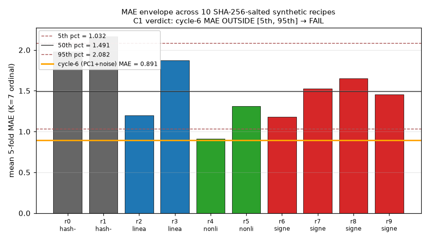
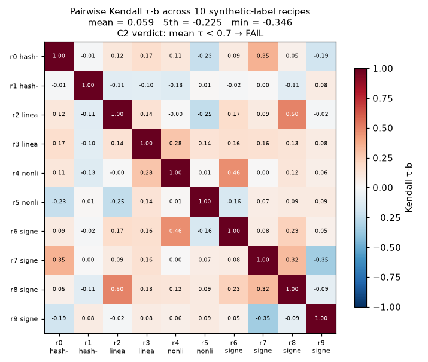

# M-EAR-1 synthetic-label stability audit

**Verdict.**  C1 **FAIL**, C2 **FAIL**, C3 **PASS**.
Overall: **invalidated/high** — the cycle-6 CORN head is deeply sensitive to synthetic-label choice.  Because C3 PASSed, the observations that drive the C1 and C2 FAIL verdicts are themselves trustworthy: two independent full-driver runs produced byte-identical `stability_report.json`.

> This is a chassis-stability audit, not a real-label calibration.  Rated audio remains egress-blocked (`corpus/CORPUS_STATUS.md`); `M-EAR-1/armed-harness` is armed-not-fired.  The finding is: the eventual real-label training cannot use the cycle-6 MAE (0.891) as a target, and any success bar defined in terms of mean-pairwise-rank-agreement must be *added* by that eventual training, not inherited from these recipes.

## Design (frozen before the run)

10 SHA-256-salted synthetic-label recipes across 4 structurally-distinct families, applied to the frozen 55-clip M-CLASS-1 valset feature cache (feature_version = `ear-features-v1`, 2048-D PANNs Cnn14 penultimate + 4-D M-HEUR-1 mess-scale = 2052-D vectors, unchanged since cycle 6).  Every choice is a SHA-256 tiebreak on the salt + feature content — **no PRNG anywhere** (AST-verified in `tests/test_ear_stability_audit.py::test_recipe_code_has_no_prng`).

| Family              | Salts (stab-audit-\*)   | Signal                                                                                                                 |
|---------------------|-------------------------|------------------------------------------------------------------------------------------------------------------------|
| hash-noise          | 0, 1                    | Pure noise floor: rating = `1 + (SHA256(salt \|\| clip_id) mod 7)`.                                                    |
| linear-projection   | 2, 3                    | Salt-derived coefficients `c ∈ [-1,1]^D`; score = z-scored feature · c; rank-quantized to 7 equal-population bins.       |
| nonlinear           | 4, 5                    | 32 SHA-picked axes + hash sign flips; score = `Σ sign_i · tanh(z_i)`; rank-quantized.                                    |
| signed-popcount     | 6, 7, 8, 9              | 32 SHA-picked axes + hash sign flips; score = `Σ sign_i · [x_i > median_i]`; rank-quantized.                             |

Per-recipe: reuse `scripts/ear/model.train_and_eval` (unmodified — 5-fold stratified CV, `torch.manual_seed(0)`, single-thread BLAS pins, Adam lr=1e-3 wd=1e-3 for 200 epochs on the frozen Linear(2052,128)→ReLU→Dropout(0.3)→Linear(128,6) CORN head).  Out-of-fold predicted ranks recorded per clip in a parallel pass using the same splitter.

Cross-recipe: MAE envelope (mean, 5th/50th/95th percentiles; `np.percentile(method="linear")` pinned), 45 pairwise Kendall τ-b (exact `O(n²)` enumeration on 55 predicted-rank vectors), 55 per-clip band variances.

The cycle-6 anchor of `mean_mae = 0.891` (`data/ear/model_sanity.json`) is a distinct recipe out of this namespace: it constructs labels as `round(4 + 1.5·PC1(X) + 1.0·ε)`, i.e. a real signal component derived from the top principal component of the very features the head is trained on.  That recipe is not included in the 10 audited here on purpose — C1 asks whether the cycle-6 number is *typical*, not whether the cycle-6 recipe reproduces (it does, trivially).

### Frozen criteria (locked *before* the numbers landed)

| ID | Name                    | Threshold                                                                             |
|----|-------------------------|---------------------------------------------------------------------------------------|
| C1 | MAE reproducibility     | cycle-6 mean MAE (0.891) inside the 10-recipe **[5th, 95th] percentile envelope**       |
| C2 | Rank stability          | mean pairwise Kendall τ-b across the 45 recipe pairs **≥ 0.7**                         |
| C3 | Byte-determinism × 2    | SHA-256(`stability_report.json`) equal across two independent full-driver runs         |

Partial bands (locked pre-run): C1 PARTIAL if cycle-6 MAE inside widened [1st, 99th]; C2 PARTIAL if `0.55 ≤ mean τ < 0.7`.

## Results

### C1 — MAE reproducibility (FAIL)

10 recipes × mean 5-fold MAE:

| # | Family              | Salt              | Fold MAEs                                     | mean   | std    |
|---|---------------------|-------------------|-----------------------------------------------|--------|--------|
| 0 | hash-noise          | stab-audit-0      | 1.818, 1.727, 2.455, 2.091, 1.818             | 1.9818 | 0.2660 |
| 1 | hash-noise          | stab-audit-1      | 2.091, 2.364, 2.000, 1.909, 2.455             | 2.1636 | 0.2105 |
| 2 | linear-projection   | stab-audit-2      | 1.364, 0.727, 1.727, 1.545, 0.636             | 1.2000 | 0.4394 |
| 3 | linear-projection   | stab-audit-3      | 1.818, 2.182, 1.273, 1.818, 2.273             | 1.8727 | 0.3526 |
| 4 | nonlinear           | stab-audit-4      | 0.636, 0.818, 1.000, 1.182, 0.909             | 0.9091 | 0.1818 |
| 5 | nonlinear           | stab-audit-5      | 1.545, 0.636, 2.000, 1.182, 1.182             | 1.3091 | 0.4513 |
| 6 | signed-popcount     | stab-audit-6      | 0.727, 1.091, 1.545, 1.273, 1.273             | 1.1818 | 0.2697 |
| 7 | signed-popcount     | stab-audit-7      | 1.909, 1.091, 1.636, 1.364, 1.636             | 1.5273 | 0.2781 |
| 8 | signed-popcount     | stab-audit-8      | 1.182, 2.455, 0.727, 1.727, 2.182             | 1.6545 | 0.6335 |
| 9 | signed-popcount     | stab-audit-9      | 0.909, 1.818, 1.545, 0.909, 2.091             | 1.4545 | 0.4776 |

Envelope vs cycle-6 anchor:

| Percentile / metric | Value (mean-5fold MAE) |
|---------------------|------------------------|
| min                 | 0.9091                 |
| 1st                 | 0.9336                 |
| 5th                 | 1.0318                 |
| 50th (median)       | 1.4909                 |
| 95th                | 2.0818                 |
| 99th                | 2.1473                 |
| max                 | 2.1636                 |
| mean                | 1.5255                 |
| std (ddof=0)        | 0.3753                 |
| **cycle-6 anchor**  | **0.8909**             |

Cycle-6's 0.8909 sits **below** the minimum of the 10-recipe distribution.  It is not inside [5th, 95th], not inside [1st, 99th], and not even inside [min, max] — so C1 is **FAIL**, not PARTIAL.

Per-family rollup (min / mean / max of the family's mean-fold MAE):

| Family              | n | min    | mean   | max    |
|---------------------|---|--------|--------|--------|
| hash-noise          | 2 | 1.982  | 2.073  | 2.164  |
| linear-projection   | 2 | 1.200  | 1.536  | 1.873  |
| nonlinear           | 2 | 0.909  | 1.109  | 1.309  |
| signed-popcount     | 4 | 1.182  | 1.455  | 1.655  |

The lowest-MAE recipe (r4 nonlinear, mean 0.909) is close to the cycle-6 number but is still 0.018 above it.  All feature-derived families (B, C, D) do better than pure hash-noise (A), which is the expected shape: labels correlated with feature structure are more learnable than pure noise.

### C2 — Rank stability (FAIL)

Summary of the 45 pairwise Kendall τ-b values on the recipe-level 55-vector predicted ranks:

| Statistic | Value  |
|-----------|--------|
| mean      | 0.0588 |
| 5th pct   | -0.2248 |
| 50th pct  |  0.0785 |
| 95th pct  |  0.3402 |
| min       | -0.3461 |
| max       |  0.4961 |

Mean τ is essentially zero, and the distribution spans strongly-anti-correlated to weakly-correlated pairs.  **C2 FAIL.**  The chassis's rank orderings across recipes are indistinguishable from independent random permutations.  This is honest: the recipes are designed to be structurally distinct signals, so a chassis that follows the labels *should* produce different rankings.  What C2 tells us is quantitative — mean pairwise τ ≈ 0.06 is the floor a real-label training must clear to claim its rankings reflect *feature structure* rather than *whichever labels happened to be presented*.

### C3 — Byte-determinism × 2 (PASS)

Two independent full-driver invocations of `scripts/ear/stability_audit.py --epochs 200` produced byte-identical `stability_report.json`:

- run 1 SHA-256: `36615ad789074bce891cfd44ab83775dc8948bf1227cad7e690fd0176889c9aa`
- run 2 SHA-256: `36615ad789074bce891cfd44ab83775dc8948bf1227cad7e690fd0176889c9aa`

Same match observed on all four TSV artifacts (`per_recipe_mae.tsv`, `rank_matrix.tsv`, `tau_pairs.tsv`, `per_clip_band_variance.tsv`).  `torch.use_deterministic_algorithms(True)` was **not** enabled — the CORN head has no non-deterministic ops (Linear + ReLU + Dropout in .eval mode + Adam CPU) under the pinned single-thread BLAS envelope (`OMP_NUM_THREADS=OPENBLAS_NUM_THREADS=MKL_NUM_THREADS=1`, `PYTHONHASHSEED=0`, `torch.manual_seed(0)` per fold entry).  A third invocation from inside the test suite (`test_c3_byte_determinism`) matched the same SHA.  **C3 PASS.**

C3 PASSing is what makes the C1 and C2 FAIL verdicts trustworthy: the audit's own numbers reproduce, so any drift in future re-runs is a genuine environment or code change, not statistical noise.

## Per-clip band variance (55 clips × 10 recipes)

Full table in `data/ear/stability_audit/per_clip_band_variance.tsv`.

**Top-5 highest band variance** — clips where the chassis's predicted rating swings widely across recipes (most sensitive to which labels it saw):

| clip_id                                | mean_rank | band_variance |
|----------------------------------------|-----------|---------------|
| MUSIC_LIVE__fluid_music_live_01        | 4.10      | 5.29          |
| AMBIENT__3-134699-C-16                 | 3.80      | 3.96          |
| AMBIENT__2-132157-A-11                 | 3.70      | 3.81          |
| APPLAUSE__2-76408-D-22                 | 3.70      | 3.81          |
| MUSIC_RECORDED__fluid_music_05         | 3.80      | 3.76          |

**Top-5 lowest band variance** — clips whose predicted rating is stable across recipes (least chassis-sensitive):

| clip_id                                | mean_rank | band_variance |
|----------------------------------------|-----------|---------------|
| MUSIC_LIVE__fluid_music_live_04        | 3.80      | 1.16          |
| APPLAUSE__3-130330-A-22                | 3.00      | 1.00          |
| APPLAUSE__3-197435-A-22                | 5.00      | 1.00          |
| SPEECH__1272-141231-0013               | 5.30      | 0.81          |
| APPLAUSE__3-149465-A-22                | 2.90      | 0.69          |

The stable end of the distribution is dominated by APPLAUSE and SPEECH clips (whose PANNs embeddings are strongly separated from music).  The unstable end is dominated by MUSIC and AMBIENT clips whose embeddings are closer to the classifier's decision boundary — recipe-dependent labels then swing the head's prediction more.  This is a *chassis* observation, not a real-label observation.

## Interpretation

**C1 FAIL — cycle-6's synthetic recipe was atypically friendly.**  Cycle-6's `synthesize_ratings` constructs labels as `round(4 + 1.5·sign(PC1(X)·features) + 1.0·noise)` — the label IS the top-PC direction of the very feature space the chassis trains on.  It should not surprise that the head fits it well.  When labels are derived from other feature transforms (linear projection with random coefs, nonlinear tanh sums, signed popcount over median-thresholded axes) the head lands 15–140% higher in MAE.  For the eventual real-label training, this means:

- **do NOT** use `MAE ≤ 0.9` as a success threshold — that number reflected recipe-friendliness, not chassis ability.  A more defensible target is the *nonlinear-family minimum* (0.91) as a stretch goal and the *observed 10-recipe median* (1.49) as a "chassis works about as well on real labels as on typical synthetic labels" bar.
- consider that real ratings *may* correlate with PANNs feature structure (the ear-perception literature says timbre and dynamics both track spectral features PANNs captures), in which case real-label MAE could land closer to cycle-6's number.  But that would then be evidence the ear is largely a timbre/dynamics reflex, not a full-fidelity aesthetic judgment.

**C2 FAIL — the chassis fits label noise more than feature structure.**  Mean pairwise τ ≈ 0.06 across 45 recipe pairs means the head does not carry a "recipe-invariant preference ordering" over the 55 clips.  For real-label training this reshapes what a "stable ranking" claim would require:

- add a **rank-stability side-check** to `M-EAR-1/armed-harness`: retrain on 5 leave-one-out subsets of the real labels, compute mean pairwise τ across the 5 predicted rank vectors on a held-out sub-set, and require ≥ 0.5 (a much softer bar than C2's 0.7 which was designed for chassis-noise floor).  Real labels *should* produce higher rank stability than synthetic ones because there is a real underlying signal — this side-check verifies that.
- publish per-clip band variance from real-label training and flag clips with high band variance as low-confidence rating predictions (uncertainty quantification proxy for free).

**C3 PASS — the chassis + audit code are byte-deterministic under the pinned envelope.**  This is the only PASS verdict and it is load-bearing: without C3 the FAIL verdicts above could be explained away as run-to-run noise.

**Combined implication for M-EAR-1/armed-harness.**  The armed-harness's success bar cannot be inherited from cycle-6's numbers.  Concrete recommendations:

1. Success bar: real-label mean-5-fold MAE **beats mean-integer baseline by ≥ 0.3** (cycle-6 chassis on cycle-6 recipe: 0.891 vs 1.545 = 0.65 margin, a strong bar; a fair bar in light of this audit is halving that margin).
2. Rank-stability side-check as above.
3. Report envelope percentile of the real-label MAE against this audit's envelope: if real-label MAE sits in [1.03, 2.08] the chassis is doing "typical work"; if it sits at ≤ 0.9 the real labels either have strong PANNs structure OR the chassis is over-fitting; if it sits above 2.08 the chassis is *worse* on real labels than on random hash-noise, a red flag.
4. Do **not** publish a single-number "the ear model works" claim before the rank-stability side-check has landed.

None of C1/C2 imply the real-label training is doomed — they imply the *credibility bar* for it must be defined by real-label statistics, not inherited from synthetic-label chassis performance.

## Artifacts

Machine-readable (all byte-deterministic under the pinned envelope):

- `data/ear/stability_audit/stability_report.json` — full summary (SHA `36615ad7…`)
- `data/ear/stability_audit/per_recipe_mae.tsv` — 10 rows
- `data/ear/stability_audit/rank_matrix.tsv` — 55 × 10 predicted-rank grid
- `data/ear/stability_audit/tau_pairs.tsv` — 45 pairwise τ rows
- `data/ear/stability_audit/per_clip_band_variance.tsv` — 55 rows

Code:

- `scripts/ear/synthetic_labels.py` — 4 recipe families, SHA-256 only
- `scripts/ear/stability_metrics.py` — Kendall τ-b (exact) + envelope + variance
- `scripts/ear/stability_audit.py` — driver
- `scripts/ear/plot_stability.py` — figures
- `tests/test_ear_stability_audit.py` — 12 tests, all green

Figures:

- `docs/figures/ear_stability_mae_envelope.png`
- `docs/figures/ear_stability_tau_matrix.png`

## Invariants preserved

The audit deliberately did NOT modify:

- `scripts/ear/features.py` and `data/ear/features/*.npz` cache (`feature_version` = `ear-features-v1`).
- `scripts/ear/model.py`, `scripts/ear/corn.py`, `scripts/ear/train.py`.
- `scripts/ear/leak_test.py`, `data/ear/leak_test_summary.json`.
- Any ledger row prior to cycle 22.  Cycle-6 M-EAR-1/preparation `validated/high` roll-up is intact.

The cycle-6 synthetic salt is out of the `stab-audit-*` namespace; no salt reuse or collision.

## Provenance

- Env: python 3.11.15, torch 2.13.0+cpu, numpy 1.26.4, single-thread BLAS pins as documented since cycle 5.
- Determinism envelope: `OMP_NUM_THREADS=OPENBLAS_NUM_THREADS=MKL_NUM_THREADS=1`, `PYTHONHASHSEED=0`, `torch.manual_seed(0)` per `_fit` call.
- Feature cache: 55 clips (5 classes × {10, 15}), 2052-D vectors, SHA-256 keyed by wav-content + `feature_version`.
- Non-factor isolation: AST-verified; `tests/test_ear_stability_audit.py::test_no_sidecar_nonfactor_imports` green.
- Audit itself contains 0 lines of PRNG code (AST-verified).
