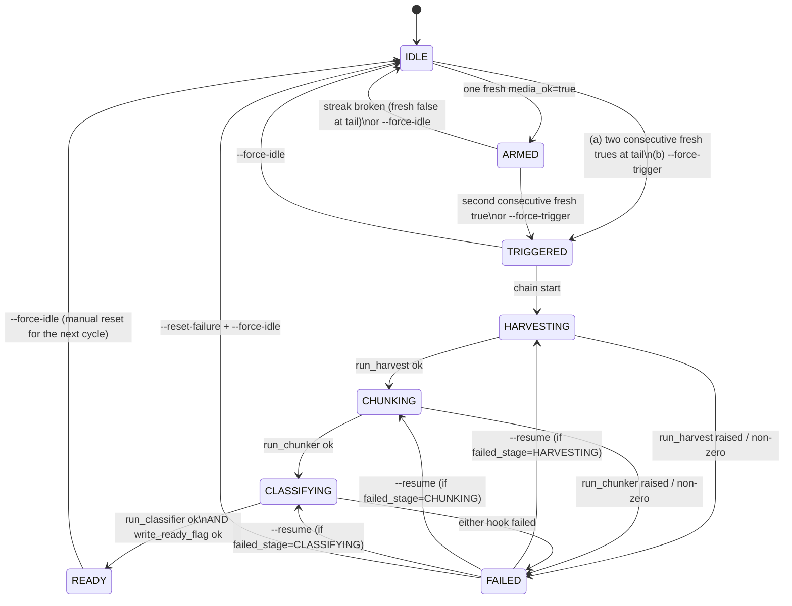

# M-INGEST-1/egress-ready-automation

A crash-resumable state machine that closes the "egress opens mid-run and
nobody catches it" hole. It watches `data/ingestion/egress_status.jsonl` and,
on two consecutive fresh `media_ok=true` rows, chains the rated-audio
pipeline unattended.

## Purpose

The `M-INGEST-1/egress-probe` sub-milestone already writes one row per
`workspace/harvest_playlists.sh` retry into `data/ingestion/egress_status.jsonl`
with `{ts, media_ok, http_code, ...}`. Today no code watches those rows: when
egress relaxes and the probe starts logging `media_ok=true`, the rated-audio
pipeline (harvester → chunker → classifier → M-EAR-1 training-set assembly)
does not fire until a human notices. This module closes that gap.

**The specific mechanism this codifies:** *two consecutive fresh
`media_ok=true` rows in the probe log constitute the unblock signal.* Any
single true row is a coincidence (the CDN sometimes 302s once before
reverting); two in a row means egress has actually opened.

## Scope

- `scripts/egress_ready/trigger.py` — the pure-function two-consecutive-true
  detector with 24-hour staleness filter.
- `scripts/egress_ready/state.py` — the finite-state machine, its transition
  map, and the atomic persistence layer.
- `scripts/egress_ready/subprocess_hooks.py` — the single injection point
  for the four downstream subprocess calls. Tests inject a mock subclass.
- `scripts/egress_ready/cli.py` — human-override interface (`--watch`,
  `--status`, `--force-idle`, `--force-trigger`, `--resume`, `--reset-failure`).
- `tests/test_egress_ready_state.py` — six named scenarios + persistence +
  byte-determinism + override + failure-recovery.
- `tests/fixtures/egress_status/*.jsonl` — six synthetic probe logs, one per
  named scenario.
- `data/egress_ready/state.json`, `data/egress_ready/transitions.jsonl` —
  runtime state; not committed until the first live trigger fires.

## Non-goals

Explicitly out of scope this cycle:

1. **Does NOT decide what `rated_ready.flag` means to M-EAR-1 training.**
   That is M-EAR-1's job. This module writes the flag and stops.
2. **Does NOT retry failed harvests indefinitely.** One attempt per
   `TRIGGERED` cycle. A human `--resume` is required to restart a failing
   stage. This is a deliberate contract: the state machine is a trigger
   detector, not a retry loop.
3. **Does NOT modify `data/ingestion/egress_status.jsonl`.** Read-only
   consumer. The probe (owned by `M-INGEST-1/egress-probe`) is the sole
   writer.
4. **Does NOT run any classifier code that reads non-factor sidecars.**
   Isolation contract preserved; zero `sidecar_nonfactor` imports (see
   §Isolation).
5. **Does NOT exercise the live network this cycle.** All six tests drive
   the machine with synthetic fixtures and monkey-patched subprocess hooks.
   Proving that the machine will notice when egress unblocks is a distinct
   question from proving that egress will unblock. This work is the former.
6. **Does NOT implement a daemon / continuous-poll loop.** `--loop N` is a
   stub for a future cycle; production use is a per-orchestrator-tick
   `--watch` invocation.

## State diagram



The authoritative transition map is `scripts/egress_ready/state.TRANSITIONS`.
Any transition not in that map raises `InvalidTransition`.

## Trigger rule

`detect_trigger(rows, now_utc, staleness_hours=24)` in
`scripts/egress_ready/trigger.py`:

1. Filter `rows` to those with `ts` fresh under strict `<` comparison against
   `now_utc - staleness_hours`. Stale rows are treated as if absent (do NOT
   count as true or false).
2. If no fresh rows remain → `NONE`.
3. If the *last* fresh row is `media_ok=false` → `NONE`.
4. If the last fresh row is `media_ok=true` and the second-to-last fresh row
   is also `media_ok=true` → `TRIGGERED((i0, i1))` with the original indices.
5. Otherwise (exactly one trailing fresh true) → `ARMED((i,))`.

**Only the last streak matters.** `[T, F, T, T]` → `TRIGGERED(2, 3)`;
`[T, T, F]` → `NONE`.

### Falsification criteria

The design is ruled out (of this cycle's scope) if any of the following hold:

- The detector fires `TRIGGERED` on a non-consecutive pattern
  (e.g. `[T, F, T]`).
- The state machine leaves `IDLE` with only one fresh true row.
- A stale-only fixture triggers anything.
- Two `--watch` invocations against the same fixture produce different
  `transitions.jsonl` bytes.
- Any test causes a real `subprocess.run` on `harvest_playlists.sh` or the
  classifier CLI (isolation breach).
- Any module in `scripts/egress_ready/` imports `sidecar_nonfactor`.

All six criteria are exercised by `tests/test_egress_ready_state.py` and
green as of this writing.

## Six-scenario matrix

Fixtures live at `tests/fixtures/egress_status/`. The `NOW_UTC` reference
for every scenario is `2026-08-28T10:00:00Z` (frozen `Clock` injected).

| # | Scenario | Fixture | Expected `detect_trigger` | Expected terminal state | Pass |
|---|----------|---------|---------------------------|-------------------------|------|
| 1 | all-false | `all_false.jsonl` | `NONE` | `IDLE` | ✓ |
| 2 | single-true-then-back | `single_true_then_back.jsonl` | `NONE` | `IDLE` | ✓ |
| 3 | two-consecutive-triggers | `two_consecutive_triggers.jsonl` | `TRIGGERED(1,2)` | `READY` | ✓ |
| 4 | already-triggered-then-false | `two_consecutive_triggers.jsonl` (drive to READY, then append a trailing false and re-scan) | first call → `TRIGGERED`; re-scan → *state authoritative, does not retract* | `READY` | ✓ |
| 5 | interleaved-then-true-true | `interleaved_then_true_true.jsonl` | `TRIGGERED(2,3)` | `READY` | ✓ |
| 6 | stale-row-does-not-count | `stale_row_does_not_count.jsonl` (one 25 h-old T, one fresh T) | `ARMED((1,))` (stale row invisible; sole fresh true) | `ARMED` | ✓ |

Every drive-through additionally asserts:

- `state.json` on disk matches the terminal in-memory state (or is *absent*
  when the machine never left `IDLE`).
- `transitions.jsonl` records the correct sequence of transitions and is
  append-only.
- A second `EgressReadyMachine(...)` constructed against the same disk state
  returns the same terminal state *without re-firing any hook* (idempotence).

## State persistence

- **`state.json` is written on every transition** via `tempfile.NamedTemporaryFile`
  in the same directory as the target + `os.fsync` + `os.replace`. POSIX
  `rename(2)` is atomic across a same-filesystem replace, so no reader (or
  crashed writer) ever observes a torn file.
- **`transitions.jsonl` is append-only.** Every transition writes a
  `{timestamp_utc, from_state, to_state, reason, evidence_ref}` line via
  `open(path, "a")`. `--force-idle` from `READY` appends a new event; it does
  not rewrite prior ones.
- **Crash resumption.** A fresh `EgressReadyMachine(...)` constructed against
  the same `state.json` loads the exact recorded `Persisted` snapshot. In the
  `HARVESTING` / `CHUNKING` / `CLASSIFYING` states, the constructor picks up
  where the crashed process left off and re-runs the current stage's hook —
  those hooks are contracted to be idempotent by their respective owning
  milestones (`M-INGEST-1/chunker` is deterministic; the classifier writes
  content-hashed sidecars; `harvest_playlists.sh` skips already-fetched
  IDs).
- **Atomicity is tested.** `tests/test_egress_ready_state.py` monkey-patches
  `os.replace` to raise mid-transition and asserts that the previous
  `state.json` bytes are still readable.

### Worked example: crash between CHUNKING and CLASSIFYING

1. Process A: `scan_and_advance()` → `TRIGGERED` → `HARVESTING` (`run_harvest` ok)
   → `CHUNKING` (`run_chunker` ok) → `state.json{state="CLASSIFYING"}`
   persisted → process dies before `run_classifier` starts.
2. Process B: `EgressReadyMachine(...)` loads `state.json`, sees
   `state="CLASSIFYING"`, calls `_drive_chain()`, which runs
   `hooks.run_classifier()` (idempotent by classifier contract), then
   `hooks.write_ready_flag()`, transitions to `READY`, persists.

No harvest re-run; no chunker re-run. Only the exact in-flight stage repeats.

## Failure recovery

`FAILED` semantics:

- Any hook returning `HookResult(ok=False)` triggers `_fail(from_stage, hook_name, result)`.
- `_fail` writes `diagnostic_YYYYMMDD_HHMMSS.json` under `data/egress_ready/`
  with `{failed_at_stage, hook, returncode, stderr_tail (4 KiB), duration_s,
  timestamp_utc}`, then transitions `... → FAILED` with `failed_stage` and
  `diagnostic_path` recorded in `state.json`.
- The chain halts. The next scan is a no-op unless the operator invokes
  `--resume` or `--reset-failure + --force-idle`.

`--resume`:

- Legal only from `FAILED`.
- Requires `failed_stage ∈ {HARVESTING, CHUNKING, CLASSIFYING}`.
- Transitions `FAILED → <failed_stage>`, then `_drive_chain()` re-runs
  *only that stage and its successors*. Prior successful stages are NOT
  re-executed. Test coverage: `resume: only failing stage + downstream ran`.

`--reset-failure`:

- Legal only from `FAILED`.
- Requires the caller to also pass `--force-idle` as an explicit
  acknowledgement. Without it, the CLI prints
  `REFUSED: --reset-failure requires --force-idle to acknowledge` and exits
  with status 2. The library-level `reset_failure(machine, force_idle_ack=False)`
  raises `InvalidTransition`.

## Human-override API

All CLI flags live in `scripts/egress_ready/cli.py`.

| Flag | Effect | Legal from | Notes |
|---|---|---|---|
| `--status` | Pretty-print `state.json` and exit 0. | any | Read-only. |
| `--watch` | One-shot scan of `egress_status.jsonl` and advance. | any | If `--loop N`, poll every N seconds (stub, not tested). |
| `--force-idle` | Force `IDLE` from `ARMED`, `TRIGGERED`, `READY`, or `FAILED`. | ARMED / TRIGGERED / READY / FAILED | Refuses from in-flight stages (`HARVESTING`/`CHUNKING`/`CLASSIFYING`) — kill the process first. |
| `--force-trigger` | Force `TRIGGERED` from `IDLE` or `ARMED`, bypassing the two-consecutive-true rule; drives the chain immediately. | IDLE / ARMED | Records `reason: "human_override"` in `transitions.jsonl`. |
| `--resume` | From `FAILED`, restart the recorded `failed_stage`. | FAILED | See §Failure recovery. |
| `--reset-failure` | From `FAILED`, allow `IDLE` reset. | FAILED | **Must combine with `--force-idle`** or refused. |

Exit codes:

- `0` — success (including `--status`).
- `1` — no action taken (help printed).
- `2` — `--reset-failure` used without `--force-idle`.
- `3` — `InvalidTransition` raised by the library.

All manual transitions write `reason: "human_override: <details>"` to
`transitions.jsonl`, distinguishing them from automatic ones.

## Isolation

- Zero imports of `scripts.classifier.sidecar_nonfactor` from any module
  under `scripts/egress_ready/`. Enforced by the AST/regex scan in
  `tests/test_integration_cross_branch.py §17` (module-level constant
  `_er_pat`) and independently by
  `tests/test_egress_ready_state.py` (rule 63 of the local suite).
- All four downstream commands (`workspace/harvest_playlists.sh`, the
  chunker CLI, the classifier CLI, the ready-flag writer) are invoked
  through `scripts.egress_ready.subprocess_hooks.SubprocessHooks` and
  nowhere else in `state.py`. Tests inject an `OkHooks` / `FailAtHooks`
  subclass; the test module additionally monkey-patches `subprocess.run`
  itself at import time with a `_SubprocessRunForbidden` guard, so an
  accidental live invocation would raise immediately.
- The command argv strings are pinned as module-level constants
  (`HARVEST_CMD`, `CHUNKER_CMD`, `CLASSIFIER_CMD`, `READY_FLAG_PATH`) and
  their exact form is asserted by the integration test as a stability
  guarantee. A silent refactor of any of them fails CI.
- Every module in `scripts/egress_ready/` guards the interpreter with
  `assert sys.executable == "/usr/bin/python3"` at import time.

## Handoff

When the state machine writes `data/ear/rated_ready.flag`:

- Its sidecar `data/ear/rated_ready.flag.json` records the exact UTC
  timestamp and the argv of the three commands that produced the rated
  audio artifacts.
- **M-EAR-1 (parent, training)** — currently `pending` — becomes eligible
  to run. The M-EAR-1 owner should treat the flag as the single signal
  that rated audio + chunks + classifier sidecars are all on disk under
  `data/chunks/rated/` and `data/class/rated/`.
- No coupling in the other direction: this module does not read anything
  M-EAR-1 produces.

## Reproduction

```bash
# Run the six-scenario suite (all 62 checks):
PYTHONPATH=. /usr/bin/python3 tests/test_egress_ready_state.py

# Run the cross-branch integration test (includes §17):
PYTHONPATH=. /usr/bin/python3 tests/test_integration_cross_branch.py

# Print current live state (production):
/usr/bin/python3 -m scripts.egress_ready.cli --status

# Single scan of the live probe log (production, dry until egress opens):
/usr/bin/python3 -m scripts.egress_ready.cli --watch
```

The state machine is currently `IDLE`; no `state.json` exists yet. The first
time egress relaxes and the probe logs two consecutive fresh `media_ok=true`
rows, a subsequent `--watch` will transition through the chain unattended
and land in `READY`, writing `data/ear/rated_ready.flag`.

## Pointers

- Test suite: `tests/test_egress_ready_state.py`
- Fixtures: `tests/fixtures/egress_status/{all_false,single_true_then_back,two_consecutive_triggers,already_triggered_then_false,interleaved_then_true_true,stale_row_does_not_count}.jsonl`
- Cross-branch invariants: `tests/test_integration_cross_branch.py §17`
- Plan milestone: `M-INGEST-1/egress-ready-automation` (plan_of_record cycle 8)
- Upstream signal source: `M-INGEST-1/egress-probe` writes
  `data/ingestion/egress_status.jsonl`.
- Downstream: `data/ear/rated_ready.flag` unblocks M-EAR-1 (parent training).
