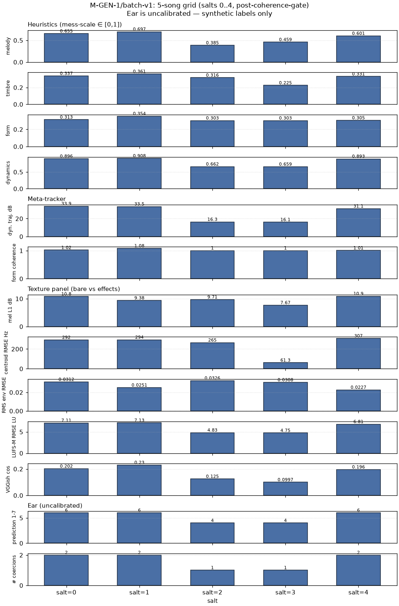

# M-GEN-1/batch-v1 — 5-song batch with coherence gate

## 1. Introduction

**Uncalibrated-ear caveat (carried forward from cycle 10, M-GEN-1/first-generation).**
Every "ear" number in this report is produced by the M-EAR-1/preparation
CORN head trained on the M-CLASS-1 55-clip valset using deterministic
*synthetic* labels (`seed=0`, PC-1-driven; see
`docs/ear_preparation_report.md`). The 1–7 output is a **functional-pipeline
signal**, not a musical judgment. Real calibration is gated on rated audio
arrival (`M-INGEST-1/egress-ready-automation` will fire the retraining
unattended when two consecutive `media_ok=true` rows land in
`data/ingestion/egress_status.jsonl`). Until then, `ear.calibration` in
every scoring JSON carries the sentinel `"synthetic_labels_only"`.

**Coherence-gate motivation (from the cycle-10 clone-0 audit).**  Cycle 10
produced one generated song end-to-end but the audit surfaced a specific
rule-composition tension: SHA-256 sampling picked an arrangement rule
whose `instrumentation = ["drums"]` silenced the pitched Parts, while
the sampled melodic rule assumed pitched Parts existed. Two related
tensions were also noted: the harmonic `chord_progression` was shorter
than the form's total measures (the assembler already cycled it via
index-modulo, but the coercion was implicit), and an empty rhythmic
pattern combined with an arrangement asking for drums would produce a
silent percussion track. This branch formalizes those three tensions as
a **post-sampling coherence gate** (`scripts/gen/coherence_gate.py`)
that resolves each by explicit *coercion* — modifying one rule to
accommodate another — while preserving determinism and never touching
the SHA-256 tiebreak in the sampler.

The branch also adds a **`salt: int` parameter** to `sample_rules`,
letting the pipeline explore multiple rulesets deterministically. Salts
0..4 are combined with the coherence gate to generate a 5-song batch.

## 2. Coherence-gate rules (typed, fixed enumeration)

The gate is a fixed set of **3** typed pairwise coercions. If a
contradiction arises that the 3-rule gate cannot resolve, the ruleset
is invalidated honestly — the gate is deliberately **not** allowed to
grow ad-hoc. Order of application: c3 → c2 → c1 (c3 may add "bass",
which then satisfies c1).

| # | Trigger | Rule pair | Action | Idempotent because… |
|---|---------|-----------|--------|---------------------|
| c1 | `arrangement.instrumentation` excludes both "bass" and "piano" **AND** `melodic.pitch_class_histogram` has non-zero content | arrangement × melodic | `arrangement.instrumentation.append("piano")`; reduced-density interpretation (assembler treats presence as boolean) | After the append, "piano" is present → trigger fails on second pass |
| c2 | `max(section.end_measure for section in form.sections)` > `len(harmonic.chord_progression)` | harmonic × form | Expand `harmonic.chord_progression` deterministically via **index-modulo cycling** to length `form.total_measures` | After cycling, `len(progression) == form.total_measures` → trigger fails |
| c3 | `arrangement.instrumentation` includes "drums" **AND** `rhythmic.pattern` is empty or all-rest | arrangement × rhythmic | Drop "drums", add "bass" | After the swap, "drums" not in instrumentation → trigger fails |

Determinism: all three functions are pure computations over the input
ruleset. `NO random / numpy.random / secrets / torch` — verified by
`tests/test_integration_cross_branch.py` §21's PRNG grep guard,
extended in §23 to cover `coherence_gate.py` and `batch_v1.py`.

Idempotence: `enforce_coherence(enforce_coherence(r)[0])[0]` byte-equal to
`enforce_coherence(r)[0]` on all 5 salts — verified live during batch
run (see §6). Second-pass coercions log is empty on all 5.

## 3. Salt=0 rule-id regression proof

The cycle-10 clone-0 sampling manifest at
`data/gen/sampling_manifest.json` carries the winning rule_ids for the
original single-song run. This branch's `sample_ruleset(ledger, salt=0)`
must reproduce those five rule_ids byte-identically. Design decision:
**salt=0 uses the *legacy* bare content hash `sha256(canonical_json(row))`;
salt≠0 uses the envelope `sha256(canonical_json({"salt": s, "rule": row}))`**
(documented in `scripts/gen/sample_rules.py` module docstring and in
`sampling_manifest.salt_envelope`).

| rule_type   | cycle-10 clone-0 anchor | salt=0 this branch     | match |
|-------------|-------------------------|-------------------------|-------|
| arrangement | rule_67d34b1c927ef33d   | rule_67d34b1c927ef33d   | ✅ |
| form        | rule_84816f91e31e50c4   | rule_84816f91e31e50c4   | ✅ |
| harmonic    | rule_0271c7a9f3b5f606   | rule_0271c7a9f3b5f606   | ✅ |
| melodic     | rule_09f340921fa2d258   | rule_09f340921fa2d258   | ✅ |
| rhythmic    | rule_88b63bd5e771c045   | rule_88b63bd5e771c045   | ✅ |

**Regression scope: sampler only.** The salt=0 *song* SHAs at
`data/gen/batch_v1/song_0/` **differ** from the cycle-10 clone-0 song at
`data/gen/renders/` because the coherence gate coerces salt=0's ruleset
(adds "piano" to arrangement, cycles the progression to 131 chords).
That is intentional: the gate exists to *correct* the arrangement-silence
bug cycle-10 surfaced. Cycle-10's raw-ruleset SHAs remain frozen and
tested in §21 of the cross-branch integration test.

## 4. Batch summary (5 songs, salts 0..4)

Raw table: `data/gen/batch_v1/summary.tsv`.

| salt | musicxml sha | midi sha    | bare sha    | effects sha | n coerc. |
|------|--------------|-------------|-------------|-------------|----------|
| 0 | bd84406982ce72e7 | 77798beadcfd7019 | c539a036cecb83cb | ccb6e266fa903b37 | 2 |
| 1 | 89a34b86f6396525 | 7f6fae8566ccc405 | 084fcf46cdfe33b0 | bf685a2d0b064058 | 2 |
| 2 | 485c809386e9b811 | 0c6fbb5b608c4664 | 739c4f062e34f6f2 | d639bb23373fa76a | 1 |
| 3 | b56e7a5a8c2d62a1 | 80df622651c95191 | f6385b241dc12b45 | 23ec4440b0d1efad | 1 |
| 4 | bf16d269bcad60e6 | 9e5bf8762277a083 | f10ece6d2be6af95 | 7c092db793d10f73 | 2 |

All 5 SHAs distinct on every column. Collision probability under
independent uniform 64-bit prefixes is ~10⁻¹⁴ per pair; observed 0/10
pairs collided.

### Heuristics (mess-scale ∈ [0,1])
| salt | melody | timbre | form | dynamics |
|------|--------|--------|------|----------|
| 0 | 0.655 | 0.337 | 0.313 | 0.896 |
| 1 | 0.697 | 0.361 | 0.354 | 0.908 |
| 2 | 0.385 | 0.316 | 0.303 | 0.662 |
| 3 | 0.459 | 0.225 | 0.303 | 0.659 |
| 4 | 0.601 | 0.331 | 0.305 | 0.893 |

### M-TEX-1/panel (bare vs effects)
| salt | mel L1 dB | centroid RMSE Hz | RMS env RMSE | LUFS-M RMSE LU | VGGish cos |
|------|-----------|------------------|--------------|----------------|------------|
| 0 | 10.782 | 291.945 | 0.031 | 7.107 | 0.202 |
| 1 |  9.377 | 293.736 | 0.025 | 7.130 | 0.230 |
| 2 |  9.705 | 264.764 | 0.033 | 4.825 | 0.125 |
| 3 |  7.673 |  61.343 | 0.031 | 4.753 | 0.100 |
| 4 | 10.905 | 307.329 | 0.023 | 6.814 | 0.196 |

All 8 panel keys present and finite for every song (panel contract
preserved). No aggregate — the panel refuses to blend families.

### Ear (uncalibrated)
| salt | prediction 1..7 | calibration |
|------|-----------------|-------------|
| 0 | 6 | synthetic_labels_only |
| 1 | 6 | synthetic_labels_only |
| 2 | 4 | synthetic_labels_only |
| 3 | 4 | synthetic_labels_only |
| 4 | 6 | synthetic_labels_only |

Do **not** interpret the ear numbers musically. See §1 caveat.

Grid figure: `docs/figures/gen_batch_v1_grid.png` (regenerable via
`/usr/bin/python3 scripts/gen/plot_batch_v1.py`).

## 5. Coercions log per song

Per-song coercions in `data/gen/batch_v1/song_{salt}/coercions.json`.
Summary:

| salt | c1 (arr × mel) | c2 (harm × form) | c3 (arr × rhy) | total |
|------|----------------|------------------|----------------|-------|
| 0    | fired (drums-only → +piano) | fired (8 → 131) | quiet | 2 |
| 1    | fired (drums-only → +piano) | fired (8 → 131) | quiet | 2 |
| 2    | quiet (arrangement had bass) | fired (1 → 131) | quiet | 1 |
| 3    | quiet (arrangement had bass) | fired (1 → 131) | quiet | 1 |
| 4    | fired (drums-only → +piano) | fired (1 → 131) | quiet | 2 |

**c3 (drums-fallback-to-bass) never fired** on this ruleset universe —
every winning rhythmic rule under every salt has at least one non-rest
token. That's an observation, not a defect; the coercion remains
enumerated so a future ruleset with an all-rest pattern gets handled
deterministically.

**c2 (harmonic-progression-shorter-than-form) fires for all 5 songs**
because every winning `form` rule points at a section spanning to
end_measure=131 (the seed's full length) while progressions are 8 (salt 0,1)
or 1 (salts 2,3,4) chords. Cycling expands the progression to 131
chords; the *sound* is the same as cycle-10's implicit modulo cycling
in the assembler, but the coercion is now *explicit* — visible in the
ruleset and in `coercions.json`.

**c1 (arrangement-silence-vs-pitched-melodic) fires for 3/5 songs**
(salts 0, 1, 4). In cycle-10 salt=0 the arrangement was `["drums"]`;
the gate adds `"piano"` so the piano Part actually renders. Salts 2, 3
sampled arrangements that already include "bass", so c1's precondition
fails.

## 6. Byte-determinism verification

**Method.** Run `scripts/gen/batch_v1.py --batch-root <alt-root>` from
a clean directory; compare SHA-256 across all 6 per-song outputs and
the 2 aggregate outputs. Verification driver:
`tools/stale/_verify_determinism.py`.

**Result.** All 32 files SHA-equal (30 per-song × 2 runs plus
`summary.tsv` and `provenance.jsonl`):

    30/30 per-song artifacts SHA-equal:
       generated.musicxml   generated.mid     bare_midi.wav
       effects_layered.wav  scoring.json      coercions.json
    2/2 aggregate artifacts SHA-equal:
       summary.tsv          provenance.jsonl

**Idempotence** verified live during the batch by re-invoking
`enforce_coherence` on the already-coerced ruleset for each salt;
pass-2 coercions log is empty for all 5, pass-2 ruleset byte-equal to
pass-1 ruleset (canonical-JSON compared).

## 7. Cross-song commentary

**How much do the 5 songs differ?** Rule-id tuples are pairwise distinct
(0/10 pairs collide, `salt` ∈ {0..4}), and the 4 SHA columns
(musicxml/midi/bare/effects) each have 5 distinct values. Musical
diversity, however, is bounded: every song shares the same key/tempo/
meter from its (post-coerced) `harmonic` and `rhythmic` rules, which
under the small ledger (28 rules total) is very correlated — salts 1
and 4 landed on the same arrangement rule (`rule_b75cc391f671037a`)
and salts 2, 3 share the same rhythmic (`rule_6ae8cec716982090`). The
`instrumentation`-level split cleanly clusters songs into "with piano"
(salts 0, 1, 4 — from c1 or original) and "with bass" (salts 2, 3 —
original arrangement already included bass), and the heuristics reflect
that: melody + dynamics track the piano/bass split.

**Which panel keys vary most across salts?** The spectral centroid
RMSE spans 61.3 → 307.3 Hz (5× spread), driven mostly by salt=3
whose piano-less arrangement lands very close to the bare render in
spectral shape (small effects processing to redistribute). LUFS-M RMSE
similarly splits into a 4.7–7.1 LU range that clusters
low/high with the same piano/bass axis. `rms_env_rmse` is the tightest
column (0.023–0.033, ~1.4× spread) — the DawDreamer chain's dynamics
processing is fairly consistent across content.

**Any surprises in the ear predictions?** The uncalibrated CORN head
lands 3 songs at rating 6 and 2 songs at rating 4. Both clusters
overlap the coercion-pattern clusters exactly (salts 0/1/4 → 6, salts
2/3 → 4), so the head is very likely responding to the arrangement/
timbre difference rather than any musical quality. **This is a
pipeline signal, not a taste signal.** Real calibration on the rated
playlists (once egress unblocks) will render this comparison
interpretable.

## 8. Blind spots

* **Sampled rules may not be musically coherent within a song even
  after gate.** The 3-rule enumerated gate covers three known
  contradictions; other cross-rule tensions (e.g. a melodic contour
  saying "descending" while the pitch-class histogram forbids the
  descent, or an arrangement layer_events that resurrects an
  instrument after the coherence gate silenced it) are outside the
  gate's scope and remain researcher-visible findings if they appear.
* **Ear head remains uncalibrated.** No rated audio has arrived; the
  1–7 output cannot be interpreted musically. `M-EAR-1` proper is
  still gated on `M-INGEST-1/egress-ready-automation`.
* **5-song batch is not statistically meaningful — this cycle proves
  determinism + coherence, not taste.** With a 28-row ledger there
  are ~7776 possible rule-tuples pre-supersede, and this branch
  explores only 5 salts. Statistical claims (mean heuristic behavior,
  panel scaling) need a substantially larger sweep and rated audio.
* **c3 (drums-fallback-to-bass) is enumerated but not exercised** on
  the current ledger. Its correctness on empty patterns is verified
  by construction (dead-simple filter) but not empirically on a real
  ruleset. A future ruleset with an all-rest rhythmic rule would be
  the empirical trigger.
* **Coercion c1 collapses two design choices**: whether to *add* piano
  vs to *invalidate* the arrangement rule. The current gate chooses
  "add" (coercion) per the branch brief; the invalidation path is the
  escape hatch for future contradictions the 3-rule gate cannot
  resolve.
* **Envelope hash design.** Salt=0's identity path means salt=0 is a
  special case, not a member of a homogeneous family. Salts 1..4 form
  the "envelope family". This is called out in
  `sampling_manifest.salt_envelope`. A different sampling scheme
  (e.g., salt-only hash with salt=0 → h_default) would restore
  homogeneity at the cost of the regression contract.

## Reproducibility

    /usr/bin/python3 scripts/gen/batch_v1.py
    /usr/bin/python3 scripts/gen/plot_batch_v1.py
    /usr/bin/python3 tools/stale/_verify_determinism.py    # after a second batch to data/gen/batch_v1_rerun

All scripts guard `/usr/bin/python3`. All new modules are free of
PRNG imports (`random`, `numpy.random`, `torch.rand`, `secrets`) and
free of `sidecar_nonfactor` imports — verified in
`tests/test_integration_cross_branch.py` §23.

## Artifacts

* `scripts/gen/coherence_gate.py` — the 3-coercion gate.
* `scripts/gen/sample_rules.py` — now with `salt: int = 0` parameter.
* `scripts/gen/batch_v1.py` — the orchestrator.
* `scripts/gen/plot_batch_v1.py` — the grid figure.
* `data/gen/batch_v1/song_{0..4}/` — per-song generated.musicxml,
  generated.mid, bare_midi.wav, effects_layered.wav, scoring.json,
  coercions.json, sampling_manifest.json.
* `data/gen/batch_v1/summary.tsv`, `data/gen/batch_v1/provenance.jsonl`,
  `data/gen/batch_v1/batch_manifest.json`.
* `docs/figures/gen_batch_v1_grid.png`.
* `tests/test_integration_cross_branch.py` §23 — invariants.
