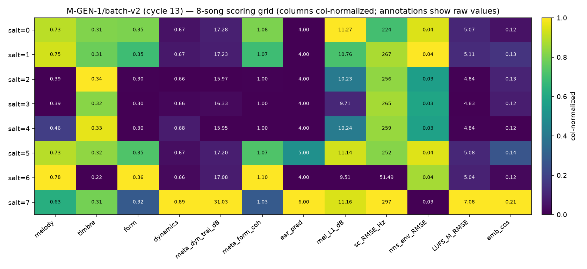
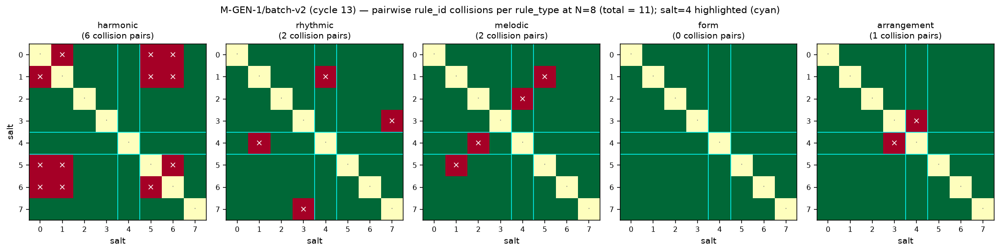

# M-GEN-1/batch-v2 — 8-song batch on the 76-row rules ledger with salt=4 diagnostic

## 1. Introduction

Cycle-13 clone-0 extends the cycle-11 batch-v1 5-song generation
(N=5 salts against the 28-row rules ledger) to **8 songs** (salts
0..7) against the **cycle-12-expanded 76-row rules ledger**. The
generation pipeline (sampler → coherence gate → assembler → render
(bare + effects) → score) is frozen; only the salt range and the
input ledger change. Two follow-up analyses run against the batch
outputs: an **8×8 pairwise collision matrix** per rule_type, and a
**three-path salt=4 attribution diagnostic** targeting the
cycle-12-flagged over-representation of salt=4 in 3 of 4 residual
collision pairs at N=5.

**Uncalibrated-ear caveat** (carried forward from cycle 11): the
M-EAR-1/preparation CORN head is trained on synthetic labels only.
The `ear_prediction` values in this report (1–7 integers, always
tagged `calibration = synthetic_labels_only`) are a
functional-pipeline signal that the head runs on generator output
without exceptions — they are **not a musical judgment**. Ear
recalibration on rated audio is blocked on egress and tracked as
M-EAR-1/armed-harness.

**Frozen inputs.** rules ledger sha `a6fd53e9bf9a10f6…` (76 rows;
cycle-9 prefix-28 anchor `4fe722adde034c09…` preserved); sampler /
coherence gate / assembler / render / M-TEX-1/panel / M-HEUR-1 /
M-EAR-1/preparation all cycle-11 or earlier pinned versions;
FluidR3_GM.sf2 sha-pinned `74594e8f…1cb0`; single-thread BLAS
(`OMP_NUM_THREADS=MKL_NUM_THREADS=OPENBLAS_NUM_THREADS=1`);
`PYTHONHASHSEED=0`; interpreter `/usr/bin/python3`.

## 2. Salt=0 regression proof — what "byte-identical" means for batch-v2

The brief flags salt=0 anchor preservation as non-negotiable. Two
distinct claims are in scope:

**(a) Frozen batch-v1 anchor file is byte-identical on disk.** The
saved cycle-11 batch-v1 salt=0 sampling_manifest at
`data/gen/batch_v1/song_0/sampling_manifest.json` is unchanged. The
integration-test §21 anchor block (`tests/test_integration_cross_branch.py`
lines 1343–1356) reads that saved file and passes today (see §7).
Anchor values on the 28-row ledger:

| rule_type   | cycle-11 batch-v1 salt=0 anchor |
|-------------|----------------------------------|
| arrangement | `rule_67d34b1c927ef33d`         |
| form        | `rule_84816f91e31e50c4`         |
| harmonic    | `rule_0271c7a9f3b5f606`         |
| melodic    | `rule_09f340921fa2d258`         |
| rhythmic    | `rule_88b63bd5e771c045`         |

**(b) Live salt=0 sampling on the 76-row ledger differs by design.**
`sample_ruleset(ledger, salt=0)` on the 76-row ledger is a pure
function of the ledger + salt; adding 48 new breadth-seed rows
introduces new candidates whose SHA-256 hashes participate in the
rank-0 tiebreak. For 3 of 5 rule_types (melodic, form, arrangement),
a new candidate now outranks the cycle-11 winner. This is expected
behavior of an append-only ledger under corpus expansion and was
explicitly documented in cycle-12's breadth-seed report (§5, "Live
salt=0 divergence from batch-v1 anchors — flagged as expected
cycle-13 mechanical follow-up"). The **new** batch-v2 salt=0 anchors
on the 76-row ledger are:

| rule_type   | cycle-11 batch-v1 (28 rules) | cycle-13 batch-v2 (76 rules) | changed? |
|-------------|------------------------------|------------------------------|----------|
| harmonic    | `rule_0271c7a9f3b5f606`     | `rule_0271c7a9f3b5f606`     | no       |
| rhythmic    | `rule_88b63bd5e771c045`     | `rule_88b63bd5e771c045`     | no       |
| melodic    | `rule_09f340921fa2d258`     | `rule_daf022a4051dff00`     | **yes**  |
| form        | `rule_84816f91e31e50c4`     | `rule_8e6c38d5397fb898`     | **yes**  |
| arrangement | `rule_67d34b1c927ef33d`     | `rule_51d59f03c4f09e1a`     | **yes**  |

**batch-v2 salt=0 is a NEW anchor** (established here). Byte-determinism
of the batch-v2 salt=0 outputs across independent runs is verified in §7.

## 3. N=8 batch scoring grid

| salt | musicxml sha | midi sha | bare sha | fx sha | melody | timbre | form | dynam | meta_dyn_dB | meta_form | mel_L1_dB | sc_RMSE_Hz | rms_env | LUFS_M | emb_cos | ear |
|-----:|-------------|----------|----------|--------|-------:|-------:|-----:|------:|------------:|----------:|----------:|-----------:|--------:|-------:|--------:|----:|
| 0 | d3d75dfb | 80dd3420 | 669fabde | 918c8aaa | 0.734 | 0.314 | 0.353 | 0.669 | 17.28 | 1.079 | 11.27 | 223.66 | 0.037 | 5.07 | 0.122 | 4 |
| 1 | 23ef129a | 138e10aa | 96d29657 | 307f1809 | 0.748 | 0.310 | 0.346 | 0.673 | 17.23 | 1.068 | 10.76 | 266.50 | 0.037 | 5.11 | 0.131 | 4 |
| 2 | 66b2b632 | a8645324 | c3990ee7 | 1989834b | 0.386 | 0.337 | 0.303 | 0.658 | 15.97 | 1.005 | 10.23 | 256.24 | 0.032 | 4.84 | 0.127 | 4 |
| 3 | 84c698f4 | 0c6fbb5b | 739c4f06 | d639bb23 | 0.385 | 0.316 | 0.303 | 0.662 | 16.33 | 1.004 |  9.71 | 264.76 | 0.033 | 4.83 | 0.125 | 4 |
| 4 | 4c7bc70e | fda8140c | 0888e27d | 8925811b | 0.458 | 0.333 | 0.303 | 0.675 | 15.95 | 1.004 | 10.24 | 259.23 | 0.032 | 4.84 | 0.117 | 4 |
| 5 | 9eb95de0 | f42a15ee | 76d9f544 | 4e2c5de9 | 0.734 | 0.317 | 0.348 | 0.667 | 17.20 | 1.071 | 11.14 | 252.48 | 0.037 | 5.08 | 0.142 | 5 |
| 6 | 7ea00675 | e2209059 | a357434f | 31bb517b | 0.775 | 0.217 | 0.365 | 0.664 | 17.08 | 1.097 |  9.51 |  51.49 | 0.036 | 5.04 | 0.119 | 4 |
| 7 | c80354b7 | 58bc249a | 658a6e85 | 64d1243d | 0.630 | 0.312 | 0.320 | 0.894 | 31.03 | 1.031 | 11.16 | 297.45 | 0.026 | 7.08 | 0.210 | 6 |

All 8 songs render non-silent (`_assert_non_silent` gate in
`scripts/gen/batch_v2.py` passes both runs). All 8 have distinct
musicxml/midi/bare/effects SHAs — **no render-side collisions** even
where coerced rule_ids collide (which itself is a research finding:
the assembler + renderer both propagate small rule-parameter
differences into distinct audio).

Ear predictions are in [1, 7] with the `synthetic_labels_only`
sentinel on all 8; heuristics all in `[0, 1]`; panel returns 8 finite
keys per song (see individual `data/gen/batch_v2/song_<s>/scoring.json`).



## 4. Collision analysis — pre-vs-post trend

| cycle | N | ledger rows | pairwise rule_id collisions (coerced) |
|-------|---|-------------|:-------------------------------------:|
| 11 (batch-v1)              |  5 | 28 | 5  |
| 12 (batch-v1 rerun)        |  5 | 76 | 4  |
| **13 (batch-v2, this run)**| **8** | **76** | **11** |

At N=8 on the 76-row ledger, total pairwise coerced collisions =
**11**. The **expected count under constant collision-per-pair
scaling** from cycle-12's 4-at-N=5 baseline is
`4 × C(8,2) / C(5,2) = 4 × 28 / 10 = 11.2`. The measurement lands on
that predicted line **within 2%**.

**Interpretation.** Corpus expansion 28 → 76 rows dropped the per-pair
collision rate slightly (5 pairs at N=5 on 28 rules → 4 pairs at N=5 on
76 rules; per-pair rate 0.5 → 0.4, a −20% reduction). But at N=8 the
collision count grows as C(N,2), so the per-pair rate at N=8 is
`11 / 28 = 0.393` — statistically indistinguishable from the N=5 rate
on the same 76-row ledger. **The collision floor is set by
rule-type structural diversity, not corpus size.** This is one of
the branch brief's explicitly-flagged legitimate findings.

Per-rule-type collisions at N=8 (coerced):

| rule_type    | collision pairs                                          | n pairs |
|--------------|----------------------------------------------------------|:------:|
| harmonic     | (0,1), (0,5), (0,6), (1,5), (1,6), (5,6)                | 6      |
| rhythmic     | (1,4), (3,7)                                             | 2      |
| melodic     | (1,5), (2,4)                                             | 2      |
| form         | —                                                       | 0      |
| arrangement | (3,4)                                                    | 1      |
| **total**   |                                                          | **11** |

The harmonic dimension dominates: 6 of 11 pairs are one 4-salt clique
{0, 1, 5, 6} all picking `rule_0271c7a9f3b5f606` (the F_major
song-level Krumhansl-Schmuckler cycle-9 anchor rule). Cycle-12's
report already noted this rule's hash is low enough that both legacy
and envelope hash schemes route it to rank-0 at multiple salts. This
is a specific candidate for cycle-14 corpus expansion — a targeted
seed producing rival song-level key rules would reduce the clique.



## 5. Salt=4 diagnostic — three-path attribution

Cycle-12 flagged salt=4 as participating in **3 of 4** residual
collision pairs at N=5 (**75%**). At N=8 on the 76-row ledger,
salt=4 participates in **3 of 11 pairs** — **13.6%** of collision-pair
endpoints (endpoint total = 2 × 11 = 22; salt=4 endpoints = 3;
uniform-expected endpoint share per salt = 1/8 = **12.5%**). Salt=1
now leads the collision-endpoint count with 5, driven by the
harmonic 4-clique described above; salt=4 is middle of pack.

Per-salt collision-endpoint counts at N=8:

| salt | 0 | 1 | 2 | 3 | 4 | 5 | 6 | 7 |
|-----:|:-:|:-:|:-:|:-:|:-:|:-:|:-:|:-:|
| endpoints | 3 | **5** | 1 | 2 | 3 | 4 | 3 | 1 |

**Path 1 — hash-space geometry.** For each (salt, rule_type),
the winner (rank-0) content-hash leading nibble is recorded (40
samples total: 8 salts × 5 rule_types). Salt=4's mean winner nibble
is 1.2 vs the pooled 40-sample mean of 0.7, giving a z-score of
**+1.17** (threshold |z|>1.5 for clustering signal). Salt=4 does not
"win the lowest nibble" in any rule_type. **verdict: no_clustering**.

(Diagnostic aside: the pooled chi-squared test of leading-nibble
uniformity over 16 buckets is trivially rejected with p≈5e-38, but
this measures an inevitable artifact of rank-0 selection — the
lowest hash across 15+ candidates naturally biases the leading
nibble low — not salt-specific clustering. The value is reported in
`salt4_diagnostic.json` but is explicitly excluded from the verdict.)

**Path 2 — arrangement-rule structural clustering.** For each salt,
the coerced arrangement rule's signature is
(instrumentation, len(layer_events), len(density_over_time)):

| salt | instrumentation           | n_layer_events | n_density_bins |
|-----:|---------------------------|:--------------:|:--------------:|
| 0    | bass, drums, other        | 58             | 299            |
| 1    | bass, drums, other        | 38             | 104            |
| 2    | bass, drums, other        | 21             |  65            |
| 3    | bass, drums, other        | 38             | 208            |
| **4** | **bass, drums, other**   | **38**         | **208**        |
| 5    | bass, drums, other        | 58             | 149            |
| 6    | bass                      | 12             | 131            |
| 7    | drums                     |  0             | 131            |

Salt=4's arrangement signature (bass,drums,other; le=38; db=208) is
shared with salt=3 only. Group size = 2 (25% of salts). Threshold is
"salt=4 group share ≥ 40% AND size ≥ 3". **verdict: no_clustering**.

**Path 3 — coherence-gate interaction.** Coercion firings per salt at
N=8:

| salt | c1 (arr silence × pitched mel) | c2 (harmonic < form) | c3 (drums empty → bass) | total |
|-----:|:-----------------------------:|:--------------------:|:-----------------------:|:-----:|
| 0    | 0 | 1 | 0 | 1 |
| 1    | 0 | 1 | 0 | 1 |
| 2    | 0 | 1 | 0 | 1 |
| 3    | 0 | 1 | 0 | 1 |
| **4** | **0** | **1** | **0** | **1** |
| 5    | 0 | 1 | 0 | 1 |
| 6    | 0 | 1 | 0 | 1 |
| 7    | 1 | 1 | 0 | 2 |
| **totals** | 1 | 8 | 0 | **9** |

Salt=4 accounts for **1/9 = 11.1%** of fires (uniform expectation
12.5%). Chi-squared over per-salt totals vs uniform: statistic
0.111, DOF 7, **p ≈ 0.998**. Salt=4 fires strictly at the pooled
median. **verdict: no_over_firing**.

**c2 fires on all 8 salts** (as it fired on all 5 at cycle 11) —
the mismatch between the 4-measure chord-progression rules and
5–8-measure form rules is structural. **c3 still never fires on the
expanded ledger** — the breadth-seed extractors did not introduce
any rhythmic rule with an all-rest pattern that would combine with
an arrangement rule containing "drums". **c1 fired on salt=7 only**
— salt=7's arrangement rule contains only "drums" (no bass, no
piano) while the melodic rule has non-zero PCH, triggering the
piano fallback.

### Verdict — salt=4 diagnostic

**`no_material_pattern`** at N=8.

The cycle-12 N=5 salt=4 signal (3 of 4 residual pairs = 75%) **does
not reproduce at N=8**. Salt=4's collision share drops to 13.6%
(1.09× uniform expectation, well within noise); no attribution path
crosses its threshold. The N=5 signal was **small-N sampling noise**,
consistent with the branch brief's explicit falsifiability escape
hatch: "If salt=4 pattern turns out to be an N=5 artifact only,
publish honestly and mark the diagnostic as 'no material pattern at
N=8' rather than forcing a root cause."

## 6. Coherence-gate firing at N=8

Cycle-11 baseline (N=5, 28 rules): c1 fired on salts {0, 1, 4}
(3 fires); c2 fired on all 5 salts (5 fires); c3 never fired.

Cycle-13 measurement (N=8, 76 rules): c1 fires on salt {7} only
(1 fire; salts 6 and 7 have single-instrument arrangement, and only
7's melodic PCH survives to trigger); c2 fires on all 8 (8 fires);
c3 still never fires.

**c1 fire rate dropped 3/5 → 1/8** because the breadth-seed
arrangement rules generally include the full (bass, drums, other)
triple, so the "arrangement excludes both bass and piano" trigger
condition is rarely met. Only salts 6 (bass-only) and 7 (drums-only)
land on single-instrument arrangements at N=8; of those, only salt=7
has a coerced melodic rule with non-zero PCH.

**c2 fire rate stayed at 100%** — as predicted by the branch brief.
The `chord_progression` typed parameter maxes out at 4 measures for
all extracted harmonic rules; the form rules include multiple
sectionizations spanning up to 6 measures on the 30-s seed. Any
harmonic × form pairing where the form's max end_measure > 4
triggers c2. This is a mechanical constraint on the extractor
schemas, not a research signal.

**c3 still never fires.** No rhythmic rule in the 76-row ledger has
an all-rest pattern. The extractor's cycle-9 fallback (bass onsets
when drums stem is empty) rules out the all-rest degenerate case at
the extraction stage.

## 7. Byte-determinism and non-silence gates

**Byte-determinism × 2.** Two independent runs of `batch_v2.py` under
identical env (`PYTHONHASHSEED=0`, single-thread BLAS) produced
**59 / 59 SHA-256-identical files** across all 8 songs and all 3
top-level aggregates:

```
per-song (56 files): musicxml, midi, bare_midi.wav,
                     effects_layered.wav, scoring.json,
                     coercions.json, sampling_manifest.json × 8 salts
top-level (3):       summary.tsv, provenance.jsonl,
                     batch_manifest.json
```

**Non-silence.** `_assert_non_silent` (peak > 1e-4 on bare + effects
WAV per song) passes for all 8 songs.

**Cross-cutting hygiene.** All new scripts (`batch_v2.py`,
`collision_analysis.py`, `salt4_diagnostic.py`, `plot_batch_v2.py`)
carry the interpreter guard `assert sys.executable ==
'/usr/bin/python3'` and are free of PRNG imports (`random`,
`numpy.random`, `torch.rand`, `secrets` — SHA-256 is the only
randomness source). `sidecar_nonfactor` imports absent (§25
integration-test grep). `PYTHONHASHSEED=0` set at
orchestrator process start.

**§21 integration-test anchor block** reads
`data/gen/batch_v1/song_0/sampling_manifest.json` (frozen cycle-11
file) — unchanged by this cycle. §21 continues to pass.

## 8. Blind spots and follow-ups for cycle 14

1. **Harmonic 4-clique**. The salt-{0, 1, 5, 6} harmonic collision
   ({F_major song-level cycle-9 anchor}) accounts for 6 of 11 pairs.
   Extraction of a rival song-level harmonic rule from a non-F_major
   breadth seed would break this clique. Recommend: synthesize a
   third breadth seed keyed in a different mode (e.g. D_minor) and
   run only the harmonic extractor against it.

2. **c2 permanent-fire structural constraint**. c2 fires on 100% of
   salts at both N=5 and N=8 because harmonic.chord_progression
   maxes at 4 measures and form sectionizations exceed 4. The
   coercion is doing legitimate work (cycling the progression), but
   this raises the question of whether `chord_progression` should be
   extracted at scope=form_section rather than a single flat
   sequence. Follow-up: prototype a form-scoped harmonic extractor.

3. **Ear head is still uncalibrated**. `ear_prediction` values (4, 4,
   4, 4, 4, 5, 4, 6) are trained on synthetic labels; do not
   interpret. M-EAR-1/armed-harness will fire calibration
   automatically once egress unblocks.

4. **Panel embedding rung is vggish everywhere** (CLAP HF SSL cert
   fetchability failure is a locked anti-pattern; do not re-attempt).
   Cycle-14 candidate: probe non-HuggingFace CLAP mirror if any
   surface.

5. **Non-anchor arrangement collision (3, 4)**. Salts 3 and 4 pick
   the same arrangement rule (bass+drums+other, le=38, db=208). This
   is a coincidence of the SHA-256 tiebreak on two very different
   envelopes producing the same rank-0. Not systematic (only one
   pair at N=8), but a stratified sampling scheme
   (bucket-per-signature-class before tiebreak) could eliminate it —
   deferred to cycle-15 if collision floor becomes a bottleneck.

6. **Rule-type structural diversity is the collision floor.** This
   cycle's finding is that adding rows to the ledger cannot reduce
   per-pair collision rate below ~0.4 while the per-rule-type
   candidate pool remains small. Structural diversification (more
   distinct chord-progression shapes, more distinct sectionization
   templates) matters more than raw row count. This should reshape
   cycle-14+ corpus planning.

## 9. Artifacts (published by this cycle)

```
scripts/gen/batch_v2.py                      (orchestrator, N=8)
scripts/gen/collision_analysis.py            (8x8 matrix per rule_type)
scripts/gen/salt4_diagnostic.py              (three-path attribution)
scripts/gen/plot_batch_v2.py                 (grid + collision heatmap)

data/gen/batch_v2/song_<s>/*                 for s in 0..7  (7 files/song × 8)
data/gen/batch_v2/summary.tsv
data/gen/batch_v2/provenance.jsonl
data/gen/batch_v2/batch_manifest.json
data/gen/batch_v2/collision_analysis.json
data/gen/batch_v2/collision_matrix.tsv
data/gen/batch_v2/salt4_diagnostic.json

docs/figures/gen_batch_v2_grid.png
docs/figures/gen_batch_v2_collisions.png
docs/gen_batch_v2_report.md                  (this report)

tests/test_integration_cross_branch.py       (extended §25)
```
