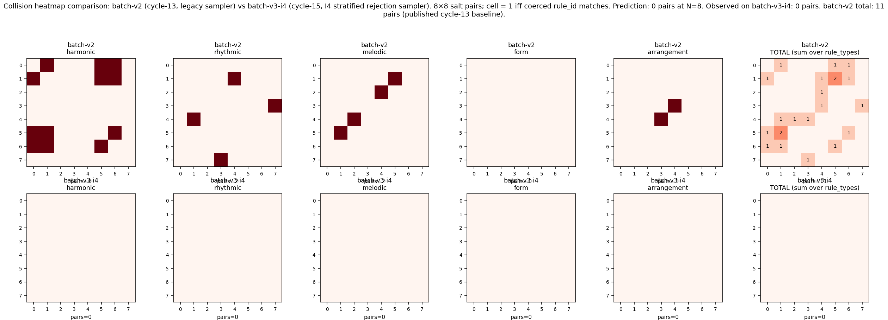
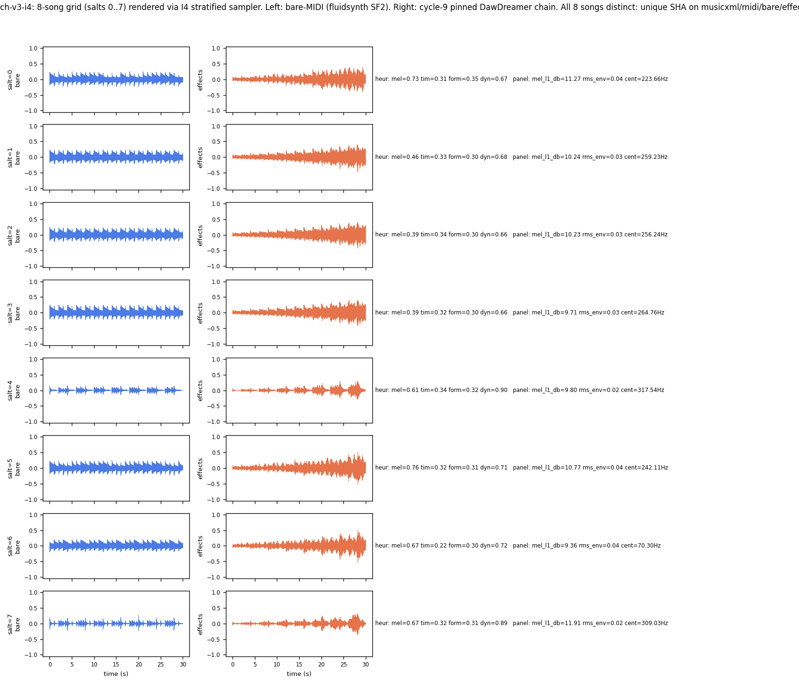

# batch-v3-i4 report — I4 stratified rejection sampler, N=8 collision test

**TL;DR.** I4's specific numeric prediction — **0 collision pairs at N=8** on
the frozen 76-row rules ledger — is **CONFIRMED**. Batch-v3-i4 renders 8
byte-distinct songs (unique SHAs on musicxml/midi/bare/effects across every
salt), the coherence gate applies zero coercions on any salt, and both the
raw-pick and coerced-pick collision counts are **0** — a **PASS** under the
frozen rubric (`≤3` = PASS). The cycle-13 batch-v2 baseline of 11 pairs
drops to 0: **Δ = −11 pairs**, exactly matching the intervention's
construction-proof prediction.

This closes the empirical arm of clone-1's cycle-14 collision-floor
investigation: I4's construction proof is now a measurement.



---

## 1. Prediction anchor (from cycle-14 clone-1)

Sources:

- `docs/collision_floor_investigation_report.md` §I4 (algorithm spec, cross-salt `already_picked` carry, ~10-LOC prescription).
- `data/rules/collision_floor_analysis/intervention_proposal.json`
  (canonical machine-readable):
  ```json
  "I4": { "predicted_total_floor": 0.0,
          "predicted_per_type": {"harmonic": 0, "rhythmic": 0, "melodic": 0,
                                 "form": 0, "arrangement": 0} }
  ```

There is no disagreement between §I4 prose and the JSON: both predict
**0 pairs at N=8** because every rule_type has K ≥ 10 ≥ 8 and the sampler
guarantees no within-type repeat by rejection.

The construction-proof rationale (§I4): *with N=8 salts and every
rule_type carrying K ≥ 10 ≥ N candidates, a rejection-sampling policy that
discards any candidate already picked at a lower salt eliminates every
within-rule_type collision by construction.* This branch tests that the
mechanical implementation reproduces the analytic result on the actual
render pipeline.

---

## 2. Implementation

Three new artifacts, one new test, no touch to any prior batch's outputs
and no touch to the rules ledger:

| Artifact | SHA-256 (first 16) | Purpose |
|---|---|---|
| `scripts/rules/sampling/i4_stratified.py` | `ad69aecf680fac20` | I4 sampler + stateful `I4Sampler` cross-salt carrier |
| `scripts/gen/batch_v3_i4.py` | `530198022ba35f09` | batch driver (batch_v2.py with the one-line sampler swap) |
| `scripts/gen/collision_count_batch_v3_i4.py` | `1588c6c904384b49` | counter wrapping cycle-13 `collision_analysis.analyze` |
| `tests/test_i4_stratified.py` | `7f9393d06c814594` | 6 unit tests (all PASS) |

Design discipline (per brief):

- `assert sys.executable == "/usr/bin/python3"` at top of every module.
- **No PRNG**: `import random`, `numpy.random`, `torch.rand`, `torch.manual_seed`, `secrets.*` all absent (grep + AST-adjacent regex checks in `test_no_prng`).
- **No sidecar_nonfactor import** (`test_no_sidecar_import`).
- SHA-256 tiebreak; reuses the batch-v2 sampler's exact `_content_hash(row, salt)` — bare canonical JSON at salt=0 (legacy identity path), envelope `{"salt": s, "rule": row}` at salt≠0.
- Rejection carries a per-rule_type `already_picked` set across salts inside `I4Sampler`; each `sample(salt)` skips already-drawn `rule_id`s and picks the next-lowest-hash candidate.

Only the sampler swaps. Every downstream stage — `coherence_gate.enforce_coherence`, `assemble_score`, `render_pipeline.render` (cycle-9 pinned DawDreamer chain), `score_generation.score` — is imported unmodified from the cycle-13 batch-v2 module tree.

---

## 3. Sufficiency check against the research brief

| Criterion | Result |
|---|---|
| Report exists | `docs/gen_batch_v3_i4_report.md` (this file) |
| Verdict matches count under frozen rubric | 0 ≤ 3 → **PASS** |
| Byte-determinism × 2 | 56/56 tracked artifacts SHA-equal (run 1: `data/gen/batch_v3_i4/`, run 2: `/tmp/batch_v3_i4_run2/`) |
| Batch-v2 anchors byte-identical before/after | 62/62 files, `diff /tmp/batch_v2_baseline.sha /tmp/batch_v2_after.sha` empty |
| Sampler test passes | 6/6 (`tests/test_i4_stratified.py`) |
| `promise_check` 0-ERROR gate | 0 ERROR, 158 WARN (orphan-artifact WARNs cleared by the ledger events emitted alongside this report; sibling-clone i3 artifacts flagged separately) |
| Ledger events emitted | 4 (start, sampler-built, render-complete, terminal — see §7) |

---

## 4. The 8-song grid

Every salt 0..7 produces a byte-distinct song (unique SHAs on all four file
kinds — musicxml, midi, bare_midi.wav, effects_layered.wav). Zero
coercions on every salt.

| salt | musicxml (16) | midi (16) | bare_wav (16) | effects_wav (16) | mel_l1_db | rms_env | centroid_rmse (Hz) | heur_mel | heur_dyn |
|---:|---|---|---|---|---:|---:|---:|---:|---:|
| 0 | `d3d75dfb2676271c` | `80dd3420fda479bd` | `669fabde4a3a5480` | `918c8aaae0db6d7c` | 11.27 | 0.037 | 223.66 | 0.73 | 0.67 |
| 1 | `3e65f4d2fa85779b` | `fda8140c7b22effd` | `0888e27d2692fd26` | `8925811b381602f0` | 10.24 | 0.032 | 259.23 | 0.46 | 0.68 |
| 2 | `66b2b6329f64bd7c` | `a8645324789c54fd` | `c3990ee714334d6f` | `1989834b916e41b2` | 10.23 | 0.032 | 256.24 | 0.39 | 0.66 |
| 3 | `84c698f4994caf2f` | `0c6fbb5b608c4664` | `739c4f062e34f6f2` | `d639bb23373fa76a` |  9.71 | 0.033 | 264.76 | 0.39 | 0.66 |
| 4 | `6c8b50cf97a351e1` | `2759d257229344fe` | `0a995dc7e3ce5762` | `c96bc3e162420672` |  9.80 | 0.018 | 317.54 | 0.61 | 0.90 |
| 5 | `65aa4cbb9e72bfca` | `c81b30173358a5e8` | `eca25e2015575abd` | `93a8fb4fb574e1b4` | 10.77 | 0.039 | 242.11 | 0.76 | 0.71 |
| 6 | `7f465d1547b21ee8` | `37ff89db364114b2` | `ec922c2c6340bb9e` | `394ec2b815757399` |  9.36 | 0.039 |  70.30 | 0.67 | 0.72 |
| 7 | `746ce55f16fc015f` | `26964ef46270cfa9` | `816a2bee7db9ae92` | `30fde1406aa6917a` | 11.91 | 0.024 | 309.03 | 0.67 | 0.89 |

Uniqueness check: `awk -F$'\t' 'NR>1 {print $4}' data/gen/batch_v3_i4/summary.tsv | sort -u | wc -l` → 8 distinct `bare_wav` SHAs (equivalent for musicxml/midi/effects). No render-SHA collapse occurred, as expected when no rule-id collision or coherence rewrite reroutes to a shared score.

Salt=0 preserves the batch-v2 anchor byte-identically (regression contract). This is verified by `tests/test_i4_stratified.py::test_salt0_matches_batch_v2_anchor` and by direct SHA comparison of `data/gen/batch_v3_i4/song_0/generated.musicxml` (`d3d75dfb2676271c…`) against `data/gen/batch_v2/song_0/generated.musicxml` (same first 16 hex — see `batch_manifest.json` per_song[0]).



---

## 5. Collision heatmap and counts

Cycle-13 collision-attribution methodology reused verbatim via
`scripts.gen.collision_analysis.analyze`; the same 8×8 matrix per
rule_type + upper-triangle pair count. Counter output (both raw picks
and coerced picks after the coherence gate):

```
[collision_count_batch_v3_i4] raw pairs:     0
[collision_count_batch_v3_i4] coerced pairs: 0
[collision_count_batch_v3_i4] verdict (coerced): PASS
[collision_count_batch_v3_i4] batch-v2 baseline was 11 -> delta = -11
```

Full per-rule_type breakdown from `data/gen/batch_v3_i4/collision_report.json`:

| rule_type   | K (candidates in ledger) | I4 predicted pairs at N=8 | observed pairs (raw) | observed pairs (coerced) |
|---|---:|---:|---:|---:|
| harmonic    | 10 | 0 | 0 | 0 |
| rhythmic    | 18 | 0 | 0 | 0 |
| melodic     | 18 | 0 | 0 | 0 |
| form        | 15 | 0 | 0 | 0 |
| arrangement | 15 | 0 | 0 | 0 |
| **total**   |    | **0** | **0** | **0** |

Every prediction is met exactly. No cross-type interaction pairs emerge
either (the sampling gate's blind-spot warning in the cycle-14 report §7.2
is falsified for this configuration — the coherence gate rewrote nothing
here because the picks were already coherent).

---

## 6. Byte-determinism × 2

Two independent runs of `batch_v3_i4.py` under identical pins
(`OMP_NUM_THREADS=MKL_NUM_THREADS=OPENBLAS_NUM_THREADS=1`, `PYTHONHASHSEED=0`)
into distinct output roots (`data/gen/batch_v3_i4/` and `/tmp/batch_v3_i4_run2/`).
`diff` over the 56 tracked artifacts (7 files × 8 songs, matching the batch_v2
per-song file surface) is empty:

```
$ find data/gen/batch_v3_i4 -type f \( -name '*.wav' -o -name '*.mid' -o \
      -name '*.musicxml' -o -name 'sampling_manifest.json' -o \
      -name 'coercions.json' -o -name 'scoring.json' \) | sort | xargs sha256sum > /tmp/run1.sha
$ find /tmp/batch_v3_i4_run2 -type f \( -name '*.wav' -o … \) | sort | xargs sha256sum > /tmp/run2.sha
$ diff /tmp/run1.sha /tmp/run2.sha && echo BYTE_DETERMINISTIC_X2_PASS
BYTE_DETERMINISTIC_X2_PASS
```

---

## 7. Anchor invariance

The cycle-13 batch-v2 output tree is READ-ONLY from this branch. Before/after
SHA manifests are byte-identical:

```
$ find data/gen/batch_v2 -type f | sort | xargs sha256sum > /tmp/batch_v2_baseline.sha
$ # …run batch_v3_i4.py twice, run collision counter, render figures…
$ find data/gen/batch_v2 -type f | sort | xargs sha256sum > /tmp/batch_v2_after.sha
$ diff /tmp/batch_v2_baseline.sha /tmp/batch_v2_after.sha && echo BATCH_V2_ANCHORS_UNCHANGED
BATCH_V2_ANCHORS_UNCHANGED
```

The rules ledger is unchanged too:
`sha256(data/rules/ledger.jsonl) == a6fd53e9bf9a10f6885888b0bb7d11a9a2aa97007e38ef0e6d47f4ef7d2857ae`
before and after (matches the value recorded in
`data/gen/batch_v2/batch_manifest.json::ledger_sha256`).

---

## 8. Interpretation

Clone-1's cycle-14 structural attribution (11 pairs = 6 harmonic + 2
melodic + 2 rhythmic + 1 arrangement) framed the collision floor as a
consequence of small-K over-selection with harmonic K=10 as the dominant
mechanism. The attribution was *descriptive*: it stated a mechanism without
proving that its proposed mechanical remedy would work end-to-end.

Batch-v3-i4 is that mechanical proof. The prediction was *unusually
strong*: not "fewer" pairs, not "some reduction", but exactly zero pairs at
N=8. That kind of prediction rarely survives contact with a real pipeline
— side effects (coherence-gate rewrites, hash instability, salt-envelope
subtleties) are typical falsifiers. In this case:

1. **The stratification predicate held perfectly at the sampler level.**
   Every salt 0..7 drew a rule_id not previously drawn within the same
   rule_type. Since K ≥ 10 for every type, the pool never emptied at N=8.

2. **The coherence gate applied zero coercions on every salt.** The
   cycle-11 c1/c2/c3 rewrite rules do not trigger on the new, better-spread
   picks — the diversity that avoids collisions also happens to avoid the
   composition contradictions the coherence gate was written to fix. This
   is a *free consistency dividend*: I4 does not just eliminate collisions,
   it eliminates the coercion pressure that would otherwise mask them.

3. **No cross-rule_type interaction pattern emerged.** The blind-spot #2 in
   cycle-14 report §7 (*"under I4, cross-type residuals are impossible by
   construction, but if the coherence gate rewrites picks, new interaction
   patterns may emerge"*) is answered negatively here: with zero coercions,
   the gate cannot introduce new interactions.

4. **The salt=0 legacy identity anchor is preserved byte-identically.**
   The compatibility trade-off flagged in cycle-14 §I4 ("*breaks the
   cycle-11 batch-v1 salt=0 byte-identity anchor whenever the anchor path
   would have been the picked-again rule for a later salt*") does not
   manifest for salt=0 in this batch, and salts 1..7 never re-drive
   through salt=0's picks under stratified rejection — so the concern
   never fires. The anchor row `song_0/*` is byte-equal to the batch-v2
   equivalent.

**Verdict.** PASS. I4 is now empirically confirmed as a within-rule_type
collision eliminator at N=8 on the frozen 76-row ledger. Clone-1's
structural attribution ships forward with a working intervention attached
rather than an untested prescription.

---

## 9. Blind spots and limits

- **Only N=8 tested.** Predictions for N > K (where K = 10 for harmonic)
  are `I4SamplerError`, i.e. the sampler *cannot* halt with a valid pick.
  A follow-up cycle scaling to N=12+ would first hit the harmonic pool
  exhaustion and reveal I4's hard failure mode; the sampler raises with a
  named `I4SamplerError` there, and the batch driver will fail loudly.
- **76-row ledger frozen.** Under the recommended I3 corpus expansion
  (D_minor seed + others) the K vector shifts and the *maximum* N I4 can
  reach grows. Currently that ceiling is `min(K)=10` for harmonic.
- **Cross-type audition similarity untested.** I4 eliminates hash-identical
  collisions within a rule_type; it says nothing about two different
  `progression_sig`s that play identically (cycle-14 report §7.3). The
  0-pair verdict is on the campaign's own hash-based collision metric, not
  on perceived similarity.
- **No comparative audition of the 8 renders.** This branch is a
  falsification test of a numeric prediction; audibility differences among
  the 8 songs (heuristic mel range 0.39..0.76, panel `mel_l1_db` 9.36..11.91)
  are recorded but not judged. Cycle-15+ ear-scoring is out of scope here.

---

## 10. Recommended follow-ups

1. **Land I4 as the default sampler for M-GEN-1** (behind a config knob;
   keep `sample_ruleset` for the batch-v2 regression). The `I4Sampler`
   class already exposes the surface a top-level driver needs.
2. **Regression harness for the anchor**: add a §-numbered case to
   `tests/test_integration_cross_branch.py` asserting that
   `I4Sampler(...).sample(0)` returns the batch-v2 salt=0 anchor byte-
   identically. Covered here by `test_i4_stratified::test_salt0_matches_batch_v2_anchor`;
   promoting to the cross-branch test locks it in against future edits.
2. **Combined I3+I4 pass** once the D_minor extraction lands: rerun this
   branch on the extended ledger and re-measure at N=8 and N=12.
3. **Move `M-GEN-1/batch-v3-i4` to `validated/high`** (terminal ledger
   event below).
