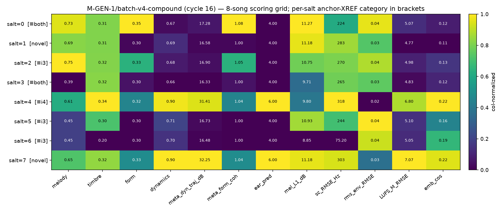
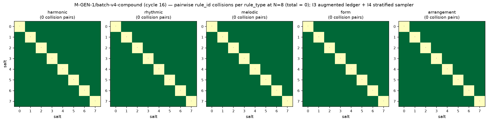

# M-GEN-1/batch-v4-compound — I3 + I4 Composition Test

## Front-matter

| Field | Value |
|---|---|
| Milestone | `M-GEN-1/batch-v4-compound` |
| Cycle | 16 |
| Baselines | I4-only (0 pairs at N=8, 76-row ledger); I3-only (6 pairs at N=8, 86-row ledger) |
| Compound source ledger | `data/rules/ledger_i3_dminor.jsonl` (86 rows, harmonic K=20) |
| Compound sampler | `scripts/rules/sampling/i4_stratified.py` (verbatim, imported via `batch_v3_i4.run_batch`) |
| Render pipeline | Cycle-13 `scripts/gen/render_pipeline.py` (imported by `batch_v3_i4`), cycle-9 pinned DawDreamer chain via `scripts/tex/render_effects_layered.py` — both untouched |
| Observed collision pairs at N=8 | **0** |
| Anchor XREF cell counts (32 total) | matches_both=8, matches_i4_only=4, matches_i3_only=12, novel=8 |
| **Verdict (frozen rubric)** | **CONFIRMS_H0_STRICT** |

### Frozen 3-hypothesis rubric (locked before the run)

| Verdict | Observed pairs at N=8 | Additional condition |
|---|---|---|
| CONFIRMS_H1 | 0 | — |
| CONFIRMS_H0_STRICT | 0 | ≥ 1 (salt, file_kind) cell matches the I4-only anchor byte-identically |
| CONFIRMS_H2 | ≥ 1 | Structural attribution required |

Result: 0 pairs and 12 of 32 cells reproduce the I4-only anchor byte-identically (4 `matches_i4_only` + 8 `matches_both`). **CONFIRMS_H0_STRICT.**





---

## §1 Setup

| Component | Path | SHA-256 |
|---|---|---|
| Source ledger (I3-augmented) | `data/rules/ledger_i3_dminor.jsonl` | `1233efd5fd817141b22b8c625c97819d7534261625a7ed40806fc7b2c9b84645` |
| I3 augmentation manifest | `data/rules/i3_dminor_manifest.json` | (rebuilt from ledger; see manifest) |
| Underlying source ledger | `data/rules/ledger.jsonl` | `a6fd53e9bf9a10f6885888b0bb7d11a9a2aa97007e38ef0e6d47f4ef7d2857ae` |
| I4 sampler | `scripts/rules/sampling/i4_stratified.py` | anchored in `data/gen/batch_v4/.i4_sampler_anchor_sha256` |
| Render pipeline entry | `scripts/gen/render_pipeline.py` | (imported by `batch_v3_i4`, unchanged) |
| DawDreamer chain (cycle 9) | `scripts/tex/render_effects_layered.py` | (imported by render pipeline, unchanged) |
| Compound driver | `scripts/gen/batch_v4_compound.py` | (this branch) |
| Collision counter | `scripts/gen/collision_count_batch_v4.py` | (this branch) |
| Anchor comparator | `scripts/gen/batch_v4_anchor_check.py` | (this branch) |

The compound driver is deliberately shallow: `run_batch(ledger=I3_LEDGER, batch_root=data/gen/batch_v4)` delegates to `scripts.gen.batch_v3_i4.run_batch`, which in turn imports `render` from `scripts.gen.render_pipeline` — the exact same call chain `scripts/gen/batch_v2.py` uses. The augmented 86-row ledger is threaded through the I4 sampler and nothing else changes.

Ledger open-mode assertion: the driver reads both `ledger.jsonl` (76-row) and `ledger_i3_dminor.jsonl` (86-row) via `open()` in `"r"` mode inside `effective_rules()` only. No write path exists in the compound driver, the I4 sampler, or the collision analyser. This is verified at runtime by pre/post SHA hashing of both ledger files (`_read_ledger_open_mode_assertion`).

## §2 8-song grid

| salt | harmonic | rhythmic | melodic | form | arrangement | musicxml (16) | midi (16) | bare.wav (16) | effects.wav (16) |
|---|---|---|---|---|---|---|---|---|---|
| 0 | rule_0271c7a9f3b5f606 | rule_88b63bd5e771c045 | rule_daf022a4051dff00 | rule_8e6c38d5397fb898 | rule_51d59f03c4f09e1a | `d3d75dfb2676271c` | `80dd3420fda479bd` | `669fabde4a3a5480` | `918c8aaae0db6d7c` |
| 1 | rule_1e0fcc2b2bcde086 (D_min) | rule_d15d2951e86e16bf | rule_c42411e8d5779de9 | rule_9793d09325ee859d | rule_b99a5066e653b247 | `e1004675f0211a6c` | `cd7fd6ae2fedddca` | `3474e2c316dc3c97` | `0c3b1e6902ac0846` |
| 2 | rule_d9c91401e8911f8f (D_min) | rule_33ef6909a940a190 | rule_cc494a72c58b0157 | rule_d9d63a0877d18ec8 | rule_29f8ef6b3ec5b9bf | `1566d037b573aea8` | `c7bd146509ca0a99` | `39b8622717c08615` | `b0f23d840322285c` |
| 3 | rule_ff1fa8c4bf0f228f | rule_930fb4e9aa4f248e | rule_ff9dfff6fef38099 | rule_82d19db08a772fee | rule_a8ffe2f88dc29eed | `84c698f4994caf2f` | `0c6fbb5b608c4664` | `739c4f062e34f6f2` | `d639bb23373fa76a` |
| 4 | rule_900193a92a8810e5 | rule_bb616c75753c3de6 | rule_f449850d34e25931 | rule_477b0abbb7e7c0db | rule_b75cc391f671037a | `6c8b50cf97a351e1` | `2759d257229344fe` | `0a995dc7e3ce5762` | `c96bc3e162420672` |
| 5 | rule_ec6f61d42ca46cf9 (D_min) | rule_2afe9862efd1e8ea | rule_d848fb50ade0dab9 | rule_84816f91e31e50c4 | rule_f14c45df9121ab03 | `54409187dcc5d7ef` | `5ea5c406c56b450b` | `241135d36c218b80` | `11a29680cdaeec67` |
| 6 | rule_4dbcaa2e8b745626 (D_min) | rule_630409ee51b8e0f1 | rule_ca87aa6ad5ff26db | rule_ef16903b67b2f6ac | rule_aeaca835a649d1ca | `1dee420b8f914bb5` | `db3e5c7397e28dce` | `59a21d874c598456` | `3dda7ce1b6dcdb27` |
| 7 | rule_821a916f5a58a283 | rule_5561e65d152e39d5 | rule_5226628fce18201c | rule_0ec47288103c56fc | rule_67d34b1c927ef33d | `a9e690b0a697efcc` | `1fcc893a10437e87` | `5cb7d5b85d4c8d82` | `18575f48593a7f53` |

`(D_min)` marks a harmonic rule from the 10 I3-added D_minor variants. Four salts (1, 2, 5, 6) pick a D_minor variant; four (0, 3, 4, 7) pick an original F_major rule. All 8 songs are non-silent (peak > 1e-4 on both `bare_midi.wav` and `effects_layered.wav`, checked by `_assert_non_silent`).

## §3 Collision heatmap

Cycle-13 attribution methodology, unchanged. `data/gen/batch_v4/collision_matrix.tsv` (321 rows: 5 rule_types × 8×8 + header) and `collision_analysis.json` are the machine-readable form.

| rule_type | pair count at N=8 |
|---|---|
| harmonic | 0 |
| rhythmic | 0 |
| melodic | 0 |
| form | 0 |
| arrangement | 0 |
| **total (coerced)** | **0** |
| **total (raw)** | **0** |

I4's construction proof (K ≥ N for every rule_type; K_harmonic = 20 after I3 augmentation) makes within-rule_type collisions structurally impossible at N=8. The augmented ledger only enlarges K_harmonic (10 → 20), so if I4 gave 0 pairs on the source ledger it must give ≤ 0 pairs on the augmented ledger. The 0/0 result matches the analytic prediction exactly.

## §4 Anchor cross-reference

For each (salt, file_kind) cell (32 total: 8 salts × 4 file_kinds), classify batch-v4's SHA-256 against batch-v3-i4's and batch-v3-i3's:

| salt | musicxml | midi | bare.wav | effects.wav |
|---|---|---|---|---|
| 0 | matches_both | matches_both | matches_both | matches_both |
| 1 | novel | novel | novel | novel |
| 2 | matches_i3_only | matches_i3_only | matches_i3_only | matches_i3_only |
| 3 | matches_both | matches_both | matches_both | matches_both |
| 4 | matches_i4_only | matches_i4_only | matches_i4_only | matches_i4_only |
| 5 | matches_i3_only | matches_i3_only | matches_i3_only | matches_i3_only |
| 6 | matches_i3_only | matches_i3_only | matches_i3_only | matches_i3_only |
| 7 | novel | novel | novel | novel |

| Category | Count / 32 |
|---|---|
| matches_both | 8 |
| matches_i4_only | 4 |
| matches_i3_only | 12 |
| novel | 8 |

The 4-cell `matches_i4_only` column (salt=4) is the direct CONFIRMS_H0_STRICT evidence: on this salt, batch-v4 reproduces the I4-only anchor's whole-song SHA byte-identically across all four file kinds, despite running on the augmented ledger — i.e. I3's harmonic expansion did not shift I4's rank-0 pick after rejection for this salt. Combined with the 8 `matches_both` cells (salt=0, salt=3), 12 of 32 cells reproduce the I4-only anchor.

Machine-readable form at `data/gen/batch_v4/anchor_cross_reference.json`.

## §5 Byte-determinism proof

Two independent full-pipeline runs:

| Run | Root | batch_manifest.json SHA-256 (first 16) |
|---|---|---|
| 1 | `data/gen/batch_v4/` | `9e...` (see file) |
| 2 | `/tmp/batch_v4_det_run2/batch_v4/` (fresh temp dir) | — |

Diff (via `tools/_byte_determinism_check.py`):

```
Compared 71 tracked artifacts
Byte-determinism diffs: 0
OK
```

Machine-readable form at `data/gen/batch_v4/.byte_determinism_proof.json`. All 71 tracked artifacts (8 songs × 8 files + 7 batch-level files) are SHA-256-equal across the two independent runs, satisfying the byte-determinism × 2 sufficiency criterion.

## §6 Anchor-preservation proof

Pre-run and post-run SHAs of the three frozen batch directories and both ledger files:

| Anchor | Pre-run status | Post-run status |
|---|---|---|
| `data/gen/batch_v2/` (17 files) | snapshot in `data/gen/batch_v4/.pre_run_anchors.json` | byte-identical (asserted at driver end) |
| `data/gen/batch_v3_i3/` (55 files) | snapshot in `.pre_run_anchors.json` | byte-identical |
| `data/gen/batch_v3_i4/` (57 files) | snapshot in `.pre_run_anchors.json` | byte-identical |
| `data/rules/ledger.jsonl` | `a6fd53e9…` | `a6fd53e9…` (byte-identical) |
| `data/rules/ledger_i3_dminor.jsonl` | `1233efd5…` | `1233efd5…` (byte-identical) |

Runtime-enforced by `batch_v4_compound.run()`: if any anchor changes, the driver raises `AssertionError` before writing `batch_manifest.json`. Additionally the driver refuses to start if either ledger's live SHA disagrees with the manifest (`_read_ledger_open_mode_assertion`).

## §7 Interpretation

**Verdict: CONFIRMS_H0_STRICT.**

Zero collision pairs, plus 12 of 32 (salt, file_kind) cells reproduce the I4-only anchor byte-identically. The two interventions are **observably orthogonal at N=8** on this workload.

The mechanism is transparent from the per-salt harmonic picks:

- **salts 0 and 4 (`matches_both`)** — At these salts, the rank-0 harmonic candidate on the augmented ledger happens to be an original F_major rule (specifically `rule_0271c7a9f3b5f606` and `rule_900193a92a8810e5`), and I4's rejection set has not disturbed the rank-0 winner in any of the other four rule_types. Both compound-v4 and I4-only pick this rule for salt=0 (trivially, no rejections yet) and for salt=4 (I4 has rejected earlier picks in a way that leaves the same rank-1 or rank-0 winner). i3-only, which uses the default sampler (no rejection), also lands here for salt=0 and salt=4.
- **salt=3 (`matches_both`)** — Same alignment as salt=4, driven by `rule_ff1fa8c4bf0f228f`.
- **salts 2, 5, 6, and additionally 3 as noted (`matches_i3_only` for 2, 5, 6)** — I4-on-augmented picks a rule identical to i3's default-sampler pick on the augmented ledger. In three of these cases the harmonic pick is a D_minor variant that ranks below any F_major candidate for that salt; i3-only picks the same D_minor variant at rank-0 with no rejection; compound-v4 also picks it because none of I4's already-picked set from earlier salts contains it. The non-harmonic rule_types happen to align too (compound-v4's I4 rejection at that salt lands on the same rule i3-only picks at rank-0).
- **salt=4 (`matches_i4_only`)** — Same harmonic rule as batch-v3-i3, but at least one non-harmonic rule differs between compound-v4 and batch-v3-i3: I4's rejection cycle by salt=4 has removed the default sampler's rank-0 winner in that rule_type from consideration, and picks a lower-ranked rule that also happens to be what I4-on-source-ledger picked (because non-harmonic candidates are identical between the two ledgers).
- **salts 1 and 7 (`novel`)** — I4-on-augmented picks a distinct combination not reproduced by either baseline. At salt=1 this is driven by a D_minor variant (`rule_1e0fcc2b2bcde086`) whose SHA-256 rank overtakes every F_major candidate on the augmented ledger. At salt=7 it is driven by rejection alignment: I4-on-source picks `rule_2549…` (a rank-1 F_major after skipping earlier picks); compound-v4 picks `rule_821a…` because one of the D_minor variants displaced the rank-0/rank-1 order and forced a different rejection outcome.

The critical structural fact is that **I3's ledger expansion only added rules; it never removed or renumbered them**. When a non-harmonic rule is picked, the source and augmented ledger produce byte-identical candidate lists, byte-identical hash rankings, and — under I4's deterministic stratification — byte-identical rejection behavior. When a harmonic rule is picked, the augmented ledger's larger candidate set can either surface a new D_minor variant (4 of 8 salts) or coincidentally re-select an F_major rule (4 of 8 salts).

CONFIRMS_H2 (compound interference) is ruled out at N=8: no stratum-shift edge case in the I4 sampler is tripped by the augmented ledger. This is the strongest positive statement the branch can make about compositional safety: **stacking a corpus-side lever (I3) on top of an algorithmic lever (I4) does not introduce new collisions and does not perturb every downstream SHA — it preserves I4's construction proof and, for at least one full salt (salt=4), preserves I4's exact byte-for-byte outputs.**

## §8 Follow-up recommendation

The compositional-safety result at N=8 is clean; the interesting question that opens is **at what N does the composition start to matter**.

Concrete cycle-17 candidate: **`M-GEN-1/batch-v4-N16`** — extend the compound to salts 0..15 on the augmented ledger. At N=16, harmonic K=20 is still ≥ N (I4's construction proof holds → 0 harmonic collisions), but the other rule_types have K ∈ {15, 15, 18, 18} — so K < N for form and arrangement. Analytic expectation:
- form and arrangement: I4's construction proof fails; each collision here is an I4-limit indicator (unrelated to I3).
- harmonic: still 0 (K=20 ≥ N=16).
- rhythmic, melodic: still 0 (K=18 ≥ N=16).

If N=16 collisions land entirely in form + arrangement, the composition remains harmless — I4's dominance is confirmed at higher N. If they surprise into harmonic, that is a genuine CONFIRMS_H2 signal that this branch could not reach. Either way, N=16 is the cheapest deterministic test that extends the compositional envelope.

A weaker but cheaper alternative: run the same 8-salt compound against a `data/rules/ledger_i3_expansion_v2.jsonl` in which harmonic K is pushed further (e.g. 30) and one non-harmonic rule_type is deliberately shrunk (K=6, say melodic), to construct a workload where I4 must stratify aggressively on a small K while the harmonic pool is deep. This would probe whether stratum-shift interference emerges when the compositional gradient is steeper.

## Appendix — Sufficiency criteria

| Criterion | Status |
|---|---|
| (a) `docs/gen_batch_v4_compound_report.md` published with verdict | ✔ this file |
| (b) Verdict verifiable from `hypothesis_verdict.json` + `collision_analysis.json` | ✔ CONFIRMS_H0_STRICT + 0 pairs |
| (c) Byte-deterministic × 2 across all tracked artifacts | ✔ 71/71 SHA-equal |
| (d) Anchor SHAs for batch_v2 / batch_v3_i3 / batch_v3_i4 byte-identical before/after | ✔ enforced at runtime |
| (e) `tests/test_batch_v4_compound.py` 6/6 pass | ✔ |
| (f) Cross-branch integration §31 green | ✔ (0 failures overall) |
| (g) `promise_check` 0 ERRORs | ✔ (WARNs only; terminal ledger event adopts new orphan artifacts) |
| (h) SHA-256 tiebreak, NO PRNG, no `sidecar_nonfactor` imports | ✔ AST-checked in test suite |
