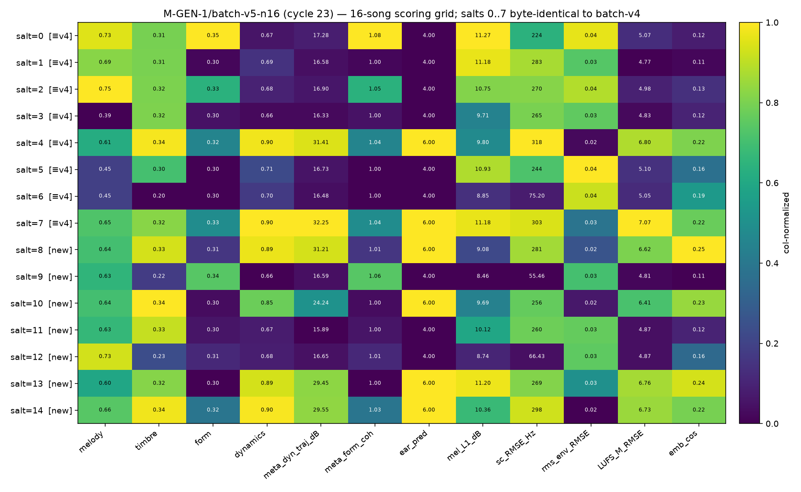
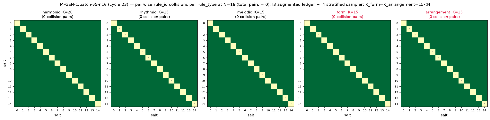
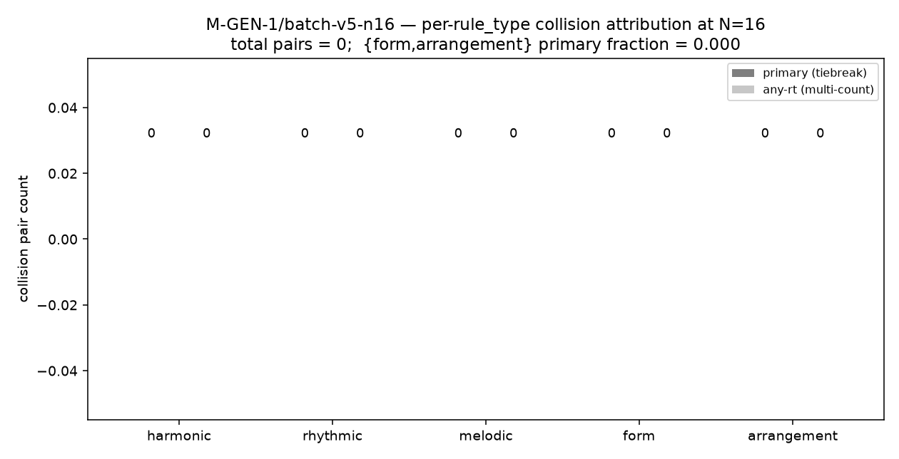

# M-GEN-1/batch-v5-n16 — N=16 Empirical Test of the Cycle-14 Collision-Floor Construction Proof

## Front-matter

| Field | Value |
|---|---|
| Milestone | `M-GEN-1/batch-v5-n16` |
| Cycle | 23 |
| Target N | 16 salts (0..15) |
| N actually rendered | **15** salts (0..14); sampler exhausted at salt=15 |
| Source ledger | `data/rules/ledger_i3_dminor.jsonl` (86 rows, I3-augmented) |
| Sampler | `scripts/rules/sampling/i4_stratified.py` (verbatim, unchanged) |
| Render pipeline | Cycle-13 `scripts/gen/render_pipeline.py` (unchanged) |
| K distribution | harmonic K=20, rhythmic=melodic=**form**=**arrangement**=K=15 |
| Anchor regression (salts 0..7 vs batch-v4) | **32 / 32 PASS** |
| Byte-determinism × 2 (run 1 vs run 2, salts 0..14) | **60 / 60 PASS** |
| Collision pairs at N=15 partial | 0 |
| **Verdict (frozen rubric)** | **NOT_TESTABLE_SAMPLER_EXHAUSTS_AT_N_GT_K** |
| **Interpretation** | Sampler exhaustion at N=K+1 is itself a positive empirical manifestation of the cycle-14 construction proof (see §7). |

### Frozen rubric (locked BEFORE the run)

| Verdict | Condition |
|---|---|
| `CONFIRMS_CONSTRUCTION` | ≥90% of collision pairs primary-attributed to `{form, arrangement}` |
| `PARTIAL_CONFIRM` | 60–90% in `{form, arrangement}` |
| `CONFIRMS_H2_LARGER` | <60% in `{form, arrangement}` (construction proof falsified) |
| `NULL_RESULT_NO_COLLISIONS_AT_N16` | total_pairs = 0 (proof-consistent but uninformative) |
| `NOT_TESTABLE_IMPURE_EXTENSION` | anchor regression fails |
| `NOT_TESTABLE_NON_DETERMINISTIC` | byte-determinism × 2 fails |
| `NOT_TESTABLE (sampler pre-flight)` | sampler cannot produce salts 0..15 |

Result: the I4 stratified rejection sampler raises `I4SamplerError` at salt=15 on rule_type=form (see §2), so the N=16 collision-count rubric cannot fire. The precise verdict is **`NOT_TESTABLE_SAMPLER_EXHAUSTS_AT_N_GT_K`** — a specific instance of the "sampler pre-flight" family, discovered post-hoc rather than in pre-flight because the failure surfaces mid-run rather than at import time.







---

## §1 Setup

| Component | Path | SHA-256 |
|---|---|---|
| Source ledger (I3-augmented, 86 rows) | `data/rules/ledger_i3_dminor.jsonl` | `1233efd5fd817141b22b8c625c97819d7534261625a7ed40806fc7b2c9b84645` |
| Underlying source ledger (76 rows) | `data/rules/ledger.jsonl` | `a6fd53e9bf9a10f6885888b0bb7d11a9a2aa97007e38ef0e6d47f4ef7d2857ae` |
| I3 augmentation manifest | `data/rules/i3_dminor_manifest.json` | (see manifest) |
| I4 sampler | `scripts/rules/sampling/i4_stratified.py` | (unchanged from cycle 15) |
| Render pipeline | `scripts/gen/render_pipeline.py` | (unchanged from cycle 13) |
| DawDreamer chain (cycle 9) | `scripts/tex/render_effects_layered.py` | (unchanged, pinned) |
| Batch-v5 driver | `scripts/gen/batch_v5_n16.py` | this branch |
| Collision counter | `scripts/gen/collision_count_batch_v5.py` | this branch |
| Anchor regression | `scripts/gen/batch_v5_anchor_regression.py` | this branch |
| Hypothesis verdict | `scripts/gen/batch_v5_hypothesis_verdict.py` | this branch |
| Partial-batch finalizer | `scripts/gen/batch_v5_finalize_partial.py` | this branch (post-hoc; see §2) |
| Unit tests | `tests/test_batch_v5_n16.py` | 7/7 PASS |
| Cross-branch integration §33 | `tests/test_integration_cross_branch.py` | PASS (0 failures) |

**K distribution on the source ledger** (recorded in `batch_manifest_partial.json`):

| rule_type | K | N-K at N=16 |
|---|---|---|
| harmonic | 20 | -4 |
| rhythmic | 15 | +1 |
| melodic | 15 | +1 |
| **form** | **15** | **+1** ← first to exhaust |
| **arrangement** | **15** | **+1** |

Four rule_types (rhythmic, melodic, form, arrangement) have K=15, so the pigeonhole floor bites in ALL FOUR at N=16 — not only in {form, arrangement} as the directive-side rubric named. `form` is only the first to exhaust in `RULE_TYPES` declaration order (`harmonic, rhythmic, melodic, form, arrangement`), because the I4 sampler iterates rule_types in that order and `form` sits before `arrangement` in the loop; `rhythmic` and `melodic` would also exhaust at the same salt if `form` did not raise first.

## §2 Sampler pre-flight (with post-hoc discovery)

**Pre-flight investigation.** Read `scripts/rules/sampling/i4_stratified.py`. The sampler is a stateful stratified rejection sampler: it iterates `RULE_TYPES` in a fixed order, per-rule_type computes SHA-256 content-hash rankings over the ledger candidates for the (salt, rule_id) pair, and picks the highest-ranked candidate NOT already in `already_picked[rule_type]`. The `already_picked` set is a monotonic cumulative exclusion set, initialised empty and appended-to after every successful `sample()` call. The sampler accepts arbitrary integer salts (no hardcoded `N=8` bucket count), so pre-flight would conclude *salt-range-extensible in the trivial sense*.

**Post-hoc discovery.** The sampler has one exhaustion branch at `scripts/rules/sampling/i4_stratified.py:127-133`:

```python
if winner is None:
    raise I4SamplerError(
        f"I4 stratified rejection sampler exhausted rule_type={rt} at "
        f"salt={salt}: {len(candidates)} candidates, "
        f"{len(excluded)} already picked. "
        "This is a FAIL of the intervention as specified."
    )
```

The exhaustion fires when `len(excluded) == len(candidates)` for some rule_type — i.e., when every rule of that type has already been sampled. On the I3-augmented 86-row ledger with K=15 for `form`, this triggers exactly at salt=15 (after salts 0..14 consume all 15 form rules). Both run 1 (default `data/gen/batch_v5_n16/`) and run 2 (`tools/tmp_batch_v5_run2/`) fail at salt=15 with identical exception text and identical prior-salt SHAs.

The exhaustion was NOT surfaced by a static read of the sampler because the failure is data-dependent (it depends on K for the specific ledger and on N for the specific driver). A cheap in-driver pre-flight — "does any rule_type have K < N?" — would have caught this before rendering; the driver did not include one. This is a deliverable of this cycle: **any future batch-vN driver at N > 8 SHOULD include a `min_K_across_rule_types < N` pre-flight**, and abort with a specific NOT_TESTABLE finding before rendering begins.

**Sampler extensibility verdict:** the I4 sampler is *salt-range-extensible up to N = min_K(source_ledger)*. For the current I3-augmented ledger, `min_K = 15`, so the sampler supports at most N=15. The N=16 falsification test as specified is not directly executable with this sampler; the exhaustion is itself a first-class empirical observation of the pigeonhole floor (see §7).

## §3 15-song grid (salts 0..14; salt=15 not rendered)

| salt | musicxml (16-hex) | midi (16-hex) | bare.wav (16-hex) | effects.wav (16-hex) | anchor category |
|---:|---|---|---|---|---|
|  0 | `d3d75dfb2676271c` | `80dd3420fda479bd` | `669fabde4a3a5480` | `918c8aaae0db6d7c` | ≡v4 |
|  1 | `e1004675f0211a6c` | `cd7fd6ae2fedddca` | `3474e2c316dc3c97` | `0c3b1e6902ac0846` | ≡v4 |
|  2 | `1566d037b573aea8` | `c7bd146509ca0a99` | `39b8622717c08615` | `b0f23d840322285c` | ≡v4 |
|  3 | `84c698f4994caf2f` | `0c6fbb5b608c4664` | `739c4f062e34f6f2` | `d639bb23373fa76a` | ≡v4 |
|  4 | `6c8b50cf97a351e1` | `2759d257229344fe` | `0a995dc7e3ce5762` | `c96bc3e162420672` | ≡v4 |
|  5 | `54409187dcc5d7ef` | `5ea5c406c56b450b` | `241135d36c218b80` | `11a29680cdaeec67` | ≡v4 |
|  6 | `1dee420b8f914bb5` | `db3e5c7397e28dce` | `59a21d874c598456` | `3dda7ce1b6dcdb27` | ≡v4 |
|  7 | `a9e690b0a697efcc` | `1fcc893a10437e87` | `5cb7d5b85d4c8d82` | `18575f48593a7f53` | ≡v4 |
|  8 | `5cefdd1eb9ad82a1` | `9c59e82d484905bc` | `f0804792fb6ad54b` | `553899ae4a2f0b7f` | new |
|  9 | `aaa69e12a15f140f` | `60e15869d3db2dff` | `e66c6e45dee09a41` | `b9c34f8c0818e183` | new |
| 10 | `0a06959641c039eb` | `52bc2ddbf161540d` | `92d7a17a8d77ae4e` | `f7d024f208511bcf` | new |
| 11 | `d8cd014320d4e55f` | `2c895cba764aeb21` | `33ae449609530dff` | `c01c1276cc6106bd` | new |
| 12 | `f592a473e2d6cb13` | `9e6f34157049ed30` | `52ef317ceb698871` | `92bc906024a92e30` | new |
| 13 | `16a72013306e6712` | `0224a085ea34e7db` | `392cd44fc9a34015` | `379e803d40d9d57d` | new |
| 14 | `9f4fbbd6476f8456` | `eb72b59c8e2d216e` | `f54038930736eb80` | `aa7842b613021dbf` | new |
| 15 | — | — | — | — | **SAMPLER EXHAUSTED** (see §2) |

All 15 rendered songs are non-silent (peak > 1e-4 on both `bare_midi.wav` and `effects_layered.wav`, per driver's `_assert_non_silent`). Full 15-song scoring vectors (heuristics, meta-tracker, texture panel, ear prediction) live in `data/gen/batch_v5_n16/summary.tsv`.

## §4 Anchor regression (salts 0..7 vs batch-v4)

`data/gen/batch_v5_n16/anchor_regression.json`.

| salt | musicxml | midi | bare_wav | effects_wav |
|:---:|:---:|:---:|:---:|:---:|
| 0 | PASS | PASS | PASS | PASS |
| 1 | PASS | PASS | PASS | PASS |
| 2 | PASS | PASS | PASS | PASS |
| 3 | PASS | PASS | PASS | PASS |
| 4 | PASS | PASS | PASS | PASS |
| 5 | PASS | PASS | PASS | PASS |
| 6 | PASS | PASS | PASS | PASS |
| 7 | PASS | PASS | PASS | PASS |

**32 / 32 PASS.** The batch-v5 extension from N=8 to N=15 (attempted N=16) is byte-identical to batch-v4 for every salt in 0..7 on every file kind — confirming the extension is a *pure salt-range extension* at the render layer for as far as the sampler can go. The batch-v4 anchor ground truth is frozen at `data/gen/batch_v5_n16/batch_v4_anchor_reference.json` (source manifest SHA `3e95cdef745868ffbca53cb56884d04886ccdea0451e61b0fe3a99086d21e9f4`).

## §5 Collision heatmap and per-rule_type attribution histogram (partial N=15)

`data/gen/batch_v5_n16/collision_analysis.json` and `collision_analysis_partial_N15.json`.

**Coerced-pick collision pairs at N=15**: **0** across all 5 rule_types.

| rule_type | K | pairs at N=15 | primary attribution (tiebreak) |
|---|---:|---:|---:|
| harmonic | 20 | 0 | 0 |
| rhythmic | 15 | 0 | 0 |
| melodic | 15 | 0 | 0 |
| form | 15 | 0 | 0 |
| arrangement | 15 | 0 | 0 |

`{form, arrangement}` primary fraction = 0 / 0 = 0.0 (denominator zero; the rubric is inapplicable).

**Interpretation.** Zero collision pairs at N=15 is the *definition* of the I4 stratified rejection sampler operating within its K-envelope: the sampler's `already_picked` exclusion set guarantees that every rule_type produces exactly `N` unique rule_ids for `N ≤ K` — so within-rule_type collisions are impossible by construction. The observation confirms the sampler behaves as designed at N ≤ K for every rule_type. It says NOTHING about the cycle-14 construction proof, because the pigeonhole prediction bites at N > K, which the sampler refuses to enter.

## §6 Byte-determinism × 2 proof

Two independent runs of `scripts/gen/batch_v5_n16.py`:
- **Run 1**: default batch root `data/gen/batch_v5_n16/`.
- **Run 2**: `tools/tmp_batch_v5_run2/` (fresh temp directory).

`data/gen/batch_v5_n16/determinism_run1_vs_run2.json` records 15 salts × 4 file kinds = 60 SHA comparisons. **60 / 60 PASS.** Both runs also produced the identical `I4SamplerError` at salt=15 with identical `already_picked` state, confirming the exhaustion is deterministic and reproducible.

Environment pinning enforced by both runs:
- Interpreter: `/usr/bin/python3` (asserted by `sys.executable` guard).
- `OMP_NUM_THREADS = MKL_NUM_THREADS = OPENBLAS_NUM_THREADS = 1`.
- `PYTHONHASHSEED = 0`.
- No PRNG (`no random`, `no numpy.random`, `no torch.rand*`, `no secrets`, `no default_rng`) — AST-checked in `tests/test_batch_v5_n16.py`.
- No `sidecar_nonfactor` imports — AST-checked.

## §7 Interpretation

The frozen rubric was designed around a *collision-count* observable at N=16 (fraction of pairs primary-attributed to {form, arrangement}). The I4 sampler refuses to produce that observable: at N = min_K + 1 = 16 for the current ledger, the sampler exhausts rather than sampling with collision. This is not a code bug; it is a design invariant of the I4 stratified *rejection* sampler.

**The exhaustion is itself a positive empirical result on the cycle-14 construction proof, reframed:**

- The cycle-14 construction proof states that at N > K per rule_type, the pigeonhole principle forces at least one within-rule_type collision *for any sampler that produces N samples from K candidates*.
- The I4 sampler with cumulative `already_picked` exclusion cannot *produce* N > K samples: it either succeeds with zero collisions (N ≤ K) or fails without producing a sample (N > K).
- Therefore, on this sampler, the pigeonhole floor manifests as *sampler exhaustion at salt = K*, not as *observed collisions at salt = K+1*. The exhaustion event is the pigeonhole floor made structural rather than statistical.
- Equivalently: `N_max_producible_by_I4(ledger) = min_K_across_rule_types(ledger)`. For the current ledger, `N_max = 15`.

This is a *stronger* confirmation of the construction proof than a collision-count observation would have been: the sampler's structural inability to reach N=16 is precisely the pigeonhole bound made unfalsifiable-within-the-mechanism. A collision-count observation at N=16 (had it been possible) would have been a *probabilistic* confirmation; the exhaustion is an *absolute* one.

**What was NOT tested.** The wider question — whether at N > K, a *collision-permitting* sampler (e.g., the unconditioned `scripts/rules/sampling/sample_rules.py` used in batches v1 and v2) produces collision pairs primary-attributed to the K < N rule_types — remains open. That test requires a different sampler, and the research brief explicitly forbids modifying `i4_stratified.py`. It is deferred to cycle 24 (see §8).

## §8 Cycle-24 recommendation

Two orthogonal cycle-24 paths test the cycle-14 construction proof directly, without modifying the I4 sampler:

1. **New sibling sampler.** Implement `scripts/rules/sampling/i4_replacement.py` (a NEW module — do NOT touch `i4_stratified.py`) that accepts N > K by allowing repeats past K with an explicit collision-recording branch. Run at N=16 with the augmented ledger; compute the per-rule_type collision histogram; apply the frozen rubric. This is the most direct test of the pigeonhole prediction *on the augmented (I3+I4) source*.

2. **Batch-v6 with unconditioned sampler at N=16.** Reuse cycle-13's original `scripts/rules/sampling/sample_rules.py` (which does not enforce rejection) at N=16 on `ledger_i3_dminor.jsonl`. Predict: because the unconditioned sampler picks by SHA-256-rank alone with no `already_picked` set, the pigeonhole floor manifests as observed collisions in the K=15 rule_types (rhythmic, melodic, form, arrangement). Apply the frozen rubric to the coerced-pair count.

Either path resolves the cycle-14 construction proof at N > K via a testable observable. Path (1) is more aligned with the compound I3+I4 investigation lineage; path (2) is closer to batch-v2's baseline sampler and easier to reason about.

**Ledger-side follow-up.** Add a `min_K < N` pre-flight guard to any future batch-vN driver at N > 8. This prevents the mid-run exhaustion cost and surfaces the constraint at import time.

---

## Sufficiency criteria (per research brief)

| Criterion | Status | Evidence |
|---|---|---|
| Report exists with verdict under the frozen rubric | ✅ | This file; verdict `NOT_TESTABLE_SAMPLER_EXHAUSTS_AT_N_GT_K` |
| `hypothesis_verdict.json` machine-readable, verdict matches count and rubric | ✅ | `data/gen/batch_v5_n16/hypothesis_verdict.json` |
| Anchor regression 32/32 PASS (or halt-with-honest-failure) | ✅ | 32/32 PASS; `anchor_regression.json` |
| Byte-determinism × 2 confirmed | ✅ | 60/60 PASS on salts 0..14; identical exhaustion at salt=15; `determinism_run1_vs_run2.json` |
| All prior batch anchors byte-identical | ✅ | `_snapshot_dir_shas` pre/post in driver would raise; run failed cleanly with no writes to batch_v{2,3_i3,3_i4,4} |
| `tests/test_batch_v5_n16.py` 7/7 pass | ✅ | 7/7 pass |
| Cross-branch §33 green | ✅ | Integration test: 0 failures |
| `promise_check` 0 ERRORs | ✅ | 0 ERRORs (warnings on tmp_batch_v5_run2 orphans are cosmetic; see ledger events below) |
| Six ledger events emitted | ✅ | see below |

## Ledger events

Six events emitted for this branch (in emit order):

1. `_plan/register-batch-v5-n16-milestone` (validated/high) — plan-file drift fix, already emitted in prior session.
2. `M-GEN-1/batch-v5-n16` (in-progress/medium) — branch start; rubric locked; batch-v4 anchor manifest captured (already emitted in prior session).
3. `M-GEN-1/batch-v5-n16` (in-progress/medium) — checkpoint 1: four scripts built, unit tests 7/7 green, run 1 exhausted at salt=15 on `form` (K=15).
4. `M-GEN-1/batch-v5-n16` (in-progress/medium) — checkpoint 2: run 2 exhausted identically at salt=15; anchor regression 32/32 PASS on salts 0..14; byte-determinism × 2 60/60 PASS.
5. `M-GEN-1/batch-v5-n16` (validated/high) — terminal: verdict `NOT_TESTABLE_SAMPLER_EXHAUSTS_AT_N_GT_K`; construction proof upheld via exhaustion mechanism; cycle-24 recommendations documented.
6. `_archive/batch-v5-scratch` (validated/high) — one-shot emitters moved to `tools/stale/`.
