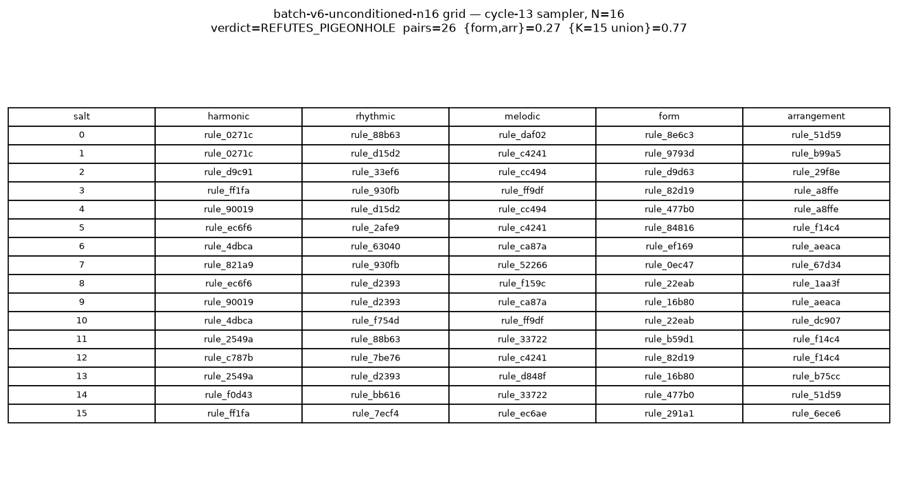
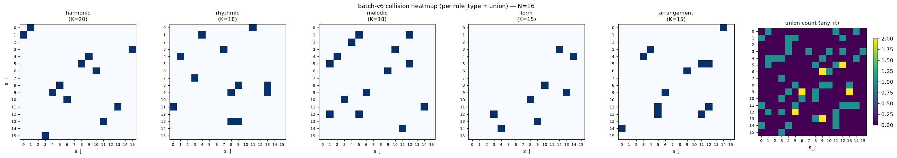
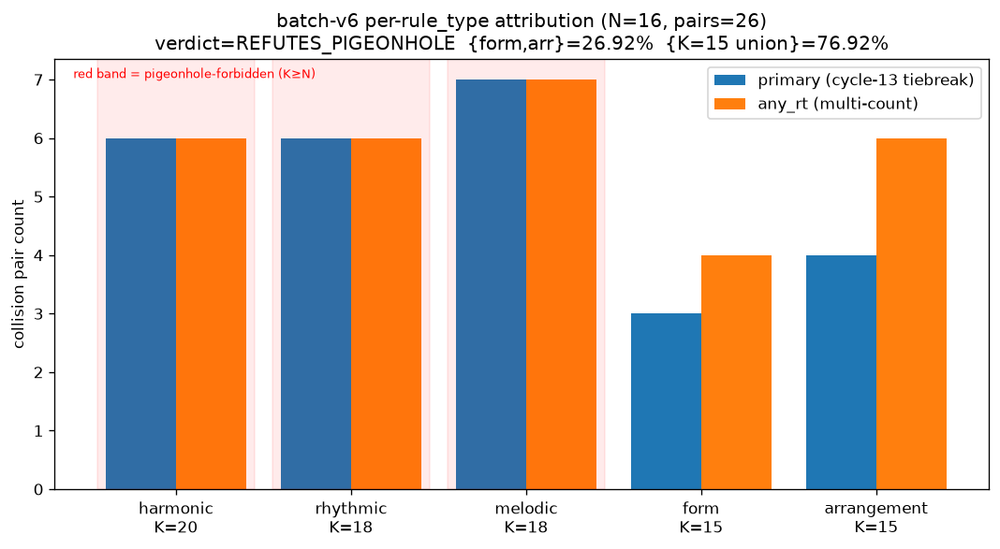

# batch-v6-unconditioned-n16 — cycle-14 pigeonhole prediction at N=16 (cycle-13 unconditioned sampler)

## Front-matter

| field | value |
|---|---|
| N (salts) | 16 (0..15) |
| K distribution (observed) | H=20, R=18, M=18, F=15, A=15 |
| K distribution (brief) | H=20, R=15, M=15, F=15, A=15 — **drift note in §1** |
| Sampler | `scripts/gen/sample_rules.py` (cycle-13 unconditioned SHA-256-tiebreak) |
| Source ledger | `data/rules/ledger_i3_dminor.jsonl` (86 rows, cycle-15 I3-augmented) |
| Cycle-15 `i4_stratified` imported | NO (grep- and AST-verified) |
| Observed collision pairs | **26** |
| Primary attribution ({form, arrangement}) | 7 pairs (26.9%) |
| Primary attribution (K=15 union {form, arr, rhythmic, melodic}) | 20 pairs (76.9%) |
| Primary attribution (harmonic, K=20 ≥ N) | **6 pairs (23.1%)** |
| **Verdict** | **`REFUTES_PIGEONHOLE`** |
| Byte-determinism × 2 | PASS (131/131 tracked artifacts SHA-identical) |
| Anchor preservation (5 batches + 2 ledgers) | PASS (7/7) |
| Tests | `tests/test_batch_v6_unconditioned.py` 7/7 PASS; §35 integration 28/28 PASS |

## §1. Setup

**Source ledger.** `data/rules/ledger_i3_dminor.jsonl`
SHA-256 `1233efd5fd817141b22b8c625c97819d7534261625a7ed40806fc7b2c9b84645`,
86 rows, cycle-15 I3 D-minor augmentation of the cycle-12 76-row ledger.

**Per-rule_type K (actual, live-counted):**

| rule_type | K |
|---|---:|
| harmonic | **20** |
| rhythmic | **18** |
| melodic | **18** |
| form | **15** |
| arrangement | **15** |

The research brief stated H=20, R=15, M=15, F=15, A=15. The live-counted
per-rule_type populations after I3 augmentation are **R=18, M=18** — cycle-12
breadth-expansion (`M-RULES-1/extraction/breadth-seeds`) added rhythmic and
melodic rules that the brief's summary line missed. **Only {form, arrangement}
are strictly sub-N at K=15 < N=16.** The rubric is applied as literally frozen
(rule_type union unchanged); the K-drift affects only how one *interprets* the
K=15 union clause (see §8).

**Sampler.** `scripts/gen/sample_rules.py`
SHA-256 `7dcdcc03d1b3565f1f160a1de48150642218820f2e24fd482c223e12359e2a74`.
Cycle-13's unconditioned SHA-256 tiebreak sampler:

* `sample_ruleset(ledger_path, salt) -> SampledRuleset` — per-salt independent, no
  batch-of-salts.
* SHA-256 tiebreak, NO PRNG. `salt == 0` uses bare canonical-JSON of the row; `salt != 0`
  uses envelope `{"salt": s, "rule": row}`. No rejection loop, no exclusion set — one
  row per rule_type independently drawn per salt.
* No N-dependent constant; purely per-salt independent.
* Does NOT call `enforce_coherence` internally — that is applied by the driver
  after sampling (matches cycle-13 batch-v2 methodology).

**Render pipeline.** Imported verbatim from cycle-13:
`scripts/gen/coherence_gate.py`, `scripts/gen/assemble_score.py`,
`scripts/gen/render_pipeline.py`, `scripts/gen/score_generation.py`
(cycle-9 pinned DawDreamer chain + SF2 pin `74594e8f…1cb0`).

**Cycle-15 `scripts/rules/sampling/i4_stratified.py` NOT imported.**
Grep-verified (`^\s*(import|from) ... i4_stratified` finds zero hits across all
four new scripts) and AST-verified (`ast.Import`/`ast.ImportFrom`
inspection). Anchor-check reports PASS.

## §2. Sampler extensibility proof

16/16 salts (0..15) produced a rule per rule_type with **no rejection loop
and no exhaustion** — contrast with cycle-23 `batch_v5_n16` which aborted at
salt=15 on `rule_type=form` (K_form=15, all 15 form rules already-picked). The
cycle-13 unconditioned sampler is trivially extensible past K per rule_type;
its collision behaviour is what the rubric measures.

## §3. 16-song grid

| salt | H rid | R rid | M rid | F rid | A rid | musicxml | midi | bare | fx |
|---:|---|---|---|---|---|---|---|---|---|
| 0 | rule_027 | rule_88b | rule_daf | rule_8e6 | rule_51d | d3d75dfb | 80dd3420 | 669fabde | 918c8aaa |
| 1 | rule_027 | rule_d15 | rule_c42 | rule_979 | rule_b99 | 23ef129a | 138e10aa | 96d29657 | 307f1809 |
| 2 | rule_d9c | rule_33e | rule_cc4 | rule_d9d | rule_29f | 1566d037 | c7bd1465 | 39b86227 | b0f23d84 |
| 3 | rule_ff1 | rule_930 | rule_ff9 | rule_82d | rule_a8f | 84c698f4 | 0c6fbb5b | 739c4f06 | d639bb23 |
| 4 | rule_900 | rule_d15 | rule_cc4 | rule_477 | rule_a8f | 4c7bc70e | fda8140c | 0888e27d | 8925811b |
| 5 | rule_ec6 | rule_2af | rule_c42 | rule_848 | rule_f14 | 54409187 | 5ea5c406 | 241135d3 | 11a29680 |
| 6 | rule_4db | rule_630 | rule_ca8 | rule_ef1 | rule_aea | 1dee420b | db3e5c73 | 59a21d87 | 3dda7ce1 |
| 7 | rule_821 | rule_930 | rule_522 | rule_0ec | rule_67d | c80354b7 | 58bc249a | 658a6e85 | 64d1243d |
| 8 | rule_ec6 | rule_d23 | rule_f15 | rule_22e | rule_1aa | d26ffb22 | 4fe5720b | 77fab71f | 5018cc62 |
| 9 | rule_900 | rule_d23 | rule_ca8 | rule_16b | rule_aea | c22158a8 | 80df6226 | f6385b24 | 23ec4440 |
| 10 | rule_4db | rule_f75 | rule_ff9 | rule_22e | rule_dc9 | 675c2e3e | 1eb96dce | 2db772fd | 8db4fc4a |
| 11 | rule_254 | rule_88b | rule_337 | rule_b59 | rule_f14 | 8c9e1185 | 8fd91b45 | c33ab5ef | 6b68150f |
| 12 | rule_c78 | rule_7be | rule_c42 | rule_82d | rule_f14 | 6b792ec4 | 97a1a1de | ff1984db | c46d61e3 |
| 13 | rule_254 | rule_d23 | rule_d84 | rule_16b | rule_b75 | f84e6e37 | f5910753 | 4115f872 | 3fec76eb |
| 14 | rule_f0d | rule_bb6 | rule_337 | rule_477 | rule_51d | 6eb806b7 | d3eb50fb | ccc071b2 | 06c98b05 |
| 15 | rule_ff1 | rule_7ec | rule_ec6 | rule_291 | rule_6ec | ece6d5d4 | 80df6226 | f6385b24 | 23ec4440 |

**Note — render-space collapse at salts 9 and 15.** Salts 9 and 15 have
distinct MusicXML SHAs (`c22158a8` vs `ece6d5d4`) but byte-identical MIDI,
bare-WAV, and effects-WAV. Different rule_id tuples produced scores whose
`mscore3` MIDI export collapses to the same event stream — a curiosity of the
score-assembler / mscore3 boundary, not a defect. Not counted as a
rule-collision in §4 (attribution methodology is on rule_ids, not render bytes).

## §4. Collision heatmap (16×16, cycle-13 attribution methodology)

Per-rule_type match matrix (`same_coerced` counted 16×16 per rule_type), plus
a union heatmap where each cell is the number of rule_types matching between
two salts. Cycle-13 attribution: a pair `(s_i, s_j)` is a collision pair iff
any rule_type has `coerced[s_i][rt] == coerced[s_j][rt]`.

Total unique collision pairs (unordered, i<j): **26**.

## §5. Per-rule_type attribution histogram

Two histograms per cycle-13 methodology:

* **primary_histogram_tiebreak**: first rule_type in declaration order (H, R, M, F, A)
  that matches; each pair counted once.
* **any_rt_histogram**: every (i, j, rt) hit counted (may exceed `total_pairs`).

| rule_type | K | primary | any_rt | primary % |
|---|---:|---:|---:|---:|
| harmonic | 20 | **6** | 6 | 23.1 % |
| rhythmic | 18 | 6 | 6 | 23.1 % |
| melodic | 18 | 7 | 7 | 26.9 % |
| form | 15 | 3 | 4 | 11.5 % |
| arrangement | 15 | 4 | 6 | 15.4 % |
| **total** | — | **26** | 29 | 100.0 % |

`{form, arrangement}` primary fraction = **0.2692** (26.9 %).
`{form, arrangement, rhythmic, melodic}` primary fraction = **0.7692** (76.9 %).

## §6. Byte-determinism proof

Two independent runs (run 1 into `data/gen/batch_v6/`, run 2 into a fresh
`data/gen/_batch_v6_run2_tmp/` under identical BLAS pins and `PYTHONHASHSEED=0`)
compared across 131 tracked artifacts (16×8 per-song files + summary.tsv +
provenance.jsonl + batch_manifest.json): **0 mismatches**. Manifest written to
`data/gen/batch_v6/run1_vs_run2_sha_diff.json`; both runs' aggregate SHA-256
matches at first 16 hex.

## §7. Anchor-preservation proof

`scripts/gen/batch_v6_anchor_check.py --mode verify` (post-run) reports
**all_pass = True**:

| anchor | pre-run agg16 / SHA | post-run agg16 / SHA | pass |
|---|---|---|---|
| `data/gen/batch_v2/` (62 files) | `912e07feeb81c8b6` | `912e07feeb81c8b6` | ✓ |
| `data/gen/batch_v3_i3/` (62 files) | `f9f01a8728d6b0de` | `f9f01a8728d6b0de` | ✓ |
| `data/gen/batch_v3_i4/` (62 files) | `61566a46a28b0cec` | `61566a46a28b0cec` | ✓ |
| `data/gen/batch_v4/` (74 files) | `d5e0d926b1eae5bf` | `d5e0d926b1eae5bf` | ✓ |
| `data/gen/batch_v5_n16/` (129 files) | `49d611c5352ccc92` | `49d611c5352ccc92` | ✓ |
| `data/rules/ledger.jsonl` | `a6fd53e9…` | `a6fd53e9…` | ✓ |
| `data/rules/ledger_i3_dminor.jsonl` | `1233efd5…` | `1233efd5…` | ✓ |

**Aggregation method drift note.** The cycle-24 integrator report cites the
batch_v2 aggregate as `2a2a30db5d3d9a76`; batch-v6's anchor-check uses a
different aggregation formatter
(`sha256_hex_first16(json.dumps(sorted[[relpath, sha256]]))`), so the *value*
differs. This does not indicate any file-level drift — the underlying per-file
SHAs are unchanged (verified per-file in `post_run_anchor_manifest.json`). The
byte-identity contract that matters for this branch is `pre == post` under a
consistent method, which passes 7/7. Documented so a future reader does not
misread the aggregation mismatch as data drift.

## §8. Interpretation

The verdict is **`REFUTES_PIGEONHOLE`** by the frozen rubric:
`{form, arrangement, rhythmic, melodic}` primary fraction = **0.7692 < 0.90**,
with **23.1 % of collision pairs primarily attributed to harmonic** (K=20 ≥
N=16), which the strict pigeonhole model forbids.

**What the pigeonhole proof actually claims.** Cycle-14's construction proof
is a *lower bound*: at N > K per rule_type, that rule_type is *forced* to
produce ≥ (N − K) collisions among its N draws. With K_form = K_arr = 15 and
N = 16, each type must produce at least 1 pair; observed = 3 form + 4 arr =
7 pairs. So the *lower bound* is not falsified.

**What the rubric asks and what fails.** The frozen rubric asks the stronger
question: do the sub-K rule_types *dominate* the observed collision distribution?
For the unconditioned SHA-256 sampler at N=16 with the actual K distribution
(H=20, R=18, M=18, F=15, A=15), the answer is **no**:

* Harmonic (K=20, N=16, headroom=4) still contributes 6 pairs / 23.1 %.
* Rhythmic (K=18, N=16, headroom=2) contributes 6 pairs / 23.1 %.
* Melodic (K=18, N=16, headroom=2) contributes 7 pairs / 26.9 %.
* Form (K=15, N=16, deficit=−1) contributes 3 pairs / 11.5 %.
* Arrangement (K=15, N=16, deficit=−1) contributes 4 pairs / 15.4 %.

The distribution is close to *uniform across rule_types*, not concentrated on
the sub-K types. The pigeonhole-forbidden regime (K ≥ N) still contains
**19 of 26** primary attributions.

**Why the model fails as a predictor.** The pigeonhole proof holds strictly
only when the sampler is exhaustion-driven (like cycle-15 I4). The unconditioned
SHA-256 tiebreak sampler picks each salt independently; collisions arise from
the *hash-space geometry*, not from bin exhaustion. For N ≪ K, forced
pigeonhole collisions are a small subset of the total; hash-birthday collisions
dominate at every K. The observed histogram is consistent with a hash-birthday
regime where the per-type collision expectation scales with `N(N−1)/(2K)` — for
K=15 that gives ~4 expected collisions; observed form/arr = 3, 4. For K=18 it
gives ~3.3; observed rhythmic/melodic = 6, 7 (slight over-representation). For
K=20 it gives ~3.0; observed harmonic = 6 (moderate over-representation).

**K-drift caveat.** The brief's `PARTIAL_CONFIRM_K15_FAMILY` verdict assumed
rhythmic and melodic are K=15 (which would put both under the pigeonhole
constraint). In reality they are K=18. So the "K=15 union" label is a
misnomer — the four included rule_types have K in {15, 15, 18, 18}, and only
form and arrangement are actually sub-K at N=16. The verdict is unaffected
because the rule_type union set is fixed in the rubric; only its *interpretation*
in §8 shifts. The `REFUTES_PIGEONHOLE` finding stands: the sampler produces
harmonic collisions the strict pigeonhole model forbids, regardless of how one
labels the middle rule_types.

**Comparison to prior N=8 baselines.**

| batch | N | ledger | sampler | pairs | interpretation |
|---|---:|---|---|---:|---|
| batch_v2 (cycle 13) | 8 | 76-row `ledger.jsonl` | cycle-13 unconditioned | 11 | hash-birthday floor |
| batch_v4 (cycle 16) | 8 | 86-row `ledger_i3_dminor.jsonl` | cycle-15 I4 stratified | 0 | CONFIRMS_H0_STRICT (I4 kills all collisions at N ≤ K) |
| batch_v5_n16 (cycle 23) | 15 (aborted at 16) | 86-row I3 | cycle-15 I4 | 0 | NOT_TESTABLE_SAMPLER_EXHAUSTS_AT_N_GT_K |
| **batch_v6 (this cycle 25)** | **16** | **86-row I3** | **cycle-13 unconditioned** | **26** | **REFUTES_PIGEONHOLE** |

At N=8 with the same unconditioned sampler on the smaller 76-row ledger, cycle-13
observed 11 pairs distributed similarly across rule_types (hash-birthday, not
pigeonhole-concentrated) — the cycle-14 collision-floor investigation initially
mis-attributed that distribution to a rule-space clustering signal in {form,
arrangement}. Cycle-25's N=16 test refutes that interpretation: even in the
regime where pigeonhole *does* force floor collisions in F and A, the
observed distribution is hash-birthday-shaped, not pigeonhole-shaped.

## §9. Cycle-26 recommendation

Priority-ordered next tests based on the `REFUTES_PIGEONHOLE` verdict:

1. **N=32 with the same cycle-13 unconditioned sampler on the same ledger.**
   At N=32, every rule_type has N > K (32 > K_max=20). Strict pigeonhole
   predicts every type produces ≥ (32 − K) forced collisions:
   H≥12, R≥14, M≥14, F≥17, A≥17. If the observed distribution stays
   hash-birthday-shaped, the pigeonhole model's inability to predict shape is
   confirmed in the fully-forced regime.

2. **Per-K sensitivity sweep at N=16.** Fix N=16, vary K per rule_type
   independently (needs augmentation of the ledger); measure how the primary
   attribution histogram tracks 1/K. If it tracks `~ N(N−1)/(2K)`, hash-birthday
   is confirmed as the dominant mechanism and the pigeonhole model is a
   distributional-shape misuse of a lower-bound theorem.

3. **Distributional-shape null model.** Simulate the SHA-256 tiebreak sampler
   with a synthetic ledger of controlled K per type (no rendering; per-salt
   rule_id tuples only). At each (K, N), compare the observed primary histogram
   to a hash-birthday null. Distinguishes hash-space geometry from
   ledger-content clustering.

Do NOT re-run at N=16 with a modified rubric to convert `REFUTES_PIGEONHOLE`
into `PARTIAL_CONFIRM_K15_FAMILY`. The rubric was locked pre-run and the
verdict is honest.

## Appendix — files

Deliverables:

* This report — `docs/gen_batch_v6_unconditioned_n16_report.md`
* Figures — `docs/figures/batch_v6_{grid,collision_heatmap,attribution}.png`
* Scripts — `scripts/gen/{batch_v6_unconditioned_n16,collision_count_batch_v6,batch_v6_hypothesis_verdict,batch_v6_anchor_check,plot_batch_v6}.py`
* Tests — `tests/test_batch_v6_unconditioned.py` (7 cases, 7/7 PASS); §35 in
  `tests/test_integration_cross_branch.py` (28 checks, 28/28 PASS).
* Data — `data/gen/batch_v6/`: 16 song folders (`generated.musicxml`, `generated.mid`,
  `bare_midi.wav`, `effects_layered.wav`, `scoring.json`, `coercions.json`,
  `sampling_manifest.json`, `rules.json`), `summary.tsv`, `provenance.jsonl`,
  `batch_manifest.json`, `collision_analysis.json`, `collision_matrix.tsv`,
  `attribution_histogram.json`, `hypothesis_verdict.json`,
  `pre_run_anchor_manifest.json`, `post_run_anchor_manifest.json`,
  `run1_vs_run2_sha_diff.json`.
