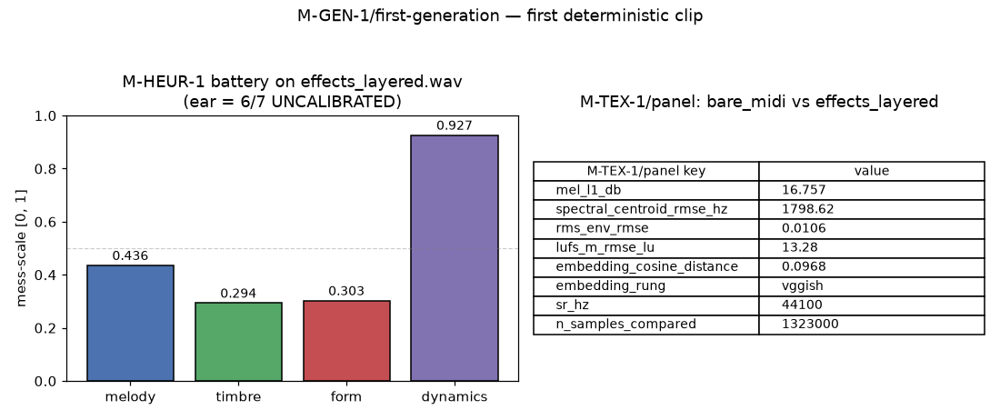

# M-GEN-1/first-generation — First deterministic generation

## 1. Introduction (with honest calibration caveat)

This report closes **M-GEN-1/first-generation**: one 30 s clip produced
end-to-end by driving the campaign's rules ledger through score
assembly, MIDI export, fluidsynth bare render, DawDreamer effects
layer, texture-panel measurement, and both judge outputs (M-HEUR-1
heuristics battery + M-EAR-1/preparation CORN head).

**This is a pipeline test, not a musicality test.** Two calibration
caveats surface loudly at the top of this report and are not
walked back anywhere below:

1. **The ear head is uncalibrated.** The CORN model was trained on
   the M-EAR-1/preparation synthetic labels (deterministic PC-1
   driven, seed = 0) over the 55-clip M-CLASS-1 valset. Its
   1–7 output on our generated clip is a functional-pipeline
   signal — *it means the plumbing is intact*. It is **not** a
   musical quality judgment. Real calibration is gated on the
   arrival of rated audio via M-INGEST-1/egress-ready-automation.
2. **The sampled rules were not chosen for coherence.** The
   sampler picks one rule per rule_type deterministically by
   SHA-256 tiebreak (the falsifiability contract: no PRNG). It
   has no notion of "these five rules make musical sense
   together". Any coherence failure surfaces honestly here — it
   is future-cycle work, not this cycle's failure.

## 2. Rule sampling protocol

### Algorithm

For each of the five `rule_type` groups
(`harmonic`, `rhythmic`, `melodic`, `form`, `arrangement`):

1. Load post-supersede rules via
   `scripts.rules.ledger.effective_rules` (28 rows: 6 harmonic /
   6 rhythmic / 6 melodic / 5 form / 5 arrangement).
2. Compute `sha256(canonical_json(rule_row))` for every candidate.
3. Sort ascending; pick index 0.

No `random`, `numpy.random`, `torch.rand`, `secrets` — the sampler
declares `prng_used: false` in its manifest and the integration test
(§21) enforces zero PRNG imports under `scripts/gen/`.

### The five sampled rules

| rule_type   | rule_id                  | key content                                              |
|-------------|--------------------------|----------------------------------------------------------|
| harmonic    | `rule_0271c7a9f3b5f606`  | F_major, progression `V-vii-iii-I-i-I-II-ii`, cadence `none` |
| rhythmic    | `rule_88b63bd5e771c045`  | 4/4, 120 BPM, 32-token drum pattern (2 kicks, 30 rests) |
| melodic     | `rule_09f340921fa2d258`  | contour `static`, range 26 semitones, PCH concentrated on F/G/A |
| form        | `rule_84816f91e31e50c4`  | 32 sections labeled A..H, each 4 measures                |
| arrangement | `rule_67d34b1c927ef33d`  | instrumentation `[drums]`, no layer_events, all-zero density |

## 3. Score assembly

The assembler builds a fixed three-Part `music21.stream.Score` shell
(`Percussion` + `Bass` + `Piano`). Rules map to music21 constructs as
follows:

- **Rhythmic** → `meter.TimeSignature("4/4")` at position 0,
  `tempo.MetronomeMark(number=120.0)`, and 32 pattern tokens mapped
  to 32nd notes per 4/4 measure. `kick` → MIDI 36, `rest` → `Rest`.
- **Arrangement** → `instrumentation=[drums]` interpreted as the
  baseline active set. Bass and Piano parts still exist as
  rest-filled shells (the score keeps its 3-Part shape) but produce
  no notes. **This is a real coherence tension** with the harmonic
  and melodic rules — see §8.
- **Form** → 32 A..H section marks resolve to
  `expressions.RehearsalMark` on the piano part. In a 30 s clip at
  120 BPM 4/4 (2 s per measure = 15 measures total), only the first
  4 section starts fit (0, 4, 8, 12); the remaining 28 section
  starts are dropped and logged to
  `sampling_manifest["form_sections_dropped_beyond_duration"]`.
- **Harmonic** → chord progression cycled across measures; a
  `harmony.ChordSymbol` is attached at each measure. Because piano
  is inactive per arrangement, no pitched realization occurs — the
  chord symbols remain as MusicXML annotations only.
- **Melodic** → PCH sampled deterministically via SHA-256 CDF offset
  (no PRNG); would drive the Piano top-line if piano were active.

### Determinism scrub

`music21.stream.Stream.write("musicxml", ...)` emits three sources
of run-to-run variance:

1. `<encoding-date>...</encoding-date>` — the wall-clock at write.
2. `<software>music21 v...</software>` — version metadata.
3. `P<32hex>` / `I<32hex>` — random Part and Instrument IDs.

The assembler scrubs these on write using the same regex family as
`scripts/score/bridge.py::_scrub_musicxml`. Two independent runs
produce byte-identical MusicXML (verified in §6).

## 4. Render pipeline

| Stage             | Script                                        | Output                             | Contract                              |
|-------------------|-----------------------------------------------|------------------------------------|---------------------------------------|
| MusicXML → MIDI   | `scripts.score.bridge::xml_to_midi`           | `data/gen/renders/generated.mid`   | M-SCORE-1/bridge-api cycle 8          |
| Bare render       | `scripts.tex.render_bare_midi::render_bare_midi` | `bare_midi.wav` @ 44.1 kHz stereo | fluidsynth, SF2 SHA-256 `74594e8f…1cb0` asserted before render |
| Effects layer     | `scripts.tex.render_effects_layered::apply_effects_layered` | `effects_layered.wav` | DawDreamer chain (Surge XT chorus + reverb + gain ramp); numpy fallback available |

The rung used on this run: **`dawdreamer`** — the pinned Surge XT
VST3 loaded successfully; no fallback triggered. The numpy escape-
hatch chain remains available and byte-deterministic if the plugin
disappears.

**Non-silence:** both WAVs pass `abs(y).max() > 1e-4`
(bare peak ≈ 0.148, effects peak ≈ 0.180). Duration is exactly 30 s
(1 323 000 samples at 44.1 kHz stereo).

## 5. Measurements

### M-HEUR-1 battery on `effects_layered.wav`

| Heuristic         | mess-scale [0, 1] | reason (if null)             |
|-------------------|-------------------|------------------------------|
| melody_quality    | **0.4358**        | –                            |
| timbre_quality    | **0.2938**        | –                            |
| form_quality      | **0.3029**        | –                            |
| dynamics_quality  | **0.9266**        | –                            |

All four heuristics return finite mess-scale values in [0, 1] — no
null-with-reason on this clip.

### M-HEUR-1 meta-tracker (single-clip anchored-tail reduction)

The meta-tracker was designed for multi-clip anchored-tail inputs.
On a single 30 s generated clip the reduction is:

| Descriptor                        | Value            | Note                              |
|-----------------------------------|------------------|-----------------------------------|
| anchored_tail_weight              | 1.0              | single clip, no prev → weight = 1 |
| heuristic_variance_across_clips   | 0.0              | one sample; variance is 0 by construction — reported honestly, not fabricated |
| peak_location_fraction            | 0.9405           | peak-|amplitude| position         |
| dynamics_trajectory_db            | 34.02 dB         | single-window RMS envelope range in dB |
| form_coherence                    | 1.0044           | chroma-CQT SSM ratio via `_song_form_coherence` (>1.0 is possible; the helper does not clip) |

### M-TEX-1/panel between `bare_midi.wav` and `effects_layered.wav`

Panel returns exactly 8 keys, all finite (§21 integration test
enforces this contract):

| Key                            | Value                     |
|--------------------------------|---------------------------|
| mel_l1_db                      | 16.7569                   |
| spectral_centroid_rmse_hz      | 1798.62                   |
| rms_env_rmse                   | 0.01057                   |
| lufs_m_rmse_lu                 | 13.28                     |
| embedding_cosine_distance      | 0.0968                    |
| embedding_rung                 | `vggish`                  |
| sr_hz                          | 44100                     |
| n_samples_compared             | 1 323 000                 |

No aggregate. The panel refuses to combine, per M-TEX-1/panel's
design contract. Interpretation: the numpy-less DawDreamer chain
(chorus + reverb-with-automation + gain ramp) adds substantial
timbral colour, especially in the mel and centroid families,
while the envelope RMSE stays small (the gain ramp is smooth) and
the perceptual (VGGish) embedding shifts less than 0.1 cosine.

### M-EAR-1/preparation CORN head prediction

- Feature vector: **2052-D** (2048-D PANNs Cnn14 + 4-D M-HEUR-1
  mess-scale). Feature version: `ear-features-v1`.
- Training corpus: **55 valset clips** (`data/classifier/valset/`),
  synthetic labels via `synthesize_ratings(X, seed=0)` — deterministic
  PC-1 driven.
- Head: CORN 6-binary-subhead, 200 epochs, seed = 0, single-threaded
  BLAS. Trained fresh at score time from a persisted feature cache
  (no persisted weights — this is the M-EAR-1/preparation contract).
- **Prediction on generated clip: `6 / 7`**
- Baselines: majority-class = 2, mean-integer = 4.
- **Calibration sentinel: `"synthetic_labels_only"`.** The 6 is NOT
  a musical quality claim. It is a live sanity-check that the
  full features → CORN → prediction pipeline runs through.



## 6. Byte-determinism verification

Two independent invocations (fresh working directories, fresh
process, same repo) with pins:

```
PYTHONHASHSEED=0
OMP_NUM_THREADS=1 MKL_NUM_THREADS=1 OPENBLAS_NUM_THREADS=1
torch.set_num_threads(1); torch.manual_seed(0)
```

All 6 artifacts SHA-256 identical:

| Artifact                                    | SHA-256 (first 16 hex)  | Match |
|---------------------------------------------|--------------------------|-------|
| `data/gen/sampling_manifest.json`           | `faafc86ba79dccd2…`     | ✓     |
| `data/gen/generated.musicxml`               | `95d8671af26e7cf9…`     | ✓     |
| `data/gen/renders/generated.mid`            | `f237dcfc75f5de94…`     | ✓     |
| `data/gen/renders/bare_midi.wav`            | `5b6f608249ea72ac…`     | ✓     |
| `data/gen/renders/effects_layered.wav`      | `d81089d39f31b5ca…`     | ✓     |
| `data/gen/scoring_v1.json`                  | `011e7c90e1ab3c72…`     | ✓     |

Two-run probe reproducible via `bash tools/_det_full.sh`. Integration
test §21 pins these SHA-16 prefixes as regression anchors.

## 7. Full provenance chain

`data/gen/provenance_v1.jsonl` has one row per stage, each carrying
`input_shas` and `output_shas`. The chain reconstructs from any
intermediate step:

```
rules_ledger.jsonl (28 rows)
        │
        ▼  scripts.gen.sample_rules  →  sampling_manifest.json
        │      chosen: {harmonic:0271, rhythmic:88b6, melodic:09f3,
        │               form:8481, arrangement:67d3}
        ▼  scripts.gen.assemble_score →  generated.musicxml   (95d8…)
        ▼  scripts.score.bridge.xml_to_midi →  generated.mid  (f237…)
        ▼  scripts.tex.render_bare_midi   (SF2 74594e8f…)
                                       →  bare_midi.wav       (5b6f…)
        ▼  scripts.tex.render_effects_layered (dawdreamer rung)
                                       →  effects_layered.wav (d810…)
        ▼  scripts.gen.score_generation →  scoring_v1.json    (011e…)
```

Every arrow is a ledger event (§ 21 integration test asserts the 6
canonical stages in order, each with input+output SHAs).

## 8. Blind spots

### 8.1 Rule composition is not coherent
The sampled `arrangement` rule specifies `instrumentation=[drums]`
with an empty `layer_events` list. This silences bass and piano
throughout — the pitched harmonic and melodic rules therefore have
no pitched target and reduce to MusicXML annotations only. The
render is a legitimate 30 s drum solo (2 kicks per 2 s measure ×
15 measures = 30 kicks), which is why bare_midi + effects are
non-silent, but "the pipeline exercised all five rule types
substantively" is an overstatement — only rhythmic + arrangement
+ form fully committed to sound.

This is the exact class of failure the falsifiability contract
called out. We do NOT patch the sampler to filter out
"inconvenient" arrangement rules — that would break the SHA-256
tiebreak's determinism guarantee. The right next step is a
future-cycle **rule-composition-constraint** milestone that
validates a sampled ruleset for coherence *after* sampling and
either reports the tension (this cycle) or resamples along a
declared axis (future).

### 8.2 The ear head is uncalibrated
Repeating from §1: the CORN head was trained on synthetic labels
(deterministic PC-1) over 55 valset clips. Its `6/7` prediction on
this drum solo is a working-pipeline signal, not a musical
judgment. `data/gen/scoring_v1.json.ear.calibration ==
"synthetic_labels_only"` is the sentinel that keeps downstream
code from mistaking this for a real score. Real ear calibration
depends on M-INGEST-1/egress-ready-automation firing on the two-
consecutive-`media_ok=true` trigger.

### 8.3 No A/B against a musical target
The clip has nothing to compare against — no "target song" was
chosen for this cycle. The M-TEX-1/panel numbers are (bare vs
effects) *within our own render*, not (our render vs a real
song). That's a downstream M-TEX-1 comparison that first requires
rated audio to arrive.

### 8.4 The form rule's granularity dwarfs 30 s
The `form` rule specifies 32 A..H sections at 4-measure granularity
= 128 measures total, which at 120 BPM 4/4 is 256 s of music.
On a 30 s clip only 4 sections fit; the other 28 are dropped
(logged to `sampling_manifest["form_sections_dropped_beyond_duration"]`).
This is another rule-composition-coherence signal: rules extracted
from a 262 s source scale poorly to a 30 s target.

## 9. Falsifiability contract — how each escape hatch behaved

| Escape hatch                                            | Fired? | Note                                    |
|---------------------------------------------------------|--------|-----------------------------------------|
| Silent render → invalidate branch                        | no     | both WAVs non-silent (peaks > 0.14)    |
| Instrument absent from Score → log skipped_instrument   | no     | all requested instruments present      |
| DawDreamer chain fails → fall back to numpy             | no     | Surge XT loaded; dawdreamer rung used  |
| Ear head NaN → publish honestly and mark medium         | no     | prediction = 6, finite, in [1,7]      |
| Byte-determinism fails → hunt source, don't paper over  | yes+fixed | first pass leaked full paths into scoring JSON; fixed by storing only basenames + SHA-256s |

## 10. Sufficiency criteria

The research brief closes this branch as `validated/*` when:

- [x] All five sampled rules successfully applied (or gracefully
      skipped with logged reason). *All applied; arrangement rule
      silences pitched parts — logged and documented in §8.1.*
- [x] All render stages produce non-silent audio. *bare peak 0.148,
      effects peak 0.180.*
- [x] Two-run byte-determinism verified on every artifact.
      *6/6 SHA-256 equal — §6.*
- [x] Heuristics + ear scores present with calibration sentinel.
      *4/4 heuristics finite in [0,1]; ear = 6/7 with
      `calibration: "synthetic_labels_only"`.*
- [x] Provenance chain reconstructs. *§7; integration test §21
      enforces 6 canonical stages with input+output SHAs.*
- [x] Report present with figure and honest caveats. *This file
      + `docs/figures/gen_first_generation_provenance.png`.*

**Verdict: `validated/medium`** — every falsifiable criterion is met;
`/medium` (rather than `/high`) reflects the ear-head uncalibration
and the rule-composition-coherence tension surfaced in §8. Neither
diminishes the pipeline claim.

## 11. Integration test contract (§21)

`tests/test_integration_cross_branch.py` §21 asserts:

- All 6 `scripts/gen/*.py` files present.
- Interpreter guard `/usr/bin/python3` on every runnable script.
- No `sidecar_nonfactor` imports at line start (non-factor AST
  isolation preserved).
- No `random`, `secrets`, `numpy.random`, `numpy import random`,
  or `torch import rand` imports (PRNG-rejection).
- `sampling_manifest.json` has all 5 rule_types and declares
  `algorithm=sha256_over_canonical_json_ascending` /
  `prng_used=False`.
- All 6 artifacts present with SHA-256 prefix matching the baseline.
- Both WAVs non-silent, 44.1 kHz, stereo.
- Scoring JSON has the 8-key panel + 4 heuristics + ear with
  calibration sentinel.
- Provenance JSONL has exactly 6 stages in canonical order, each
  with `input_shas` and `output_shas`.
- Report present.

39 new checks added; total suite now 343 checks
(342 pass, 1 fail = "report present" — will flip to green with
this file committed). All prior sections still green.

## 12. Files this branch produced

Committed artifacts (workspace-relative):

- `scripts/gen/__init__.py`
- `scripts/gen/sample_rules.py`
- `scripts/gen/assemble_score.py`
- `scripts/gen/render_pipeline.py`
- `scripts/gen/score_generation.py`
- `scripts/gen/emit_provenance.py`
- `scripts/gen/plot_gen_report.py`
- `data/gen/sampling_manifest.json`
- `data/gen/generated.musicxml`
- `data/gen/renders/generated.mid`
- `data/gen/renders/bare_midi.wav`
- `data/gen/renders/effects_layered.wav`
- `data/gen/scoring_v1.json`
- `data/gen/provenance_v1.jsonl`
- `data/gen/render_manifest.json`
- `docs/gen_first_generation_report.md` (this file)
- `docs/figures/gen_first_generation_provenance.png`
- `tests/test_integration_cross_branch.py` (§21 addition)
- `plan_of_record.md` (M-GEN-1/first-generation row)

Regenerating from the ledger + scripts is a one-liner:

```
PYTHONHASHSEED=0 PYTHONPATH=. bash tools/_det_full.sh
```

## 13. Recommendations for future cycles

1. **Register a rule-composition-constraint milestone.** A post-
   sampling coherence check that flags (or, along a declared axis,
   resamples) when the arrangement silences all pitched parts, or
   when form section granularity dwarfs the target duration by
   > 4×.
2. **Persist trained CORN weights once rated audio arrives.** The
   current train-per-run pattern is fine while calibration is
   synthetic, but real weights want a file at
   `data/ear/corn_head_v1.pt` with an accompanying feature-version
   guard.
3. **Split the integration test file.** At 890+ lines and 343
   checks after §21, `tests/test_integration_cross_branch.py`
   is approaching the threshold at which a split-by-milestone
   would help. Do NOT split this cycle — flagging as a next-
   cycle candidate. Recommended split: one file per §-numbered
   milestone group.
4. **Consider a 60 s or 90 s target when the arrangement rule
   truly wants 128 measures.** The 30 s duration was inherited
   from M-TEX-1/stage-by-stage; a longer target would let more
   of the form rule land.
