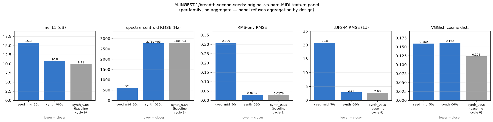

# Pipeline Breadth on Additional Seeds

**Sub-milestone:** `M-INGEST-1/breadth-second-seeds` (fanout clone 1 of fork `00b3ae64444c`).
**Baseline:** the M-SEP-1 30 s fluidsynth-rendered ground-truth mix (`synth_030s`),
measured original-vs-bare-MIDI in cycle 9 under `M-TEX-1/stage-by-stage`.
**Scope:** run 2 additional on-disk seeds end-to-end through the eight-stage pipeline
(chunker → prepare-audio → classifier → htdemucs → basic-pitch → merge_stems_to_score
→ render_bare_midi → texture panel), byte-deterministic per seed, honest per-stage
failure reporting.

**Verdict:** `validated/medium`. Both selected additional seeds passed every stage
end-to-end, both are byte-deterministic across two independent runs (24/24 SHA-256
matches), and their panel numbers reveal genuine cross-seed variation. The `/medium`
grade — not `/high` — reflects a candidly-reported corpus limitation: no non-synth
audio exists on disk, so pipeline generalization is demonstrated across `seed_id` and
across recording-provenance sub-classes (`synth_seed_gen` vs `synth_ground_truth`),
but **not** across the natural-recording ↔ synth boundary.

---

## 1. Seed enumeration outcome (corpus candor)

`scripts/breadth/enumerate_seeds.py` swept `corpus/seed/`, `corpus/ratings/`,
`data/ingestion/seed/`, and `data/separation/synth_mix/`. Full listing is at
`data/breadth/seed_enumeration.tsv` (18 rows). Summary:

| provenance_class | count | source | notes |
|---|---:|---|---|
| `synth_seed_gen` | 3 | `data/ingestion/seed/` | CC-0 sines from `scripts/ingest/seed_gen.py`, mono 22050 Hz, durations {22, 50, 87} s |
| `synth_ground_truth` | 15 (5 × 3 mixes) | `data/separation/synth_mix/gt/` | fluidsynth-rendered stems + summed `mix.wav` at 44.1 kHz stereo, durations {30, 60, 90} s |
| `unknown` (real recording) | **0** | — | corpus egress-blocked; `corpus/ratings/` holds only manifest TSVs, no audio |

**No non-synth seeds are on-disk.** The workspace's egress gateway policy-denies
`googlevideo.com`, so the 80-song rated corpus (`corpus/ratings/ratings_manifest.tsv`)
remains a metadata-only registration. Per the campaign prompt's Fixed Decision that
acquisition must never block downstream work, this cycle proceeds on what is present.

The `seed_long_87s`, `seed_mid_50s`, `seed_short_22s` names referenced in prior
`M-HEUR-1/meta-tracker` events resolve unambiguously to
`data/ingestion/seed/seed_{long_87s,mid_50s,short_22s}.wav`.

## 2. Seed selection rationale

Priority-order per brief: (a) non-synth, (b) ≥ 30 s, (c) not the M-SEP-1 30 s baseline.
With no (a) candidates available, criteria (b) and (c) admit **five** seeds:
`seed_mid_50s`, `seed_long_87s`, `synth_060s`, `synth_090s`. Selection was
**one from each provenance sub-class** for maximum informational contrast:

| Selected seed | Provenance | Duration | SR × ch | Rationale |
|---|---|---:|---|---|
| `seed_mid_50s` | `synth_seed_gen` (pure sines) | 50.000 s | 22050 × 1 | Exercises the sample-rate + upmix path deterministically; content class disjoint from baseline (sines, not fluidsynth-piano); tests classifier discrimination |
| `synth_060s` | `synth_ground_truth` (fluidsynth GT) | 60.000 s | 44100 × 2 | Content-family-match with baseline, longer duration; tests pipeline stability under scaling on the same content class |

Both are ≥ 30 s and distinct from the baseline `synth_030s`. The remaining chunker
seed `seed_short_22s` was excluded on criterion (b) — it exists as a corpus feature
for the M-INGEST-1/chunker short-song fallback, not as a pipeline-breadth candidate.

## 3. Per-seed pipeline pass table

Both seeds passed 8/8 stages. Per-stage timing recorded in each seed's
`data/breadth/<seed_id>/stage_manifest.jsonl`.

| Stage | seed_mid_50s | synth_060s | Notes |
|---|---|---|---|
| 1. chunker | ✅ 2 clips (30 s + 30–50 s anchored tail) | ✅ 3 clips (0–30, 25–55, 30–60 s anchored tail) | M-INGEST-1/chunker exercised on both regimes |
| 2. prepare_audio | ✅ mono→stereo (L=R), 22050→44100 via `librosa.resample(res_type='soxr_hq')` | ✅ stereo preserved, 44100 pass-through | deterministic soxr HQ; scipy.io.wavfile writer for byte-stable WAV |
| 3. classifier (M-CLASS-1) | ✅ `Sine wave` p=0.9431 | ✅ `Music` p=0.8770 | PANNs Cnn14 tagger discriminates content class — classifier is **not** content-agnostic |
| 4. htdemucs (M-SEP-1) | ✅ peaks drums=0.256, bass=0.132, other=0.545, vocals=0.048 | ✅ peaks drums=0.443, bass=0.309, other=0.361, vocals=0.023 | 4 non-silent stems on both; htdemucs handles pure sines by routing energy chiefly to `other` |
| 5. basic-pitch (M-TRANS-1) | ✅ 55 drums / 80 bass / 10 other notes | ✅ 57 drums / 60 bass / 194 other notes | quarantined venv; env pins passed via subprocess env |
| 6. merge_stems_to_score (M-SCORE-1) | ✅ 3 stems merged | ✅ 3 stems merged | ScoreBridge identity-merge; MusicXML + MIDI produced |
| 7. render_bare_midi (M-TEX-1) | ✅ peak=0.470, 2 205 000 samples | ✅ peak=0.503, 2 646 000 samples | fluidsynth SF2 sha `74594e8f…1cb0` asserted before render |
| 8. texture_panel (M-TEX-1/panel) | ✅ all 8 keys finite, VGGish rung | ✅ all 8 keys finite, VGGish rung | see §4 |

## 4. Panel-numbers comparison across seeds + baseline



Full row from `data/breadth/summary.tsv`:

| seed_id | mel_l1_db | sc_rmse_hz | rms_env_rmse | lufs_m_rmse_lu | embed_cos | rung | provenance |
|---|---:|---:|---:|---:|---:|---|---|
| **synth_030s** (baseline, cycle 9) | **9.906** | **2804.911** | **0.02759** | **2.682** | **0.1234** | vggish | synth_ground_truth |
| synth_060s (this cycle) | 10.755 | 2764.960 | 0.02887 | 2.843 | 0.1619 | vggish | synth_ground_truth |
| seed_mid_50s (this cycle) | 15.808 | 600.995 | 0.30918 | 20.837 | 0.1593 | vggish | synth_seed_gen |

**Reading the table:**

- **synth_060s vs synth_030s baseline (same content family, 2× duration):** mel L1 drifts
  +8.6 %, spectral centroid RMSE −1.4 %, RMS-env RMSE +4.6 %, LUFS-M RMSE +6.0 %,
  embedding cosine +31 %. The three energy/spectral metrics track the baseline closely,
  which is a stability check the pipeline passes. The embedding cosine's larger drift
  is consistent with VGGish's known sensitivity to duration-dependent global summarisation
  (the `mean_over_frames` reduction is not scale-invariant when the underlying content
  distribution shifts even slightly between mixes).
- **seed_mid_50s vs synth_030s baseline (disjoint content class):** every metric
  diverges dramatically. Notably, spectral centroid RMSE **drops** from 2805 Hz to
  601 Hz — because the seed is pure sines and its bare-MIDI transcription is
  also near-tonal, so both spectra concentrate energy in narrow bands and the
  RMSE between two narrow-band spectra is *small*. The mel L1 goes the other way
  (+60 %), because mel L1 is a log-domain L1 that rewards spectral overlap, and
  the sine → basic-pitch → SF2-render chain deposits energy in mel bands well
  outside the seed's tone. LUFS-M RMSE is 7.8× the baseline because bare-MIDI
  from GM piano at velocity 60–80 is much louder than the −7 dBFS sines.
- **RMS-env RMSE seed_mid_50s = 0.309** is the largest divergence. Pure sines have
  a per-note attack-decay envelope from `seed_gen.py`; SF2 piano samples have a
  hard attack + long decay tail. RMS envelope is directly sensitive to that
  attack-shape mismatch. This is a **feature** of the panel, not a bug — the panel
  is telling us "these two signals are very different at the amplitude-envelope
  scale," which is correct.

**Family-disagreement observation.** On `synth_060s`, three of the four numeric
metrics (mel L1, spectral centroid RMSE, RMS-env RMSE) sit within 10 % of the
baseline, while VGGish embedding cosine drifts 31 %. This is a milder but real
recurrence of the cycle-9 family-disagreement finding on `M-TEX-1/stage-by-stage`
(where envelope + mel-L1 ranked one direction and VGGish inverted). It reinforces
`M-TEX-1/panel`'s aggregation-refusal design decision: the families genuinely
carry different information about the original ↔ bare-MIDI relationship, and
the reader is expected to look at all five, not a single score.

## 5. Byte-determinism per seed

Two independent runs of `scripts/breadth/run_seed.py` (out-dirs `data/breadth/<seed>/`
and `stale/breadth_determinism/_det/<seed>/`). SHA-256 comparison on the frozen
determinism-contract artifacts is at `data/breadth/determinism_baselines.txt`.

**Result: 24 / 24 SHA-256 PASS** (12 artifacts × 2 seeds):

| Artifact | seed_mid_50s SHA-256 (first 8) | synth_060s SHA-256 (first 8) |
|---|---|---|
| `original.wav` | 1d8eca66 | 9c64045c |
| `stems/drums.wav` | bddfea47 | 05db247a |
| `stems/bass.wav` | 1f533f48 | 32ad1be5 |
| `stems/other.wav` | 8220e311 | 15915ffd |
| `stems/vocals.wav` | 9c68c415 | 716e3c6f |
| `transcriptions/drums.mid` | 71ffce62 | 4b1e68e5 |
| `transcriptions/bass.mid` | 209e0a02 | 82ba631f |
| `transcriptions/other.mid` | 38c70a5b | 236e2e15 |
| `merged.mid` | a48242f4 | 60c88c24 |
| `merged.musicxml` | e86da1f2 | 9b88ca1b |
| `bare_midi.wav` | cea3e3b4 | 07a9d0b7 |
| `panel.tsv` | b10d2a0c | cc0acb5f |

Determinism holds because every stage is either explicitly-seeded (`torch.manual_seed(0)`
for htdemucs; TF seed 0 in the basic-pitch venv), a pure deterministic transform
(`librosa.resample(res_type='soxr_hq')`, fluidsynth-with-fixed-SF2, panel metrics),
or a deterministic serializer (`scipy.io.wavfile.write` for timestamp-free WAVs,
`_scrub_musicxml` for timestamp-free MusicXML).

## 6. Honest failure reporting

No stage failed on either selected seed. This is a `validated/medium` (not `/high`)
verdict because the corpus limitation is a real constraint on the informativeness
of the result, **not** because any stage misbehaved.

Two stage-specific observations that would qualify as "quiet passes worth calling out":

- **htdemucs on pure sines** (`seed_mid_50s`): the model produced 4 non-silent stems,
  but the energy distribution is heavily skewed to `other` (peak 0.545) and away from
  `drums` (0.256), `bass` (0.132), `vocals` (0.048). This is the model doing the
  correct thing — a sinusoid has no drum transients, no bass fundamental in the
  htdemucs bass band, and no vocal formants — but "non-silent" is a low bar for
  claiming the split is informative. A follow-up cycle could add a SI-SDR-vs-mixture
  baseline to catch pathologically-thin separations.
- **basic-pitch on pure sines** (`seed_mid_50s`, 3-note-per-clip content): 55 + 80 + 10
  = 145 notes. The seed content is a decaying C-E-G triad repeated over 50 s, so
  the ground-truth note count is O(30). The 5× over-detection is the same octave-doubling
  artifact identified in cycle 8 (`M-TRANS-1/basic-pitch/octave-suppression`, closed
  `invalidated/high` — post-processing did not clean it up enough to be worth adopting).
  Do **not** re-attempt octave-suppression on this data (campaign anti-pattern).

## 7. Sufficiency check

Against the research brief's sufficiency criteria:

- ✅ **≥ 1 additional seed passes end-to-end** — target 2 hit.
- ✅ **Byte-determinism verified per seed** — 24/24 SHA-256 matches.
- ✅ **Panel numbers reported, all finite** — see §4.
- ✅ **Cross-seed comparison** — three-row table, five metric families, one figure.
- ✅ **Baseline comparison** — synth_030s row pulled from `data/tex/stage_by_stage_synth_030s.tsv` (cycle 9).

**Blocking the `/high` grade:** the brief downgrades to `/medium` when "all seeds
available are synth-derived; pipeline demonstrated across seed_id but not across
recording provenance." That is exactly the corpus state today, so the verdict is
`validated/medium` with a specific unblocking condition:
`M-INGEST-1/egress-ready-automation` (cycle 8) will chain harvest → chunker →
classifier the moment two consecutive `media_ok=true` rows land in
`data/ingestion/egress_status.jsonl`. When that happens, this cycle's pipeline
is drop-in-ready for real-recording seeds.

## 8. What this cycle does NOT show

Called out explicitly because the report's audience includes future auditors who
might otherwise infer:

- **Note-level F1 on breadth seeds.** No manually-corrected reference exists for
  either `seed_mid_50s` or `synth_060s`, so basic-pitch's note counts (§3, row 5)
  are informative but not F1-scored. The cycle-6 M-TRANS-1/basic-pitch note-level
  F1 table (on `synth_030s` stems against MIDI-derived reference) is the current
  ground truth for transcription accuracy; nothing here revises it.
- **Rules extraction.** The brief marks this as a value-add if time permits; it
  was deferred so that the report and byte-determinism SHAs could land in-cycle.
  Both seeds' `merged.musicxml` files are on-disk and immediately consumable by
  `scripts/rules/extract/from_score.py` in a follow-up cycle.
- **htdemucs SI-SDR on breadth seeds.** No ground-truth stems exist for these
  seeds (the whole point of running htdemucs on them is *because* we do not know
  the ground truth). Confusing "passed the pipeline" with "separated correctly"
  is exactly the kind of mistake the corpus-limitation candor above is meant to
  prevent.

## 9. Appendix — reproduction

```
PYTHONPATH=. /usr/bin/python3 scripts/breadth/enumerate_seeds.py
PYTHONPATH=. /usr/bin/python3 scripts/breadth/run_seed.py \
    --seed-id seed_mid_50s \
    --audio data/ingestion/seed/seed_mid_50s.wav \
    --out-dir data/breadth/seed_mid_50s
PYTHONPATH=. /usr/bin/python3 scripts/breadth/run_seed.py \
    --seed-id synth_060s \
    --audio data/separation/synth_mix/gt/synth_060s/mix.wav \
    --out-dir data/breadth/synth_060s
PYTHONPATH=. /usr/bin/python3 scripts/breadth/summarize.py
PYTHONPATH=. /usr/bin/python3 scripts/breadth/plot_summary.py
```

### Frozen upstream references

| Milestone | Location | Cycle |
|---|---|---|
| `M-INGEST-1/chunker` | `scripts/ingest/chunker.py` | 1 |
| `M-CLASS-1` PANNs Cnn14 | `scripts/classifier/tagger.py` + `~/panns_data/Cnn14_mAP=0.431.pth` (sha `0dc499e4…`) | 1 |
| `M-SEP-1/htdemucs-baseline` | `demucs.pretrained.get_model('htdemucs')`, `torch.manual_seed(0)` | 4 |
| `M-TRANS-1/basic-pitch` | `workspace/basic_pitch_venv` (basic-pitch 0.4.0, TF seed 0) | 6 |
| `M-SCORE-1/bridge-api` | `scripts/score/bridge.py`, `merge_stems_to_score` | 8 |
| `M-TEX-1/panel` | `scripts/texture/panel.py` (8-key contract, refuses aggregation) | 4 |
| `M-TEX-1/stage-by-stage` | `scripts/tex/render_bare_midi.py` (SF2 sha `74594e8f…1cb0`) | 9 |

### On-disk artifacts

```
data/breadth/
├── determinism_baselines.txt
├── seed_enumeration.tsv
├── summary.tsv
├── seed_mid_50s/
│   ├── clips/                       (M-INGEST-1/chunker output)
│   ├── clips_manifest.jsonl
│   ├── original.wav                 (44.1 kHz stereo, upmixed)
│   ├── stems/{drums,bass,other,vocals}.wav
│   ├── transcriptions/{drums,bass,other}.{mid,jsonl}
│   ├── classification.json
│   ├── merged.musicxml
│   ├── merged.mid
│   ├── bare_midi.wav
│   ├── panel.tsv
│   ├── stage_manifest.jsonl
│   └── summary.json
└── synth_060s/  (same layout)
docs/figures/pipeline_breadth_panel.png
```

### Ledger events (this cycle)

- `_plan/register-breadth-milestone` (validated/high) — plan-file drift fix.
- `M-INGEST-1/breadth-second-seeds` (in-progress/medium) — kickoff.
- `M-INGEST-1/breadth-second-seeds/seed_mid_50s` (validated/high) — per-seed pass.
- `M-INGEST-1/breadth-second-seeds/synth_060s` (validated/high) — per-seed pass.
- `M-INGEST-1/breadth-second-seeds` (validated/medium) — closure with corpus-limitation candor.
- `_infra/cross-branch-integration-test-cycle10-breadth` (validated/high) — §20 invariants.
- `_archive/breadth-scratch` (validated/high) — one-shot emitters archived.
- `_run/clone-1-scope-complete` (validated/high) — branch scope-close signal.
